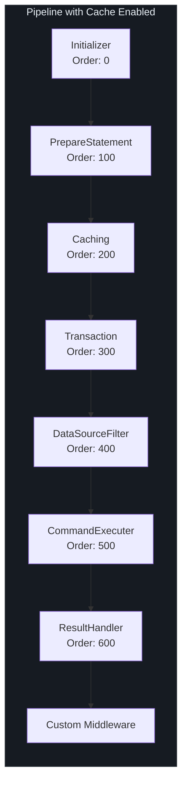

# Configuration API

SmartSql is configured through the `SmartSqlBuilder` fluent API, which constructs a `SmartSqlConfig` containing all runtime services. The builder assembles the middleware pipeline, registers type handlers, initializes filters, and sets up caching before producing the final `ISqlMapper` and `IDbSessionFactory` instances.

## At a Glance

| Concept | Class | Purpose |
|---------|-------|---------|
| Builder | `SmartSqlBuilder` | Fluent API to configure and construct the runtime |
| Config | `SmartSqlConfig` | Runtime configuration holding all services and mappings |
| Settings | `Settings` | Global toggle settings (cache, parameter case, etc.) |
| Database | `Database` | Database provider and data source configuration |
| Properties | `Properties` | Import variables for XML `${Property}` substitution |

## SmartSqlBuilder Fluent API

### Builder Flow Diagram

```mermaid
flowchart TD
    subgraph builder["SmartSqlBuilder Configuration Flow"]
        style builder fill:#161b22,stroke:#30363d,color:#e6edf3
        Start["new SmartSqlBuilder()"] --> Source
        Source["UseXmlConfig() / UseDataSource() / UseNativeConfig()"]
        Source --> Alias["UseAlias()"]
        Alias --> Logger["UseLoggerFactory()"]
        Logger --> Cache["UseCache() / UseCacheManager()"]
        Cache --> Entities["RegisterEntity()"]
        Entities --> TH["AddTypeHandler()"]
        TH --> Filters["AddFilter()"]
        Filters --> MW["AddMiddleware()"]
        MW --> Props["UseProperties() / UsePropertiesFromEnv()"]
        Props --> CUD["UseCUDConfigBuilder()"]
        CUD --> Build["Build()"]
        Build --> Output["ISqlMapper + IDbSessionFactory"]
        Build --> Register["SmartSqlContainer.Register()"]
    end

```



<!-- Sources: src/SmartSql/SmartSqlBuilder.cs:23, src/SmartSql/SmartSqlBuilder.cs:60 -->

### Configuration Source Methods

Choose **one** of these as the first call to establish how SmartSql loads its configuration:

| Method | Description |
|--------|-------------|
| `UseXmlConfig(resourceType, path)` | Loads configuration from an XML file. Default path: `SmartSqlMapConfig.xml`. `resourceType` can be `File`, `EmbeddedResource`, or `Directory`. |
| `UseDataSource(writeDataSource)` | Configures directly with a `WriteDataSource` object (provider + connection string). |
| `UseDataSource(dbProviderName, connectionString)` | Shorthand that resolves the provider by name from `DbProviderManager`. |
| `UseNativeConfig(smartSqlConfig)` | Uses a pre-built `SmartSqlConfig` object directly. |

```csharp
// XML configuration
var builder = new SmartSqlBuilder()
    .UseXmlConfig()
    .Build();

// Code-based configuration
var builder = new SmartSqlBuilder()
    .UseDataSource("MySql", "Server=localhost;Database=SmartSqlTest;Uid=root;Pwd=root;")
    .Build();
```

### Identity and Logging

| Method | Default | Description |
|--------|---------|-------------|
| `UseAlias(alias)` | `"SmartSql"` | Sets the instance name. Must be non-empty. Used to identify this instance in the `SmartSqlContainer`. |
| `UseLoggerFactory(factory)` | `NullLoggerFactory` | Sets the logger factory for all internal logging. |

### Cache Configuration

| Method | Description |
|--------|-------------|
| `UseCache(isCacheEnabled = true)` | Enables or disables the caching middleware globally. |
| `UseCacheManager(cacheManager)` | Provides a custom `ICacheManager` implementation (e.g., Redis cache). |
| `UseIgnoreDbNull(ignoreDbNull = false)` | When true, ignores `DBNull` values when building result objects. |

### Entity Registration

| Method | Description |
|--------|-------------|
| `RegisterEntity(entityType)` | Registers a single entity type for metadata cache initialization and CUD builder support. |
| `RegisterEntity(typeScanOptions)` | Scans assemblies by `TypeScanOptions` and registers all matching entity types. |

### Type Handler and Deserializer Registration

| Method | Description |
|--------|-------------|
| `AddTypeHandler(typeHandler)` | Registers a custom `TypeHandler` for parameter/property conversion. |
| `AddDeserializer(deserializer)` | Registers a custom `IDataReaderDeserializer` for result mapping. |

### Filter and Middleware Registration

| Method | Description |
|--------|-------------|
| `AddFilter<TFilter>()` | Adds a filter by type (must implement `IFilter` with a parameterless constructor). |
| `AddFilter(filter)` | Adds a filter instance. |
| `AddMiddleware(middleware)` | Adds a custom `IMiddleware` to the pipeline (inserted after built-in middlewares). See [Middleware API](/api/middleware). |

### Properties and Environment

| Method | Description |
|--------|-------------|
| `UseProperties(kvp)` | Imports key-value properties for XML `${Property}` substitution. |
| `UseProperties(dictionary)` | Imports from an `IDictionary`. |
| `UsePropertiesFromEnv(target)` | Imports from system environment variables. |

### Advanced Options

| Method | Description |
|--------|-------------|
| `UseCUDConfigBuilder()` | Enables auto-generated CUD (Create/Update/Delete) SQL statements from registered entities. |
| `UseCommandExecuter(executer)` | Provides a custom `ICommandExecuter` implementation. |
| `UseDataSourceFilter(filter)` | Provides a custom `IDataSourceFilter` for read/write splitting logic. |
| `RegisterToContainer(registered = false)` | When false, prevents auto-registration in `SmartSqlContainer`. |
| `ListenInvokeSucceeded(callback)` | Registers a callback for every successful command execution. |

### Build Method

| Method | Description |
|--------|-------------|
| `Build()` | Constructs the runtime. Idempotent -- calling it again returns immediately. Internally: configures `SmartSqlConfig`, builds the middleware pipeline, initializes deserializers, registers type handlers, and registers in `SmartSqlContainer`. |

```csharp
var builder = new SmartSqlBuilder()
    .UseAlias("MyApp")
    .UseXmlConfig()
    .UseCache()
    .RegisterEntity<User>()
    .AddFilter<CustomFilter>()
    .UseLoggerFactory(loggerFactory)
    .Build();

ISqlMapper mapper = builder.GetSqlMapper();
IDbSessionFactory factory = builder.GetDbSessionFactory();
```

## SmartSqlConfig

The central runtime configuration object. Constructed by `SmartSqlBuilder.Build()` and held by all runtime services.

### Properties

| Property | Type | Description |
|----------|------|-------------|
| `Alias` | `string` | Instance identifier |
| `Settings` | `Settings` | Global toggle settings |
| `Database` | `Database` | Database provider and data sources |
| `Properties` | `Properties` | Import variables |
| `SqlMaps` | `IDictionary<string, SqlMap>` | All loaded SQL map scopes |
| `LoggerFactory` | `ILoggerFactory` | Logging factory |
| `ObjectFactoryBuilder` | `IObjectFactoryBuilder` | Factory for creating object instances (default: `ExpressionObjectFactoryBuilder`) |
| `DeserializerFactory` | `IDeserializerFactory` | Chain of `IDataReaderDeserializer` instances |
| `TypeHandlerFactory` | `TypeHandlerFactory` | Registry of type handlers |
| `TagBuilderFactory` | `ITagBuilderFactory` | Factory for XML dynamic tag builders |
| `StatementAnalyzer` | `StatementAnalyzer` | Parses statement XML |
| `SqlParamAnalyzer` | `SqlParamAnalyzer` | Analyzes SQL parameter placeholders |
| `CacheTemplateAnalyzer` | `SqlParamAnalyzer` | Analyzes cache template parameters |
| `Pipeline` | `IMiddleware` | The head of the middleware linked list |
| `DataSourceFilter` | `IDataSourceFilter` | Read/write data source selection |
| `SessionStore` | `IDbSessionStore` | Thread-local session management |
| `DbSessionFactory` | `IDbSessionFactory` | Session factory |
| `CacheManager` | `ICacheManager` | Cache manager |
| `CommandExecuter` | `ICommandExecuter` | Executes `DbCommand` objects |
| `InvokeSucceedListener` | `InvokeSucceedListener` | Event listener for successful invocations |
| `IdGenerators` | `IDictionary<string, IIdGenerator>` | ID generators (default: SnowflakeId) |
| `AutoConverters` | `IDictionary<string, IAutoConverter>` | Named auto-converters |
| `DefaultAutoConverter` | `IAutoConverter` | Default auto-converter (default: `NoneAutoConverter`) |
| `Filters` | `FilterCollection` | Registered filters |

### Lookup Methods

| Method | Description |
|--------|-------------|
| `GetSqlMap(scope)` | Returns a `SqlMap` by scope name. Throws if not found. |
| `GetStatement(fullId)` | Returns a `Statement` by full ID (e.g., `"User.Query"`). |
| `GetCache(fullId)` | Returns a `Cache` by full ID. |
| `GetResultMap(fullId)` | Returns a `ResultMap` by full ID. |
| `GetParameterMap(fullId)` | Returns a `ParameterMap` by full ID. |
| `GetMultipleResultMap(fullId)` | Returns a `MultipleResultMap` by full ID. |

## Settings

Global toggle settings with sensible defaults:

| Setting | Default | Description |
|---------|---------|-------------|
| `IgnoreParameterCase` | `false` | When true, parameter names are case-insensitive |
| `IsCacheEnabled` | `false` | Global cache toggle |
| `ParameterPrefix` | `"$"` | Prefix for parameter placeholders in XML |
| `EnablePropertyChangedTrack` | `false` | Enables property change tracking for entities |
| `IgnoreDbNull` | `false` | When true, `DBNull` values are skipped during result mapping |

## Build Process Internals

The `Build()` method performs these steps in order:


<!-- Sources: src/SmartSql/SmartSqlBuilder.cs:60, src/SmartSql/SmartSqlBuilder.cs:155 -->

### Deserializer Chain Initialization

The deserializer chain is initialized in a specific order. Custom deserializers registered via `AddDeserializer()` are inserted into this chain:

| Order | Deserializer | Purpose |
|-------|-------------|---------|
| 1 | `MultipleResultDeserializer` | Handles multiple result sets |
| 2 | `ValueTupleDeserializer` | Maps to `ValueTuple` types |
| 3 | `ValueTypeDeserializer` | Maps to value types (int, string, etc.) |
| 4 | `DynamicDeserializer` | Maps to `dynamic` / `ExpandoObject` |
| 5 | `EntityDeserializer` | Maps to POCO entities (always last) |

### Pipeline Construction

When `IsCacheEnabled` is true, the `CachingMiddleware` is inserted between `PrepareStatementMiddleware` and `TransactionMiddleware`. When false, a `NoneCacheManager` is used and `CachingMiddleware` is omitted entirely. Custom middlewares added via `AddMiddleware()` are appended after all built-in middlewares.



<!-- Sources: src/SmartSql/SmartSqlBuilder.cs:240, src/SmartSql/SmartSqlBuilder.cs:256 -->

## Cross-References

- [API Overview](/api/index) -- Package listing and entry points
- [Core Interfaces](/api/core-interfaces) -- `ISqlMapper`, `IDbSession`, `IDbSessionFactory` methods
- [Middleware API](/api/middleware) -- How the middleware pipeline works and how to create custom middleware

## References

| Source | Description |
|--------|-------------|
| [`src/SmartSql/SmartSqlBuilder.cs`](https://github.com/dotnetcore/SmartSql/blob/master/src/SmartSql/SmartSqlBuilder.cs) | Fluent builder with all configuration methods |
| [`src/SmartSql/Configuration/SmartSqlConfig.cs`](https://github.com/dotnetcore/SmartSql/blob/master/src/SmartSql/Configuration/SmartSqlConfig.cs) | Central configuration class |
| [`src/SmartSql/SqlMapper.cs`](https://github.com/dotnetcore/SmartSql/blob/master/src/SmartSql/SqlMapper.cs) | `SqlMapper` constructor showing session store usage |
| [`src/SmartSql/DbSession/IDbSessionFactory.cs`](https://github.com/dotnetcore/SmartSql/blob/master/src/SmartSql/DbSession/IDbSessionFactory.cs) | Session factory interface |
| [`src/SmartSql/Middlewares/AbstractMiddleware.cs`](https://github.com/dotnetcore/SmartSql/blob/master/src/SmartSql/Middlewares/AbstractMiddleware.cs) | Base middleware class |
