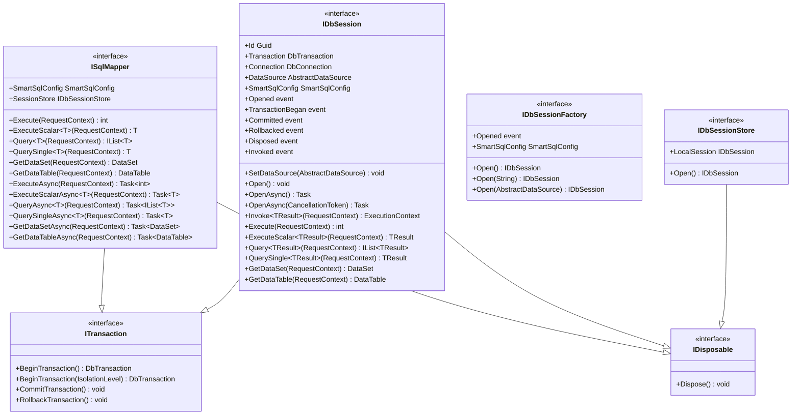
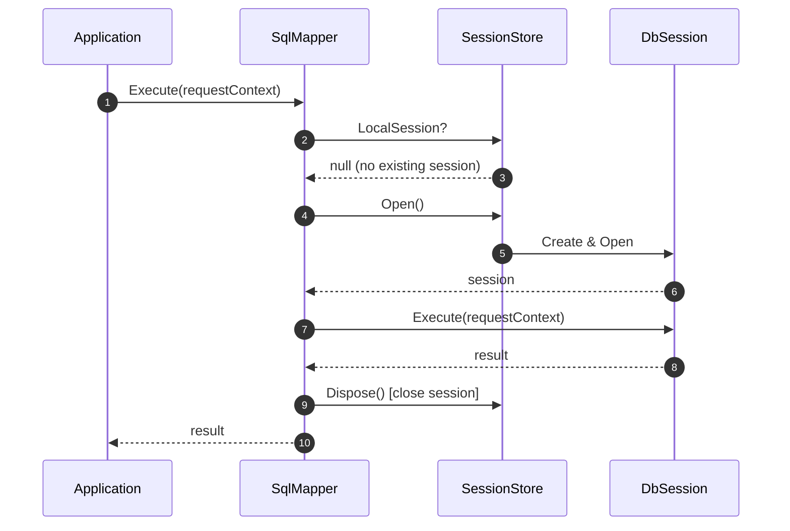
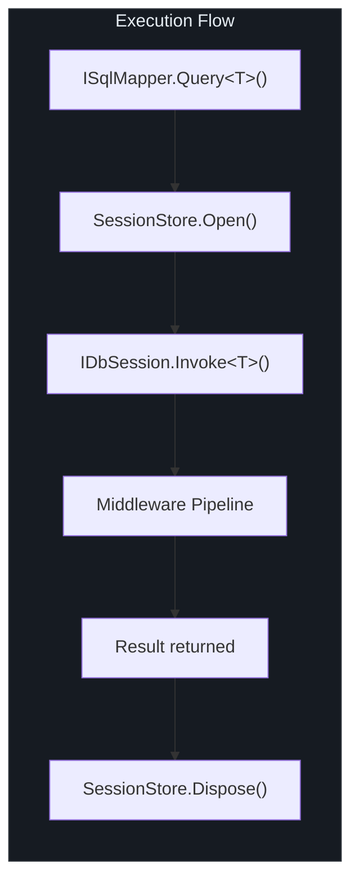

# Core Interfaces

SmartSql's public API is built around a small set of core interfaces that handle data access, session management, and transaction control. This page documents every public method on these interfaces.

## At a Glance

| Interface | Purpose | Lifetime |
|-----------|---------|----------|
| `ISqlMapper` | High-level data access (sync + async) | Singleton per SmartSql instance |
| `IDbSession` | Low-level database session with connection + transaction | Per-request or managed by session store |
| `IDbSessionFactory` | Creates `IDbSession` instances | Singleton per SmartSql instance |
| `IDbSessionStore` | Thread-local session storage | Singleton per SmartSql instance |
| `ITransaction` | Transaction management contract | Mixed into `ISqlMapper` and `IDbSession` |

## Interface Hierarchy

<!-- Sources: src/SmartSql/ISqlMapper.cs:13, src/SmartSql/DbSession/IDbSession.cs:24, src/SmartSql/DbSession/IDbSessionFactory.cs:17, src/SmartSql/DbSession/ITransaction.cs:6 -->

## ISqlMapper

The primary entry point for data access. `ISqlMapper` automatically manages the session lifecycle: it opens a session before execution and closes it afterward if no external session exists.

### Synchronous Methods

| Method | Return Type | Description |
|--------|-------------|-------------|
| `Execute(requestContext)` | `int` | Executes a non-query command (INSERT, UPDATE, DELETE). Returns affected row count. |
| `ExecuteScalar<T>(requestContext)` | `T` | Executes a command and returns the first column of the first row, cast to `T`. |
| `Query<T>(requestContext)` | `IList<T>` | Executes a query and returns a list of entities of type `T`. |
| `QuerySingle<T>(requestContext)` | `T` | Executes a query and returns a single entity, or default if not found. |
| `GetDataSet(requestContext)` | `DataSet` | Returns an untyped `DataSet` from the query results. |
| `GetDataTable(requestContext)` | `DataTable` | Returns an untyped `DataTable` from the query results. |

### Asynchronous Methods

| Method | Return Type | Description |
|--------|-------------|-------------|
| `ExecuteAsync(requestContext)` | `Task<int>` | Async version of `Execute`. |
| `ExecuteScalarAsync<TResult>(requestContext)` | `Task<TResult>` | Async version of `ExecuteScalar`. |
| `QueryAsync<TResult>(requestContext)` | `Task<IList<TResult>>` | Async version of `Query`. |
| `QuerySingleAsync<TResult>(requestContext)` | `Task<TResult>` | Async version of `QuerySingle`. |
| `GetDataSetAsync(requestContext)` | `Task<DataSet>` | Async version of `GetDataSet`. |
| `GetDataTableAsync(requestContext)` | `Task<DataTable>` | Async version of `GetDataTable`. |

### Transaction Methods (from ITransaction)

| Method | Description |
|--------|-------------|
| `BeginTransaction()` | Opens a session and begins a transaction with default isolation level. Throws if a local session already exists. |
| `BeginTransaction(IsolationLevel)` | Same as above with explicit isolation level. |
| `CommitTransaction()` | Commits the current transaction and disposes the local session. |
| `RollbackTransaction()` | Rolls back the current transaction and disposes the local session. Logs a warning if no transaction is active. |

### Properties

| Property | Type | Description |
|----------|------|-------------|
| `SmartSqlConfig` | `SmartSqlConfig` | The runtime configuration instance. |
| `SessionStore` | `IDbSessionStore` | The session store managing thread-local sessions. |

### Session Ownership Pattern

<!-- Sources: src/SmartSql/SqlMapper.cs:90, src/SmartSql/SqlMapper.cs:113 -->

When a local session already exists (e.g. within a transaction), `SqlMapper` reuses it rather than creating a new one. The principle is: **whoever opens the session is responsible for disposing it** (session ownership).

## IDbSession

Represents a single database session with an open connection. Provides direct access to the connection and transaction, plus all data access methods.

### Events

| Event | Delegate Type | Fired When |
|-------|---------------|------------|
| `Opened` | `DbSessionEventHandler` | Session connection is opened |
| `TransactionBegan` | `DbSessionEventHandler` | Transaction is started |
| `Committed` | `DbSessionEventHandler` | Transaction is committed |
| `Rollbacked` | `DbSessionEventHandler` | Transaction is rolled back |
| `Disposed` | `DbSessionEventHandler` | Session is disposed |
| `Invoked` | `DbSessionInvokedEventHandler` | Any command completes (carries `ExecutionContext`) |

### Properties

| Property | Type | Description |
|----------|------|-------------|
| `Id` | `Guid` | Unique session identifier |
| `Transaction` | `DbTransaction` | Current transaction, or null |
| `Connection` | `DbConnection` | The underlying database connection |
| `DataSource` | `AbstractDataSource` | The data source this session is connected to |
| `SmartSqlConfig` | `SmartSqlConfig` | The runtime configuration |

### Methods

| Method | Description |
|--------|-------------|
| `SetDataSource(dataSource)` | Overrides the data source for this session |
| `Open()` / `OpenAsync()` | Opens the connection |
| `Invoke<TResult>(requestContext)` | Full middleware pipeline invocation, returns `ExecutionContext` |

The data access methods (`Execute`, `ExecuteScalar`, `Query`, `QuerySingle`, `GetDataSet`, `GetDataTable`) and their async counterparts mirror those on `ISqlMapper`, but operate directly on the session without opening/closing it.

## IDbSessionFactory

Creates `IDbSession` instances. The factory is constructed internally by `SmartSqlConfig` during `Build()`.

| Method | Description |
|--------|-------------|
| `Open()` | Creates a session using the default connection string |
| `Open(connectionString)` | Creates a session with an explicit connection string |
| `Open(dataSource)` | Creates a session using a specific `AbstractDataSource` |

### Event

| Event | Description |
|-------|-------------|
| `Opened` | Fires when any session is opened (used to bind `InvokeSucceedListener`) |

## IDbSessionStore

Manages the thread-local session. When you call `Open()`, it creates or retrieves a session for the current thread.

| Member | Description |
|--------|-------------|
| `LocalSession` | The current thread's session, or null if none is open |
| `Open()` | Opens a new session for the current thread |
| `Dispose()` | Disposes and clears the current thread's session |

## Execution Flow

When `ISqlMapper` receives a call, it delegates to `IDbSession`, which passes the request through the middleware pipeline:

<!-- Sources: src/SmartSql/SqlMapper.cs:123, src/SmartSql/DbSession/IDbSession.cs:42 -->

## ExecutionContext

Every middleware in the pipeline receives an `ExecutionContext` that carries all state through the execution chain:

| Property | Type | Description |
|----------|------|-------------|
| `Type` | `ExecutionType` | The operation type (Execute, ExecuteScalar, Query, QuerySingle, GetDataTable, GetDataSet) |
| `SmartSqlConfig` | `SmartSqlConfig` | Runtime configuration |
| `DbSession` | `IDbSession` | The active database session |
| `Request` | `AbstractRequestContext` | The request with SQL ID, parameters, and statement info |
| `DataReaderWrapper` | `DataReaderWrapper` | The wrapped DataReader (set by CommandExecuterMiddleware) |
| `Result` | `ResultContext` | The result container that receives data |

## Cross-References

- [API Overview](/api/index) -- Package listing and entry point summary
- [Configuration API](/api/configuration) -- How to create and configure `SmartSqlBuilder`
- [Middleware API](/api/middleware) -- The pipeline that executes between `ISqlMapper` and the database

## References

| Source | Description |
|--------|-------------|
| [`src/SmartSql/ISqlMapper.cs`](https://github.com/dotnetcore/SmartSql/blob/master/src/SmartSql/ISqlMapper.cs) | `ISqlMapper` interface definition |
| [`src/SmartSql/SqlMapper.cs`](https://github.com/dotnetcore/SmartSql/blob/master/src/SmartSql/SqlMapper.cs) | `SqlMapper` implementation |
| [`src/SmartSql/DbSession/IDbSession.cs`](https://github.com/dotnetcore/SmartSql/blob/master/src/SmartSql/DbSession/IDbSession.cs) | `IDbSession` interface |
| [`src/SmartSql/DbSession/IDbSessionFactory.cs`](https://github.com/dotnetcore/SmartSql/blob/master/src/SmartSql/DbSession/IDbSessionFactory.cs) | `IDbSessionFactory` interface |
| [`src/SmartSql/DbSession/IDbSessionStore.cs`](https://github.com/dotnetcore/SmartSql/blob/master/src/SmartSql/DbSession/IDbSessionStore.cs) | `IDbSessionStore` interface |
| [`src/SmartSql/DbSession/ITransaction.cs`](https://github.com/dotnetcore/SmartSql/blob/master/src/SmartSql/DbSession/ITransaction.cs) | `ITransaction` interface |
| [`src/SmartSql/ExecutionContext.cs`](https://github.com/dotnetcore/SmartSql/blob/master/src/SmartSql/ExecutionContext.cs) | `ExecutionContext` class |
