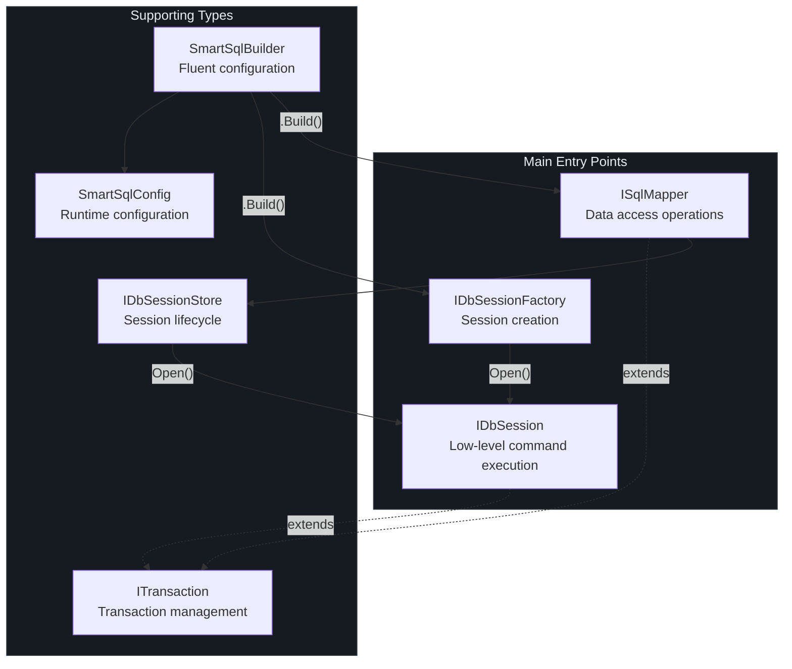
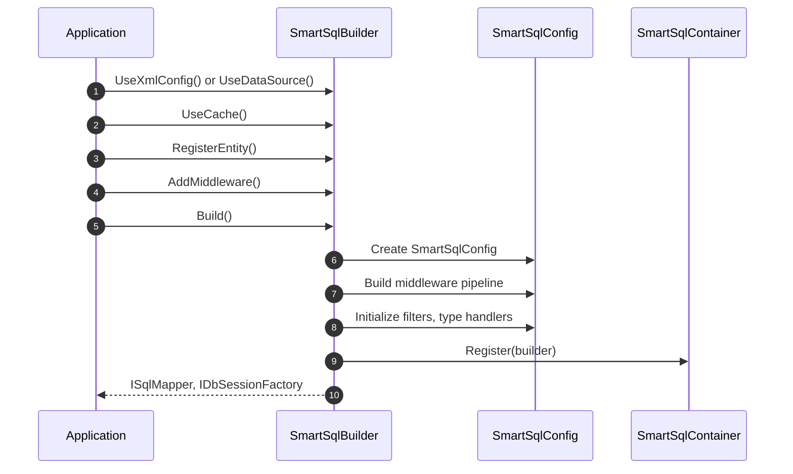

# API Reference Overview

SmartSql is a .NET ORM library targeting `netstandard2.0` (C# 7.3) that provides XML-managed SQL statements, read/write splitting, caching, dynamic repository proxies, and a middleware-based execution pipeline. Version **4.1.68** is published under the **Apache-2.0** license.

This section documents the public API surface of all SmartSql packages.

## At a Glance

| Aspect | Details |
|--------|---------|
| Target Framework | `netstandard2.0` |
| Language Version | C# 7.3 |
| License | Apache-2.0 |
| Current Version | 4.1.68 |
| Author | Ahoo Wang |
| Repository | [dotnetcore/SmartSql](https://github.com/dotnetcore/SmartSql) |

## Package Dependency Diagram

```mermaid
graph TD
    subgraph core["Core"]
        style core fill:#161b22,stroke:#30363d,color:#e6edf3
        SmartSql["SmartSql<br>Core ORM Library"]
    end
    subgraph extensions["Extension Packages"]
        style extensions fill:#161b22,stroke:#30363d,color:#e6edf3
        DI["SmartSql.DIExtension"]
        DyRepo["SmartSql.DyRepository"]
        Options["SmartSql.Options"]
        AOP["SmartSql.AOP"]
        Extensions["SmartSql.Extensions"]
        ScriptTag["SmartSql.ScriptTag"]
    end
    subgraph caching["Caching Packages"]
        style caching fill:#161b22,stroke:#30363d,color:#e6edf3
        CacheRedis["SmartSql.Cache.Redis"]
        CacheSync["SmartSql.Cache.Sync"]
        DistCache["SmartSql.DistributedCache"]
    end
    subgraph bulk["Bulk Insert Packages"]
        style bulk fill:#161b22,stroke:#30363d,color:#e6edf3
        BulkBase["SmartSql.Bulk"]
        BulkSQL["SmartSql.Bulk.SqlServer"]
        BulkMSSQL["SmartSql.Bulk.MsSqlServer"]
        BulkMy["SmartSql.Bulk.MySql"]
        BulkMyConn["SmartSql.Bulk.MySqlConnector"]
        BulkPG["SmartSql.Bulk.PostgreSql"]
    end
    subgraph sync["Sync Packages"]
        style sync fill:#161b22,stroke:#30363d,color:#e6edf3
        InvokeSync["SmartSql.InvokeSync"]
        SyncKafka["SmartSql.InvokeSync.Kafka"]
        SyncRMQ["SmartSql.InvokeSync.RabbitMQ"]
    end
    subgraph providers["Database Providers"]
        style providers fill:#161b22,stroke:#30363d,color:#e6edf3
        Oracle["SmartSql.Oracle"]
        TypeHandler["SmartSql.TypeHandler"]
        TypeHandlerPG["SmartSql.TypeHandler.PostgreSql"]
    end

    SmartSql --> DI
    SmartSql --> DyRepo
    SmartSql --> Options
    SmartSql --> AOP
    SmartSql --> Extensions
    SmartSql --> ScriptTag
    SmartSql --> CacheRedis
    SmartSql --> CacheSync
    SmartSql --> DistCache
    BulkBase --> BulkSQL
    BulkBase --> BulkMSSQL
    BulkBase --> BulkMy
    BulkBase --> BulkMyConn
    BulkBase --> BulkPG
    SmartSql --> BulkBase
    SmartSql --> InvokeSync
    InvokeSync --> SyncKafka
    InvokeSync --> SyncRMQ
    SmartSql --> Oracle
    SmartSql --> TypeHandler
    SmartSql --> TypeHandlerPG

```



<!-- Sources: Directory.Build.props:1, build/version.props:1 -->

## NuGet Packages

### Core

| Package | Description |
|---------|-------------|
| `SmartSql` | Core ORM library with middleware pipeline, XML SQL management, and `ISqlMapper` |

### Extensions

| Package | Description |
|---------|-------------|
| `SmartSql.DIExtension` | ASP.NET Core dependency injection integration (`AddSmartSql()`) |
| `SmartSql.DyRepository` | Dynamic proxy repository generation via IL emit |
| `SmartSql.Options` | Options-pattern configuration builder for `appsettings.json` |
| `SmartSql.AOP` | AOP transaction support with `[Transaction]` attribute |
| `SmartSql.Extensions` | General-purpose extensions |
| `SmartSql.ScriptTag` | Script tag support for dynamic SQL |
| `SmartSql.DataConnector` | Data connector service |

### Caching

| Package | Description |
|---------|-------------|
| `SmartSql.Cache.Redis` | Redis-based distributed cache provider |
| `SmartSql.Cache.Sync` | Cache synchronization across instances |
| `SmartSql.DistributedCache` | Distributed cache abstraction |

### Bulk Insert

| Package | Description |
|---------|-------------|
| `SmartSql.Bulk` | Base bulk insert abstractions |
| `SmartSql.Bulk.SqlServer` | SQL Server bulk insert |
| `SmartSql.Bulk.MsSqlServer` | MS SQL Server bulk insert |
| `SmartSql.Bulk.MySql` | MySQL bulk insert |
| `SmartSql.Bulk.MySqlConnector` | MySQL (MySqlConnector driver) bulk insert |
| `SmartSql.Bulk.PostgreSql` | PostgreSQL bulk insert |

### Synchronization

| Package | Description |
|---------|-------------|
| `SmartSql.InvokeSync` | Data synchronization via message queues |
| `SmartSql.InvokeSync.Kafka` | Kafka-based sync transport |
| `SmartSql.InvokeSync.RabbitMQ` | RabbitMQ-based sync transport |

### Database Providers

| Package | Description |
|---------|-------------|
| `SmartSql.Oracle` | Oracle database provider |
| `SmartSql.TypeHandler` | JSON and custom type handlers |
| `SmartSql.TypeHandler.PostgreSql` | PostgreSQL-specific type handlers |

## Main Entry Points

SmartSql exposes three primary interfaces that form the public API surface:



<!-- Sources: src/SmartSql/ISqlMapper.cs:1, src/SmartSql/DbSession/IDbSessionFactory.cs:17, src/SmartSql/DbSession/IDbSession.cs:24 -->

### ISqlMapper

The primary data access interface. Provides sync and async methods for executing SQL statements, queries, and retrieving results. It automatically manages session lifecycle (open/close) around each operation. See [Core Interfaces](/api/core-interfaces) for the full method listing.

```csharp
// Typical usage
var list = sqlMapper.Query<User>(new RequestContext { FullSqlId = "User.Query" });
var count = await sqlMapper.ExecuteAsync(new RequestContext { FullSqlId = "User.Delete", Request = new { Id = 1 } });
```

### IDbSessionFactory

Creates `IDbSession` instances for lower-level control. Useful when you need explicit session management or custom data source routing.

```csharp
var session = sessionFactory.Open();
var result = session.Query<User>(requestContext);
```

### IDbSession

The lowest-level interface. Provides direct access to `DbConnection`, `DbTransaction`, and raw command execution. Exposes events (`Opened`, `Committed`, `Rollbacked`, `Disposed`) for lifecycle hooks.

## SmartSqlBuilder

The fluent entry point for constructing the entire runtime. All configuration flows through `SmartSqlBuilder` before calling `Build()`. See [Configuration API](/api/configuration) for the full fluent API.



<!-- Sources: src/SmartSql/SmartSqlBuilder.cs:60, src/SmartSql/Configuration/SmartSqlConfig.cs:21 -->

## Cross-References

- [Core Interfaces](/api/core-interfaces) -- Full documentation of `ISqlMapper`, `IDbSession`, `IDbSessionFactory`
- [Configuration API](/api/configuration) -- `SmartSqlBuilder` fluent API and `SmartSqlConfig`
- [Middleware API](/api/middleware) -- Middleware pipeline, custom middleware, filters

## References

| Source | Description |
|--------|-------------|
| [`src/SmartSql/ISqlMapper.cs`](https://github.com/dotnetcore/SmartSql/blob/master/src/SmartSql/ISqlMapper.cs) | `ISqlMapper` interface definition |
| [`src/SmartSql/SqlMapper.cs`](https://github.com/dotnetcore/SmartSql/blob/master/src/SmartSql/SqlMapper.cs) | `SqlMapper` implementation |
| [`src/SmartSql/SmartSqlBuilder.cs`](https://github.com/dotnetcore/SmartSql/blob/master/src/SmartSql/SmartSqlBuilder.cs) | Fluent builder |
| [`src/SmartSql/Configuration/SmartSqlConfig.cs`](https://github.com/dotnetcore/SmartSql/blob/master/src/SmartSql/Configuration/SmartSqlConfig.cs) | Central configuration |
| [`src/SmartSql/DbSession/IDbSession.cs`](https://github.com/dotnetcore/SmartSql/blob/master/src/SmartSql/DbSession/IDbSession.cs) | Session interface |
| [`src/SmartSql/DbSession/IDbSessionFactory.cs`](https://github.com/dotnetcore/SmartSql/blob/master/src/SmartSql/DbSession/IDbSessionFactory.cs) | Session factory interface |
| [`Directory.Build.props`](https://github.com/dotnetcore/SmartSql/blob/master/Directory.Build.props) | Shared build properties |
