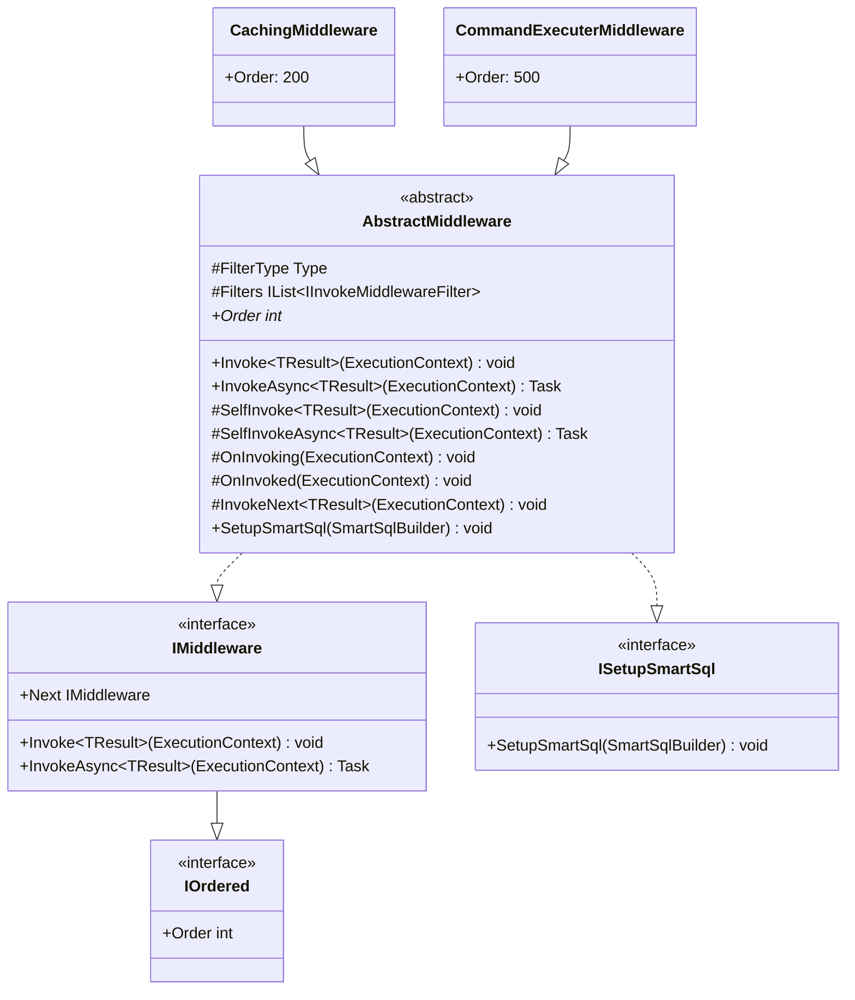
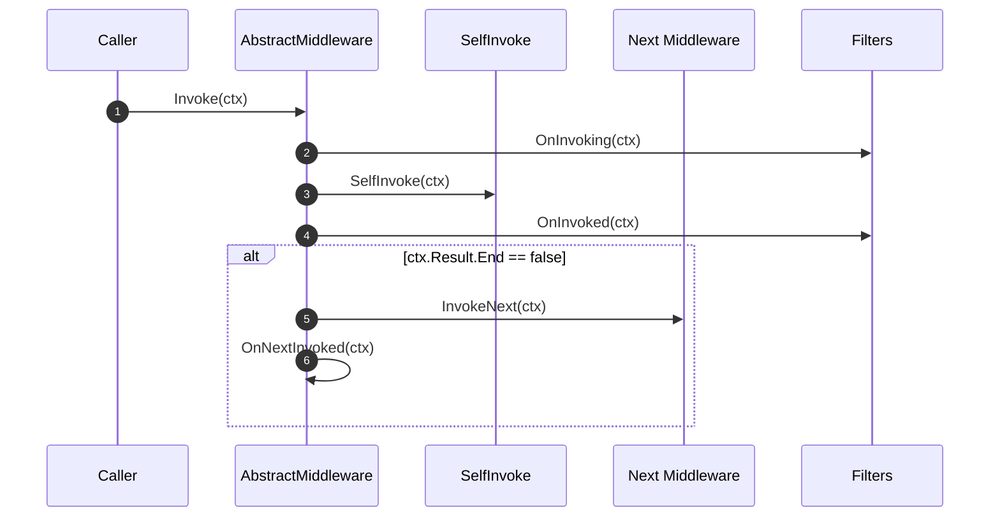
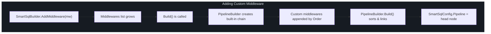
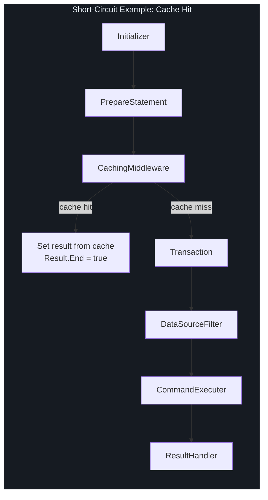

# Middleware API

SmartSql executes all SQL operations through a linked-list middleware pipeline. Each middleware receives an `ExecutionContext`, performs its work, and delegates to the next middleware. This design enables clean separation of concerns: statement resolution, SQL preparation, caching, transaction management, data source routing, command execution, and result deserialization are each handled by independent middleware components.

## At a Glance

| Concept | Description |
|---------|-------------|
| `IMiddleware` | Core interface: `Invoke<T>`, `InvokeAsync<T>`, and `Next` pointer |
| `IOrdered` | Determines execution order via `int Order` property |
| `AbstractMiddleware` | Base class with filter support and lifecycle hooks |
| `PipelineBuilder` | Constructs the linked list from registered middleware |
| `ExecutionContext` | Shared context flowing through the entire pipeline |

## Interface Definitions

### IMiddleware

```csharp
public interface IMiddleware : IOrdered
{
    IMiddleware Next { get; set; }
    void Invoke<TResult>(ExecutionContext executionContext);
    Task InvokeAsync<TResult>(ExecutionContext executionContext);
}
```

The `Next` pointer forms a singly linked list. Each middleware calls `Next.Invoke<TResult>()` (or the async variant) to continue the pipeline.

### IOrdered

```csharp
public interface IOrdered
{
    int Order { get; }
}
```

The `Order` property controls where a middleware sits in the pipeline. Lower values execute first. Built-in middlewares use these orders:

## Built-in Middleware Chain

```mermaid
flowchart TD
    subgraph pipeline["SmartSql Middleware Pipeline"]
        style pipeline fill:#161b22,stroke:#30363d,color:#e6edf3
        M0["InitializerMiddleware<br>Order: 0<br>Resolves Statement, DataSource"]
        M1["PrepareStatementMiddleware<br>Order: 100<br>Builds SQL, creates DbParameters"]
        M2["CachingMiddleware<br>Order: 200<br>Cache check/populate (optional)"]
        M3["TransactionMiddleware<br>Order: 300<br>Wraps in transaction if requested"]
        M4["DataSourceFilterMiddleware<br>Order: 400<br>Selects read vs write data source"]
        M5["CommandExecuterMiddleware<br>Order: 500<br>Executes DbCommand"]
        M6["ResultHandlerMiddleware<br>Order: 600<br>Deserializes DataReader results"]
        Custom["Custom Middleware<br>Order: > 600<br>User-defined logic"]

        M0 --> M1 --> M2 --> M3 --> M4 --> M5 --> M6 --> Custom
    end

```



<!-- Sources: src/SmartSql/Middlewares/InitializerMiddleware.cs:214, src/SmartSql/Middlewares/PrepareStatementMiddleware.cs:155, src/SmartSql/Middlewares/CachingMiddleware.cs:58, src/SmartSql/Middlewares/TransactionMiddleware.cs:43, src/SmartSql/Middlewares/DataSourceFilterMiddleware.cs:32, src/SmartSql/Middlewares/CommandExecuterMiddleware.cs:156, src/SmartSql/Middlewares/ResultHandlerMiddleware.cs:76 -->

### Middleware Details

| Order | Class | Key Responsibility |
|-------|-------|--------------------|
| 0 | `InitializerMiddleware` | Resolves the `Statement` from `SmartSqlConfig.SqlMaps`, sets data source choice (Read/Write), resolves result maps, parameter maps, cache references, and auto-converters |
| 100 | `PrepareStatementMiddleware` | Builds the final SQL string by evaluating dynamic XML tags and creates `DbParameter` objects from the request parameters using `TypeHandlerFactory` |
| 200 | `CachingMiddleware` | Checks the cache before executing the query. On cache miss, lets the pipeline continue and then caches the result. Only active when cache is configured for the statement and no transaction is active. |
| 300 | `TransactionMiddleware` | If a transaction isolation level is specified on the statement/request and no transaction is active, wraps the downstream pipeline in a `TransactionWrap` |
| 400 | `DataSourceFilterMiddleware` | Uses `IDataSourceFilter.Elect()` to select the appropriate data source (read or write) if one is not already set on the session |
| 500 | `CommandExecuterMiddleware` | Executes the actual `DbCommand` via `ICommandExecuter`. For queries, opens a `DataReader` and passes it downstream. For non-queries, sets the result directly and terminates the pipeline (`Result.End = true`) |
| 600 | `ResultHandlerMiddleware` | Uses the `DeserializerFactory` to select the appropriate deserializer and maps the `DataReader` to entities. Closes and disposes the `DataReader` when done. |

## AbstractMiddleware Base Class

All built-in middlewares extend `AbstractMiddleware`, which provides:



<!-- Sources: src/SmartSql/Middlewares/AbstractMiddleware.cs:9, src/SmartSql/IMiddleware.cs:8, src/SmartSql/IOrdered.cs:3 -->

### Lifecycle Hooks

`AbstractMiddleware` provides overridable hooks in this order:



<!-- Sources: src/SmartSql/Middlewares/AbstractMiddleware.cs:15 -->

| Hook | When | Typical Use |
|------|------|-------------|
| `OnInvoking(ctx)` | Before `SelfInvoke` | Pre-processing, validation |
| `SelfInvoke<T>(ctx)` | Main middleware logic | Core middleware work |
| `OnInvoked(ctx)` | After `SelfInvoke` | Post-processing, logging |
| `InvokeNext<T>(ctx)` | Delegates to `Next` | Pipeline continuation |
| `OnNextInvoked<T>(ctx)` | After `Next` completes | Cleanup after downstream |

## Filter System

Filters attach to specific middleware types and run before/after that middleware's `SelfInvoke`. This provides cross-cutting concerns without modifying the middleware itself.

### Filter Interfaces

| Interface | Method | When Called |
|-----------|--------|------------|
| `IInvokeFilter` | `OnInvoking(ctx)` | Before `SelfInvoke` |
| `IInvokeFilter` | `OnInvoked(ctx)` | After `SelfInvoke` |
| `IAsyncInvokeFilter` | `OnInvokingAsync(ctx)` | Async before `SelfInvoke` |
| `IAsyncInvokeFilter` | `OnInvokedAsync(ctx)` | Async after `SelfInvoke` |
| `IFilter` | (marker) | Base interface for all filters |
| `IPrepareStatementFilter` | Extends `IInvokeMiddlewareFilter` | Targets `PrepareStatementMiddleware` |

A middleware declares which filter type it supports via the `FilterType` property. For example, `PrepareStatementMiddleware` sets `FilterType = typeof(IPrepareStatementFilter)`, so only filters implementing `IPrepareStatementFilter` will be attached to it.

## Creating Custom Middleware

To create a custom middleware:

### Step 1: Implement the Middleware

```csharp
public class LoggingMiddleware : AbstractMiddleware
{
    private ILogger _logger;

    // Order determines position in pipeline.
    // Use a value > 600 to run after built-in middlewares.
    public override int Order => 700;

    protected override void SelfInvoke<TResult>(ExecutionContext executionContext)
    {
        _logger.LogInformation(
            "Executing {Type} for {FullSqlId}",
            executionContext.Type,
            executionContext.Request.FullSqlId);
    }

    protected override async Task SelfInvokeAsync<TResult>(ExecutionContext executionContext)
    {
        _logger.LogInformation(
            "Executing {Type} for {FullSqlId}",
            executionContext.Type,
            executionContext.Request.FullSqlId);
    }

    public override void SetupSmartSql(SmartSqlBuilder smartSqlBuilder)
    {
        _logger = smartSqlBuilder.SmartSqlConfig.LoggerFactory
            .CreateLogger<LoggingMiddleware>();
    }
}
```

### Step 2: Register via SmartSqlBuilder

```csharp
var builder = new SmartSqlBuilder()
    .UseXmlConfig()
    .AddMiddleware(new LoggingMiddleware())
    .Build();
```

Custom middlewares are appended after the built-in chain. The `PipelineBuilder` sorts all middlewares by `Order`, so even if you add them out of order, they execute correctly.

## Creating Custom Filters

```csharp
// 1. Define a filter interface (or use IPrepareStatementFilter)
public interface IMyCustomFilter : IInvokeMiddlewareFilter { }

// 2. Implement the filter
public class AuditFilter : IMyCustomFilter
{
    public void OnInvoking(ExecutionContext context)
    {
        // Pre-execution audit
    }

    public void OnInvoked(ExecutionContext context)
    {
        // Post-execution audit
    }

    public Task OnInvokingAsync(ExecutionContext context)
    {
        OnInvoking(context);
        return Task.CompletedTask;
    }

    public Task OnInvokedAsync(ExecutionContext context)
    {
        OnInvoked(context);
        return Task.CompletedTask;
    }
}

// 3. Register the filter
var builder = new SmartSqlBuilder()
    .UseXmlConfig()
    .AddFilter(new AuditFilter())
    .Build();
```

The filter only activates on middlewares whose `FilterType` is assignable from the filter interface.

## Adding Middleware via SmartSqlBuilder

The `AddMiddleware` method on `SmartSqlBuilder`:



<!-- Sources: src/SmartSql/SmartSqlBuilder.cs:392, src/SmartSql/SmartSqlBuilder.cs:240 -->

## Middleware Short-Circuiting

Some middlewares terminate the pipeline early by setting `executionContext.Result.End = true`. When this happens, downstream middlewares are skipped.

| Middleware | Short-Circuits When |
|-----------|---------------------|
| `CommandExecuterMiddleware` | For `Execute`, `ExecuteScalar`, `GetDataSet`, and `GetDataTable` operations -- sets result directly without invoking `ResultHandlerMiddleware` |
| `CachingMiddleware` | When a cache hit is found (no transaction active) -- sets result from cache, skips command execution entirely |



<!-- Sources: src/SmartSql/Middlewares/CachingMiddleware.cs:20, src/SmartSql/Middlewares/CommandExecuterMiddleware.cs:14 -->

## Cross-References

- [API Overview](/api/index) -- Package listing and entry points
- [Configuration API](/api/configuration) -- `SmartSqlBuilder` fluent API and pipeline construction
- [Core Interfaces](/api/core-interfaces) -- `ExecutionContext`, `ISqlMapper`, `IDbSession`

## References

| Source | Description |
|--------|-------------|
| [`src/SmartSql/IMiddleware.cs`](https://github.com/dotnetcore/SmartSql/blob/master/src/SmartSql/IMiddleware.cs) | `IMiddleware` interface |
| [`src/SmartSql/IOrdered.cs`](https://github.com/dotnetcore/SmartSql/blob/master/src/SmartSql/IOrdered.cs) | `IOrdered` interface |
| [`src/SmartSql/Middlewares/AbstractMiddleware.cs`](https://github.com/dotnetcore/SmartSql/blob/master/src/SmartSql/Middlewares/AbstractMiddleware.cs) | Base class with lifecycle hooks and filter support |
| [`src/SmartSql/Middlewares/InitializerMiddleware.cs`](https://github.com/dotnetcore/SmartSql/blob/master/src/SmartSql/Middlewares/InitializerMiddleware.cs) | Statement resolution middleware |
| [`src/SmartSql/Middlewares/PrepareStatementMiddleware.cs`](https://github.com/dotnetcore/SmartSql/blob/master/src/SmartSql/Middlewares/PrepareStatementMiddleware.cs) | SQL building and parameter creation |
| [`src/SmartSql/Middlewares/CachingMiddleware.cs`](https://github.com/dotnetcore/SmartSql/blob/master/src/SmartSql/Middlewares/CachingMiddleware.cs) | Cache check and populate |
| [`src/SmartSql/Middlewares/TransactionMiddleware.cs`](https://github.com/dotnetcore/SmartSql/blob/master/src/SmartSql/Middlewares/TransactionMiddleware.cs) | Transaction wrapping |
| [`src/SmartSql/Middlewares/DataSourceFilterMiddleware.cs`](https://github.com/dotnetcore/SmartSql/blob/master/src/SmartSql/Middlewares/DataSourceFilterMiddleware.cs) | Read/write data source selection |
| [`src/SmartSql/Middlewares/CommandExecuterMiddleware.cs`](https://github.com/dotnetcore/SmartSql/blob/master/src/SmartSql/Middlewares/CommandExecuterMiddleware.cs) | Command execution |
| [`src/SmartSql/Middlewares/ResultHandlerMiddleware.cs`](https://github.com/dotnetcore/SmartSql/blob/master/src/SmartSql/Middlewares/ResultHandlerMiddleware.cs) | Result deserialization |
| [`src/SmartSql/Middlewares/Filters/IInvokeMiddlewareFilter.cs`](https://github.com/dotnetcore/SmartSql/blob/master/src/SmartSql/Middlewares/Filters/IInvokeMiddlewareFilter.cs) | Middleware filter interface |
| [`src/SmartSql/Filters/IFilter.cs`](https://github.com/dotnetcore/SmartSql/blob/master/src/SmartSql/Filters/IFilter.cs) | Base filter marker interface |
| [`src/SmartSql/Filters/IInvokeFilter.cs`](https://github.com/dotnetcore/SmartSql/blob/master/src/SmartSql/Filters/IInvokeFilter.cs) | Sync filter interface |
| [`src/SmartSql/SmartSqlBuilder.cs`](https://github.com/dotnetcore/SmartSql/blob/master/src/SmartSql/SmartSqlBuilder.cs) | Builder with `AddMiddleware` and `AddFilter` |
