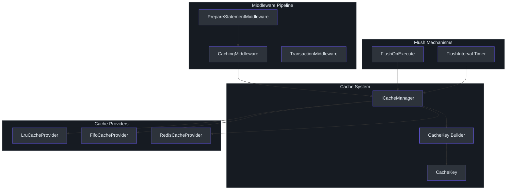
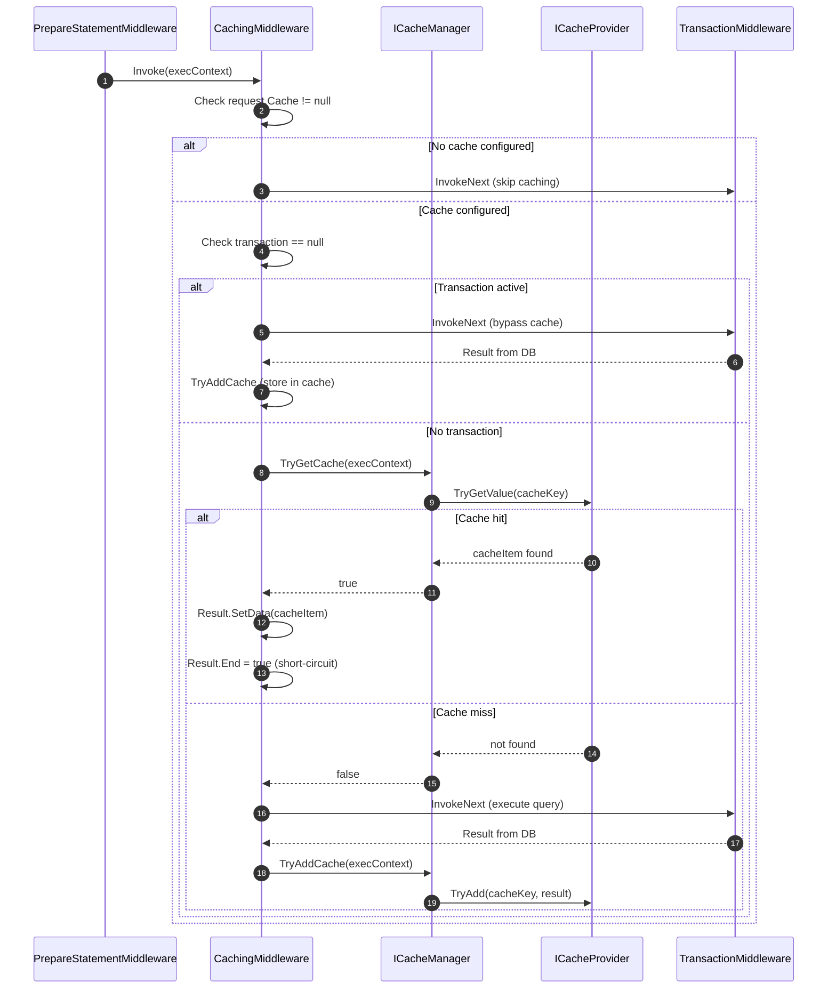
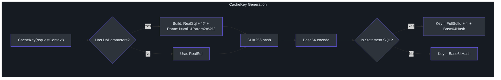
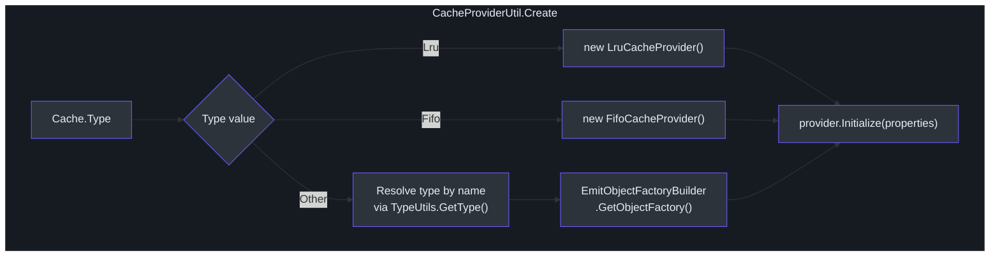
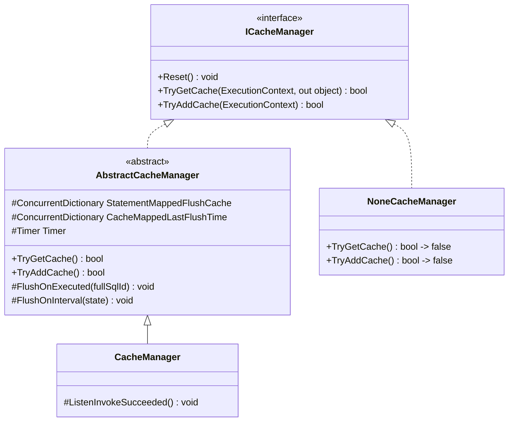

# Caching Architecture

SmartSql includes a built-in caching layer that sits inside the middleware pipeline between SQL preparation and transaction management. When a query statement has an associated cache definition, `CachingMiddleware` checks for a cached result before executing against the database. This can dramatically reduce database load for frequently executed, parameterized queries. The system supports in-memory LRU and FIFO caches out of the box, plus Redis for distributed caching scenarios.

## At a Glance

| Aspect | Detail |
|--------|--------|
| Cache interface | `ICacheProvider` with `TryGetValue`, `TryAdd`, `Flush` |
| Manager interface | `ICacheManager` with `TryGetCache`, `TryAddCache` |
| Built-in providers | `LruCacheProvider`, `FifoCacheProvider` |
| Distributed provider | `RedisCacheProvider` (separate package `SmartSql.Cache.Redis`) |
| Cache key | SHA256 hash of SQL + parameters, prefixed with FullSqlId |
| Flush strategies | `FlushOnExecute` (event-driven) and `FlushInterval` (timer-based) |
| Transaction bypass | Cache is not used when a transaction is active |

## Cache Architecture Overview



<!-- Sources: src/SmartSql/Middlewares/CachingMiddleware.cs:9, src/SmartSql/Cache/AbstractCacheManager.cs:10, src/SmartSql/Cache/CacheProviderUtil.cs:10 -->

## Cache Hit/Miss Flow

The following sequence shows how `CachingMiddleware` processes a query that has cache configured.



<!-- Sources: src/SmartSql/Middlewares/CachingMiddleware.cs:12, src/SmartSql/Middlewares/CachingMiddleware.cs:20 -->

## Cache Key Generation

`CacheKey` is constructed from the request's final SQL and all parameter values. The key is a SHA256 hash to avoid collisions while keeping memory usage bounded.



<!-- Sources: src/SmartSql/Cache/CacheKey.cs:10, src/SmartSql/Cache/CacheKey.cs:21 -->

The resulting key format for statement SQL is: `Scope.StatementId:SHA256Base64`, ensuring uniqueness across different statements and parameter combinations.

## Built-in Cache Providers

### LruCacheProvider (Least Recently Used)

Maintains a bounded dictionary of cached results. When the cache exceeds `CacheSize`, the least recently used entry is evicted. On `TryGetValue`, the accessed key is moved to the end of the key list, marking it as most recently used.

| Parameter | Default | Description |
|-----------|---------|-------------|
| `CacheSize` | 100 | Maximum number of cached entries |

```csharp
// XML configuration
<Cache Id="UserCache" Type="Lru">
  <Parameter Name="CacheSize" Value="500"/>
  <FlushInterval Interval="00:05:00"/>
  <FlushOnExecute Statement="InsertUser"/>
</Cache>
```

<!-- Sources: src/SmartSql/Cache/Default/LruCacheProvider.cs:10, src/SmartSql/Cache/Default/LruCacheProvider.cs:31 -->

### FifoCacheProvider (First In First Out)

Maintains a bounded queue of cached results. When the cache exceeds `CacheSize`, the oldest entry is evicted. Simpler than LRU but does not consider access patterns.

| Parameter | Default | Description |
|-----------|---------|-------------|
| `CacheSize` | 100 | Maximum number of cached entries |

<!-- Sources: src/SmartSql/Cache/Default/FifoCacheProvider.cs:10, src/SmartSql/Cache/Default/FifoCacheProvider.cs:34 -->

### NoneCacheProvider

A no-op provider returned by `NoneCacheManager` when caching is globally disabled. Always returns cache misses.

<!-- Sources: src/SmartSql/Cache/Default/NoneCacheProvider.cs -->

## ICacheProvider Interface

```csharp
public interface ICacheProvider : IDisposable
{
    bool SupportExpire { get; }
    void Initialize(IDictionary<string, object> properties);
    bool TryGetValue(CacheKey cacheKey, out object cacheItem);
    bool TryAdd(CacheKey cacheKey, object cacheItem);
    void Flush();
}
```

| Method | Purpose |
|--------|---------|
| `SupportExpire` | If true, the provider handles its own expiration (e.g., Redis TTL) and skips `FlushInterval` |
| `Initialize` | Configures the provider from XML parameters |
| `TryGetValue` | Retrieves a cached value by key |
| `TryAdd` | Stores a value in the cache |
| `Flush` | Clears all entries from this provider |

<!-- Sources: src/SmartSql/Cache/ICacheProvider.cs:8 -->

## Cache Manager and Flush Strategies

`AbstractCacheManager` implements two flush strategies:

### FlushOnExecute (Event-Driven)

When an XML cache definition includes `<FlushOnExecute Statement="SomeStatement"/>`, the cache is automatically flushed whenever that statement executes successfully. This is wired through `InvokeSucceedListener` which fires after every successful command execution.

```xml
<Cache Id="UserListCache" Type="Lru">
  <Parameter Name="CacheSize" Value="200"/>
  <FlushOnExecute Statement="InsertUser"/>
  <FlushOnExecute Statement="UpdateUser"/>
  <FlushOnExecute Statement="DeleteUser"/>
</Cache>
```

### FlushInterval (Timer-Based)

A background `Timer` runs every 1 minute (starting after 1 minute) and checks each cache's `FlushInterval`. If the elapsed time since the last flush exceeds the interval, the cache is flushed. Providers with `SupportExpire = true` (like Redis) are skipped since they handle expiration natively.

```xml
<Cache Id="UserListCache" Type="Lru">
  <Parameter Name="CacheSize" Value="200"/>
  <FlushInterval Interval="00:10:00"/>
</Cache>
```

<!-- Sources: src/SmartSql/Cache/AbstractCacheManager.cs:10, src/SmartSql/Cache/AbstractCacheManager.cs:50, src/SmartSql/Cache/AbstractCacheManager.cs:83 -->

## Cache Provider Selection

`CacheProviderUtil.Create()` resolves the provider type from the cache definition:



<!-- Sources: src/SmartSql/Cache/CacheProviderUtil.cs:10, src/SmartSql/Cache/CacheProviderUtil.cs:15 -->

## Redis Cache Integration

The `SmartSql.Cache.Redis` package provides `RedisCacheProvider` for distributed caching using StackExchange.Redis.

| Parameter | Required | Description |
|-----------|----------|-------------|
| `ConnectionString` | Yes | Redis connection string |
| `Prefix` | No | Key prefix (defaults to Cache.Id) |
| `DatabaseId` | No | Redis database number (defaults to 0) |
| `FlushInterval` | No | If set, uses Redis key expiration (TTL) |

```xml
<Cache Id="UserCache" Type="SmartSql.Cache.Redis.RedisCacheProvider, SmartSql.Cache.Redis">
  <Parameter Name="ConnectionString" Value="localhost:6379"/>
  <Parameter Name="Prefix" Value="SmartSql:UserCache"/>
  <Parameter Name="DatabaseId" Value="0"/>
  <FlushInterval Interval="00:05:00"/>
  <FlushOnExecute Statement="InsertUser"/>
</Cache>
```

Key characteristics of `RedisCacheProvider`:

- `SupportExpire = true` -- the `FlushInterval` timer does not flush this provider since Redis handles TTL natively
- `Flush()` performs a pattern-based `KEYS` scan and bulk delete for the cache prefix
- Values are serialized with `Newtonsoft.Json` for cross-process compatibility

<!-- Sources: src/SmartSql.Cache.Redis/RedisCacheProvider.cs:10, src/SmartSql.Cache.Redis/RedisCacheProvider.cs:18 -->

## Enabling Caching

Caching is enabled globally via `SmartSqlBuilder.UseCache()` or through XML config:

```csharp
new SmartSqlBuilder()
    .UseXmlConfig()
    .UseCache()
    .Build();
```

When `IsCacheEnabled` is true, the pipeline includes `CachingMiddleware` and assigns a real `CacheManager`. When false, `NoneCacheManager` is used and the `CachingMiddleware` is excluded from the pipeline.

<!-- Sources: src/SmartSql/SmartSqlBuilder.cs:238, src/SmartSql/SmartSqlBuilder.cs:248 -->

## ICacheManager Hierarchy



<!-- Sources: src/SmartSql/Cache/ICacheManager.cs:9, src/SmartSql/Cache/AbstractCacheManager.cs:10, src/SmartSql/Cache/CacheManager.cs:9, src/SmartSql/Cache/NoneCacheManager.cs:7 -->

## Cross-References

- [Architecture Overview](./index.md) -- where caching fits in the middleware pipeline
- [Middleware Pipeline](./middleware-pipeline.md) -- `CachingMiddleware` at Order 200
- [DataSource & Read/Write Splitting](./datasource.md) -- transaction context bypasses cache

## References

- [ICacheProvider.cs](https://github.com/dotnetcore/SmartSql/blob/master/src/SmartSql/Cache/ICacheProvider.cs)
- [ICacheManager.cs](https://github.com/dotnetcore/SmartSql/blob/master/src/SmartSql/Cache/ICacheManager.cs)
- [AbstractCacheManager.cs](https://github.com/dotnetcore/SmartSql/blob/master/src/SmartSql/Cache/AbstractCacheManager.cs)
- [CacheManager.cs](https://github.com/dotnetcore/SmartSql/blob/master/src/SmartSql/Cache/CacheManager.cs)
- [NoneCacheManager.cs](https://github.com/dotnetcore/SmartSql/blob/master/src/SmartSql/Cache/NoneCacheManager.cs)
- [CacheKey.cs](https://github.com/dotnetcore/SmartSql/blob/master/src/SmartSql/Cache/CacheKey.cs)
- [LruCacheProvider.cs](https://github.com/dotnetcore/SmartSql/blob/master/src/SmartSql/Cache/Default/LruCacheProvider.cs)
- [FifoCacheProvider.cs](https://github.com/dotnetcore/SmartSql/blob/master/src/SmartSql/Cache/Default/FifoCacheProvider.cs)
- [CacheProviderUtil.cs](https://github.com/dotnetcore/SmartSql/blob/master/src/SmartSql/Cache/CacheProviderUtil.cs)
- [RedisCacheProvider.cs](https://github.com/dotnetcore/SmartSql/blob/master/src/SmartSql.Cache.Redis/RedisCacheProvider.cs)
- [CachingMiddleware.cs](https://github.com/dotnetcore/SmartSql/blob/master/src/SmartSql/Middlewares/CachingMiddleware.cs)
