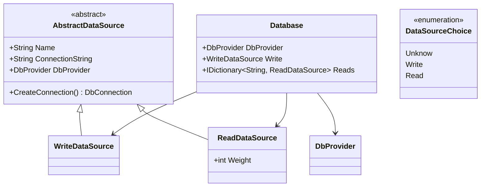
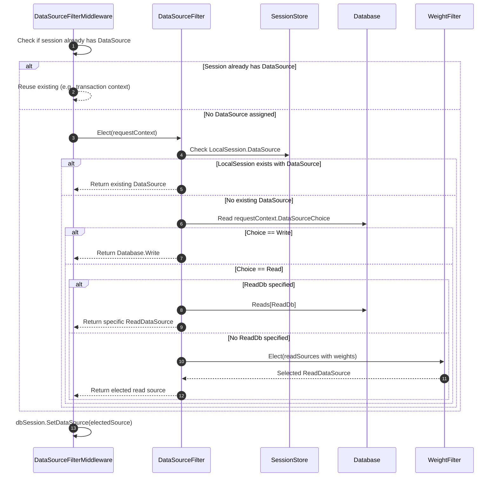
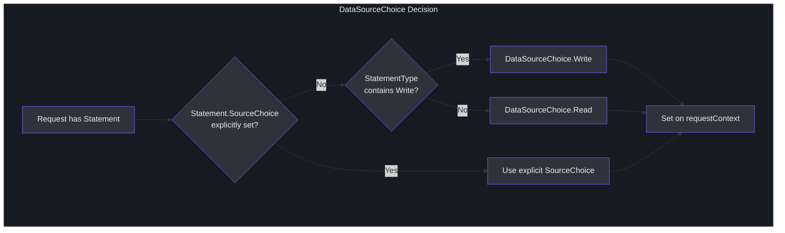
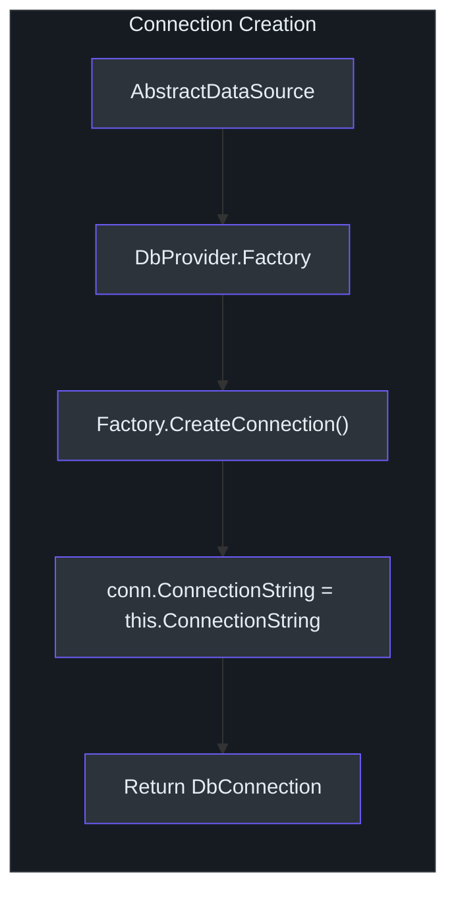

# DataSource & Read/Write Splitting

SmartSql provides built-in support for read/write splitting, allowing you to direct read queries to one or more read replicas while routing write operations to a single master database. This feature is essential for scaling read-heavy applications and is configured through XML or programmatic APIs. The routing decision happens inside the middleware pipeline via `DataSourceFilterMiddleware`, which delegates to an `IDataSourceFilter` implementation.

## At a Glance

| Aspect | Detail |
|--------|--------|
| Abstract base | `AbstractDataSource` with Name, ConnectionString, DbProvider |
| Write source | `WriteDataSource` -- single master database |
| Read source | `ReadDataSource` -- one or more replicas with a `Weight` property |
| Filter interface | `IDataSourceFilter` with `Elect(AbstractRequestContext)` |
| Default filter | `DataSourceFilter` with weighted load balancing via `WeightFilter<T>` |
| Selection logic | Statement type (`Read`/`Write`) determines source choice |
| Extension point | Replace `IDataSourceFilter` via `SmartSqlBuilder.UseDataSourceFilter()` |

## DataSource Class Hierarchy



<!-- Sources: src/SmartSql/DataSource/AbstractDataSource.cs:9, src/SmartSql/DataSource/WriteDataSource.cs:7, src/SmartSql/DataSource/ReadDataSource.cs:7, src/SmartSql/DataSource/Database.cs:7 -->

## How Data Source Selection Works

When the middleware pipeline reaches `DataSourceFilterMiddleware`, it delegates to `IDataSourceFilter.Elect()` to determine which database connection to use.



<!-- Sources: src/SmartSql/Middlewares/DataSourceFilterMiddleware.cs:7, src/SmartSql/DataSource/DataSourceFilter.cs:11, src/SmartSql/DataSource/DataSourceFilter.cs:24 -->

## DataSourceChoice Determination

The `DataSourceChoice` (Read or Write) is determined during the `InitializerMiddleware` phase based on the statement's `StatementType`:

| StatementType Mapping | Resulting Choice |
|----------------------|-----------------|
| `StatementType.Write` (or contains Write flag) | `DataSourceChoice.Write` |
| All other types (Select, etc.) | `DataSourceChoice.Read` |
| Explicit `SourceChoice` on the Statement | Overrides automatic detection |



<!-- Sources: src/SmartSql/Middlewares/InitializerMiddleware.cs:64, src/SmartSql/DataSource/DataSourceChoice.cs:7 -->

## Weighted Load Balancing for Read Replicas

When multiple read replicas are configured and no specific `ReadDb` is requested, `DataSourceFilter` uses `WeightFilter<T>` to perform weighted random selection. Each `ReadDataSource` has a `Weight` property that influences the probability of selection.

| Replica | Weight | Selection Probability |
|---------|--------|----------------------|
| Read-1 | 100 | 50% |
| Read-2 | 60 | 30% |
| Read-3 | 40 | 20% |

This allows you to direct more traffic to more powerful replicas while still distributing load.

## XML Configuration

Database sources are configured in the `SmartSqlMapConfig.xml` file:

```xml
<SmartSqlMapConfig>
  <Database>
    <DbProvider Name="MySql"/>
    <Write Name="WriteDB"
           ConnectionString="Server=master-db;Database=MyDb;Uid=root;Pwd=123456;"/>
    <Read Name="ReadDB-1" Weight="100"
          ConnectionString="Server=replica-1;Database=MyDb;Uid=readonly;Pwd=123456;"/>
    <Read Name="ReadDB-2" Weight="60"
          ConnectionString="Server=replica-2;Database=MyDb;Uid=readonly;Pwd=123456;"/>
  </Database>
  <SmartSqlMaps>
    <SmartSqlMap Resource="Maps/User.xml"/>
  </SmartSqlMaps>
</SmartSqlMapConfig>
```

## Programmatic Configuration

When using `SmartSqlBuilder`, you can configure the data source directly without XML:

```csharp
// Single database (no read/write splitting)
new SmartSqlBuilder()
    .UseDataSource("MySql", connectionString)
    .Build();

// Or with a WriteDataSource object
new SmartSqlBuilder()
    .UseDataSource(new WriteDataSource
    {
        Name = "Write",
        ConnectionString = masterConnectionString,
        DbProvider = dbProvider
    })
    .Build();
```

## Explicit ReadDb Selection

Individual statements or request contexts can specify a `ReadDb` property to target a specific read replica, bypassing the weighted selection:

```xml
<Statement Id="GetReport" ReadDb="ReadDB-1">
  SELECT * FROM Reports WHERE Id = @Id
</Statement>
```

## Transaction Behavior

When a transaction is active (`IDbSession.Transaction != null`), the `DataSourceFilter` always returns the data source already assigned to the session. This ensures all operations within a transaction hit the same database connection, regardless of read/write designation.

## IDataSourceFilter Interface

```csharp
public interface IDataSourceFilter
{
    AbstractDataSource Elect(AbstractRequestContext context);
}
```

To implement custom routing logic (e.g., based on tenant, region, or latency), create a class implementing `IDataSourceFilter` and register it:

```csharp
new SmartSqlBuilder()
    .UseDataSourceFilter(new MyCustomDataSourceFilter())
    .Build();
```

<!-- Sources: src/SmartSql/DataSource/IDataSourceFilter.cs:11, src/SmartSql/DataSource/DataSourceFilter.cs:11 -->

## Connection Creation

`AbstractDataSource.CreateConnection()` uses the `DbProvider.Factory` to create a new `DbConnection` instance and assigns the `ConnectionString`:



<!-- Sources: src/SmartSql/DataSource/AbstractDataSource.cs:23 -->

## Cross-References

- [Architecture Overview](./index.md) -- where DataSource fits in the layered architecture
- [Middleware Pipeline](./middleware-pipeline.md) -- `DataSourceFilterMiddleware` at Order 400
- [Caching Architecture](./caching.md) -- cache behavior differences in transaction context

## References

- [AbstractDataSource.cs](https://github.com/dotnetcore/SmartSql/blob/master/src/SmartSql/DataSource/AbstractDataSource.cs)
- [WriteDataSource.cs](https://github.com/dotnetcore/SmartSql/blob/master/src/SmartSql/DataSource/WriteDataSource.cs)
- [ReadDataSource.cs](https://github.com/dotnetcore/SmartSql/blob/master/src/SmartSql/DataSource/ReadDataSource.cs)
- [Database.cs](https://github.com/dotnetcore/SmartSql/blob/master/src/SmartSql/DataSource/Database.cs)
- [DataSourceFilter.cs](https://github.com/dotnetcore/SmartSql/blob/master/src/SmartSql/DataSource/DataSourceFilter.cs)
- [IDataSourceFilter.cs](https://github.com/dotnetcore/SmartSql/blob/master/src/SmartSql/DataSource/IDataSourceFilter.cs)
- [DataSourceChoice.cs](https://github.com/dotnetcore/SmartSql/blob/master/src/SmartSql/DataSource/DataSourceChoice.cs)
- [DataSourceFilterMiddleware.cs](https://github.com/dotnetcore/SmartSql/blob/master/src/SmartSql/Middlewares/DataSourceFilterMiddleware.cs)
