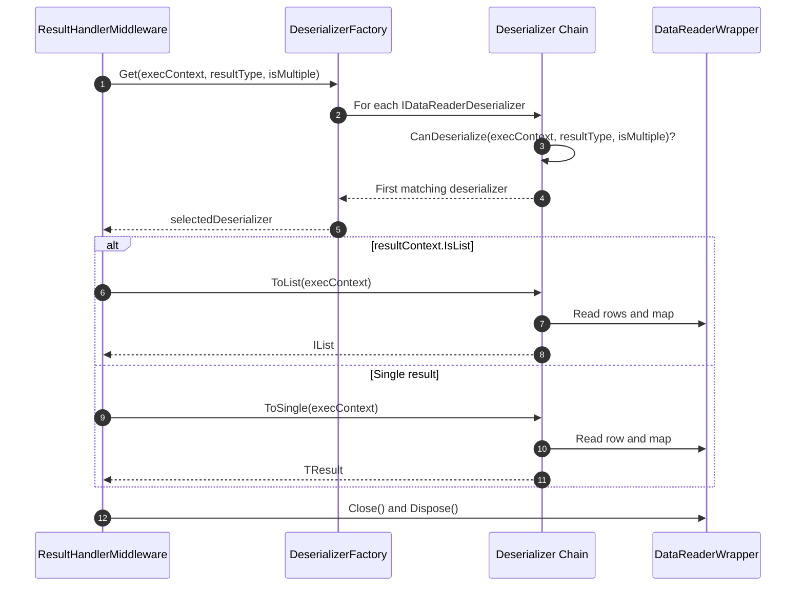
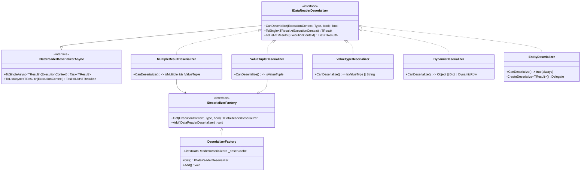

# Deserialization

After a SQL query executes and returns a `DataReader`, SmartSql must convert the raw column data into strongly typed .NET objects. This deserialization step is handled by a chain of `IDataReaderDeserializer` implementations, each responsible for a specific result type. The `DeserializerFactory` selects the first deserializer in the chain that can handle the requested type. SmartSql's `EntityDeserializer` uses IL emit to generate high-performance deserialization delegates at runtime, avoiding reflection overhead on repeated calls.

## At a Glance

| Aspect | Detail |
|--------|--------|
| Interface | `IDataReaderDeserializer` with `CanDeserialize`, `ToSingle`, `ToList` |
| Factory | `DeserializerFactory` -- first-match selection from ordered list |
| Default chain | MultipleResult -> ValueTuple -> ValueType -> Dynamic -> Entity |
| IL Emit | `EntityDeserializer` generates `DynamicMethod` delegates for zero-reflection mapping |
| Extension point | `SmartSqlBuilder.AddDeserializer()` to prepend custom deserializers |

## Deserializer Chain Order

The deserializer chain is registered in `SmartSqlBuilder.InitDeserializerFactory()` with a specific order. The factory iterates through all registered deserializers and returns the first one whose `CanDeserialize` method returns `true`.

```mermaid
flowchart LR
    subgraph Chain["Deserializer Chain (in order)"]
        style Chain fill:#161b22,stroke:#30363d,color:#e6edf3
        D1["1. MultipleResultDeserializer"]
        D2["2. ValueTupleDeserializer"]
        D3["3. ValueTypeDeserializer"]
        D4["4. DynamicDeserializer"]
        D5["5. EntityDeserializer"]
    end

    D1 -->|"Can't handle"| D2
    D2 -->|"Can't handle"| D3
    D3 -->|"Can't handle"| D4
    D4 -->|"Can't handle"| D5
    D5 -->|"Always true"| Result["Selected Deserializer"]

    style D1 fill:#2d333b,stroke:#6d5dfc,color:#e6edf3
    style D2 fill:#2d333b,stroke:#6d5dfc,color:#e6edf3
    style D3 fill:#2d333b,stroke:#6d5dfc,color:#e6edf3
    style D4 fill:#2d333b,stroke:#6d5dfc,color:#e6edf3
    style D5 fill:#2d333b,stroke:#6d5dfc,color:#e6edf3
    style Result fill:#2d333b,stroke:#6d5dfc,color:#e6edf3
```



<!-- Sources: src/SmartSql/SmartSqlBuilder.cs:219, src/SmartSql/Deserializer/DeserializerFactory.cs:9 -->

## Deserialization Resolution Process

When `ResultHandlerMiddleware` executes, it delegates to the `DeserializerFactory` to find the appropriate deserializer and then invokes either `ToList` or `ToSingle`.



<!-- Sources: src/SmartSql/Middlewares/ResultHandlerMiddleware.cs:14, src/SmartSql/Deserializer/DeserializerFactory.cs:9 -->

## Deserializer Class Hierarchy



<!-- Sources: src/SmartSql/Deserializer/IDataReaderDeserializer.cs:7, src/SmartSql/Deserializer/DeserializerFactory.cs:9 -->

## Individual Deserializers

### 1. MultipleResultDeserializer

Handles multiple result set scenarios (e.g., stored procedures returning several result sets). Only activates when `isMultiple = true` and the result type is not a `ValueTuple`. It deserializes the root result set first, then iterates through `MultipleResultMap.Results` to populate sub-properties by calling `DataReader.NextResult()`.

Cannot support `ToList` -- throws `SmartSqlException` if called.

<!-- Sources: src/SmartSql/Deserializer/MultipleResultDeserializer.cs:14, src/SmartSql/Deserializer/MultipleResultDeserializer.cs:24 -->

### 2. ValueTupleDeserializer

Handles `ValueTuple` result types (e.g., `(List<User>, int)`). It iterates through each generic type argument, delegates each to the factory for sub-deserialization, and advances the DataReader via `NextResult()`. The results are assembled into a `ValueTuple` via `ValueTupleConvert`.

Cannot support `ToList` -- throws `SmartSqlException` if called.

<!-- Sources: src/SmartSql/Deserializer/ValueTupleDeserializer.cs:10, src/SmartSql/Deserializer/ValueTupleDeserializer.cs:19 -->

### 3. ValueTypeDeserializer

Handles primitive value types and strings. Reads a single column (ordinal 0) using `TypeHandlerCache<T, AnyFieldType>.Handler.GetValue()`.

| CanDeserialize condition | `resultType.IsValueType` or `resultType == typeof(string)` |
|--------------------------|--------------------------------------------------------------|

For list results, it iterates rows and collects values into a `List<TResult>`.

<!-- Sources: src/SmartSql/Deserializer/ValueTypeDeserializer.cs:10, src/SmartSql/Deserializer/ValueTypeDeserializer.cs:14 -->

### 4. DynamicDeserializer

Handles untyped results: `object`, `Dictionary<string, object>`, and `DynamicRow`. For each row, it reads all column values into an object array and wraps them in a `DynamicRow` that provides dictionary-style column access.

| CanDeserialize condition | `resultType == object` or `Dictionary<string, object>` or `DynamicRow` |
|--------------------------|-------------------------------------------------------------------------|

<!-- Sources: src/SmartSql/Deserializer/DynamicDeserializer.cs:11, src/SmartSql/Deserializer/DynamicDeserializer.cs:13 -->

### 5. EntityDeserializer

The workhorse deserializer that maps DataReader columns to strongly typed entity properties. This is the fallback -- `CanDeserialize` always returns `true`.

**Key features:**

- **IL Emit**: Generates a `DynamicMethod` at runtime that performs direct property assignment without reflection. The generated delegate is cached by `DeserializeIdentity` (Alias + ResultIndex + RealSql).
- **ResultMap support**: Respects explicit `<Result>` mappings from XML result maps, including property chains (e.g., `Department.Name`).
- **Entity metadata cache**: Falls back to `EntityMetaDataCache<T>` column-to-property mappings when no explicit result map exists.
- **Property change tracking**: When `EnablePropertyChangedTrack = true`, creates entity proxies that implement `IEntityPropertyChangedTrackProxy`.
- **Constructor mapping**: Supports parameterized constructors via `<Constructor>` in result maps.
- **IgnoreDbNull**: When `Settings.IgnoreDbNull` is true, skips setting properties for database NULL values.
- **TypeHandler resolution**: Resolves `TypeHandler` for each column either from the result map definition, the parameter map, or the `TypeHandlerFactory`.

<!-- Sources: src/SmartSql/Deserializer/EntityDeserializer.cs:21, src/SmartSql/Deserializer/EntityDeserializer.cs:86, src/SmartSql/Deserializer/EntityDeserializer.cs:95 -->

## EntityDeserializer IL Emit Process

The `EntityDeserializer` generates high-performance deserialization code at runtime using `System.Reflection.Emit.DynamicMethod`:

```mermaid
flowchart TD
    subgraph EmitProcess["EntityDeserializer.CreateDeserialize"]
        style EmitProcess fill:#161b22,stroke:#30363d,color:#e6edf3
        Start["CreateDeserialize&lt;TResult&gt;()"] --> CheckCache{"Cached delegate exists?"}
        CheckCache -->|Yes| Return["Return cached delegate"]
        CheckCache -->|No| Create["Create DynamicMethod"]
        Create --> IL["Generate IL instructions"]
        IL --> New["Newobj: call constructor"]
        New --> Columns["For each DataReader column"]
        Columns --> Resolve["Resolve property from ResultMap<br>or EntityMetaDataCache"]
        Resolve --> HasProp{"Property found<br>& writable?"}
        HasProp -->|No| Skip["Skip column"]
        HasProp -->|Yes| NullCheck{"IgnoreDbNull?"}
        NullCheck -->|Yes| CheckNull["IL: if IsDBNull goto skipLabel"]
        NullCheck -->|No| Load["IL: Load entity, call TypeHandler.GetValue, call set_Property"]
        CheckNull --> Load
        Load --> Next["Next column"]
        Skip --> Next
        Next --> More{"More columns?"}
        More -->|Yes| Columns
        More -->|No| Finish["IL: return entity"]
        Finish --> Cache["Cache delegate by DeserializeIdentity"]
        Cache --> Return
    end

    style Start fill:#2d333b,stroke:#6d5dfc,color:#e6edf3
    style CheckCache fill:#2d333b,stroke:#6d5dfc,color:#e6edf3
    style Return fill:#2d333b,stroke:#6d5dfc,color:#e6edf3
    style Create fill:#2d333b,stroke:#6d5dfc,color:#e6edf3
    style IL fill:#2d333b,stroke:#6d5dfc,color:#e6edf3
    style New fill:#2d333b,stroke:#6d5dfc,color:#e6edf3
    style Columns fill:#2d333b,stroke:#6d5dfc,color:#e6edf3
    style Resolve fill:#2d333b,stroke:#6d5dfc,color:#e6edf3
    style HasProp fill:#2d333b,stroke:#6d5dfc,color:#e6edf3
    style NullCheck fill:#2d333b,stroke:#6d5dfc,color:#e6edf3
    style Load fill:#2d333b,stroke:#6d5dfc,color:#e6edf3
    style Skip fill:#2d333b,stroke:#6d5dfc,color:#e6edf3
    style Next fill:#2d333b,stroke:#6d5dfc,color:#e6edf3
    style More fill:#2d333b,stroke:#6d5dfc,color:#e6edf3
    style Finish fill:#2d333b,stroke:#6d5dfc,color:#e6edf3
    style Cache fill:#2d333b,stroke:#6d5dfc,color:#e6edf3
```



<!-- Sources: src/SmartSql/Deserializer/EntityDeserializer.cs:95, src/SmartSql/Deserializer/EntityDeserializer.cs:125 -->

## DeserializerFactory

The factory maintains an ordered list of deserializers. `Get()` performs a linear scan using `FirstOrDefault(d => d.CanDeserialize(...))`, returning the first match.

```csharp
public IDataReaderDeserializer Get(ExecutionContext executionContext,
    Type resultType = null, bool isMultiple = false)
{
    resultType = resultType ?? executionContext.Result.ResultType;
    return _deserCache.FirstOrDefault(d =>
        d.CanDeserialize(executionContext, resultType, isMultiple));
}
```

Custom deserializers added via `SmartSqlBuilder.AddDeserializer()` are appended to the end of the list (after `EntityDeserializer`).

<!-- Sources: src/SmartSql/Deserializer/DeserializerFactory.cs:9, src/SmartSql/Deserializer/DeserializerFactory.cs:12 -->

## IDeserializerFactory Interface

```csharp
public interface IDeserializerFactory
{
    IDataReaderDeserializer Get(ExecutionContext executionContext,
        Type resultType = null, bool isMultiple = false);
    void Add(IDataReaderDeserializer deserializer);
}
```

<!-- Sources: src/SmartSql/Deserializer/IDeserializerFactory.cs -->

## Cross-References

- [Architecture Overview](./index.md) -- how deserialization fits in the pipeline
- [Middleware Pipeline](./middleware-pipeline.md) -- `ResultHandlerMiddleware` at Order 600
- [XML Tag System](./xml-tags.md) -- how ResultMap XML definitions drive `EntityDeserializer`

## References

- [IDataReaderDeserializer.cs](https://github.com/dotnetcore/SmartSql/blob/master/src/SmartSql/Deserializer/IDataReaderDeserializer.cs)
- [DeserializerFactory.cs](https://github.com/dotnetcore/SmartSql/blob/master/src/SmartSql/Deserializer/DeserializerFactory.cs)
- [MultipleResultDeserializer.cs](https://github.com/dotnetcore/SmartSql/blob/master/src/SmartSql/Deserializer/MultipleResultDeserializer.cs)
- [ValueTupleDeserializer.cs](https://github.com/dotnetcore/SmartSql/blob/master/src/SmartSql/Deserializer/ValueTupleDeserializer.cs)
- [ValueTypeDeserializer.cs](https://github.com/dotnetcore/SmartSql/blob/master/src/SmartSql/Deserializer/ValueTypeDeserializer.cs)
- [DynamicDeserializer.cs](https://github.com/dotnetcore/SmartSql/blob/master/src/SmartSql/Deserializer/DynamicDeserializer.cs)
- [EntityDeserializer.cs](https://github.com/dotnetcore/SmartSql/blob/master/src/SmartSql/Deserializer/EntityDeserializer.cs)
- [ResultHandlerMiddleware.cs](https://github.com/dotnetcore/SmartSql/blob/master/src/SmartSql/Middlewares/ResultHandlerMiddleware.cs)
- [SmartSqlBuilder.cs](https://github.com/dotnetcore/SmartSql/blob/master/src/SmartSql/SmartSqlBuilder.cs) -- deserializer chain initialization
