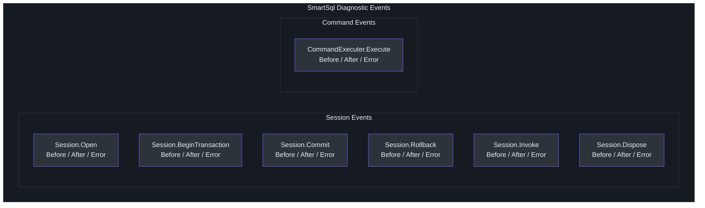
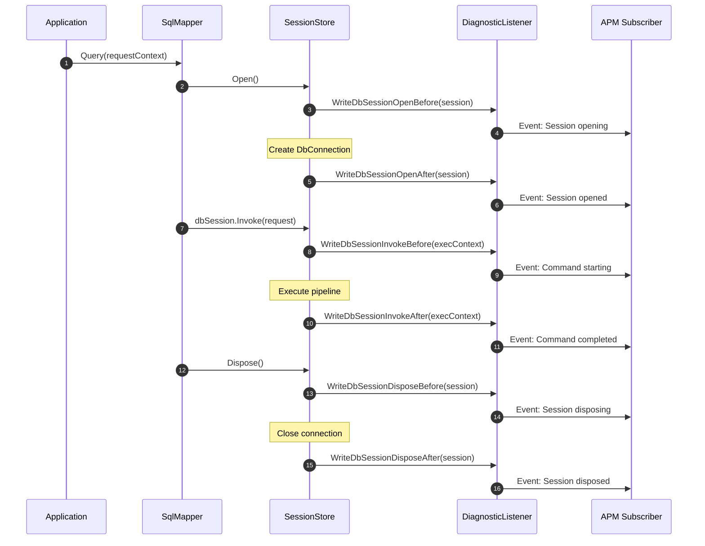
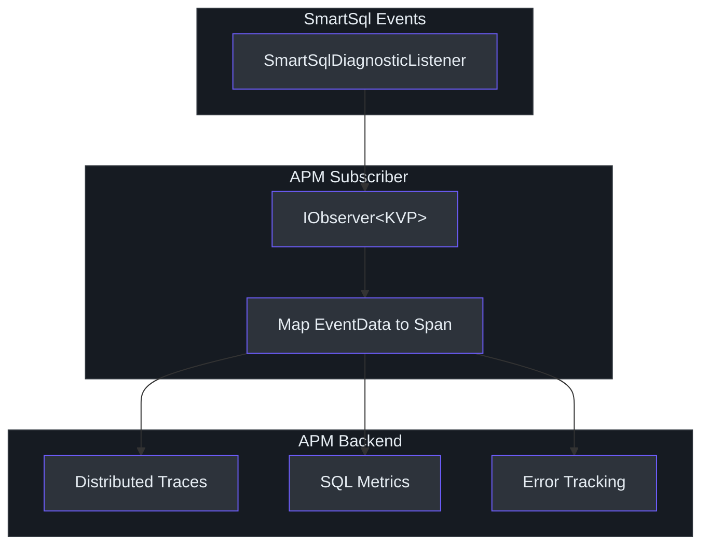
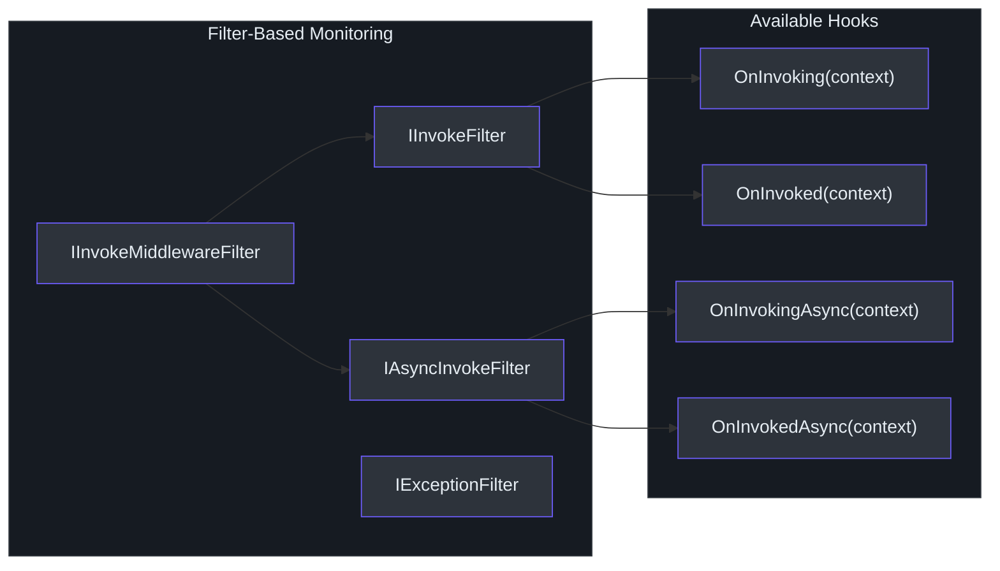

# Diagnostics & Monitoring

SmartSql emits structured diagnostic events at every critical stage of database interaction using .NET's `System.Diagnostics.DiagnosticSource`. This allows external monitoring tools and APM agents (such as SkyWalking) to subscribe to SmartSql events without modifying application code. The diagnostic system covers session lifecycle, command execution, and error propagation, providing full observability into SQL operations.

## At a Glance

| Aspect | Detail |
|--------|--------|
| Event source | `DiagnosticListener` named `"SmartSqlDiagnosticListener"` |
| Event prefix | `"SmartSql."` followed by event name |
| Event pattern | Before/After/Error triplets for each operation |
| Event data | Strongly typed `EventData` subclasses with context |
| Integration | Subscribe via `IObserver<KeyValuePair<string, object>>` |
| Extension methods | `SmartSqlDiagnosticListenerExtensions` for event emission |

## Diagnostic Event Categories

SmartSql emits events in two major categories: **Session lifecycle** and **Command execution**. Each operation follows a Before/After/Error triplet pattern.



<!-- Sources: src/SmartSql/Diagnostics/SmartSqlDiagnosticListenerExtensions.cs:10 -->

## Complete Event Catalog

### Session Lifecycle Events

| Event Name | Constant | When Emitted |
|------------|----------|-------------|
| `SmartSql.WriteDbSessionOpenBefore` | `SMART_SQL_BEFORE_DB_SESSION_OPEN` | Before opening a new database session |
| `SmartSql.WriteDbSessionOpenAfter` | `SMART_SQL_AFTER_DB_SESSION_OPEN` | After session successfully opened |
| `SmartSql.WriteDbSessionOpenError` | `SMART_SQL_ERROR_DB_SESSION_OPEN` | When session open fails |
| `SmartSql.WriteDbSessionBeginTransactionBefore` | `SMART_SQL_BEFORE_DB_SESSION_BEGINTRANSACTION` | Before starting a transaction |
| `SmartSql.WriteDbSessionBeginTransactionAfter` | `SMART_SQL_AFTER_DB_SESSION_BEGINTRANSACTION` | After transaction started |
| `SmartSql.WriteDbSessionBeginTransactionError` | `SMART_SQL_ERROR_DB_SESSION_BEGINTRANSACTION` | When transaction start fails |
| `SmartSql.WriteDbSessionCommitBefore` | `SMART_SQL_BEFORE_DB_SESSION_COMMIT` | Before committing |
| `SmartSql.WriteDbSessionCommitAfter` | `SMART_SQL_AFTER_DB_SESSION_COMMIT` | After commit |
| `SmartSql.WriteDbSessionCommitError` | `SMART_SQL_ERROR_DB_SESSION_COMMIT` | When commit fails |
| `SmartSql.WriteDbSessionRollbackBefore` | `SMART_SQL_BEFORE_DB_SESSION_ROLLBACK` | Before rolling back |
| `SmartSql.WriteDbSessionRollbackAfter` | `SMART_SQL_AFTER_DB_SESSION_ROLLBACK` | After rollback |
| `SmartSql.WriteDbSessionRollbackError` | `SMART_SQL_ERROR_DB_SESSION_ROLLBACK` | When rollback fails |
| `SmartSql.WriteDbSessionInvokeBefore` | `SMART_SQL_BEFORE_DB_SESSION_INVOKE` | Before invoking a command through the session |
| `SmartSql.WriteDbSessionInvokeAfter` | `SMART_SQL_AFTER_DB_SESSION_INVOKE` | After command invocation |
| `SmartSql.WriteDbSessionInvokeError` | `SMART_SQL_ERROR_DB_SESSION_INVOKE` | When command invocation fails |
| `SmartSql.WriteDbSessionDisposeBefore` | `SMART_SQL_BEFORE_DB_SESSION_DISPOSE` | Before disposing session |
| `SmartSql.WriteDbSessionDisposeAfter` | `SMART_SQL_AFTER_DB_SESSION_DISPOSE` | After disposing session |
| `SmartSql.WriteDbSessionDisposeError` | `SMART_SQL_ERROR_DB_SESSION_DISPOSE` | When dispose fails |

### Command Execution Events

| Event Name | Constant | When Emitted |
|------------|----------|-------------|
| `SmartSql.WriteCommandExecuterExecuteBefore` | `SMART_SQL_BEFORE_COMMAND_EXECUTER_EXECUTE` | Before `ICommandExecuter` executes a DbCommand |
| `SmartSql.WriteCommandExecuterExecuteAfter` | `SMART_SQL_AFTER_COMMAND_EXECUTER_EXECUTE` | After successful command execution |
| `SmartSql.WriteCommandExecuterExecuteError` | `SMART_SQL_ERROR_COMMAND_EXECUTER_EXECUTE` | When command execution fails |

<!-- Sources: src/SmartSql/Diagnostics/SmartSqlDiagnosticListenerExtensions.cs:17, src/SmartSql/Diagnostics/SmartSqlDiagnosticListenerExtensions.cs:269 -->

## Event Data Hierarchy

All diagnostic event data classes derive from `EventData`, which carries an `OperationId` (a GUID that correlates Before/After/Error events for the same operation) and an `Operation` name.

```mermaid
classDiagram
    class EventData {
        +Guid OperationId
        +string Operation
    }
    class IErrorEventData {
        <<interface>>
        +Exception Exception
    }
    class DbSessionEventData {
        +IDbSession DbSession
    }
    class DbSessionInvokeEventData {
        +IDbSession DbSession
        +ExecutionContext ExecutionContext
    }
    class CommandExecuterEventData {
        +ExecutionContext ExecutionContext
    }

    EventData <|-- DbSessionEventData
    EventData <|-- DbSessionInvokeEventData
    EventData <|-- CommandExecuterEventData

    DbSessionEventData <|-- DbSessionOpenBeforeEventData
    DbSessionEventData <|-- DbSessionOpenAfterEventData
    DbSessionEventData <|-- DbSessionBeginTransactionBeforeEventData
    DbSessionEventData <|-- DbSessionCommitBeforeEventData
    DbSessionEventData <|-- DbSessionRollbackBeforeEventData
    DbSessionEventData <|-- DbSessionDisposeBeforeEventData

    DbSessionInvokeEventData <|-- DbSessionInvokeBeforeEventData
    DbSessionInvokeEventData <|-- DbSessionInvokeAfterEventData
    DbSessionInvokeEventData <|-- DbSessionInvokeErrorEventData

    CommandExecuterEventData <|-- CommandExecuterExecuteBeforeEventData
    CommandExecuterEventData <|-- CommandExecuterExecuteAfterEventData
    CommandExecuterEventData <|-- CommandExecuterExecuteErrorEventData

    IErrorEventData <|.. DbSessionOpenErrorEventData
    IErrorEventData <|.. DbSessionInvokeErrorEventData
    IErrorEventData <|.. CommandExecuterExecuteErrorEventData
```



<!-- Sources: src/SmartSql/Diagnostics/EventData.cs:7, src/SmartSql/Diagnostics/EventData.DbSession.cs:9, src/SmartSql/Diagnostics/EventData.CommandExecuter.cs:7, src/SmartSql/Diagnostics/IErrorEventData.cs:7 -->

## Diagnostic Event Flow

The following diagram shows how diagnostic events are emitted during a typical query execution:



<!-- Sources: src/SmartSql/Diagnostics/SmartSqlDiagnosticListenerExtensions.cs:21, src/SmartSql/Diagnostics/SmartSqlDiagnosticListenerExtensions.cs:181 -->

## Subscribing to Diagnostic Events

### Basic Subscription

You can subscribe to SmartSql events by observing the static `DiagnosticListener` instance:

```csharp
using System.Diagnostics;
using SmartSql.Diagnostics;

// Subscribe to all SmartSql events
SmartSqlDiagnosticListenerExtensions.Instance.Subscribe(new MyObserver());

class MyObserver : IObserver<KeyValuePair<string, object>>
{
    public void OnNext(KeyValuePair<string, object> value)
    {
        Console.WriteLine($"Event: {value.Key}");
        if (value.Value is EventData eventData)
        {
            Console.WriteLine($"  OperationId: {eventData.OperationId}");
            Console.WriteLine($"  Operation: {eventData.Operation}");
        }
    }

    public void OnError(Exception error) { }
    public void OnCompleted() { }
}
```

### Subscribing to Specific Events

Use `IObserver` with a filter predicate to handle only the events you care about:

```csharp
SmartSqlDiagnosticListenerExtensions.Instance
    .SubscribeWithAdapter(new MyDiagnosticObserver());

// Example: Track command execution timing
SmartSqlDiagnosticListenerExtensions.Instance.Subscribe(
    Observer.Create<KeyValuePair<string, object>>(kv =>
    {
        switch (kv.Value)
        {
            case CommandExecuterExecuteBeforeEventData before:
                // Start timing
                break;
            case CommandExecuterExecuteAfterEventData after:
                // Stop timing, record metrics
                break;
            case CommandExecuterExecuteErrorEventData error:
                // Log exception
                break;
        }
    }));
```

### Conditional Subscription

Events are only emitted when their corresponding event name is enabled on the `DiagnosticListener`. You can use the `IsEnabled` check to avoid the overhead of event emission when no subscriber is listening:

```csharp
// Events are only written if a subscriber is active for that event name
if (@this.IsEnabled(SMART_SQL_BEFORE_COMMAND_EXECUTER_EXECUTE))
{
    @this.Write(SMART_SQL_BEFORE_COMMAND_EXECUTER_EXECUTE, eventData);
}
```

<!-- Sources: src/SmartSql/Diagnostics/SmartSqlDiagnosticListenerExtensions.cs:273, src/SmartSql/Diagnostics/SmartSqlDiagnosticListenerExtensions.cs:24 -->

## Integration with APM Tools

### SkyWalking Integration

SmartSql's diagnostic events integrate with Apache SkyWalking through the .NET agent. SkyWalking's SmartSql plugin subscribes to the `DiagnosticListener` and automatically captures:

- SQL statement text and parameters
- Execution duration (from Before to After events)
- Error details (from Error events)
- Database connection metadata

### Custom APM Integration

For custom APM tools, implement a subscriber that maps SmartSql events to your APM's span/trace model:



<!-- Sources: src/SmartSql/Diagnostics/SmartSqlDiagnosticListenerExtensions.cs:13 -->

## InvokeSucceeded Listener

Separate from the `DiagnosticSource` system, SmartSql also provides an `InvokeSucceedListener` on `SmartSqlConfig` that fires after every successful command execution. This listener is used internally by the cache system for `FlushOnExecute` but can also be used for simple success callbacks:

```csharp
new SmartSqlBuilder()
    .ListenInvokeSucceeded(context =>
    {
        Console.WriteLine($"Executed: {context.Request.FullSqlId}");
    })
    .Build();
```

<!-- Sources: src/SmartSql/Configuration/SmartSqlConfig.cs:42, src/SmartSql/SmartSqlBuilder.cs:291 -->

## Filter-Based Observability

In addition to diagnostic events, SmartSql's filter system provides another observability hook. `IInvokeFilter` and `IAsyncInvokeFilter` can be registered globally to intercept all invocations:



| Filter Interface | Methods | Scope |
|-----------------|---------|-------|
| `IInvokeFilter` | `OnInvoking`, `OnInvoked` | Sync hooks for all invocations |
| `IAsyncInvokeFilter` | `OnInvokingAsync`, `OnInvokedAsync` | Async hooks for all invocations |
| `IInvokeMiddlewareFilter` | All of the above | Combined, used for per-middleware filtering |
| `IExceptionFilter` | (marker interface) | Reserved for future exception handling |

<!-- Sources: src/SmartSql/Filters/IInvokeFilter.cs:5, src/SmartSql/Filters/IAsyncInvokeFilter.cs:5, src/SmartSql/Middlewares/Filters/IInvokeMiddlewareFilter.cs:5 -->

## DiagnosticEvent Name Constants

All event name constants follow the pattern `SmartSql.{Category}{Operation}{Phase}`:

| Constant | Value |
|----------|-------|
| `SMART_SQL_DIAGNOSTIC_LISTENER` | `"SmartSqlDiagnosticListener"` |
| `SMART_SQL_PREFIX` | `"SmartSql."` |
| `SMART_SQL_BEFORE_DB_SESSION_OPEN` | `"SmartSql.WriteDbSessionOpenBefore"` |
| `SMART_SQL_AFTER_DB_SESSION_OPEN` | `"SmartSql.WriteDbSessionOpenAfter"` |
| `SMART_SQL_ERROR_DB_SESSION_OPEN` | `"SmartSql.WriteDbSessionOpenError"` |
| `SMART_SQL_BEFORE_COMMAND_EXECUTER_EXECUTE` | `"SmartSql.WriteCommandExecuterExecuteBefore"` |
| `SMART_SQL_AFTER_COMMAND_EXECUTER_EXECUTE` | `"SmartSql.WriteCommandExecuterExecuteAfter"` |
| `SMART_SQL_ERROR_COMMAND_EXECUTER_EXECUTE` | `"SmartSql.WriteCommandExecuterExecuteError"` |

<!-- Sources: src/SmartSql/Diagnostics/SmartSqlDiagnosticListenerExtensions.cs:14, src/SmartSql/Diagnostics/SmartSqlDiagnosticListenerExtensions.cs:269 -->

## Cross-References

- [Architecture Overview](./index.md) -- where diagnostics fits in the overall system
- [Middleware Pipeline](./middleware-pipeline.md) -- how middleware interacts with diagnostic events
- [Caching Architecture](./caching.md) -- how `InvokeSucceeded` drives `FlushOnExecute`

## References

- [SmartSqlDiagnosticListenerExtensions.cs](https://github.com/dotnetcore/SmartSql/blob/master/src/SmartSql/Diagnostics/SmartSqlDiagnosticListenerExtensions.cs) -- event emission methods and constants
- [EventData.cs](https://github.com/dotnetcore/SmartSql/blob/master/src/SmartSql/Diagnostics/EventData.cs) -- base event data class
- [EventData.DbSession.cs](https://github.com/dotnetcore/SmartSql/blob/master/src/SmartSql/Diagnostics/EventData.DbSession.cs) -- session event data base
- [EventData.CommandExecuter.cs](https://github.com/dotnetcore/SmartSql/blob/master/src/SmartSql/Diagnostics/EventData.CommandExecuter.cs) -- command event data base
- [IErrorEventData.cs](https://github.com/dotnetcore/SmartSql/blob/master/src/SmartSql/Diagnostics/IErrorEventData.cs) -- error event interface
- [IFilter.cs](https://github.com/dotnetcore/SmartSql/blob/master/src/SmartSql/Filters/IFilter.cs) -- base filter interface
- [IInvokeFilter.cs](https://github.com/dotnetcore/SmartSql/blob/master/src/SmartSql/Filters/IInvokeFilter.cs) -- sync invocation filter
- [IAsyncInvokeFilter.cs](https://github.com/dotnetcore/SmartSql/blob/master/src/SmartSql/Filters/IAsyncInvokeFilter.cs) -- async invocation filter
- [IInvokeMiddlewareFilter.cs](https://github.com/dotnetcore/SmartSql/blob/master/src/SmartSql/Middlewares/Filters/IInvokeMiddlewareFilter.cs) -- middleware-specific filter
