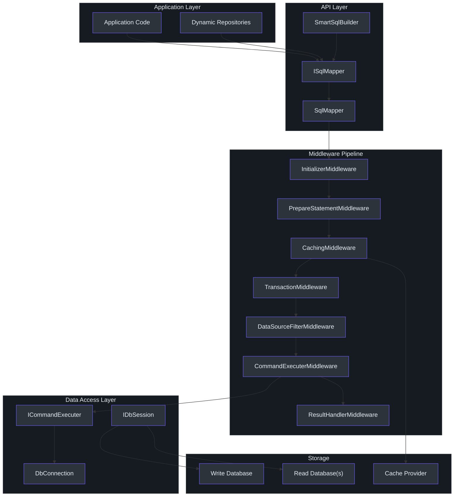
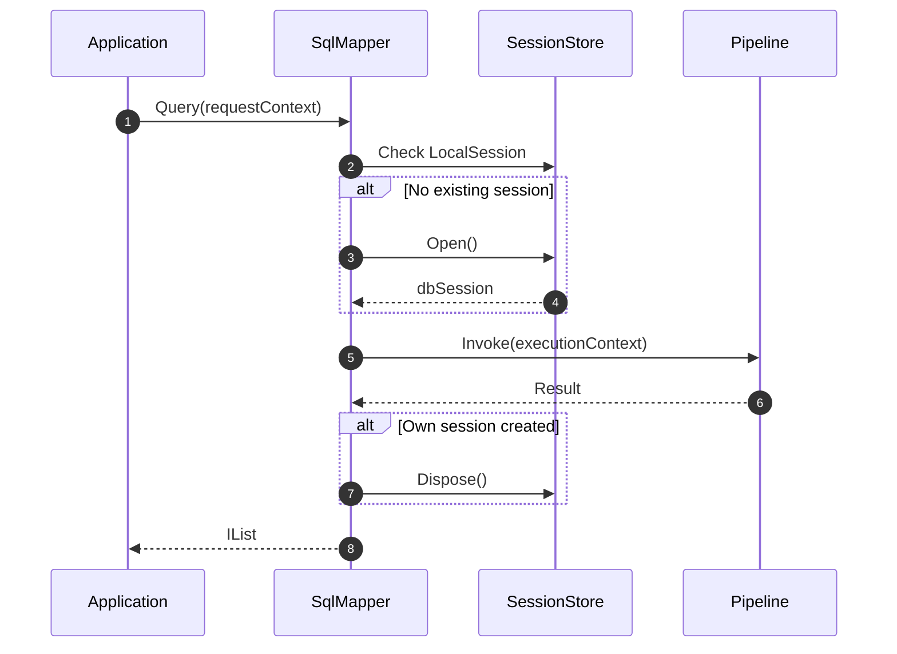
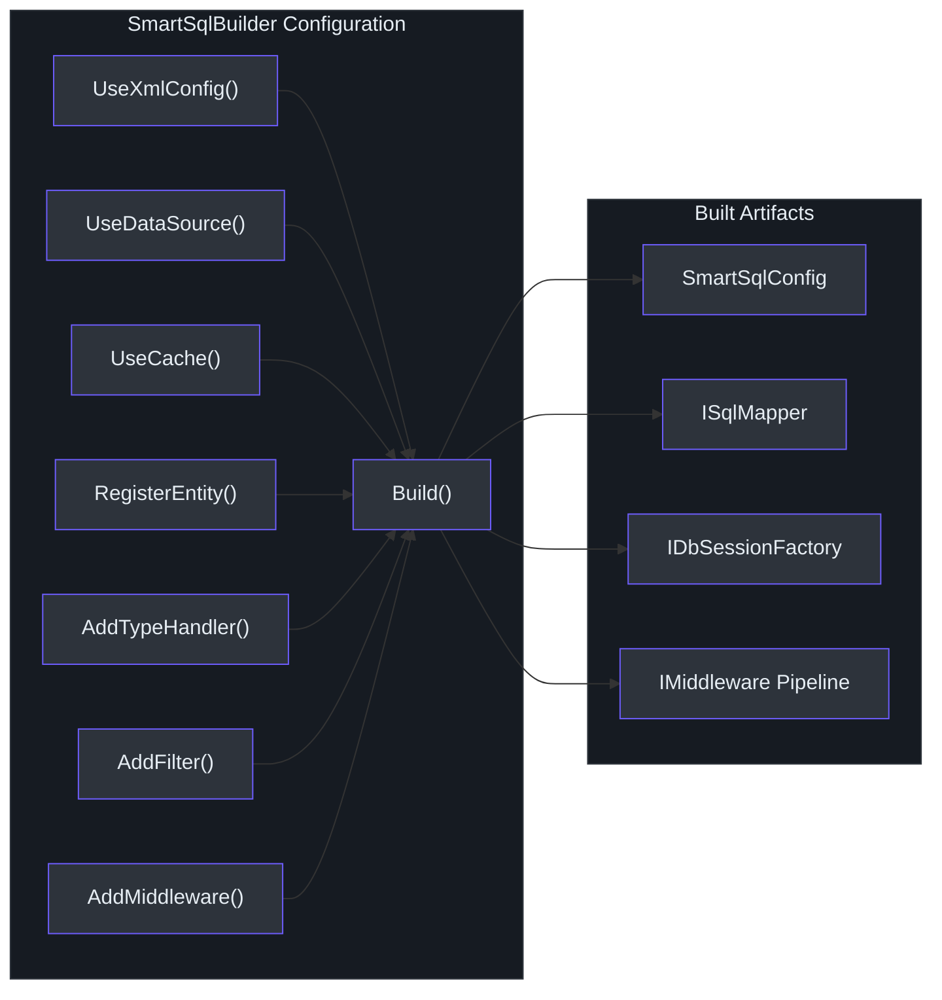
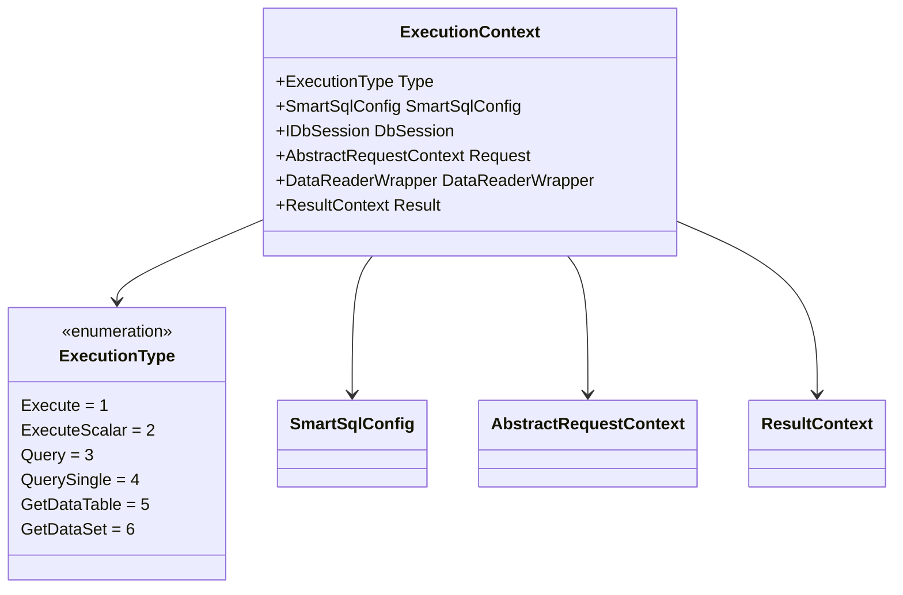

# Architecture Overview

SmartSql is a .NET ORM inspired by MyBatis that uses XML-managed SQL with a middleware-based execution pipeline. The architecture separates concerns into distinct layers: a developer-facing API, a configurable middleware pipeline that processes every SQL invocation, and a database access layer. This design makes it possible to intercept, transform, and observe every step of SQL execution without modifying core logic.

## At a Glance

| Component | Class | Responsibility |
|-----------|-------|----------------|
| API Surface | `ISqlMapper` / `SqlMapper` | Developer entry point for queries, commands, and transactions |
| Builder | `SmartSqlBuilder` | Fluent configuration that wires up the entire runtime |
| Central Config | `SmartSqlConfig` | Holds Database, SqlMaps, Pipeline, Caches, Filters, TypeHandlers |
| Execution Context | `ExecutionContext` | Carries request, session, config, and result through the pipeline |
| Middleware Pipeline | `IMiddleware` chain | Linked-list of middleware that each handle a stage of execution |
| Data Source Filter | `IDataSourceFilter` | Selects read or write database based on statement type |

## Layered Architecture

SmartSql follows a three-layer architecture. Application code interacts with `ISqlMapper`, which delegates to a middleware pipeline that ultimately executes database commands.

<!-- Sources: src/SmartSql/SmartSqlBuilder.cs:60, src/SmartSql/SqlMapper.cs:14, src/SmartSql/Configuration/SmartSqlConfig.cs:21 -->

## Core Abstractions

### ISqlMapper

`ISqlMapper` is the primary developer-facing interface. It provides synchronous and asynchronous methods for all common database operations. The implementation `SqlMapper` manages session lifecycle automatically -- if no existing session is found in the `SessionStore`, it opens one, executes through the pipeline, and disposes afterward.

<!-- Sources: src/SmartSql/SqlMapper.cs:90, src/SmartSql/ISqlMapper.cs:13 -->

The key API methods are:

| Method | Return Type | Description |
|--------|-------------|-------------|
| `Execute` | `int` | Runs non-query SQL, returns rows affected |
| `ExecuteScalar<T>` | `T` | Runs SQL and returns a single scalar value |
| `Query<T>` | `IList<T>` | Runs SQL and returns a list of mapped entities |
| `QuerySingle<T>` | `T` | Runs SQL and returns a single entity |
| `GetDataTable` | `DataTable` | Returns raw `DataTable` results |
| `GetDataSet` | `DataSet` | Returns raw `DataSet` results |
| `BeginTransaction` | `DbTransaction` | Starts a manual transaction |
| `CommitTransaction` | `void` | Commits the active transaction |
| `RollbackTransaction` | `void` | Rolls back the active transaction |

All methods have async counterparts (e.g., `QueryAsync<T>`, `ExecuteAsync`).

### SmartSqlBuilder

`SmartSqlBuilder` is the fluent builder that constructs the entire SmartSql runtime. It configures the database connection, XML mappings, cache, filters, type handlers, deserializers, and the middleware pipeline, then registers the built instance into `SmartSqlContainer`.

<!-- Sources: src/SmartSql/SmartSqlBuilder.cs:23, src/SmartSql/SmartSqlBuilder.cs:60 -->

### SmartSqlConfig

`SmartSqlConfig` is the central configuration object that holds all resolved settings and services. It is constructed during the `Build()` phase and shared across all components.

| Property | Type | Purpose |
|----------|------|---------|
| `Alias` | `string` | Instance identifier for `SmartSqlContainer` |
| `Settings` | `Settings` | Global settings (IgnoreParameterCase, IsCacheEnabled, etc.) |
| `Database` | `Database` | Write/Read data source definitions |
| `SqlMaps` | `IDictionary<string, SqlMap>` | All loaded SQL maps keyed by Scope |
| `Pipeline` | `IMiddleware` | Head of the middleware chain |
| `CacheManager` | `ICacheManager` | Cache management for read queries |
| `TypeHandlerFactory` | `TypeHandlerFactory` | Registry of type handlers |
| `DeserializerFactory` | `IDeserializerFactory` | Chain of DataReader deserializers |
| `Filters` | `FilterCollection` | Global invocation filters |
| `DataSourceFilter` | `IDataSourceFilter` | Read/write source selection logic |
| `CommandExecuter` | `ICommandExecuter` | Executes DbCommand against the database |
| `SessionStore` | `IDbSessionStore` | Thread-local session storage |
| `IdGenerators` | `IDictionary<string, IIdGenerator>` | ID generators (Snowflake, etc.) |

### ExecutionContext

`ExecutionContext` is the request-scoped object that flows through every middleware. It carries the configuration, active database session, request context, and result context.

<!-- Sources: src/SmartSql/ExecutionContext.cs:9, src/SmartSql/Configuration/SmartSqlConfig.cs:21 -->

## Middleware Pipeline Execution Order

The pipeline is built by `PipelineBuilder`, which sorts middleware by their `IOrdered.Order` value and chains them via `Next` pointers. When cache is enabled, the pipeline includes `CachingMiddleware`; when disabled, it is replaced by `NoneCacheManager`.

| Order | Middleware | Responsibility |
|-------|-----------|----------------|
| 0 | `InitializerMiddleware` | Resolves Statement, DataSourceChoice, Cache, ResultMap from config |
| 100 | `PrepareStatementMiddleware` | Builds final SQL string, creates DbParameters |
| 200 | `CachingMiddleware` | Checks/populates cache (only when cache is enabled) |
| 300 | `TransactionMiddleware` | Wraps execution in a transaction if configured |
| 400 | `DataSourceFilterMiddleware` | Selects read or write data source |
| 500 | `CommandExecuterMiddleware` | Executes the DbCommand against the database |
| 600 | `ResultHandlerMiddleware` | Deserializes DataReader results via the deserializer chain |

For a detailed explanation of each middleware, see [Middleware Pipeline](./middleware-pipeline.md).

## Component Dependency Diagram

```mermaid
graph TD
    subgraph Config["SmartSqlConfig"]
        style Config fill:#161b22,stroke:#30363d,color:#e6edf3
        SC["SmartSqlConfig"]
    end

    subgraph Components["Runtime Components"]
        style Components fill:#161b22,stroke:#30363d,color:#e6edf3
        SM["SqlMapper"]
        SS["SessionStore"]
        DF["DeserializerFactory"]
        CM["CacheManager"]
        TH["TypeHandlerFactory"]
        DS["IDataSourceFilter"]
        CE["ICommandExecuter"]
        FC["FilterCollection"]
        TB["TagBuilderFactory"]
    end

    subgraph Maps["XML Configuration"]
        style Maps fill:#161b22,stroke:#30363d,color:#e6edf3
        SQLM["SqlMap(s)"]
        STMT["Statement(s)"]
        RMAP["ResultMap(s)"]
        CDEF["Cache Definition(s)"]
    end

    SC --> SM
    SC --> SS
    SC --> DF
    SC --> CM
    SC --> TH
    SC --> DS
    SC --> CE
    SC --> FC
    SC --> TB
    SC --> SQLM
    SQLM --> STMT
    SQLM --> RMAP
    SQLM --> CDEF

    style SC fill:#2d333b,stroke:#6d5dfc,color:#e6edf3
    style SM fill:#2d333b,stroke:#6d5dfc,color:#e6edf3
    style SS fill:#2d333b,stroke:#6d5dfc,color:#e6edf3
    style DF fill:#2d333b,stroke:#6d5dfc,color:#e6edf3
    style CM fill:#2d333b,stroke:#6d5dfc,color:#e6edf3
    style TH fill:#2d333b,stroke:#6d5dfc,color:#e6edf3
    style DS fill:#2d333b,stroke:#6d5dfc,color:#e6edf3
    style CE fill:#2d333b,stroke:#6d5dfc,color:#e6edf3
    style FC fill:#2d333b,stroke:#6d5dfc,color:#e6edf3
    style TB fill:#2d333b,stroke:#6d5dfc,color:#e6edf3
    style SQLM fill:#2d333b,stroke:#6d5dfc,color:#e6edf3
    style STMT fill:#2d333b,stroke:#6d5dfc,color:#e6edf3
    style RMAP fill:#2d333b,stroke:#6d5dfc,color:#e6edf3
    style CDEF fill:#2d333b,stroke:#6d5dfc,color:#e6edf3
```

<!-- Sources: src/SmartSql/Configuration/SmartSqlConfig.cs:21, src/SmartSql/SmartSqlBuilder.cs:240 -->

## Solution Structure

| Project | Purpose |
|---------|---------|
| `SmartSql` | Core library targeting netstandard2.0 |
| `SmartSql.DyRepository` | Dynamic repository proxy generation via IL emit |
| `SmartSql.DIExtension` | ASP.NET Core DI integration (`services.AddSmartSql()`) |
| `SmartSql.Options` | Options-pattern config from `appsettings.json` |
| `SmartSql.Cache.Redis` | Redis cache provider |
| `SmartSql.Cache.Sync` | Cache synchronization across instances |
| `SmartSql.TypeHandler` | JSON and custom type handlers |
| `SmartSql.AOP` | AOP transaction support via `[Transaction]` attribute |
| `SmartSql.Bulk.*` | Bulk insert for SqlServer, MySql, PostgreSql |
| `SmartSql.InvokeSync.*` | Data sync via Kafka/RabbitMQ |

## Cross-References

- [Middleware Pipeline](./middleware-pipeline.md) -- deep dive into each middleware stage
- [XML Tag System](./xml-tags.md) -- dynamic SQL construction with XML tags
- [DataSource & Read/Write Splitting](./datasource.md) -- database source selection
- [Caching Architecture](./caching.md) -- LRU, FIFO, and Redis cache
- [Deserialization](./deserialization.md) -- DataReader to object mapping
- [Diagnostics & Monitoring](./diagnostics.md) -- observability via DiagnosticSource

## References

- [SmartSqlBuilder.cs](https://github.com/dotnetcore/SmartSql/blob/master/src/SmartSql/SmartSqlBuilder.cs) -- Fluent builder
- [SqlMapper.cs](https://github.com/dotnetcore/SmartSql/blob/master/src/SmartSql/SqlMapper.cs) -- Main entry point
- [ISqlMapper.cs](https://github.com/dotnetcore/SmartSql/blob/master/src/SmartSql/ISqlMapper.cs) -- Mapper interface
- [SmartSqlConfig.cs](https://github.com/dotnetcore/SmartSql/blob/master/src/SmartSql/Configuration/SmartSqlConfig.cs) -- Central config
- [ExecutionContext.cs](https://github.com/dotnetcore/SmartSql/blob/master/src/SmartSql/ExecutionContext.cs) -- Execution context
