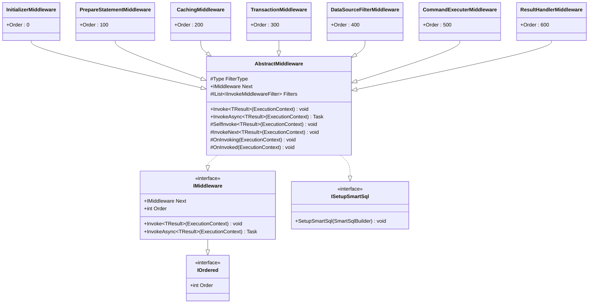
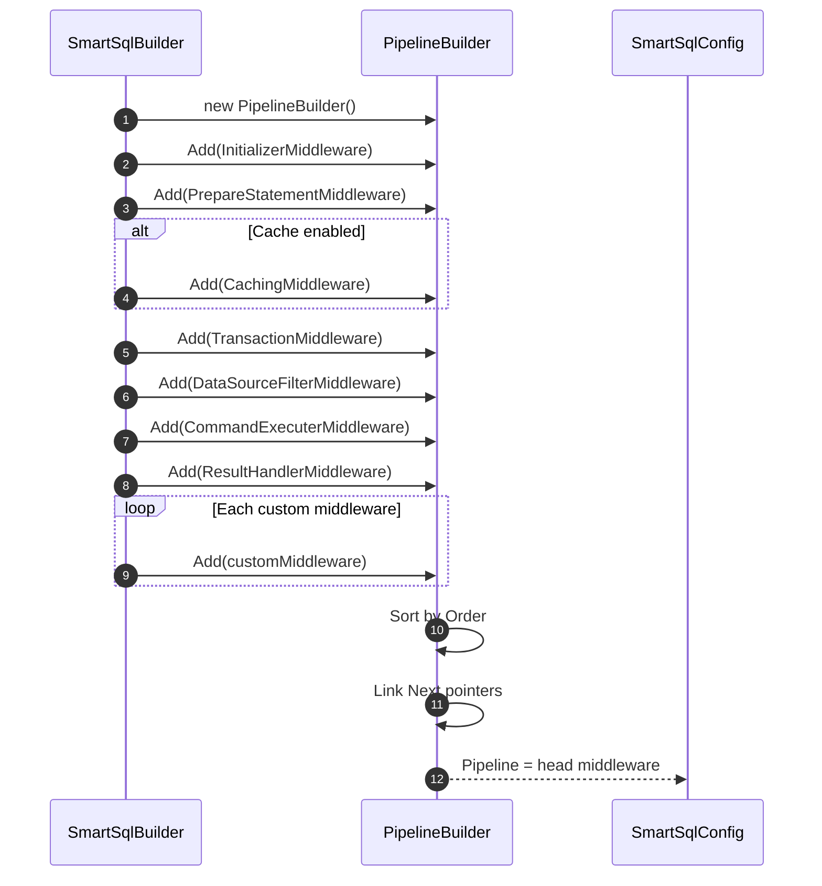
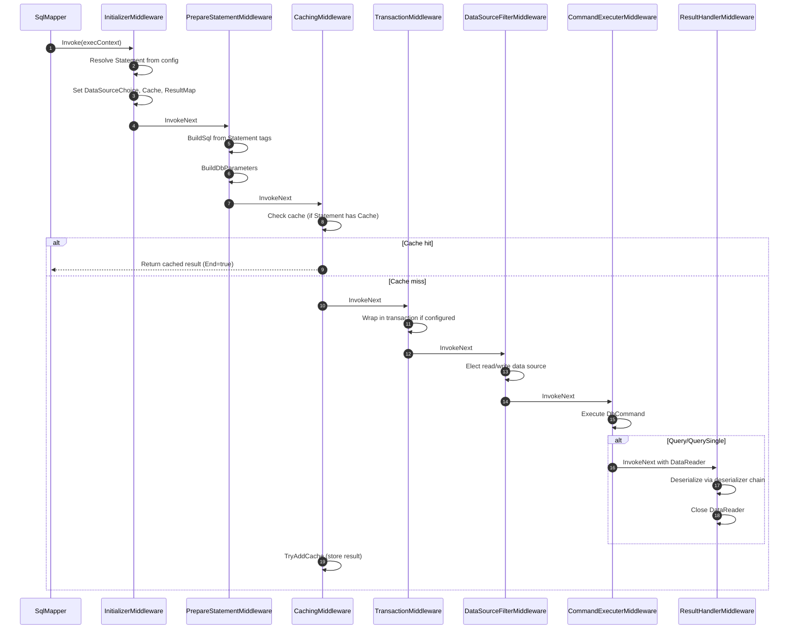
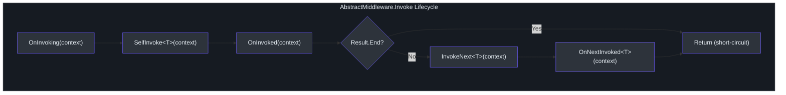

# Middleware Pipeline

SmartSql processes every SQL invocation through a middleware pipeline -- a linked list of `IMiddleware` implementations, each responsible for a specific stage of execution. This design replaces traditional AOP or decorator patterns with an explicit, ordered chain that is easy to extend, inspect, and debug. Any custom middleware can be inserted at a specific position to add cross-cutting behavior like logging, auditing, or dynamic data source routing.

## At a Glance

| Aspect | Detail |
|--------|--------|
| Interface | `IMiddleware` with `Next` pointer for chaining |
| Base class | `AbstractMiddleware` provides filter hooks and lifecycle |
| Builder | `PipelineBuilder` sorts by `IOrdered.Order` and links chain |
| Extension point | `SmartSqlBuilder.AddMiddleware()` appends custom middleware |
| Filter support | Each middleware can declare a `FilterType` for per-middleware filters |

## IMiddleware Interface

The `IMiddleware` interface defines the contract for pipeline stages. Each middleware holds a reference to the next middleware in the chain via the `Next` property.



<!-- Sources: src/SmartSql/Middlewares/AbstractMiddleware.cs:9, src/SmartSql/Middlewares/InitializerMiddleware.cs:10 -->

## Pipeline Construction

`PipelineBuilder` accumulates middleware instances, sorts them by `Order`, and links them into a chain. The resulting head of the chain is stored in `SmartSqlConfig.Pipeline`.



<!-- Sources: src/SmartSql/SmartSqlBuilder.cs:240, src/SmartSql/SmartSqlBuilder.cs:256 -->

### Build Logic

When `SmartSqlBuilder.Build()` is called, the pipeline is constructed in `BuildPipeline()`:

- **Cache enabled** (`Settings.IsCacheEnabled = true`): All seven middlewares are registered, including `CachingMiddleware`.
- **Cache disabled**: `CachingMiddleware` is omitted. Instead, `NoneCacheManager` is assigned to `SmartSqlConfig.CacheManager`, which always returns cache misses.
- **Custom middleware**: Any middleware added via `AddMiddleware()` is appended after the built-in chain.

## Middleware Execution Flow

When `SqlMapper` invokes the pipeline, execution flows through each middleware in order. Each middleware calls `InvokeNext<TResult>()` to pass control to the next stage, unless the result has been marked as `End` (short-circuit).



<!-- Sources: src/SmartSql/SmartSqlBuilder.cs:256, src/SmartSql/Middlewares/AbstractMiddleware.cs:15 -->

## AbstractMiddleware Base Class

`AbstractMiddleware` provides the scaffolding for all middleware implementations. Its `Invoke<TResult>` method orchestrates the lifecycle:

1. **OnInvoking** -- calls filter hooks before processing
2. **SelfInvoke** -- the middleware's own logic (override point)
3. **OnInvoked** -- calls filter hooks after processing
4. **InvokeNext** -- passes to the next middleware (unless `Result.End` is true)
5. **OnNextInvoked** -- called after the next middleware returns



<!-- Sources: src/SmartSql/Middlewares/AbstractMiddleware.cs:15, src/SmartSql/Middlewares/AbstractMiddleware.cs:50 -->

### Per-Middleware Filters

Each middleware can declare a `FilterType`. During setup (`SetupSmartSql`), the base class scans `SmartSqlConfig.Filters` for matching filters and stores them. Before and after `SelfInvoke`, the middleware invokes all matching filters via `OnInvoking` and `OnInvoked`. This allows fine-grained interception at specific pipeline stages.

| Filter Interface | Purpose |
|-----------------|---------|
| `IInvokeFilter` | Sync hooks before/after any invocation |
| `IAsyncInvokeFilter` | Async hooks before/after any invocation |
| `IInvokeMiddlewareFilter` | Combined sync + async hooks for middleware-specific filtering |
| `IPrepareStatementFilter` | Hooks specific to `PrepareStatementMiddleware` |

## Individual Middleware Details

### 1. InitializerMiddleware (Order: 0)

Resolves the `Statement` object from the XML configuration based on the request's `FullSqlId`. Sets the `DataSourceChoice` (Read or Write) based on the statement's `StatementType`. Attaches cache configuration, result maps, parameter maps, and command type to the request context.

If the request provides a raw SQL string instead of a statement ID, it bypasses statement resolution and operates as a direct SQL execution.

<!-- Sources: src/SmartSql/Middlewares/InitializerMiddleware.cs:10, src/SmartSql/Middlewares/InitializerMiddleware.cs:32 -->

### 2. PrepareStatementMiddleware (Order: 100)

Builds the final SQL string by invoking `Statement.BuildSql()` which processes all XML tags. Then creates `DbParameter` objects from the parameter collection using the database provider factory. Handles `IN` clause expansion for enumerable parameters. Supports `IPrepareStatementFilter` hooks.

<!-- Sources: src/SmartSql/Middlewares/PrepareStatementMiddleware.cs:18, src/SmartSql/Middlewares/PrepareStatementMiddleware.cs:127 -->

### 3. CachingMiddleware (Order: 200)

Only active when the statement has an associated `Cache` definition. On query operations, checks `ICacheManager.TryGetCache()` first. If a cache hit is found and no transaction is active, sets the result and marks `Result.End = true` to short-circuit the pipeline. On cache miss, passes execution to the next middleware and then stores the result via `TryAddCache()`.

<!-- Sources: src/SmartSql/Middlewares/CachingMiddleware.cs:9, src/SmartSql/Middlewares/CachingMiddleware.cs:12 -->

### 4. TransactionMiddleware (Order: 300)

Wraps downstream execution in a database transaction if the statement's `Transaction` property is set and no transaction is already active. Uses `IDbSession.TransactionWrap()` which begins the transaction, invokes the action, and commits/rolls back based on success or failure.

<!-- Sources: src/SmartSql/Middlewares/TransactionMiddleware.cs:9, src/SmartSql/Middlewares/TransactionMiddleware.cs:11 -->

### 5. DataSourceFilterMiddleware (Order: 400)

Delegates to `IDataSourceFilter.Elect()` to select the appropriate data source. If the session already has a data source assigned (e.g., from an explicit transaction), it is reused. Otherwise, the filter determines Read vs Write based on the request's `DataSourceChoice` and performs weighted load balancing among read replicas.

<!-- Sources: src/SmartSql/Middlewares/DataSourceFilterMiddleware.cs:7, src/SmartSql/Middlewares/DataSourceFilterMiddleware.cs:22 -->

### 6. CommandExecuterMiddleware (Order: 500)

Executes the actual `DbCommand` via `ICommandExecuter`. Behavior varies by `ExecutionType`:

| ExecutionType | Action |
|---------------|--------|
| `Execute` | `ExecuteNonQuery` -- returns rows affected |
| `ExecuteScalar` | `ExecuteScalar` -- returns single value with type conversion |
| `Query` / `QuerySingle` | `ExecuteReader` -- passes DataReader to `ResultHandlerMiddleware` |
| `GetDataTable` | Returns raw `DataTable` |
| `GetDataSet` | Returns raw `DataSet` |

For Query operations, the DataReader is wrapped in a `DataReaderWrapper` and passed forward; for non-query operations, the result is set directly on the `ResultContext`.

<!-- Sources: src/SmartSql/Middlewares/CommandExecuterMiddleware.cs:9, src/SmartSql/Middlewares/CommandExecuterMiddleware.cs:14 -->

### 7. ResultHandlerMiddleware (Order: 600)

Deserializes `DataReaderWrapper` results into typed objects using the deserializer chain from `IDeserializerFactory`. Selects `ToList<TResult>` or `ToSingle<TResult>` based on whether the result context is a list or single result. Always closes and disposes the DataReader in a `finally` block.

<!-- Sources: src/SmartSql/Middlewares/ResultHandlerMiddleware.cs:10, src/SmartSql/Middlewares/ResultHandlerMiddleware.cs:14 -->

## Extending the Pipeline

Custom middleware can be added via `SmartSqlBuilder.AddMiddleware()`. Custom middleware is appended after the built-in chain and sorted by its `Order` value. To insert at a specific position, choose an `Order` value between the surrounding middleware orders.

```csharp
public class LoggingMiddleware : AbstractMiddleware
{
    public override int Order => 150; // Between PrepareStatement and Caching

    protected override void SelfInvoke<TResult>(ExecutionContext executionContext)
    {
        // Log SQL, timing, parameters, etc.
    }
}

// Registration
new SmartSqlBuilder()
    .UseXmlConfig()
    .AddMiddleware(new LoggingMiddleware())
    .Build();
```

## Cross-References

- [Architecture Overview](./index.md) -- layered architecture and core abstractions
- [XML Tag System](./xml-tags.md) -- how Statement tags build the SQL string
- [DataSource & Read/Write Splitting](./datasource.md) -- how DataSourceFilterMiddleware selects a source
- [Caching Architecture](./caching.md) -- how CachingMiddleware interacts with the cache system
- [Deserialization](./deserialization.md) -- how ResultHandlerMiddleware deserializes DataReader
- [Diagnostics & Monitoring](./diagnostics.md) -- observability hooks for pipeline execution

## References

- [AbstractMiddleware.cs](https://github.com/dotnetcore/SmartSql/blob/master/src/SmartSql/Middlewares/AbstractMiddleware.cs)
- [InitializerMiddleware.cs](https://github.com/dotnetcore/SmartSql/blob/master/src/SmartSql/Middlewares/InitializerMiddleware.cs)
- [PrepareStatementMiddleware.cs](https://github.com/dotnetcore/SmartSql/blob/master/src/SmartSql/Middlewares/PrepareStatementMiddleware.cs)
- [CachingMiddleware.cs](https://github.com/dotnetcore/SmartSql/blob/master/src/SmartSql/Middlewares/CachingMiddleware.cs)
- [TransactionMiddleware.cs](https://github.com/dotnetcore/SmartSql/blob/master/src/SmartSql/Middlewares/TransactionMiddleware.cs)
- [DataSourceFilterMiddleware.cs](https://github.com/dotnetcore/SmartSql/blob/master/src/SmartSql/Middlewares/DataSourceFilterMiddleware.cs)
- [CommandExecuterMiddleware.cs](https://github.com/dotnetcore/SmartSql/blob/master/src/SmartSql/Middlewares/CommandExecuterMiddleware.cs)
- [ResultHandlerMiddleware.cs](https://github.com/dotnetcore/SmartSql/blob/master/src/SmartSql/Middlewares/ResultHandlerMiddleware.cs)
- [SmartSqlBuilder.cs](https://github.com/dotnetcore/SmartSql/blob/master/src/SmartSql/SmartSqlBuilder.cs) -- pipeline construction
