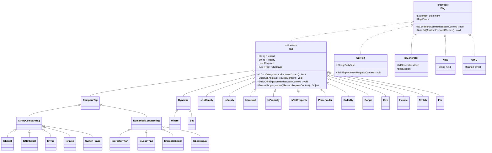
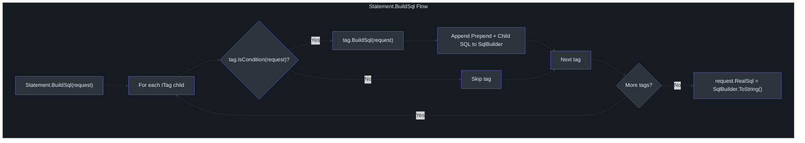

# XML Tag System

SmartSql uses XML to define SQL statements, but unlike static SQL mappers, it provides a rich tag system for dynamic SQL construction. Tags are evaluated at runtime against the request parameters to conditionally include SQL fragments, iterate over collections, switch on values, and inject generated values. This system is inspired by MyBatis's dynamic SQL but is tailored for .NET types and conventions.

## At a Glance

| Aspect | Detail |
|--------|--------|
| Interface | `ITag` with `IsCondition()` and `BuildSql()` methods |
| Base class | `Tag` provides property-based condition checking and child tag iteration |
| Container | Each `Statement` holds a list of `ITag` children that are processed sequentially |
| Composite tags | `Dynamic`, `Where`, `Set` act as containers that prepend keywords based on child matches |
| Factory | `TagBuilderFactory` creates tag instances from XML element definitions |

## Tag Class Hierarchy



<!-- Sources: src/SmartSql/Configuration/Tags/ITag.cs:7, src/SmartSql/Configuration/Tags/Tag.cs:8 -->

## How Statements Process Tags

When `PrepareStatementMiddleware` calls `Statement.BuildSql()`, each statement iterates through its child tags. Each tag checks its condition against the request parameters, and if the condition passes, appends its SQL fragment to the `SqlBuilder`.



<!-- Sources: src/SmartSql/Configuration/Tags/Tag.cs:22, src/SmartSql/Middlewares/PrepareStatementMiddleware.cs:127 -->

## Tag Types Reference

### Conditional Tags

These tags check a condition against request parameters and include their child content only when the condition is met.

#### IsNotEmpty

Renders child content when the property value is not null, not an empty string, and (for collections) has at least one element.

```xml
<IsNotEmpty Property="UserName">
  AND UserName = @UserName
</IsNotEmpty>
```

<!-- Sources: src/SmartSql/Configuration/Tags/IsNotEmpty.cs:9 -->

#### IsEmpty

The inverse of `IsNotEmpty` -- renders when the property is null, empty string, or an empty collection.

<!-- Sources: src/SmartSql/Configuration/Tags/IsEmpty.cs:9 -->

#### IsEqual / IsNotEqual

Compares the property value (as a string) to a `CompareValue` attribute.

```xml
<IsEqual Property="Status" CompareValue="1">
  AND Active = 1
</IsEqual>
```

<!-- Sources: src/SmartSql/Configuration/Tags/IsEqual.cs:7 -->

#### IsGreaterThan / IsLessThan / IsGreaterEqual / IsLessEqual

Numerical comparison tags that parse the property value to `Decimal` and compare against `CompareValue`.

```xml
<IsGreaterThan Property="Age" CompareValue="18">
  AND Age > @Age
</IsGreaterThan>
```

<!-- Sources: src/SmartSql/Configuration/Tags/IsGreaterThan.cs:8, src/SmartSql/Configuration/Tags/IsLessThan.cs:7 -->

#### IsNotNull / IsNull

Checks whether the property value is null or not null.

<!-- Sources: src/SmartSql/Configuration/Tags/IsNotNull.cs:7 -->

#### IsProperty / IsNotProperty

Checks whether the property key exists in the request parameters (regardless of value).

```xml
<IsProperty Property="DeptId">
  AND DeptId = @DeptId
</IsProperty>
<IsNotProperty Property="DeptId">
  AND DeptId IS NULL
</IsNotProperty>
```

`IsProperty` additionally supports `PropertyChanged` tracking for entity proxy change detection.

<!-- Sources: src/SmartSql/Configuration/Tags/IsProperty.cs:8, src/SmartSql/Configuration/Tags/IsNotProperty.cs:5 -->

#### IsTrue / IsFalse

Boolean comparison tags that check if the property value equals "True" or "False" as a string.

<!-- Sources: src/SmartSql/Configuration/Tags/IsTrue.cs, src/SmartSql/Configuration/Tags/IsFalse.cs -->

#### Range

Checks whether a numeric property value falls within a `[Min, Max]` range.

```xml
<Range Property="PageNum" Min="1" Max="100">
  -- pagination logic
</Range>
```

<!-- Sources: src/SmartSql/Configuration/Tags/Range.cs:8 -->

#### Env

Conditionally includes content based on the current database provider name. Useful for database-specific SQL.

```xml
<Env DbProvider="MySql">
  LIMIT @PageSize OFFSET @Offset
</Env>
<Env DbProvider="SqlServer">
  OFFSET @Offset ROWS FETCH NEXT @PageSize ROWS ONLY
</Env>
```

<!-- Sources: src/SmartSql/Configuration/Tags/Env.cs:7 -->

### Composite / Structural Tags

#### Where

Extends `Dynamic` with `Prepend = "Where"`. Renders the `WHERE` keyword only if at least one child tag condition passes. The first child that matches gets the `WHERE` keyword prepended; subsequent children get their own `Prepend` values (typically `AND`).

```xml
<Where>
  <IsNotEmpty Property="Name">
    AND Name = @Name
  </IsNotEmpty>
  <IsNotEmpty Property="Status">
    AND Status = @Status
  </IsNotEmpty>
</Where>
<!-- Produces: WHERE Name = @Name AND Status = @Status -->
```

<!-- Sources: src/SmartSql/Configuration/Tags/Where.cs:8 -->

#### Set

Extends `Dynamic` with `Prepend = "Set"`. Used in UPDATE statements to conditionally include SET clauses.

```xml
<Set>
  <IsNotEmpty Property="Name">
    Name = @Name,
  </IsNotEmpty>
  <IsNotEmpty Property="Status">
    Status = @Status,
  </IsNotEmpty>
</Set>
```

<!-- Sources: src/SmartSql/Configuration/Tags/Set.cs:7 -->

#### Dynamic

The base composite tag. Evaluates child tags and renders `Prepend` before the first matching child. Supports a `Min` attribute that throws `TagMinMatchedFailException` if fewer children match than the minimum.

<!-- Sources: src/SmartSql/Configuration/Tags/Dynamic.cs:9 -->

#### Switch / Case / Default

A switch-case construct that evaluates child `Case` tags by comparing the property value to `CompareValue`, falling through to `Default` if no case matches.

```xml
<Switch Property="SortField">
  <Case CompareValue="Name">ORDER BY Name ASC</Case>
  <Case CompareValue="Date">ORDER BY CreateTime DESC</Case>
  <Default>ORDER BY Id ASC</Default>
</Switch>
```

<!-- Sources: src/SmartSql/Configuration/Tags/Switch.cs:7, src/SmartSql/Configuration/Tags/Switch.cs:35 -->

#### For

Iterates over a collection property and generates parameterized SQL for each element. Supports `Open`, `Separator`, and `Close` attributes for controlling delimiters.

```xml
<For Property="Ids" Open="(" Close=")" Separator="," Key="id">
  @id
</For>
<!-- Produces: (@Ids_For__0, @Ids_For__1, @Ids_For__2) -->
```

The `For` tag handles both direct values (primitives, strings) and complex objects, creating uniquely named parameters for each iteration to avoid conflicts.

<!-- Sources: src/SmartSql/Configuration/Tags/For.cs:10, src/SmartSql/Configuration/Tags/For.cs:35 -->

#### Include

References another statement's SQL content via `RefId`, enabling SQL fragment reuse.

```xml
<Include RefId="BaseColumns">
  <!-- Refs another Statement that defines common column selections -->
</Include>
```

<!-- Sources: src/SmartSql/Configuration/Tags/Include.cs:6 -->

### Value Injection Tags

These tags always render and inject values into the parameter collection rather than producing SQL text.

#### Now

Injects the current date/time into the request parameters. Supports `Kind="UTC"` for UTC time.

```xml
<Now Property="CreateTime" />
<!-- Sets request parameter CreateTime to DateTime.Now -->
```

<!-- Sources: src/SmartSql/Configuration/Tags/Now.cs:7 -->

#### UUID

Generates a new GUID and injects it into the request parameters. Supports a `Format` attribute for string formatting.

```xml
<UUID Property="Id" Format="N" />
<!-- Sets request parameter Id to a GUID formatted as "N" (no hyphens) -->
```

<!-- Sources: src/SmartSql/Configuration/Tags/UUID.cs:7 -->

#### Placeholder

Directly interpolates a property value into the SQL string (not as a parameterized value). Used for dynamic table names or column names where parameterization is not possible.

```xml
<Placeholder Property="TableName" Prepend="FROM " />
<!-- Produces: FROM Users (literal string substitution) -->
```

<!-- Sources: src/SmartSql/Configuration/Tags/Placeholder.cs:7 -->

#### OrderBy

Generates an ORDER BY clause from a `KeyValuePair<string, string>` or a collection of key-value pairs where Key is the column name and Value is the direction.

```xml
<OrderBy Property="Sort" />
<!-- If Sort = {Key: "Name", Value: "ASC"}, produces: ORDER BY Name ASC -->
```

<!-- Sources: src/SmartSql/Configuration/Tags/OrderBy.cs:8 -->

#### IdGenerator

Uses a registered `IIdGenerator` (e.g., Snowflake) to generate a unique ID and inject it into the request parameters.

<!-- Sources: src/SmartSql/Configuration/Tags/IdGenerator.cs:9 -->

### SqlText

`SqlText` is the leaf node that holds raw SQL text between tags. It also handles automatic `IN` clause expansion: when it detects an `IN @ParamName` syntax and the parameter value is an `IEnumerable`, it expands the parameter into individual numbered parameters.

<!-- Sources: src/SmartSql/Configuration/Tags/SqlText.cs:8, src/SmartSql/Configuration/Tags/SqlText.cs:24 -->

## Tag Hierarchy Diagram

The following diagram shows the abstract inheritance chain that provides common behavior to concrete tags:

```mermaid
graph TD
    subgraph Interfaces["Tag Interfaces"]
        style Interfaces fill:#161b22,stroke:#30363d,color:#e6edf3
        ITag["ITag"]
        ITagB["ITagBuilder"]
    end

    subgraph Base["Abstract Base"]
        style Base fill:#161b22,stroke:#30363d,color:#e6edf3
        AbsTag["Tag (abstract)"]
        CmpTag["CompareTag&lt;T&gt;"]
        StrCmp["StringCompareTag"]
        NumCmp["NumericalCompareTag"]
    end

    subgraph Conditional["Conditional Tags"]
        style Conditional fill:#161b22,stroke:#30363d,color:#e6edf3
        INE["IsNotEmpty"]
        IE["IsEmpty"]
        INN["IsNotNull"]
        ISN["IsNull"]
        IP["IsProperty"]
        INP["IsNotProperty"]
        IEq["IsEqual"]
        INEq["IsNotEqual"]
        IGT["IsGreaterThan"]
        ILT["IsLessThan"]
        IGE["IsGreaterEqual"]
        ILE["IsLessEqual"]
        IT["IsTrue"]
        IF["IsFalse"]
        Rng["Range"]
    end

    subgraph Composite["Composite Tags"]
        style Composite fill:#161b22,stroke:#30363d,color:#e6edf3
        Dyn["Dynamic"]
        Whr["Where"]
        St["Set"]
        Sw["Switch"]
        Fr["For"]
        Inc["Include"]
        EnvT["Env"]
    end

    subgraph Inject["Value Injection"]
        style Inject fill:#161b22,stroke:#30363d,color:#e6edf3
        NowT["Now"]
        UUIDT["UUID"]
        PH["Placeholder"]
        OB["OrderBy"]
        IDG["IdGenerator"]
        ST["SqlText"]
    end

    ITag --> AbsTag
    AbsTag --> CmpTag
    AbsTag --> Dyn
    AbsTag --> INE
    AbsTag --> IE
    AbsTag --> INN
    AbsTag --> ISN
    AbsTag --> IP
    AbsTag --> INP
    AbsTag --> Rng
    AbsTag --> Fr
    AbsTag --> Inc
    AbsTag --> EnvT
    AbsTag --> PH
    AbsTag --> OB
    CmpTag --> StrCmp
    CmpTag --> NumCmp
    StrCmp --> IEq
    StrCmp --> INEq
    StrCmp --> IT
    StrCmp --> IF
    NumCmp --> IGT
    NumCmp --> ILT
    NumCmp --> IGE
    NumCmp --> ILE
    Dyn --> Whr
    Dyn --> St
    Dyn --> Sw

    style ITag fill:#2d333b,stroke:#6d5dfc,color:#e6edf3
    style AbsTag fill:#2d333b,stroke:#6d5dfc,color:#e6edf3
    style CmpTag fill:#2d333b,stroke:#6d5dfc,color:#e6edf3
    style StrCmp fill:#2d333b,stroke:#6d5dfc,color:#e6edf3
    style NumCmp fill:#2d333b,stroke:#6d5dfc,color:#e6edf3
    style Dyn fill:#2d333b,stroke:#6d5dfc,color:#e6edf3
    style Whr fill:#2d333b,stroke:#6d5dfc,color:#e6edf3
    style St fill:#2d333b,stroke:#6d5dfc,color:#e6edf3
    style INE fill:#2d333b,stroke:#6d5dfc,color:#e6edf3
    style IEq fill:#2d333b,stroke:#6d5dfc,color:#e6edf3
    style Fr fill:#2d333b,stroke:#6d5dfc,color:#e6edf3
    style ST fill:#2d333b,stroke:#6d5dfc,color:#e6edf3
    style ING fill:#2d333b,stroke:#6d5dfc,color:#e6edf3
    style NowT fill:#2d333b,stroke:#6d5dfc,color:#e6edf3
    style UUIDT fill:#2d333b,stroke:#6d5dfc,color:#e6edf3
    style PH fill:#2d333b,stroke:#6d5dfc,color:#e6edf3
    style OB fill:#2d333b,stroke:#6d5dfc,color:#e6edf3
    style IDG fill:#2d333b,stroke:#6d5dfc,color:#e6edf3
    style Inc fill:#2d333b,stroke:#6d5dfc,color:#e6edf3
    style EnvT fill:#2d333b,stroke:#6d5dfc,color:#e6edf3
    style Rng fill:#2d333b,stroke:#6d5dfc,color:#e6edf3
    style Sw fill:#2d333b,stroke:#6d5dfc,color:#e6edf3
    style IGT fill:#2d333b,stroke:#6d5dfc,color:#e6edf3
    style ILT fill:#2d333b,stroke:#6d5dfc,color:#e6edf3
```



<!-- Sources: src/SmartSql/Configuration/Tags/Tag.cs:8, src/SmartSql/Configuration/Tags/CompareTag.cs:7, src/SmartSql/Configuration/Tags/StringCompareTag.cs:7, src/SmartSql/Configuration/Tags/NumericalCompareTag.cs:7 -->

## Complete Example

Here is a complete XML statement demonstrating multiple tag types working together:

```xml
<Statement Id="QueryUsers">
  SELECT * FROM Users
  <Where>
    <IsNotEmpty Property="Name">
      AND Name LIKE CONCAT('%', @Name, '%')
    </IsNotEmpty>
    <IsEqual Property="Status" CompareValue="1">
      AND IsActive = 1
    </IsEqual>
    <IsGreaterThan Property="MinAge" CompareValue="0">
      AND Age >= @MinAge
    </IsGreaterThan>
    <Env DbProvider="MySql">
      LIMIT @PageSize OFFSET @Offset
    </Env>
  </Where>
  <Switch Property="SortField">
    <Case CompareValue="Name">ORDER BY Name ASC</Case>
    <Default>ORDER BY Id DESC</Default>
  </Switch>
</Statement>
```

## Cross-References

- [Architecture Overview](./index.md) -- how XML maps fit into the overall architecture
- [Middleware Pipeline](./middleware-pipeline.md) -- where `PrepareStatementMiddleware` invokes tag processing
- [DataSource & Read/Write Splitting](./datasource.md) -- how `Env` tags enable database-specific SQL

## References

- [ITag.cs](https://github.com/dotnetcore/SmartSql/blob/master/src/SmartSql/Configuration/Tags/ITag.cs)
- [Tag.cs](https://github.com/dotnetcore/SmartSql/blob/master/src/SmartSql/Configuration/Tags/Tag.cs) -- abstract base
- [Where.cs](https://github.com/dotnetcore/SmartSql/blob/master/src/SmartSql/Configuration/Tags/Where.cs)
- [Dynamic.cs](https://github.com/dotnetcore/SmartSql/blob/master/src/SmartSql/Configuration/Tags/Dynamic.cs)
- [Set.cs](https://github.com/dotnetcore/SmartSql/blob/master/src/SmartSql/Configuration/Tags/Set.cs)
- [For.cs](https://github.com/dotnetcore/SmartSql/blob/master/src/SmartSql/Configuration/Tags/For.cs)
- [Switch.cs](https://github.com/dotnetcore/SmartSql/blob/master/src/SmartSql/Configuration/Tags/Switch.cs)
- [SqlText.cs](https://github.com/dotnetcore/SmartSql/blob/master/src/SmartSql/Configuration/Tags/SqlText.cs)
- [TagBuilderFactory.cs](https://github.com/dotnetcore/SmartSql/blob/master/src/SmartSql/Configuration/Tags/TagBuilderFactory.cs)
