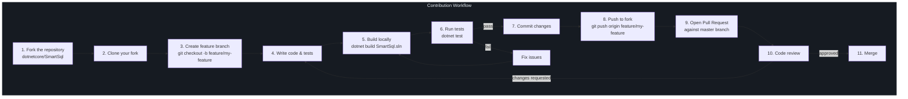
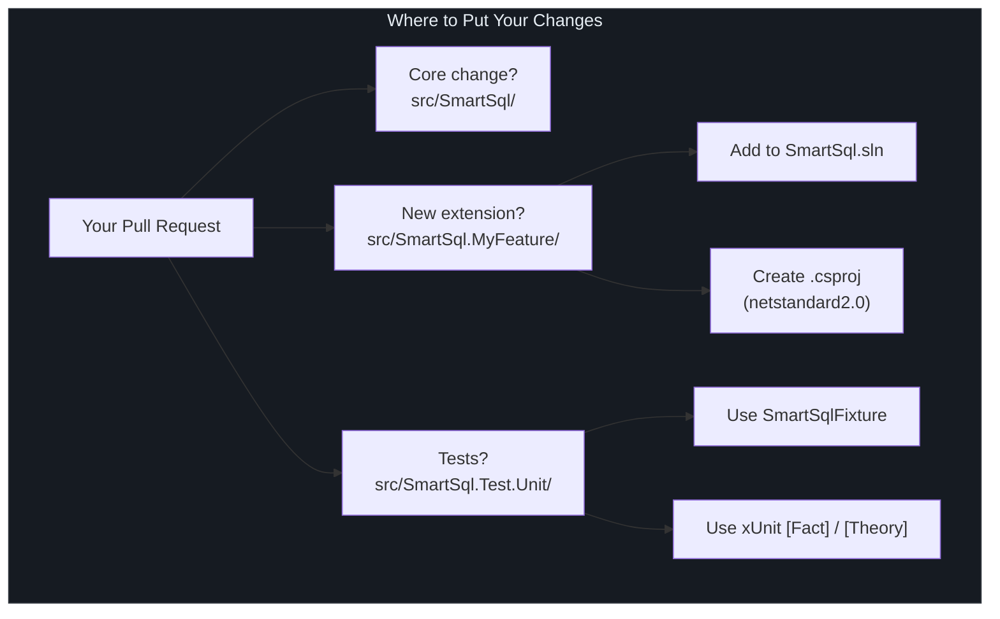
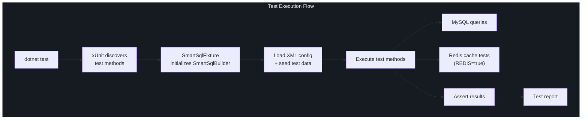
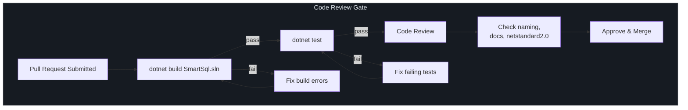

# Contributing Guide

SmartSql welcomes contributions. This page covers the contribution workflow, coding conventions, testing expectations, and XML configuration patterns.

## At a Glance

| Aspect | Convention |
|--------|------------|
| License | Apache-2.0 |
| Language | C# 7.3 |
| Target | `netstandard2.0` |
| Test Framework | xUnit |
| CI Required | All tests pass on push/PR |
| Commit Style | Descriptive, concise messages |

## Contribution Workflow



<!-- Sources: .github/workflows/integration-test.yml:1 -->

### Step-by-Step

1. **Fork** the repository at [github.com/dotnetcore/SmartSql](https://github.com/dotnetcore/SmartSql)
2. **Clone** your fork:
   ```bash
   git clone https://github.com/<your-username>/SmartSql.git
   cd SmartSql
   ```
3. **Create a branch** from `master`:
   ```bash
   git checkout -b feature/my-feature
   ```
4. **Make your changes** following the coding conventions below
5. **Build and test**:
   ```bash
   dotnet build SmartSql.sln
   dotnet test
   ```
6. **Commit** with a clear message describing what and why
7. **Push** and open a **Pull Request** against `master`

## Coding Conventions

### General C# Style

- Target `netstandard2.0` -- avoid APIs not available in this target
- Use C# 7.3 language features (no C# 8+ features such as nullable reference types, switch expressions, or async streams)
- Use `var` when the type is obvious from the right side of the assignment
- Use explicit types when the type is not obvious
- Prefer `readonly` fields for injected dependencies
- Use XML documentation comments on public APIs

### Naming Conventions

| Element | Convention | Example |
|---------|------------|---------|
| Namespace | PascalCase, matching folder structure | `SmartSql.Middlewares` |
| Class/Struct | PascalCase | `PrepareStatementMiddleware` |
| Interface | `I` prefix + PascalCase | `IMiddleware`, `ISqlMapper` |
| Method | PascalCase | `ExecuteAsync` |
| Property | PascalCase | `SmartSqlConfig` |
| Private field | `_` prefix + camelCase | `_logger`, `_cacheManager` |
| Parameter | camelCase | `requestContext` |
| Constant | PascalCase | `DEFAULT_ALIAS` |

### Project Structure

When adding a new feature:

- **Core changes** go in `src/SmartSql/`
- **Extensions** get their own project: `src/SmartSql.MyFeature/`
- **Tests** go in `src/SmartSql.Test.Unit/` for the corresponding feature
- New extension projects should be added to the `SmartSql.sln` solution file



<!-- Sources: src/SmartSql/SmartSql.csproj:1, SmartSql.sln:1 -->

### Interface-Based Design

SmartSql follows interface-based design. All major services are accessed through interfaces:

```csharp
// Good: depend on interface
public class MyMiddleware : AbstractMiddleware
{
    private ICacheManager _cacheManager;

    public override void SetupSmartSql(SmartSqlBuilder smartSqlBuilder)
    {
        _cacheManager = smartSqlBuilder.SmartSqlConfig.CacheManager;
    }
}
```

## Testing Requirements



<!-- Sources: src/SmartSql.Test.Unit/SmartSql.Test.Unit.csproj:1, .github/workflows/integration-test.yml:39 -->

### xUnit Conventions

All tests use xUnit. The test project is located at `src/SmartSql.Test.Unit/`.

| Convention | Details |
|------------|---------|
| Framework | xUnit |
| Test Discovery | Public methods with `[Fact]` or `[Theory]` |
| Naming | `MethodName_Scenario_ExpectedBehavior` or descriptive Chinese names |
| Fixture | `SmartSqlFixture` initializes SmartSqlBuilder with XML config |
| Database | Tests expect a local MySQL instance with pre-seeded data |
| Redis | Cache tests require Redis (controlled by `REDIS` environment variable) |

### Running Tests Locally

Before submitting a PR, ensure all tests pass:

```bash
# Start MySQL and ensure test database exists
mysql -h localhost -uroot -proot < src/SmartSql.Test.Unit/DB/init-mysql-db.sql

# Run all tests
dotnet test

# Run a specific test class
dotnet test --filter "FullyQualifiedName~SmartSql.Test.Unit.Tests.CacheTest"
```

### Writing Tests

```csharp
public class MyFeatureTest : IClassFixture<SmartSqlFixture>
{
    private readonly ISqlMapper _sqlMapper;

    public MyFeatureTest(SmartSqlFixture fixture)
    {
        _sqlMapper = fixture.SqlMapper;
    }

    [Fact]
    public void Query_ShouldReturnResults()
    {
        var users = _sqlMapper.Query<User>(new RequestContext
        {
            FullSqlId = "User.GetAll"
        });

        Assert.NotNull(users);
        Assert.True(users.Count > 0);
    }
}
```

## XML Configuration Conventions

SmartSql uses XML files (`.xml`) to define SQL maps. Follow these conventions:

### File Naming and Placement

- SQL map files are named after their scope: `User.xml`, `Order.xml`
- Place them in the `Maps/` directory of the test project or sample app
- Reference them from the main `SmartSqlMapConfig.xml`

### Statement Naming

| Statement Type | Prefix | Example |
|---------------|--------|---------|
| Query (SELECT) | `Query` or descriptive | `User.Query`, `User.GetById` |
| Insert | `Insert` | `User.Insert` |
| Update | `Update` | `User.Update` |
| Delete | `Delete` | `User.Delete` |

### XML Structure

```xml
<?xml version="1.0" encoding="utf-8" ?>
<SmartSqlMap Scope="User" xmlns="http://SmartSql.net/schemas/SmartSqlMap.xsd">
  <Statement Id="Query">
    SELECT
      <IsNotEmpty Property="Name">
        u.Name,
      </IsNotEmpty>
      u.Id
    FROM t_user u
    <Where>
      <IsNotEmpty Property="Name">
        AND u.Name = @Name
      </IsNotEmpty>
    </Where>
  </Statement>
</SmartSqlMap>
```

## Code Review Checklist



<!-- Sources: .github/workflows/integration-test.yml:1, Directory.Build.props:1 -->

When reviewing PRs or preparing your own, verify:

- [ ] Code compiles with `dotnet build SmartSql.sln`
- [ ] All tests pass with `dotnet test`
- [ ] New public APIs have XML documentation comments
- [ ] No breaking changes to existing APIs (unless major version bump)
- [ ] New features have corresponding unit tests
- [ ] Naming conventions are followed
- [ ] No hardcoded connection strings or credentials
- [ ] `netstandard2.0` compatibility is maintained

## Issue Templates

The repository provides issue templates for bug reports and feature requests:

- [Bug Issue Template](https://github.com/dotnetcore/SmartSql/blob/master/.github/ISSUE_TEMPLATE/bug-issue-template.md) -- For reporting bugs with reproduction steps
- [Feature Request Template](https://github.com/dotnetcore/SmartSql/blob/master/.github/ISSUE_TEMPLATE/feature_request.md) -- For proposing new features

## Reporting Bugs

When filing a bug report, include:

1. SmartSql version (check `build/version.props`)
2. .NET target framework
3. Database type and version
4. Minimal reproduction steps
5. Expected vs actual behavior
6. Relevant stack trace or error message

## Cross-References

- [Build & CI](/building/index) -- Build commands and CI pipeline details
- [Publishing](/building/publishing) -- How packages are published to NuGet
- [Middleware API](/api/middleware) -- How to create custom middleware

## References

| Source | Description |
|--------|-------------|
| [`.github/workflows/integration-test.yml`](https://github.com/dotnetcore/SmartSql/blob/master/.github/workflows/integration-test.yml) | CI workflow that runs on push/PR |
| [`.github/ISSUE_TEMPLATE/bug-issue-template.md`](https://github.com/dotnetcore/SmartSql/blob/master/.github/ISSUE_TEMPLATE/bug-issue-template.md) | Bug report template |
| [`.github/ISSUE_TEMPLATE/feature_request.md`](https://github.com/dotnetcore/SmartSql/blob/master/.github/ISSUE_TEMPLATE/feature_request.md) | Feature request template |
| [`Directory.Build.props`](https://github.com/dotnetcore/SmartSql/blob/master/Directory.Build.props) | Shared build properties (license, tags, etc.) |
| [`build/version.props`](https://github.com/dotnetcore/SmartSql/blob/master/build/version.props) | Version management |
