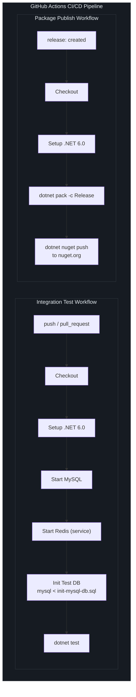
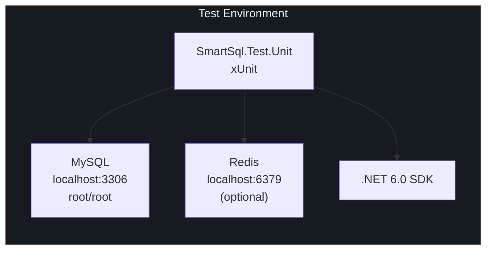
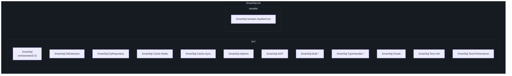

# Build & CI

This page covers building SmartSql from source, running tests, understanding the CI/CD pipeline, and the build configuration system.

## At a Glance

| Aspect | Details |
|--------|---------|
| Solution File | `SmartSql.sln` |
| Target Framework | `netstandard2.0` |
| Language | C# 7.3 |
| Test Framework | xUnit |
| CI Platform | GitHub Actions |
| Package Format | NuGet (`.nupkg`) |

## Build Commands

### Build the Solution

```bash
dotnet build SmartSql.sln
```

This compiles all projects in the solution, including the core library, extensions, and test projects. The solution file at `SmartSql.sln` contains all projects organized in solution folders.

### Run All Tests

```bash
dotnet test
```

The unit test project (`src/SmartSql.Test.Unit`) requires:
- **MySQL** running locally (default connection: `Server=localhost;Uid=root;Pwd=root`)
- **Redis** (optional, for cache tests) on port 6379

To run a specific test project:

```bash
dotnet test src/SmartSql.Test.Unit/SmartSql.Test.Unit.csproj
```

To run tests by name filter:

```bash
dotnet test src/SmartSql.Test.Unit/SmartSql.Test.Unit.csproj \
  --filter "FullyQualifiedName~SmartSql.Test.Unit.Tests.CacheTest"
```

### Pack NuGet Packages

```bash
dotnet pack -c Release -o ./nuget
```

This produces `.nupkg` files for every library project in the solution. The version is read from `build/version.props`.

## Build Configuration

### Directory.Build.props

All projects share common metadata through `Directory.Build.props` at the repository root. This file:

- Imports version from `build/version.props`
- Sets NuGet package metadata (authors, license, description, tags)
- Enables SourceLink for debugging into NuGet packages

| Property | Value |
|----------|-------|
| `Product` | SmartSql |
| `Authors` | Ahoo Wang; ncc |
| `PackageLicenseExpression` | Apache-2.0 |
| `RepositoryUrl` | https://github.com/Smart-Kit/SmartSql |
| `PackageTags` | orm, sql, read-write-separation, cache, redis, dotnet-core |

<!-- Sources: Directory.Build.props:1 -->

### Version Management

Version numbers are centrally managed in `build/version.props`:

```xml
<Project>
  <PropertyGroup>
    <VersionMajor>4</VersionMajor>
    <VersionMinor>1</VersionMinor>
    <VersionPatch>68</VersionPatch>
    <VersionPrefix>$(VersionMajor).$(VersionMinor).$(VersionPatch)</VersionPrefix>
  </PropertyGroup>
</Project>
```

| Component | Current Value | Description |
|-----------|---------------|-------------|
| Major | `4` | Breaking changes |
| Minor | `1` | New features (backward compatible) |
| Patch | `68` | Bug fixes |
| Full Version | `4.1.68` | Combined version string |

To increment the version, edit `build/version.props` and update the appropriate component.

<!-- Sources: build/version.props:1 -->

## CI/CD Pipeline

### Pipeline Overview



<!-- Sources: .github/workflows/integration-test.yml:1, .github/workflows/package-publish.yml:1 -->

### Integration Test Workflow

**Trigger:** Every push and pull request.

| Step | Action | Details |
|------|--------|---------|
| 1 | Start MySQL | Uses the pre-installed MySQL on `ubuntu-latest` |
| 2 | Start Redis | Docker container on port 6379 with health checks |
| 3 | Checkout | `actions/checkout@master` |
| 4 | Setup .NET | `actions/setup-dotnet@v2` with SDK `6.0.x` |
| 5 | Init Test DB | Runs `src/SmartSql.Test.Unit/DB/init-mysql-db.sql` against local MySQL |
| 6 | Unit Test | `dotnet test` (all test projects) |

The workflow sets the environment variable `REDIS=true` to enable Redis-dependent tests.

### Package Publish Workflow

**Trigger:** GitHub release creation (`release: types: [created]`).

| Step | Action | Details |
|------|--------|---------|
| 1 | Checkout | `actions/checkout@master` |
| 2 | Setup .NET | `actions/setup-dotnet@v2` with SDK `6.0.x` |
| 3 | Pack | `dotnet pack -c Release -o ./nuget` |
| 4 | Publish | `dotnet nuget push "./nuget/*.nupkg"` to nuget.org using `NUGET_API_KEY` secret |

The pack step produces one `.nupkg` per library project. All packages share the same version from `build/version.props`. The push step uploads all packages in a single command.

### Test Environment Requirements



| Dependency | Required | Purpose |
|------------|----------|---------|
| MySQL | Yes | Primary test database |
| Redis | Optional | Cache extension tests |
| .NET SDK | 6.0+ | Build and run |

## Solution Structure

The solution organizes projects into logical folders:



## Cross-References

- [Contributing Guide](/building/contributing) -- How to contribute code to SmartSql
- [Publishing](/building/publishing) -- How packages are published to NuGet
- [API Overview](/api/index) -- NuGet package listing

## References

| Source | Description |
|--------|-------------|
| [`.github/workflows/integration-test.yml`](https://github.com/dotnetcore/SmartSql/blob/master/.github/workflows/integration-test.yml) | CI test workflow |
| [`.github/workflows/package-publish.yml`](https://github.com/dotnetcore/SmartSql/blob/master/.github/workflows/package-publish.yml) | NuGet publish workflow |
| [`Directory.Build.props`](https://github.com/dotnetcore/SmartSql/blob/master/Directory.Build.props) | Shared build properties |
| [`build/version.props`](https://github.com/dotnetcore/SmartSql/blob/master/build/version.props) | Version management |
| [`SmartSql.sln`](https://github.com/dotnetcore/SmartSql/blob/master/SmartSql.sln) | Solution file |
