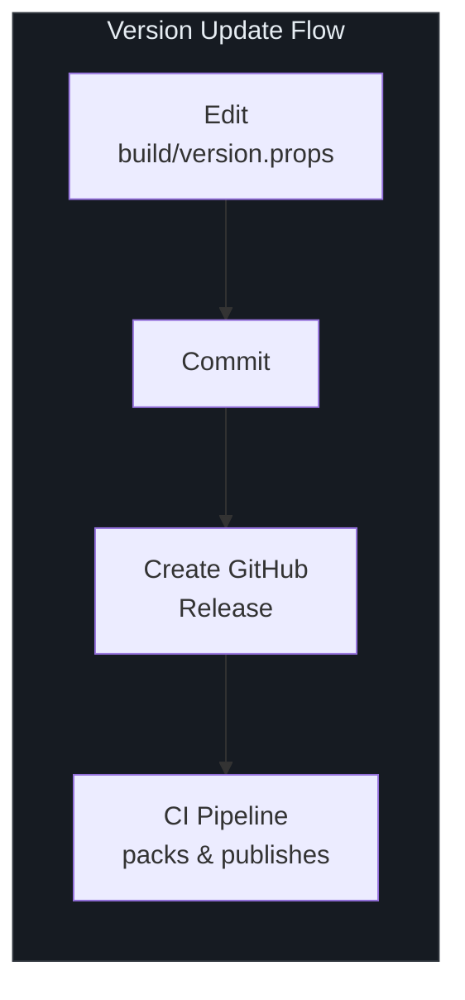
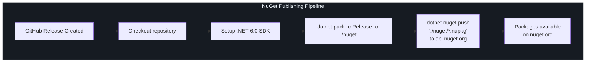
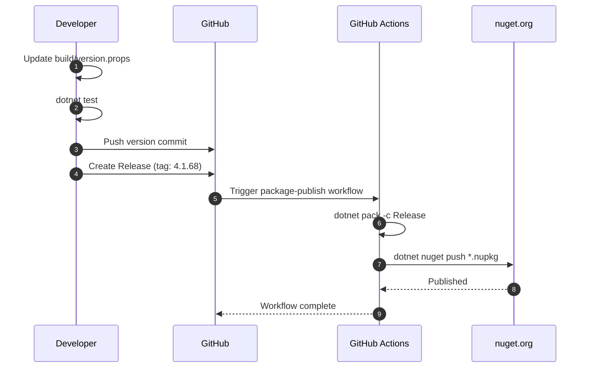

# Publishing

SmartSql publishes all library packages to [nuget.org](https://www.nuget.org/) as a coordinated set. This page covers the version management system, the CI/CD publishing pipeline, and the complete list of published NuGet packages.

## At a Glance

| Aspect | Details |
|--------|---------|
| Registry | [nuget.org](https://www.nuget.org/) |
| Version Source | `build/version.props` |
| Current Version | 4.1.68 |
| CI Trigger | GitHub release creation |
| Build Command | `dotnet pack -c Release -o ./nuget` |
| Push Command | `dotnet nuget push "./nuget/*.nupkg"` |
| License | Apache-2.0 |

## Version Management

All SmartSql packages share a single version number, centrally managed in `build/version.props`:

```xml
<Project>
  <PropertyGroup>
    <VersionMajor>4</VersionMajor>
    <VersionMinor>1</VersionMinor>
    <VersionPatch>68</VersionPatch>
    <VersionPrefix>$(VersionMajor).$(VersionMinor).$(VersionPatch)</VersionPrefix>
  </PropertyGroup>
</Project>
```

The `VersionPrefix` property is computed from the three components and automatically applied to every project via `Directory.Build.props` (which imports `build/version.props`).

### Versioning Strategy

| Component | Increment When | Example |
|-----------|----------------|---------|
| Major (`VersionMajor`) | Breaking API changes | `4.x.x` -> `5.0.0` |
| Minor (`VersionMinor`) | New features, backward compatible | `4.1.x` -> `4.2.0` |
| Patch (`VersionPatch`) | Bug fixes, no API changes | `4.1.67` -> `4.1.68` |

### How to Increment

1. Edit `build/version.props`
2. Update the appropriate component (`VersionMajor`, `VersionMinor`, or `VersionPatch`)
3. Commit the change
4. Create a GitHub release (this triggers the publish pipeline)



<!-- Sources: build/version.props:1, Directory.Build.props:3 -->

## Publishing Pipeline

### CI/CD Overview

Publishing is fully automated through GitHub Actions. The workflow triggers when a GitHub release is created.



<!-- Sources: .github/workflows/package-publish.yml:1 -->

### Workflow Details

The publish workflow (`.github/workflows/package-publish.yml`) performs these steps:

| Step | Command | Description |
|------|---------|-------------|
| Setup | `actions/setup-dotnet@v2` with SDK `6.0.x` | Install .NET SDK |
| Pack | `dotnet pack -c Release -o ./nuget` | Build and package all projects in Release mode |
| Push | `dotnet nuget push "./nuget/*.nupkg" -s https://api.nuget.org/v3/index.json -k NUGET_API_KEY` | Upload all packages to nuget.org |

### Required Secrets

| Secret | Purpose |
|--------|---------|
| `NUGET_API_KEY` | API key for publishing to nuget.org (set in repository secrets) |

### What Gets Published

The `dotnet pack` command produces one `.nupkg` for each library project (non-test, non-sample projects). All packages use the same version from `build/version.props`. The `PackageId` for each package defaults to the `AssemblyName` (which matches the project name).

## NuGet Packages

### Core Package

| Package | Description | NuGet |
|---------|-------------|-------|
| `SmartSql` | Core ORM library | [](https://www.nuget.org/packages/SmartSql/) |

### Extension Packages

| Package | Description | NuGet |
|---------|-------------|-------|
| `SmartSql.DIExtension` | ASP.NET Core DI integration | [](https://www.nuget.org/packages/SmartSql.DIExtension/) |
| `SmartSql.DyRepository` | Dynamic repository proxy generation | [](https://www.nuget.org/packages/SmartSql.DyRepository/) |
| `SmartSql.Options` | Options-pattern configuration | [](https://www.nuget.org/packages/SmartSql.Options/) |
| `SmartSql.AOP` | AOP transaction support | [](https://www.nuget.org/packages/SmartSql.AOP/) |
| `SmartSql.Extensions` | General extensions | [](https://www.nuget.org/packages/SmartSql.Extensions/) |
| `SmartSql.ScriptTag` | Script tag support | [](https://www.nuget.org/packages/SmartSql.ScriptTag/) |
| `SmartSql.DataConnector` | Data connector service | [](https://www.nuget.org/packages/SmartSql.DataConnector/) |

### Caching Packages

| Package | Description | NuGet |
|---------|-------------|-------|
| `SmartSql.Cache.Redis` | Redis cache provider | [](https://www.nuget.org/packages/SmartSql.Cache.Redis/) |
| `SmartSql.Cache.Sync` | Cache synchronization | [](https://www.nuget.org/packages/SmartSql.Cache.Sync/) |
| `SmartSql.DistributedCache` | Distributed cache abstraction | [](https://www.nuget.org/packages/SmartSql.DistributedCache/) |

### Bulk Insert Packages

| Package | Description | NuGet |
|---------|-------------|-------|
| `SmartSql.Bulk` | Base bulk insert abstractions | [](https://www.nuget.org/packages/SmartSql.Bulk/) |
| `SmartSql.Bulk.SqlServer` | SQL Server bulk insert | [](https://www.nuget.org/packages/SmartSql.Bulk.SqlServer/) |
| `SmartSql.Bulk.MsSqlServer` | MS SQL Server bulk insert | [](https://www.nuget.org/packages/SmartSql.Bulk.MsSqlServer/) |
| `SmartSql.Bulk.MySql` | MySQL bulk insert | [](https://www.nuget.org/packages/SmartSql.Bulk.MySql/) |
| `SmartSql.Bulk.MySqlConnector` | MySQL (MySqlConnector) bulk insert | [](https://www.nuget.org/packages/SmartSql.Bulk.MySqlConnector/) |
| `SmartSql.Bulk.PostgreSql` | PostgreSQL bulk insert | [](https://www.nuget.org/packages/SmartSql.Bulk.PostgreSql/) |

### Synchronization Packages

| Package | Description | NuGet |
|---------|-------------|-------|
| `SmartSql.InvokeSync` | Data synchronization base | [](https://www.nuget.org/packages/SmartSql.InvokeSync/) |
| `SmartSql.InvokeSync.Kafka` | Kafka sync transport | [](https://www.nuget.org/packages/SmartSql.InvokeSync.Kafka/) |
| `SmartSql.InvokeSync.RabbitMQ` | RabbitMQ sync transport | [](https://www.nuget.org/packages/SmartSql.InvokeSync.RabbitMQ/) |

### Database Provider Packages

| Package | Description | NuGet |
|---------|-------------|-------|
| `SmartSql.Oracle` | Oracle database provider | [](https://www.nuget.org/packages/SmartSql.Oracle/) |
| `SmartSql.TypeHandler` | JSON and custom type handlers | [](https://www.nuget.org/packages/SmartSql.TypeHandler/) |
| `SmartSql.TypeHandler.PostgreSql` | PostgreSQL type handlers | [](https://www.nuget.org/packages/SmartSql.TypeHandler.PostgreSql/) |

## Build Metadata

The `Directory.Build.props` file configures shared metadata applied to every package:

| Property | Value | Description |
|----------|-------|-------------|
| `Authors` | Ahoo Wang; ncc | Package authors |
| `PackageLicenseExpression` | Apache-2.0 | License identifier |
| `PackageRequireLicenseAcceptance` | True | Requires license acceptance on install |
| `Description` | SmartSql = MyBatis + Cache(Memory \| Redis) + ZooKeeper + R/W Splitting + Dynamic Repository | Package description |
| `PackageTags` | orm, sql, read-write-separation, cache, redis, dotnet-core, cross-platform, high-performance, distributed-computing, zookeeper | Search tags |
| `PublishRepositoryUrl` | true | SourceLink: publish repository URL |
| `EmbedUntrackedSources` | true | SourceLink: embed untracked sources |

SourceLink is enabled via the `Microsoft.SourceLink.GitHub` package, which allows consumers to step into SmartSql source code from their debugger.

<!-- Sources: Directory.Build.props:5 -->

## Release Checklist

Before creating a GitHub release to trigger publishing:

1. **Update version** in `build/version.props`
2. **Run all tests** -- `dotnet test`
3. **Build in Release mode** -- `dotnet build SmartSql.sln -c Release`
4. **Pack locally** -- `dotnet pack -c Release -o ./nuget`
5. **Verify package contents** by examining `.nupkg` files
6. **Commit** the version change
7. **Create a GitHub release** with a tag matching the version (e.g., `4.1.68`)
8. The CI pipeline automatically packs and publishes all packages



<!-- Sources: .github/workflows/package-publish.yml:1, build/version.props:1 -->

## Cross-References

- [Build & CI](/building/index) -- Build commands and test setup
- [Contributing Guide](/building/contributing) -- How to contribute code
- [API Overview](/api/index) -- Package dependency diagram and descriptions

## References

| Source | Description |
|--------|-------------|
| [`.github/workflows/package-publish.yml`](https://github.com/dotnetcore/SmartSql/blob/master/.github/workflows/package-publish.yml) | NuGet publish workflow |
| [`.github/workflows/integration-test.yml`](https://github.com/dotnetcore/SmartSql/blob/master/.github/workflows/integration-test.yml) | CI test workflow (runs before publish) |
| [`build/version.props`](https://github.com/dotnetcore/SmartSql/blob/master/build/version.props) | Version management |
| [`Directory.Build.props`](https://github.com/dotnetcore/SmartSql/blob/master/Directory.Build.props) | Shared package metadata and SourceLink |
