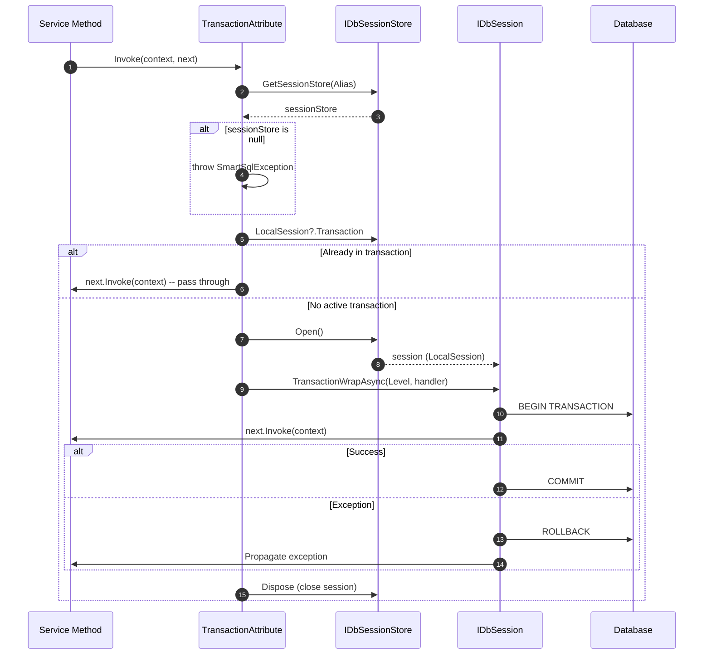
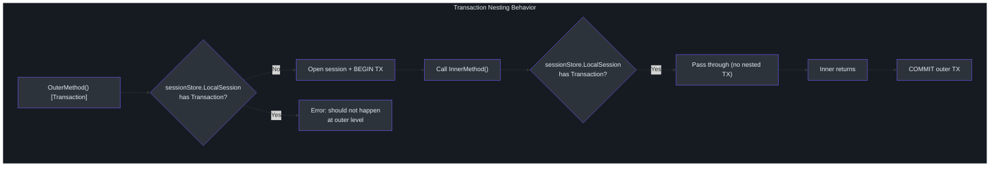
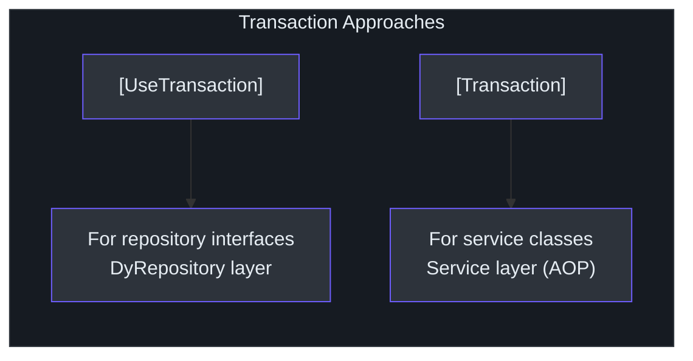

# AOP Transactions

The `SmartSql.AOP` package provides declarative transaction and session management through AspectCore interceptor attributes. Instead of writing explicit `using` / `TransactionWrap` blocks, you decorate your methods with `[Transaction]` or `[DbSession]` attributes and let the AOP framework handle opening sessions, committing transactions, and rolling back on exceptions.

## At a Glance

| Feature | Description |
|---------|-------------|
| Package | `SmartSql.AOP` |
| Framework | AspectCore DynamicProxy |
| `[Transaction]` | Opens a DB session, wraps the method in a transaction |
| `[DbSession]` | Opens a DB session (no transaction) |
| Nesting Support | Detects existing transactions, avoids double-wrapping |
| Isolation Level | Configurable via `Level` property |
| Multi-Instance | `Alias` property selects which SmartSql instance to use |

## Transaction Lifecycle

The `[Transaction]` attribute manages the full lifecycle of a database transaction:



<!-- Sources: src/SmartSql.AOP/TransactionAttribute.cs:13, src/SmartSql.AOP/DbSessionAttribute.cs:10 -->

## Transaction Nesting

SmartSql's AOP transaction system supports nesting. When a method annotated with `[Transaction]` calls another `[Transaction]` method, the inner call detects the existing transaction and passes through without creating a nested transaction:



<!-- Sources: src/SmartSql.AOP/TransactionAttribute.cs:24, src/SmartSql.AOP/TransactionAttribute.cs:28 -->

## Attributes

### `[Transaction]`

Intercepts the method call and wraps it in a database transaction:

```csharp
public class UserService
{
    private readonly IUserRepository _userRepository;

    [Transaction(Alias = "SmartSql", Level = IsolationLevel.ReadCommitted)]
    public void TransferFunds(long fromId, long toId, decimal amount)
    {
        var from = _userRepository.GetById(fromId);
        var to = _userRepository.GetById(toId);
        from.Balance -= amount;
        to.Balance += amount;
        _userRepository.Update(from);
        _userRepository.Update(to);
    }
}
```

| Property | Type | Default | Description |
|---|---|---|---|
| `Alias` | `string` | `"SmartSql"` | Which SmartSql instance to use |
| `Level` | `IsolationLevel` | `Unspecified` | Transaction isolation level |

### `[DbSession]`

Opens a database session without a transaction. Useful for read-only operations that benefit from connection reuse:

```csharp
[DbSession(Alias = "SmartSql")]
public async Task<IList<User>> GetAllUsers()
{
    return await _userRepository.QueryAsync();
}
```

| Property | Type | Default | Description |
|---|---|---|---|
| `Alias` | `string` | `"SmartSql"` | Which SmartSql instance to use |

## Integration with AspectCore

Both attributes inherit from `AspectCore.DynamicProxy.AbstractInterceptorAttribute`. To enable them in your application, you must configure AspectCore as the DI provider:

```csharp
public IServiceProvider ConfigureServices(IServiceCollection services)
{
    services.AddSmartSql("SmartSql")
        .AddRepositoryFromAssembly(o =>
        {
            o.AssemblyString = "MyApp";
        });

    // Register services that use [Transaction]
    services.AddSingleton<UserService>();

    // Use AspectCore's proxy provider
    return services.BuildAspectInjectorProvider();
}
```

::: warning
Without `BuildAspectInjectorProvider()`, the `[Transaction]` and `[DbSession]` attributes will not intercept method calls. You must use AspectCore's service provider.
:::

## DyRepository vs AOP Transactions

SmartSql offers two ways to declare transactions:



| Feature | `[UseTransaction]` | `[Transaction]` |
|---|---|---|
| Applied to | Repository interface methods | Any service method |
| Requires AspectCore | No | Yes |
| Nesting awareness | Via DyRepository emit logic | Via `sessionStore.LocalSession` check |
| Recommended layer | Data access | Business/service layer |

See the [Dynamic Repository](./dy-repository.md) page for `[UseTransaction]` details.

## API Reference

### TransactionAttribute

| Member | Type | Description |
|---|---|---|
| `Alias` | `string` | SmartSql instance alias |
| `Level` | `IsolationLevel` | Transaction isolation level |
| `Invoke(AspectContext, AspectDelegate)` | `Task` | Interceptor entry point |

### DbSessionAttribute

| Member | Type | Description |
|---|---|---|
| `Alias` | `string` | SmartSql instance alias |
| `Invoke(AspectContext, AspectDelegate)` | `Task` | Interceptor entry point |

## Cross-References

- **[Dynamic Repository](./dy-repository.md)** -- `[UseTransaction]` annotation for repository methods.
- **[DI Integration](./di-extension.md)** -- How to register services that use AOP attributes.
- **[InvokeSync](./invoke-sync.md)** -- Transaction events can trigger data synchronization.

## References

- [TransactionAttribute.cs](https://github.com/dotnetcore/SmartSql/blob/master/src/SmartSql.AOP/TransactionAttribute.cs) -- Transaction interceptor
- [DbSessionAttribute.cs](https://github.com/dotnetcore/SmartSql/blob/master/src/SmartSql.AOP/DbSessionAttribute.cs) -- Session interceptor
- [SmartSqlBuilder.cs](https://github.com/dotnetcore/SmartSql/blob/master/src/SmartSql/SmartSqlBuilder.cs) -- Core builder that AOP extends
- [SmartSqlDIExtensions.cs](https://github.com/dotnetcore/SmartSql/blob/master/src/SmartSql.DIExtension/SmartSqlDIExtensions.cs) -- DI registration used alongside AOP
- [UseTransactionAttribute.cs](https://github.com/dotnetcore/SmartSql/blob/master/src/SmartSql.DyRepository/Annotations/UseTransactionAttribute.cs) -- DyRepository transaction alternative
- [Startup.cs](https://github.com/dotnetcore/SmartSql/blob/master/sample/SmartSql.Sample.AspNetCore/Startup.cs) -- Sample using `BuildAspectInjectorProvider()`
