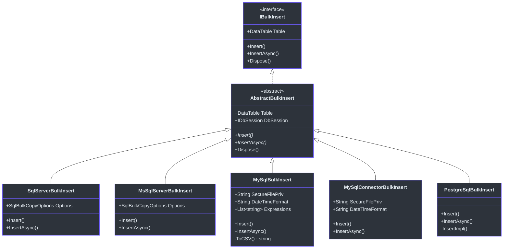
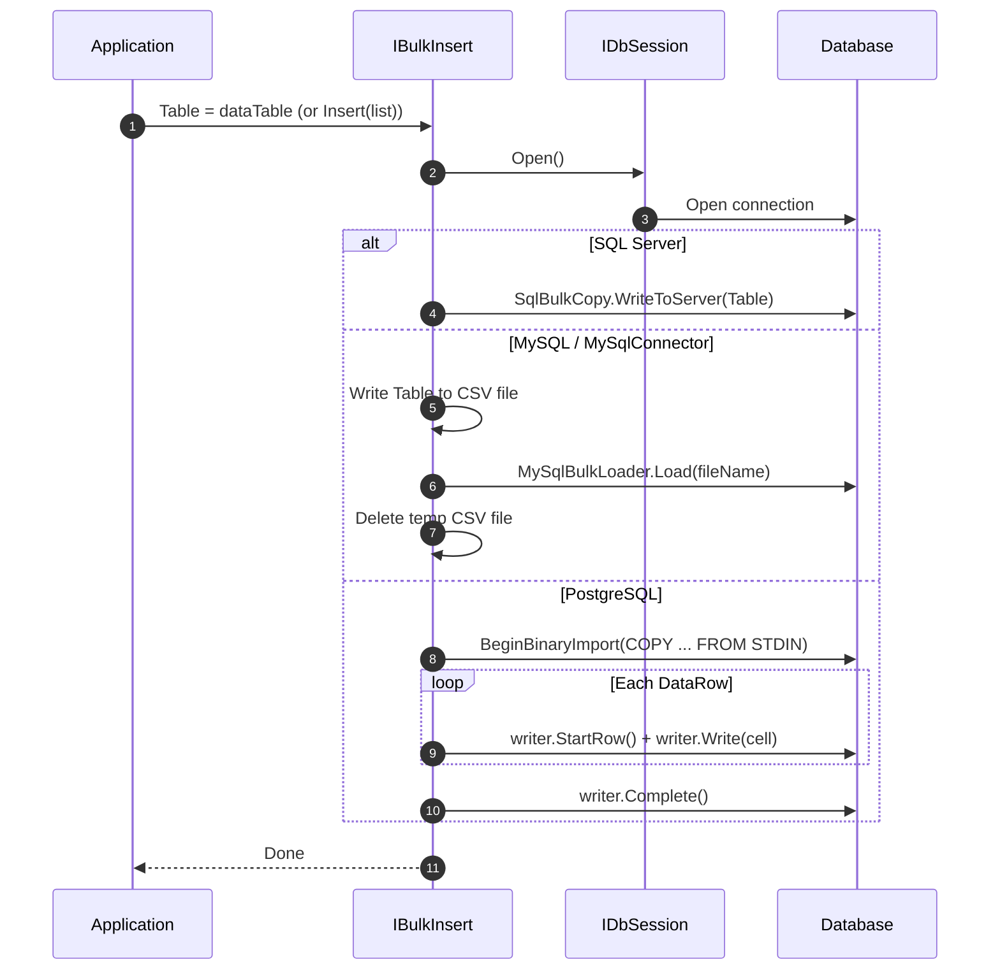
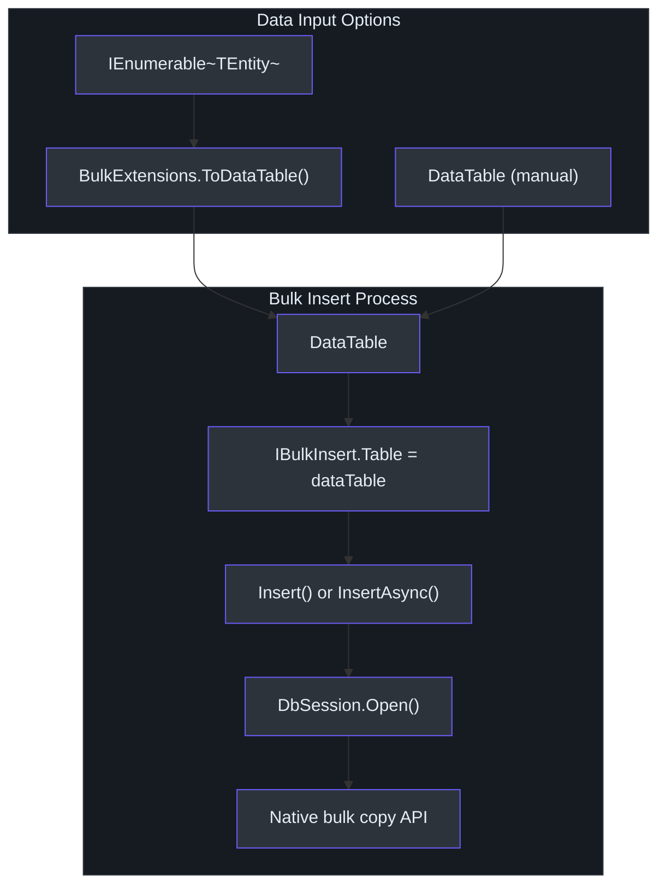

# Bulk Insert

Inserting large volumes of data one row at a time is prohibitively slow for most production workloads. The `SmartSql.Bulk` package provides a database-agnostic interface for high-performance bulk inserts, with native implementations for SQL Server, MySQL, MySQL (MySqlConnector), and PostgreSQL. Each implementation uses the database's own bulk loading mechanism -- `SqlBulkCopy`, `MySqlBulkLoader`, and `COPY BINARY` respectively -- to achieve maximum throughput.

## At a Glance

| Feature | Description |
|---------|-------------|
| Package | `SmartSql.Bulk` (base) |
| Implementations | SqlServer, MsSqlServer, MySql, MySqlConnector, PostgreSql |
| Input | `DataTable` or `IEnumerable<TEntity>` |
| Interface | `IBulkInsert` |
| Sync/Async | `Insert()` and `InsertAsync()` |

## Class Hierarchy



<!-- Sources: src/SmartSql.Bulk/IBulkInsert.cs:8, src/SmartSql.Bulk/AbstractBulkInsert.cs:10, src/SmartSql.Bulk.SqlServer/BulkInsert.cs:17, src/SmartSql.Bulk.MySql/BulkInsert.cs:19, src/SmartSql.Bulk.PostgreSql/BulkInsert.cs:10 -->

## How Each Database Provider Works



<!-- Sources: src/SmartSql.Bulk.SqlServer/BulkInsert.cs:28, src/SmartSql.Bulk.MySql/BulkInsert.cs:27, src/SmartSql.Bulk.PostgreSql/BulkInsert.cs:19 -->

## Data Flow



<!-- Sources: src/SmartSql.Bulk/BulkExtensions.cs:17, src/SmartSql.Bulk/BulkExtensions.cs:58 -->

## Usage

### Convert Entities to DataTable

The `BulkExtensions.ToDataTable<T>()` extension method converts an `IEnumerable<T>` to a `DataTable`, using SmartSql's entity metadata cache for column definitions:

```csharp
var entities = new List<User> { /* ... */ };
DataTable dataTable = entities.ToDataTable();
```

### Bulk Insert Directly from Entity List

The `Insert<T>()` and `InsertAsync<T>()` extension methods combine conversion and insertion:

```csharp
// SQL Server
var bulkInsert = new SmartSql.Bulk.SqlServer.BulkInsert(dbSession);
await bulkInsert.InsertAsync(userList);

// PostgreSQL
var bulkInsert = new SmartSql.Bulk.PostgreSql.BulkInsert(dbSession);
await bulkInsert.InsertAsync(orderList);
```

### Bulk Insert with DataTable

```csharp
var bulkInsert = new SmartSql.Bulk.MySql.BulkInsert(dbSession)
{
    SecureFilePriv = "/tmp",
    DateTimeFormat = "yyyy-MM-dd HH:mm:ss"
};
bulkInsert.Table = dataTable;
bulkInsert.Insert();
```

## Provider-Specific Options

### MySQL / MySqlConnector

| Property | Type | Default | Description |
|---|---|---|---|
| `SecureFilePriv` | `string` | AppDomain base directory | Directory for temp CSV files |
| `DateTimeFormat` | `string` | `"yyyy-MM-dd HH:mm:ss"` | DateTime format in CSV |
| `Expressions` | `List<string>` | empty | MySqlBulkLoader expressions |
| `_fieldTerminator` | `string` | `","` | CSV field delimiter |
| `_fieldQuotationCharacter` | `char` | `"` | CSV quote character |
| `_escapeCharacter` | `char` | `"` | CSV escape character |
| `_lineTerminator` | `string` | `"\r\n"` | CSV line terminator |

### SQL Server / MsSqlServer

| Property | Type | Default | Description |
|---|---|---|---|
| `Options` | `SqlBulkCopyOptions` | `Default` | Bulk copy behavior flags |

### PostgreSQL

PostgreSQL bulk insert uses `NpgsqlConnection.BeginBinaryImport()` with the `COPY ... FROM STDIN (FORMAT BINARY)` command. For JSONB columns, set the `DataTypeName` extended property on the `DataColumn`:

```csharp
DataColumn col = dataTable.Columns["Metadata"];
col.ExtendedProperties.Add("DataTypeName", "JSONB");
```

## Package Mapping

| NuGet Package | Underlying Driver | Mechanism |
|---|---|---|
| `SmartSql.Bulk.SqlServer` | `System.Data.SqlClient` | `SqlBulkCopy` |
| `SmartSql.Bulk.MsSqlServer` | `Microsoft.Data.SqlClient` | `SqlBulkCopy` |
| `SmartSql.Bulk.MySql` | `MySql.Data.MySqlClient` | `MySqlBulkLoader` via CSV |
| `SmartSql.Bulk.MySqlConnector` | `MySqlConnector` | `MySqlBulkLoader` via CSV |
| `SmartSql.Bulk.PostgreSql` | `Npgsql` | `BeginBinaryImport` (COPY BINARY) |

::: info
`SmartSql.Bulk.SqlServer` and `SmartSql.Bulk.MsSqlServer` use the same source file with conditional compilation (`#if MicrosoftSqlClient`). Choose the package matching your SqlClient dependency.
:::

## Cross-References

- **[Type Handlers](./type-handlers.md)** -- Custom type handlers affect how entity properties are converted to `DataTable` values via `BulkExtensions.ToDataTable<T>()`.
- **[DI Integration](./di-extension.md)** -- Register `IBulkInsert` implementations in the DI container.

## References

- [IBulkInsert.cs](https://github.com/dotnetcore/SmartSql/blob/master/src/SmartSql.Bulk/IBulkInsert.cs) -- Interface definition
- [AbstractBulkInsert.cs](https://github.com/dotnetcore/SmartSql/blob/master/src/SmartSql.Bulk/AbstractBulkInsert.cs) -- Base class with `IDbSession`
- [BulkExtensions.cs](https://github.com/dotnetcore/SmartSql/blob/master/src/SmartSql.Bulk/BulkExtensions.cs) -- `ToDataTable<T>()` and `Insert<T>()` extensions
- [SqlServer/BulkInsert.cs](https://github.com/dotnetcore/SmartSql/blob/master/src/SmartSql.Bulk.SqlServer/BulkInsert.cs) -- SQL Server implementation
- [MySql/BulkInsert.cs](https://github.com/dotnetcore/SmartSql/blob/master/src/SmartSql.Bulk.MySql/BulkInsert.cs) -- MySQL implementation
- [PostgreSql/BulkInsert.cs](https://github.com/dotnetcore/SmartSql/blob/master/src/SmartSql.Bulk.PostgreSql/BulkInsert.cs) -- PostgreSQL implementation
