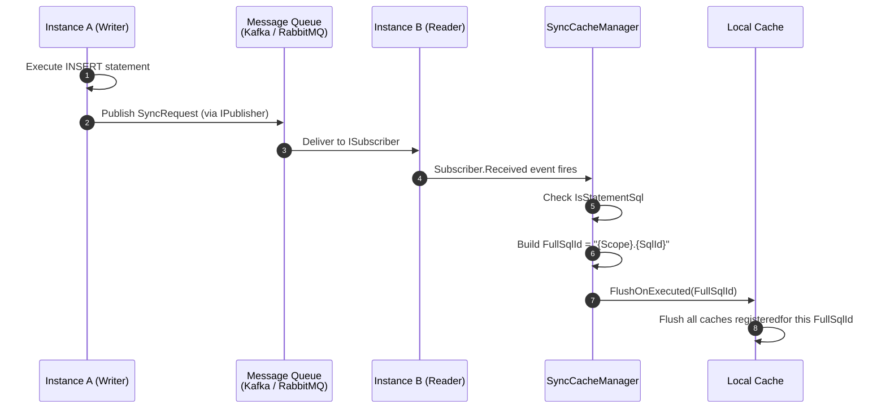
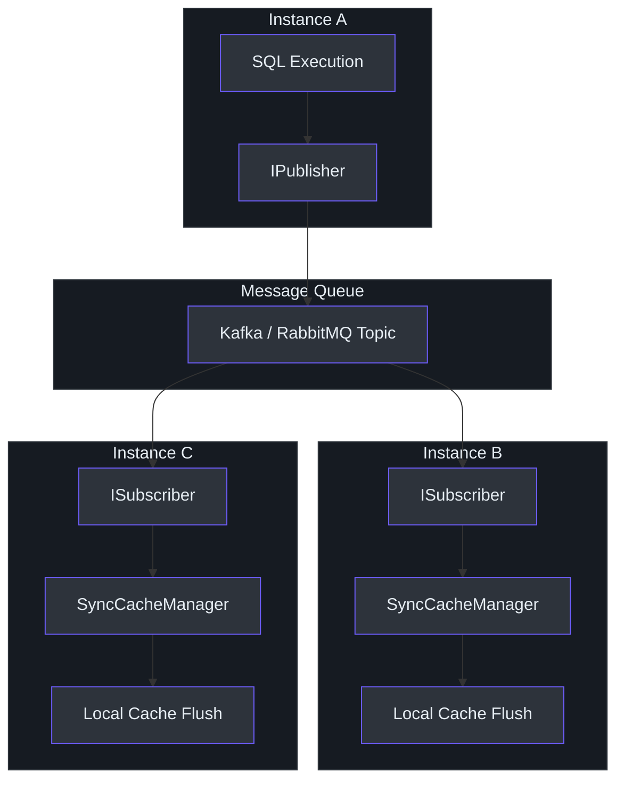
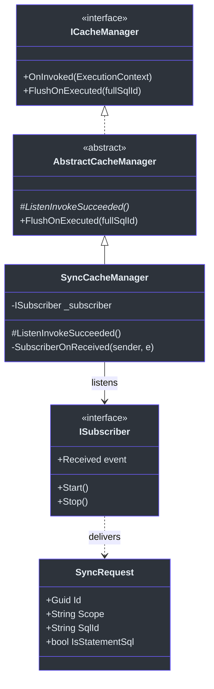

# Cache Synchronization

In a multi-instance deployment, each application instance maintains its own local cache. When one instance performs a write operation (INSERT, UPDATE, DELETE), other instances' caches become stale. The `SmartSql.Cache.Sync` package solves this by listening to message queue events published by the [InvokeSync](./invoke-sync.md) extension and flushing local caches when data-changing SQL statements are executed on other instances.

## At a Glance

| Feature | Description |
|---------|-------------|
| Package | `SmartSql.Cache.Sync` |
| Key Class | `SyncCacheManager` |
| Extends | `AbstractCacheManager` |
| Depends On | `SmartSql.InvokeSync` (`ISubscriber`) |
| Mechanism | Subscribes to `ISubscriber.Received` event, flushes matching caches |

## How It Works

The `SyncCacheManager` extends the standard `AbstractCacheManager` and overrides `ListenInvokeSucceeded()` to subscribe to message queue events instead of (or in addition to) local invocation events:



<!-- Sources: src/SmartSql.Cache.Sync/SyncCacheManager.cs:9, src/SmartSql.Cache.Sync/SyncCacheManager.cs:22 -->

## Architecture



<!-- Sources: src/SmartSql.Cache.Sync/SyncCacheManager.cs:9 -->

## Class Relationships



<!-- Sources: src/SmartSql.Cache.Sync/SyncCacheManager.cs:8, src/SmartSql.InvokeSync/ISubscriber.cs:6, src/SmartSql.InvokeSync/SyncRequest.cs:9 -->

## SyncCacheManager Internals

The implementation is concise. The `SyncCacheManager` overrides the `ListenInvokeSucceeded()` hook from `AbstractCacheManager`:

```csharp
protected override void ListenInvokeSucceeded()
{
    _subscriber.Received += SubscriberOnReceived;
}

private void SubscriberOnReceived(object sender, SyncRequest e)
{
    if (!e.IsStatementSql)
    {
        return;
    }
    FlushOnExecuted($"{e.Scope}.{e.SqlId}");
}
```

The key behaviors:
1. Only processes requests where `IsStatementSql == true` (skips non-SQL operations).
2. Constructs the `FullSqlId` from `Scope` and `SqlId` of the `SyncRequest`.
3. Calls `FlushOnExecuted()` which triggers all cache flush handlers registered for that statement.

## Setup

### Registration

```csharp
services
    .AddSmartSql("SmartSql")
    .AddInvokeSync(options =>
    {
        options.StatementType = StatementType.Write;
    })
    .AddKafkaPublisher(options =>
    {
        options.Servers = "localhost:9092";
        options.Topic = "smartsql-sync";
    })
    .AddKafkaSubscriber(options =>
    {
        options.Servers = "localhost:9092";
        options.Topic = "smartsql-sync";
    });

// In Configure():
app.ApplicationServices.UseSmartSqlSync();
app.ApplicationServices.UseSmartSqlSubscriber(syncRequest => { });
```

### Replacing the Default CacheManager

To use `SyncCacheManager` instead of the default cache manager, inject the `ISubscriber` and create it manually:

```csharp
var subscriber = sp.GetRequiredService<ISubscriber>();
builder.UseCacheManager(new SyncCacheManager(subscriber));
```

## SyncRequest Structure

The `SyncRequest` object carries all information about the SQL operation that triggered the sync:

| Property | Type | Description |
|---|---|---|
| `Id` | `Guid` | Unique request identifier |
| `Scope` | `string` | XML SqlMap scope (e.g., "User") |
| `SqlId` | `string` | Statement ID (e.g., "Insert", "Update") |
| `IsStatementSql` | `bool` | Whether this is a real SQL statement |
| `StatementType` | `StatementType?` | Select, Insert, Update, Delete |
| `Parameters` | `IDictionary<string, object>` | SQL parameters used |
| `Result` | `object` | Execution result |

## Cross-References

- **[InvokeSync & Messaging](./invoke-sync.md)** -- The publish side that creates `SyncRequest` messages.
- **[Redis Cache](./redis-cache.md)** -- Redis-backed caching that can be synchronized.
- **[DI Integration](./di-extension.md)** -- How to wire up `SyncCacheManager` in DI.

## References

- [SyncCacheManager.cs](https://github.com/dotnetcore/SmartSql/blob/master/src/SmartSql.Cache.Sync/SyncCacheManager.cs) -- Full implementation
- [AbstractCacheManager.cs](https://github.com/dotnetcore/SmartSql/blob/master/src/SmartSql/Cache/AbstractCacheManager.cs) -- Base class with FlushOnExecute support
- [ISubscriber.cs](https://github.com/dotnetcore/SmartSql/blob/master/src/SmartSql.InvokeSync/ISubscriber.cs) -- Subscriber interface consumed by SyncCacheManager
- [SyncRequest.cs](https://github.com/dotnetcore/SmartSql/blob/master/src/SmartSql.InvokeSync/SyncRequest.cs) -- Message payload structure
- [SmartSqlDIExtensions.cs](https://github.com/dotnetcore/SmartSql/blob/master/src/SmartSql.InvokeSync/SmartSqlDIExtensions.cs) -- DI registration for sync and subscriber
