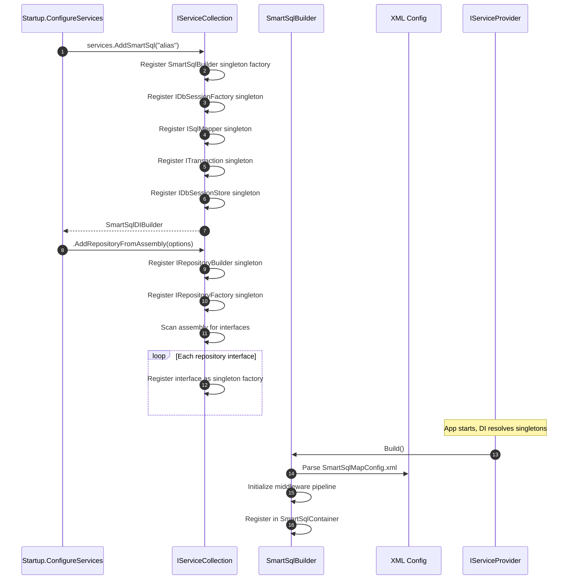
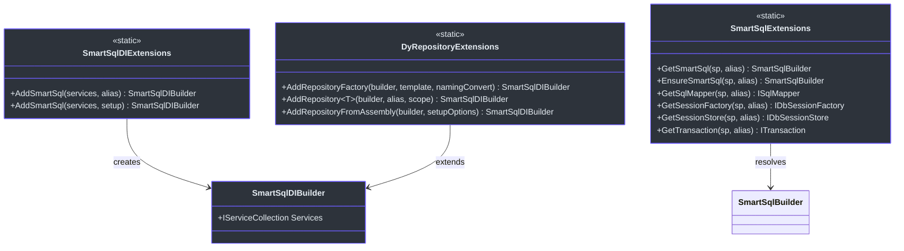
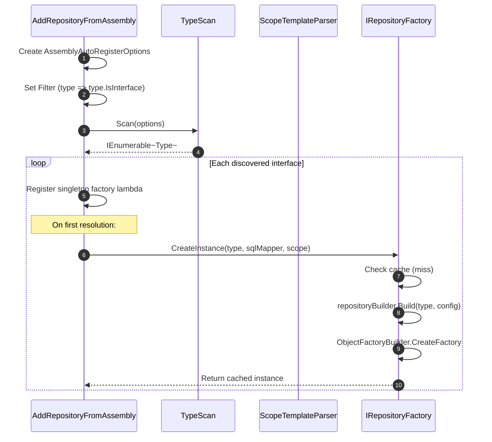
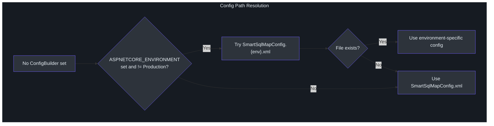

# DI Integration

The `SmartSql.DIExtension` package provides seamless integration with the ASP.NET Core dependency injection container. It registers `SmartSqlBuilder`, `ISqlMapper`, `IDbSessionFactory`, and dynamic repository proxies as singleton services, so your controllers and services can receive them through constructor injection without manual wiring.

## At a Glance

| Feature | Description |
|---------|-------------|
| Package | `SmartSql.DIExtension` |
| Entry Point | `services.AddSmartSql()` |
| Instance Lookup | By `Alias` (default: `"SmartSql"`) |
| Repository Registration | Single `AddRepository<T>()` or assembly scan via `AddRepositoryFromAssembly()` |
| Auto Config Resolution | Resolves `SmartSqlMapConfig.xml` or environment-specific variant |
| Required Framework | ASP.NET Core 2.0+ / Microsoft.Extensions.DependencyInjection |

## Registration Flow

When `services.AddSmartSql()` is called, the following sequence occurs:



<!-- Sources: src/SmartSql.DIExtension/SmartSqlDIExtensions.cs:16, src/SmartSql.DIExtension/DyRepositoryExtensions.cs:65 -->

## Service Registration Details

The `AddSmartSql()` extension method registers these core services as singletons:

| Service Type | Resolution |
|---|---|
| `SmartSqlBuilder` | Factory lambda, built once, shared |
| `ISqlMapper` | `builder.SqlMapper` |
| `IDbSessionFactory` | `builder.DbSessionFactory` |
| `ITransaction` | `builder.SqlMapper` (same instance) |
| `IDbSessionStore` | `builder.SmartSqlConfig.SessionStore` |



<!-- Sources: src/SmartSql.DIExtension/SmartSqlDIBuilder.cs:9, src/SmartSql.DIExtension/SmartSqlExtensions.cs:12, src/SmartSql.DIExtension/DyRepositoryExtensions.cs:11 -->

## Named Instance Support

SmartSql supports multiple named instances, each identified by an `Alias`. This is useful when your application connects to multiple databases:

```csharp
// Register first instance (default alias "SmartSql")
services.AddSmartSql("MasterDb");

// Register second instance
services.AddSmartSql("SlaveDb");

// Resolve by alias
var masterMapper = sp.GetSqlMapper("MasterDb");
var slaveMapper = sp.GetSqlMapper("SlaveDb");
```

## Repository Registration

### Register a Single Repository

```csharp
services.AddSmartSql("MyDb")
    .AddRepository<IUserRepository>("MyDb");
```

### Register All Repositories from an Assembly

The `AddRepositoryFromAssembly` method scans assemblies for interfaces and registers them as dynamic repository singletons:



<!-- Sources: src/SmartSql.DIExtension/DyRepositoryExtensions.cs:65, src/SmartSql.DyRepository/RepositoryFactory.cs:24 -->

The `AssemblyAutoRegisterOptions` class controls scanning behavior:

| Property | Type | Default | Description |
|---|---|---|---|
| `SmartSqlAlias` | `string` | `"SmartSql"` | Which SmartSql instance to bind to |
| `ScopeTemplate` | `string` | `"I{Scope}Repository"` | Template to extract scope from type name |
| `AssemblyString` | `string` | -- | Assembly name to scan |
| `Filter` | `Func<Type, bool>` | `type.IsInterface` | Additional type filter |

## Auto Config Path Resolution

When no explicit configuration is provided, `AddSmartSql()` auto-resolves the XML config path:



<!-- Sources: src/SmartSql.DIExtension/SmartSqlDIExtensions.cs:53 -->

## Complete Example

From the sample ASP.NET Core application:

```csharp
public class Startup
{
    public IServiceProvider ConfigureServices(IServiceCollection services)
    {
        services.AddControllers();
        services
            .AddSmartSql((sp, builder) =>
            {
                builder.UseProperties(Configuration);
            })
            .AddRepositoryFromAssembly(o =>
            {
                o.AssemblyString = "SmartSql.Sample.AspNetCore";
                o.Filter = (type) =>
                    type.Namespace == "SmartSql.Sample.AspNetCore.DyRepositories";
            });

        services.AddSingleton<UserService>();
        return services.BuildAspectInjectorProvider();
    }
}
```

## API Reference

### SmartSqlDIExtensions

| Method | Return | Description |
|---|---|---|
| `AddSmartSql(services, alias)` | `SmartSqlDIBuilder` | Register with default config path |
| `AddSmartSql(services, setup)` | `SmartSqlDIBuilder` | Register with custom builder configuration |
| `AddSmartSql(services, Func<ISP, SmartSqlBuilder>)` | `SmartSqlDIBuilder` | Register with full factory control |

### DyRepositoryExtensions

| Method | Return | Description |
|---|---|---|
| `AddRepositoryFactory(builder)` | `SmartSqlDIBuilder` | Register `IRepositoryBuilder` and `IRepositoryFactory` |
| `AddRepository<T>(builder, alias, scope)` | `SmartSqlDIBuilder` | Register a single repository interface |
| `AddRepositoryFromAssembly(builder, options)` | `SmartSqlDIBuilder` | Bulk-register repositories from assembly scan |

### SmartSqlExtensions

| Method | Return | Description |
|---|---|---|
| `GetSmartSql(sp, alias)` | `SmartSqlBuilder` | Resolve by alias (nullable) |
| `EnsureSmartSql(sp, alias)` | `SmartSqlBuilder` | Resolve by alias (throws if missing) |
| `GetSqlMapper(sp, alias)` | `ISqlMapper` | Get mapper for alias |
| `GetSessionFactory(sp, alias)` | `IDbSessionFactory` | Get session factory for alias |
| `GetSessionStore(sp, alias)` | `IDbSessionStore` | Get session store for alias |

## Cross-References

- **[Dynamic Repository](./dy-repository.md)** -- Details on how the generated proxies work internally.
- **[Options Pattern](./options.md)** -- Use `IOptions<SmartSqlConfigOptions>` instead of XML config.
- **[AOP Transactions](./aop.md)** -- Add `[Transaction]` to service methods via AspectCore integration.
- **[InvokeSync](./invoke-sync.md)** -- Register message queue publishers/subscribers alongside SmartSql.

## References

- [SmartSqlDIExtensions.cs](https://github.com/dotnetcore/SmartSql/blob/master/src/SmartSql.DIExtension/SmartSqlDIExtensions.cs) -- Core DI registration
- [DyRepositoryExtensions.cs](https://github.com/dotnetcore/SmartSql/blob/master/src/SmartSql.DIExtension/DyRepositoryExtensions.cs) -- Repository DI registration
- [SmartSqlDIBuilder.cs](https://github.com/dotnetcore/SmartSql/blob/master/src/SmartSql.DIExtension/SmartSqlDIBuilder.cs) -- Fluent builder returned by AddSmartSql
- [SmartSqlExtensions.cs](https://github.com/dotnetcore/SmartSql/blob/master/src/SmartSql.DIExtension/SmartSqlExtensions.cs) -- Service resolution helpers
- [AssemblyAutoRegisterOptions.cs](https://github.com/dotnetcore/SmartSql/blob/master/src/SmartSql.DIExtension/AssemblyAutoRegisterOptions.cs) -- Assembly scanning options
- [SmartSqlBuilderExtensions.cs](https://github.com/dotnetcore/SmartSql/blob/master/src/SmartSql.DIExtension/SmartSqlBuilderExtensions.cs) -- IConfiguration integration
- [Startup.cs](https://github.com/dotnetcore/SmartSql/blob/master/sample/SmartSql.Sample.AspNetCore/Startup.cs) -- Full sample application
