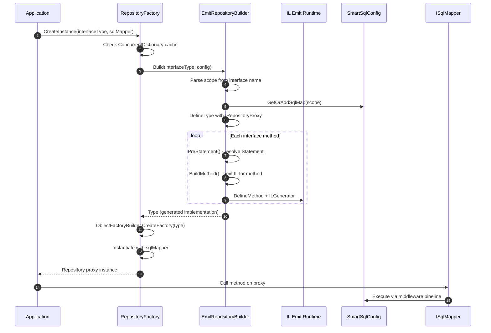
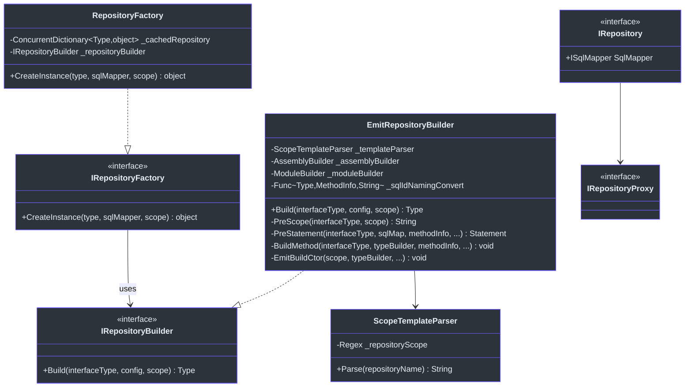
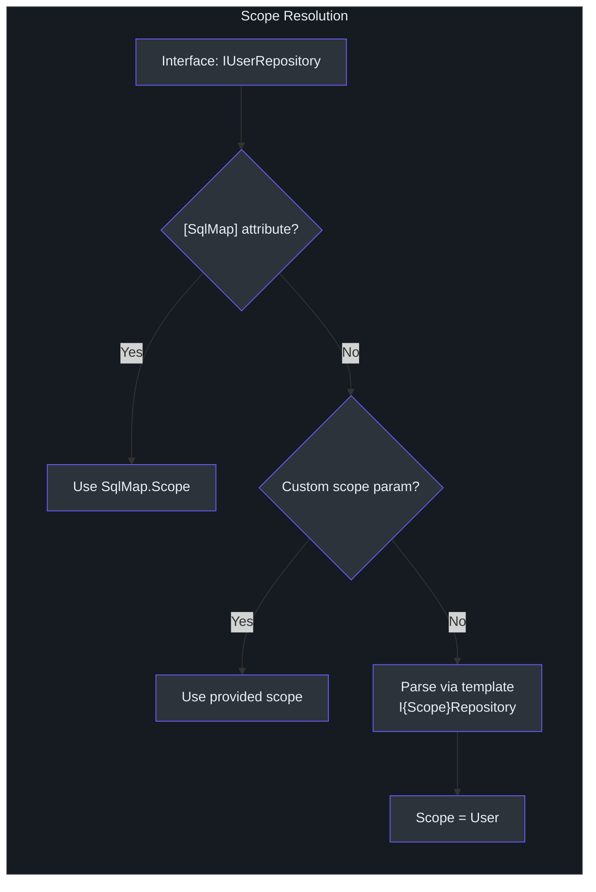
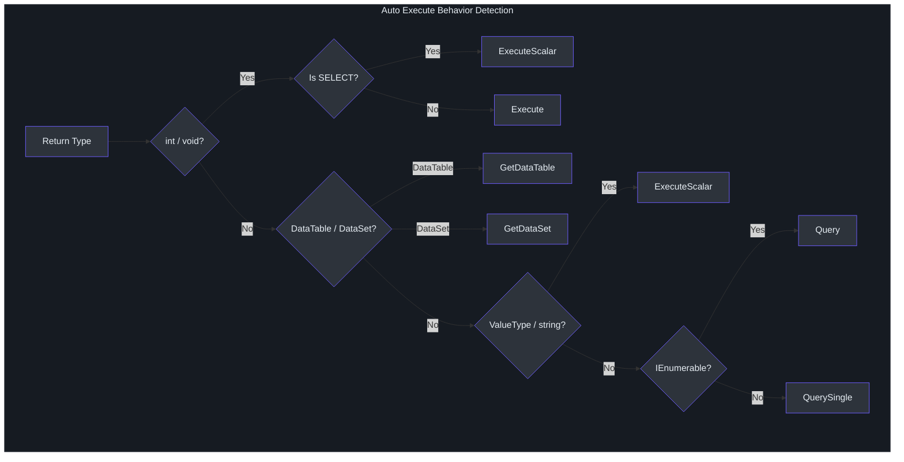

# Dynamic Repository

Writing repetitive CRUD repository classes is one of the most tedious parts of data access code. The `SmartSql.DyRepository` extension eliminates this entirely: you define a C# interface, and SmartSql generates a fully-functional implementation at runtime using IL emit. The generated proxy maps each method to a SQL statement in your XML configuration by naming convention, and supports annotations for fine-grained control over execution behavior, parameters, caching, and transactions.

## At a Glance

| Feature | Description |
|---------|-------------|
| Proxy Generation | Runtime IL emit via `EmitRepositoryBuilder` |
| Scope Resolution | Interface name parsed by `ScopeTemplateParser` (default: `I{Scope}Repository`) |
| Statement Mapping | Method name maps to `Statement.Id` in XML config |
| Execute Behavior | Auto-detected from return type or specified via `[Statement]` |
| Parameters | Single complex object or multiple params with `[Param]` |
| Transactions | `[UseTransaction]` attribute for DyRepository interfaces |
| Caching | `[Cache]` on interface, `[ResultCache]` on methods |
| Sync/Async | Both sync and `Task`-based async methods supported |

## How It Works

When you request a repository instance from `RepositoryFactory`, the following sequence occurs:



<!-- Sources: src/SmartSql.DyRepository/RepositoryFactory.cs:24, src/SmartSql.DyRepository/EmitRepositoryBuilder.cs:703 -->

## Class Hierarchy

The following diagram shows the key types involved in repository proxy generation:



<!-- Sources: src/SmartSql.DyRepository/IRepositoryFactory.cs:7, src/SmartSql.DyRepository/IRepositoryBuilder.cs:7, src/SmartSql.DyRepository/RepositoryFactory.cs:8, src/SmartSql.DyRepository/EmitRepositoryBuilder.cs:21, src/SmartSql.DyRepository/IRepository.cs:9 -->

## Scope Resolution

The `ScopeTemplateParser` resolves the XML `SqlMap.Scope` from the repository interface name. The default template is `I{Scope}Repository`:

- Interface `IUserRepository` resolves to scope `User`
- Interface `IOrderDetailRepository` resolves to scope `OrderDetail`

You can customize the template via the `[SqlMap]` attribute or by passing a custom template to `EmitRepositoryBuilder`.



<!-- Sources: src/SmartSql.DyRepository/ScopeTemplateParser.cs:10, src/SmartSql.DyRepository/EmitRepositoryBuilder.cs:264, src/SmartSql.DyRepository/Annotations/SqlMapAttribute.cs:6 -->

## Naming Conventions

By default, the method name on the repository interface maps directly to the `Statement.Id` in the XML configuration. For async methods, the `Async` suffix is stripped before lookup:

| Interface Method | Statement Id |
|---|---|
| `Insert(entity)` | `Insert` |
| `GetById(id)` | `GetEntity` (via `[Statement]`) |
| `QueryAsync(params)` | `Query` |
| `DeleteByIdAsync(id)` | `Delete` (via `[Statement]`) |

You can also provide a custom `sqlIdNamingConvert` function to transform method names programmatically.

## Execute Behavior

When `ExecuteBehavior` is `Auto` (the default), the system infers the correct execution strategy from the return type:

| Return Type | Execute Behavior |
|---|---|
| `int` / `void` / `Task<int>` / `Task` | `Execute` (affected row count) |
| `int` on SELECT statement | `ExecuteScalar` (first row, first column) |
| Value types / `string` | `ExecuteScalar` |
| `IEnumerable<T>` / `IList<T>` | `Query` |
| Single entity | `QuerySingle` |
| `ValueTuple` | `QuerySingle` |
| `DataTable` | `GetDataTable` |
| `DataSet` | `GetDataSet` |



<!-- Sources: src/SmartSql.DyRepository/EmitRepositoryBuilder.cs:365, src/SmartSql.DyRepository/Annotations/StatementAttribute.cs:40 -->

## Annotations

### `[SqlMap]` -- Interface-Level

Applied to the repository interface to override the scope resolution:

```csharp
[SqlMap(Scope = "CustomScope")]
public interface IMyRepository
{
    // Maps to XML statement: CustomScope.Query
    IList<MyEntity> Query(object reqParams);
}
```

### `[Statement]` -- Method-Level

Overrides the default statement mapping behavior:

| Property | Type | Description |
|---|---|---|
| `Id` | `string` | Custom statement ID (defaults to method name) |
| `Sql` | `string` | Inline SQL (bypasses XML lookup) |
| `Execute` | `ExecuteBehavior` | Override auto-detection |
| `CommandType` | `CommandType` | `Text` or `StoredProcedure` |
| `SourceChoice` | `DataSourceChoice` | Force read or write data source |
| `ReadDb` | `string` | Specific read database name |
| `CommandTimeout` | `int` | Custom command timeout |
| `EnablePropertyChangedTrack` | `bool` | Enable property change tracking |

### `[Param]` -- Parameter-Level

Maps method parameters to SQL parameter names:

```csharp
[Statement(Id = "Delete")]
int DeleteById([Param("Id")] long id);
```

| Property | Type | Description |
|---|---|---|
| `Name` | `string` | The SQL parameter name |
| `TypeHandler` | `string` | Named type handler to use |

### `[UseTransaction]` -- Method-Level

Wraps the method call in a database transaction. Preferred over `[Transaction]` for DyRepository interfaces:

```csharp
[UseTransaction(Level = IsolationLevel.ReadCommitted)]
[Statement(Id = "Insert")]
long InsertWithTx(AllPrimitive entity);
```

### `[Cache]` -- Interface-Level

Defines a cache configuration on the repository interface:

```csharp
[Cache(Id = "AllPrimitives", Type = "LRU", CacheSize = 50, FlushInterval = 60)]
public interface IAllPrimitiveRepository { ... }
```

### `[ResultCache]` -- Method-Level

Associates a method's result with a cache defined by `[Cache]`:

```csharp
[ResultCache("AllPrimitives", Key = "QueryByPage:{PageSize}:{Page}")]
IList<AllPrimitive> QueryByPage(object reqParams);
```

## Built-in CRUD Interfaces

The `SmartSql.DyRepository.CURD` namespace provides pre-built generic interfaces that automatically map to standard CUD operations:

```mermaid
classDiagram
    class IRepository {
        <<interface>>
        +ISqlMapper SqlMapper
    }
    class IRepository~TEntity,TPrimary~ {
        <<interface>>
    }
    class IInsert~TEntity~ {
        <<interface>>
        +Insert(entity) int
    }
    class IUpdate~TEntity~ {
        <<interface>>
        +Update(entity) int
        +DyUpdate(dyObj) int
    }
    class IDelete~TPrimary~ {
        <<interface>>
        +Delete(reqParams) int
        +DeleteById(id) int
    }
    class IGetEntity~TEntity,TPrimary~ {
        <<interface>>
        +GetEntity(reqParams) TEntity
        +GetById(id) TEntity
    }
    class IQuery~TEntity~ {
        <<interface>>
        +Query(reqParams) IList~TEntity~
    }
    class IQueryByPage~TEntity~ {
        <<interface>>
        +QueryByPage(reqParams) IList~TEntity~
    }
    class IIsExist {
        <<interface>>
    }

    IRepository~TEntity,TPrimary~ --|> IRepository
    IRepository~TEntity,TPrimary~ --|> IInsert
    IRepository~TEntity,TPrimary~ --|> IUpdate
    IRepository~TEntity,TPrimary~ --|> IDelete
    IRepository~TEntity,TPrimary~ --|> IGetEntity
    IRepository~TEntity,TPrimary~ --|> IQuery
    IRepository~TEntity,TPrimary~ --|> IQueryByPage
    IRepository~TEntity,TPrimary~ --|> IIsExist

    style IRepository fill:#2d333b,stroke:#6d5dfc,color:#e6edf3
    style IRepository fill:#2d333b,stroke:#6d5dfc,color:#e6edf3
    style IInsert fill:#2d333b,stroke:#6d5dfc,color:#e6edf3
    style IUpdate fill:#2d333b,stroke:#6d5dfc,color:#e6edf3
    style IDelete fill:#2d333b,stroke:#6d5dfc,color:#e6edf3
    style IGetEntity fill:#2d333b,stroke:#6d5dfc,color:#e6edf3
    style IQuery fill:#2d333b,stroke:#6d5dfc,color:#e6edf3
    style IQueryByPage fill:#2d333b,stroke:#6d5dfc,color:#e6edf3
    style IIsExist fill:#2d333b,stroke:#6d5dfc,color:#e6edf3
```



<!-- Sources: src/SmartSql.DyRepository/IRepository.cs:18, src/SmartSql.DyRepository/CURD/IInsert.cs:8, src/SmartSql.DyRepository/CURD/IUpdate.cs:9, src/SmartSql.DyRepository/CURD/IDelete.cs:9, src/SmartSql.DyRepository/CURD/IGetEntity.cs:9, src/SmartSql.DyRepository/CURD/IQuery.cs:9, src/SmartSql.DyRepository/CURD/IQueryByPage.cs:9 -->

## Examples

### Basic Repository

From the test suite:

```csharp
public interface IAllPrimitiveRepository
{
    [Statement(Id = "QueryByTaken", Sql = "SELECT T.* From T_AllPrimitive T limit ?Taken")]
    IList<AllPrimitive> Query([Param("Taken")] int taken);

    long Insert(AllPrimitive entity);

    [UseTransaction]
    [Statement(Id = "Insert")]
    long InsertByAnnotationTransaction(AllPrimitive entity);

    [Statement(Sql = "SELECT NumericalEnum FROM T_AllPrimitive WHERE NumericalEnum = ?numericalEnum")]
    List<NumericalEnum11> GetNumericalEnums(int numericalEnum);

    [Statement(Sql = "truncate table T_AllPrimitive")]
    void Truncate();
}
```

### StoredProcedure Repository

```csharp
public interface IUserRepository
{
    long Insert(User user);
    IEnumerable<User> Query();

    [Statement(CommandType = CommandType.StoredProcedure, Sql = "SP_Query")]
    IEnumerable<AllPrimitive> SP_Query(SqlParameterCollection sqlParameterCollection);
}
```

### Manual Transaction Wrapping

The `RepositoryExtensions` class provides `TransactionWrap` and `TransactionWrapAsync` extension methods:

```csharp
repository.TransactionWrap(() =>
{
    repository.Insert(entity1);
    repository.Update(entity2);
});
```

## Cross-References

- **[DI Integration](./di-extension.md)** -- Use `AddRepositoryFromAssembly()` to auto-register repository interfaces.
- **[AOP Transactions](./aop.md)** -- For service-layer transaction management using AspectCore.
- **[Configuration](../guide/configuration.md)** -- Define the XML `Statement` elements that repository methods map to.

## References

- [EmitRepositoryBuilder.cs](https://github.com/dotnetcore/SmartSql/blob/master/src/SmartSql.DyRepository/EmitRepositoryBuilder.cs) -- IL emit proxy generation
- [RepositoryFactory.cs](https://github.com/dotnetcore/SmartSql/blob/master/src/SmartSql.DyRepository/RepositoryFactory.cs) -- Factory with cached instances
- [ScopeTemplateParser.cs](https://github.com/dotnetcore/SmartSql/blob/master/src/SmartSql.DyRepository/ScopeTemplateParser.cs) -- Regex-based scope parsing
- [IRepository.cs](https://github.com/dotnetcore/SmartSql/blob/master/src/SmartSql.DyRepository/IRepository.cs) -- Base repository interfaces
- [StatementAttribute.cs](https://github.com/dotnetcore/SmartSql/blob/master/src/SmartSql.DyRepository/Annotations/StatementAttribute.cs) -- Method-level annotation
- [UseTransactionAttribute.cs](https://github.com/dotnetcore/SmartSql/blob/master/src/SmartSql.DyRepository/Annotations/UseTransactionAttribute.cs) -- Transaction annotation
- [CacheAttribute.cs](https://github.com/dotnetcore/SmartSql/blob/master/src/SmartSql.DyRepository/Annotations/CacheAttribute.cs) -- Cache configuration annotation
- [IAllPrimitiveRepository.cs](https://github.com/dotnetcore/SmartSql/blob/master/src/SmartSql.Test/Repositories/IAllPrimitiveRepository.cs) -- Test repository example
- [IUserRepository.cs](https://github.com/dotnetcore/SmartSql/blob/master/src/SmartSql.Test/Repositories/IUserRepository.cs) -- Test repository example
