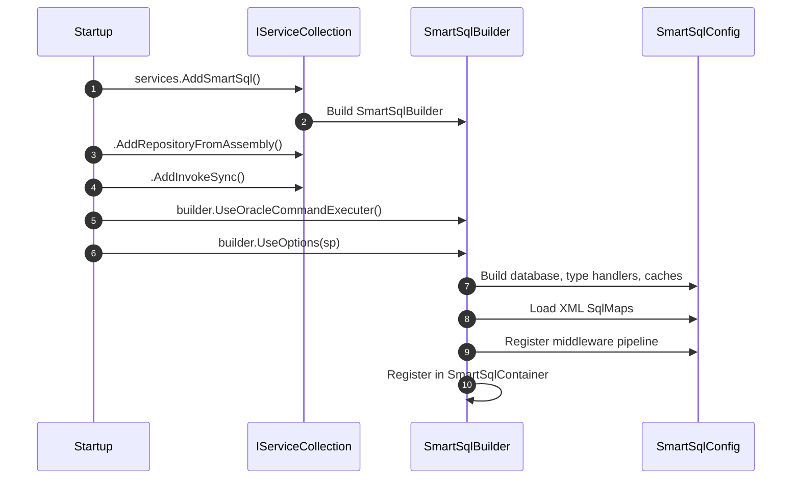
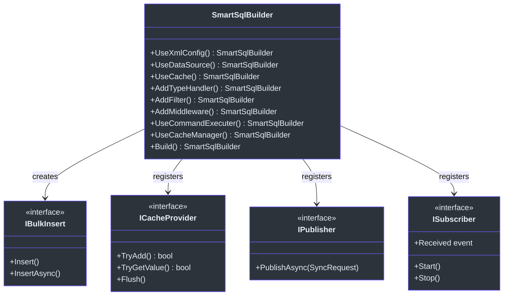

# Extensions Overview

SmartSql provides a modular extension system that allows you to add capabilities beyond the core ORM functionality. Each extension is distributed as a separate NuGet package, so you only pull in what your project actually needs. Extensions range from ASP.NET Core DI integration and dynamic repository proxies to bulk insert providers, distributed cache synchronization, and message-queue-based data replication.

## At a Glance

| Package | Purpose | Key File |
|---------|---------|----------|
| `SmartSql.DyRepository` | Dynamic repository proxy generation via IL emit | [EmitRepositoryBuilder.cs](https://github.com/dotnetcore/SmartSql/blob/master/src/SmartSql.DyRepository/EmitRepositoryBuilder.cs) |
| `SmartSql.DIExtension` | ASP.NET Core dependency injection integration | [SmartSqlDIExtensions.cs](https://github.com/dotnetcore/SmartSql/blob/master/src/SmartSql.DIExtension/SmartSqlDIExtensions.cs) |
| `SmartSql.Options` | Options-pattern configuration from `appsettings.json` | [SmartSqlConfigOptions.cs](https://github.com/dotnetcore/SmartSql/blob/master/src/SmartSql.Options/SmartSqlConfigOptions.cs) |
| `SmartSql.AOP` | AOP-based transaction management via AspectCore | [TransactionAttribute.cs](https://github.com/dotnetcore/SmartSql/blob/master/src/SmartSql.AOP/TransactionAttribute.cs) |
| `SmartSql.Bulk` | Bulk insert abstraction and base classes | [IBulkInsert.cs](https://github.com/dotnetcore/SmartSql/blob/master/src/SmartSql.Bulk/IBulkInsert.cs) |
| `SmartSql.Bulk.SqlServer` | SqlServer bulk insert via `SqlBulkCopy` | [BulkInsert.cs](https://github.com/dotnetcore/SmartSql/blob/master/src/SmartSql.Bulk.SqlServer/BulkInsert.cs) |
| `SmartSql.Bulk.MsSqlServer` | MsSqlServer bulk insert via `Microsoft.Data.SqlClient` | [BulkInsert.cs](https://github.com/dotnetcore/SmartSql/blob/master/src/SmartSql.Bulk.MsSqlServer/BulkInsert.cs) |
| `SmartSql.Bulk.MySql` | MySQL bulk insert via `MySqlBulkLoader` | [BulkInsert.cs](https://github.com/dotnetcore/SmartSql/blob/master/src/SmartSql.Bulk.MySql/BulkInsert.cs) |
| `SmartSql.Bulk.MySqlConnector` | MySQL bulk insert via MySqlConnector driver | [BulkInsert.cs](https://github.com/dotnetcore/SmartSql/blob/master/src/SmartSql.Bulk.MySqlConnector/BulkInsert.cs) |
| `SmartSql.Bulk.PostgreSql` | PostgreSQL bulk insert via `NpgsqlConnection.BeginBinaryImport` | [BulkInsert.cs](https://github.com/dotnetcore/SmartSql/blob/master/src/SmartSql.Bulk.PostgreSql/BulkInsert.cs) |
| `SmartSql.TypeHandler` | JSON, XML, and Crypto type handlers | [JsonTypeHandler.cs](https://github.com/dotnetcore/SmartSql/blob/master/src/SmartSql.TypeHandler/JsonTypeHandler.cs) |
| `SmartSql.TypeHandler.PostgreSql` | PostgreSQL-specific type handlers (arrays, geometric types) | [JsonTypeHandler.cs](https://github.com/dotnetcore/SmartSql/blob/master/src/SmartSql.TypeHandler.PostgreSql/JsonTypeHandler.cs) |
| `SmartSql.Cache.Redis` | Redis-backed cache provider | [RedisCacheProvider.cs](https://github.com/dotnetcore/SmartSql/blob/master/src/SmartSql.Cache.Redis/RedisCacheProvider.cs) |
| `SmartSql.Cache.Sync` | Distributed cache synchronization via pub/sub | [SyncCacheManager.cs](https://github.com/dotnetcore/SmartSql/blob/master/src/SmartSql.Cache.Sync/SyncCacheManager.cs) |
| `SmartSql.InvokeSync` | Data synchronization abstraction via message queues | [SyncService.cs](https://github.com/dotnetcore/SmartSql/blob/master/src/SmartSql.InvokeSync/SyncService.cs) |
| `SmartSql.InvokeSync.Kafka` | Kafka-based invoke synchronization | [KafkaPublisher.cs](https://github.com/dotnetcore/SmartSql/blob/master/src/SmartSql.InvokeSync.Kafka/KafkaPublisher.cs) |
| `SmartSql.InvokeSync.RabbitMQ` | RabbitMQ-based invoke synchronization | [RabbitMQPublisher.cs](https://github.com/dotnetcore/SmartSql/blob/master/src/SmartSql.InvokeSync.RabbitMQ/RabbitMQPublisher.cs) |
| `SmartSql.ScriptTag` | Script tag for JavaScript-based dynamic SQL conditions | [Script.cs](https://github.com/dotnetcore/SmartSql/blob/master/src/SmartSql.ScriptTag/Script.cs) |
| `SmartSql.Oracle` | Oracle DB provider support | [SmartSqlBuilderExtensions.cs](https://github.com/dotnetcore/SmartSql/blob/master/src/SmartSql.Oracle/SmartSqlBuilderExtensions.cs) |

## Extension Architecture

The following diagram shows how the extension packages relate to the SmartSql core library and to each other. The core (`SmartSql`) provides the fundamental abstractions, while extensions plug in at specific points.

```mermaid
graph TB
    subgraph Extensions["Extensions"]
        style Extensions fill:#161b22,stroke:#30363d,color:#e6edf3
        DyRepo["SmartSql.DyRepository"]
        DI["SmartSql.DIExtension"]
        Options["SmartSql.Options"]
        AOP["SmartSql.AOP"]
        Bulk["SmartSql.Bulk.*"]
        TypeH["SmartSql.TypeHandler"]
        TypeHPg["SmartSql.TypeHandler.PostgreSql"]
        CacheRedis["SmartSql.Cache.Redis"]
        CacheSync["SmartSql.Cache.Sync"]
        InvokeSync["SmartSql.InvokeSync"]
        InvKafka["SmartSql.InvokeSync.Kafka"]
        InvRabbit["SmartSql.InvokeSync.RabbitMQ"]
        ScriptTag["SmartSql.ScriptTag"]
        Oracle["SmartSql.Oracle"]
    end

    subgraph Core["SmartSql Core"]
        style Core fill:#161b22,stroke:#30363d,color:#e6edf3
        SmartSqlBuilder["SmartSqlBuilder"]
        SqlMapper["ISqlMapper"]
        Pipeline["Middleware Pipeline"]
        Cache["Cache System"]
        Config["SmartSqlConfig"]
    end

    DI --> DyRepo
    DI --> SmartSqlBuilder
    Options --> SmartSqlBuilder
    DyRepo --> SqlMapper
    AOP --> SmartSqlBuilder
    Bulk --> SqlMapper
    TypeH --> Config
    TypeHPg --> Config
    CacheRedis --> Cache
    CacheSync --> InvokeSync
    CacheSync --> Cache
    InvokeSync --> Pipeline
    InvKafka --> InvokeSync
    InvRabbit --> InvokeSync
    ScriptTag --> Config
    Oracle --> SmartSqlBuilder

    style DyRepo fill:#2d333b,stroke:#6d5dfc,color:#e6edf3
    style DI fill:#2d333b,stroke:#6d5dfc,color:#e6edf3
    style Options fill:#2d333b,stroke:#6d5dfc,color:#e6edf3
    style AOP fill:#2d333b,stroke:#6d5dfc,color:#e6edf3
    style Bulk fill:#2d333b,stroke:#6d5dfc,color:#e6edf3
    style TypeH fill:#2d333b,stroke:#6d5dfc,color:#e6edf3
    style TypeHPg fill:#2d333b,stroke:#6d5dfc,color:#e6edf3
    style CacheRedis fill:#2d333b,stroke:#6d5dfc,color:#e6edf3
    style CacheSync fill:#2d333b,stroke:#6d5dfc,color:#e6edf3
    style InvokeSync fill:#2d333b,stroke:#6d5dfc,color:#e6edf3
    style InvKafka fill:#2d333b,stroke:#6d5dfc,color:#e6edf3
    style InvRabbit fill:#2d333b,stroke:#6d5dfc,color:#e6edf3
    style ScriptTag fill:#2d333b,stroke:#6d5dfc,color:#e6edf3
    style Oracle fill:#2d333b,stroke:#6d5dfc,color:#e6edf3
    style SmartSqlBuilder fill:#2d333b,stroke:#6d5dfc,color:#e6edf3
    style SqlMapper fill:#2d333b,stroke:#6d5dfc,color:#e6edf3
    style Pipeline fill:#2d333b,stroke:#6d5dfc,color:#e6edf3
    style Cache fill:#2d333b,stroke:#6d5dfc,color:#e6edf3
    style Config fill:#2d333b,stroke:#6d5dfc,color:#e6edf3
```

<!-- Sources: src/SmartSql.DyRepository/EmitRepositoryBuilder.cs:1, src/SmartSql.DIExtension/SmartSqlDIExtensions.cs:1, src/SmartSql.Options/SmartSqlConfigOptions.cs:1, src/SmartSql.AOP/TransactionAttribute.cs:1, src/SmartSql.Bulk/IBulkInsert.cs:1 -->

## Extension Registration Lifecycle

The following sequence diagram illustrates how extensions register themselves during application startup:

<!-- Sources: src/SmartSql/SmartSqlBuilder.cs:1, src/SmartSql.DIExtension/SmartSqlDIExtensions.cs:19, src/SmartSql.Options/SmartSqlOptionsExtensions.cs:13 -->

## Extension Point Summary

<!-- Sources: src/SmartSql/SmartSqlBuilder.cs:1, src/SmartSql.Bulk/IBulkInsert.cs:8, src/SmartSql.Cache.Redis/RedisCacheProvider.cs:10, src/SmartSql.InvokeSync/IPublisher.cs:6 -->

## Extension Categories

### Data Access Extensions

These extensions enhance how SmartSql interacts with databases and maps data:

- **[Dynamic Repository](./dy-repository.md)** -- Eliminates boilerplate repository code by auto-generating implementations from interface definitions at runtime using IL emit.
- **[Bulk Insert](./bulk-insert.md)** -- High-performance bulk data loading using database-specific native APIs (SqlBulkCopy, MySqlBulkLoader, COPY BINARY).
- **[Type Handlers](./type-handlers.md)** -- Custom serialization for JSON, XML, cryptography, and PostgreSQL-specific types like arrays and geometric shapes.
- **[Oracle Support](./oracle.md)** -- Oracle-specific command executer configuration for `OracleCommand` compatibility.

### Configuration & DI Extensions

These extensions integrate SmartSql with the ASP.NET Core ecosystem:

- **[DI Integration](./di-extension.md)** -- Registers `SmartSqlBuilder`, `ISqlMapper`, and dynamic repositories into the ASP.NET Core service container.
- **[Options Pattern](./options.md)** -- Configures SmartSql entirely from `appsettings.json` using `IOptions<SmartSqlConfigOptions>`.
- **[AOP Transactions](./aop.md)** -- Declarative transaction management via AspectCore `[Transaction]` interceptor attributes.

### Caching & Synchronization Extensions

These extensions extend SmartSql's caching capabilities to distributed environments:

- **[Redis Cache](./redis-cache.md)** -- Stores query result caches in Redis for shared caching across multiple application instances.
- **[Cache Sync](./cache-sync.md)** -- Listens to message queue events to flush local caches when data changes on other instances.

### Data Synchronization Extensions

These extensions replicate SQL operations to other systems via message queues:

- **[InvokeSync & Messaging](./invoke-sync.md)** -- Publishes SQL invocation events to Kafka or RabbitMQ for downstream consumers.

### Dynamic SQL Extensions

- **[Script Tag](./script-tag.md)** -- Enables JavaScript-based expressions in XML SQL maps for complex conditional logic.

## Cross-References

- See [Middleware Pipeline](../architecture/middleware-pipeline.md) for how extensions plug into the SQL execution flow.
- See [Configuration](../guide/configuration.md) for XML-based configuration that complements Options pattern.
- See [Caching](../architecture/caching.md) for the core cache abstractions that Redis and Cache Sync build upon.

## References

- [SmartSql.csproj solution structure](https://github.com/dotnetcore/SmartSql/blob/master/SmartSql.sln)
- [SmartSqlBuilder.cs](https://github.com/dotnetcore/SmartSql/blob/master/src/SmartSql/SmartSqlBuilder.cs) -- Central builder that extensions register into
- [SmartSqlConfig.cs](https://github.com/dotnetcore/SmartSql/blob/master/src/SmartSql/Configuration/SmartSqlConfig.cs) -- Configuration object that holds all extension registrations
