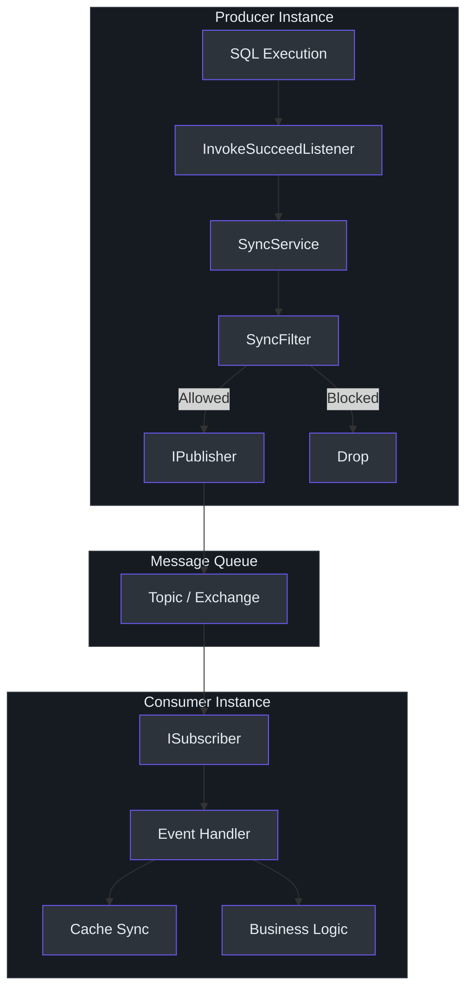
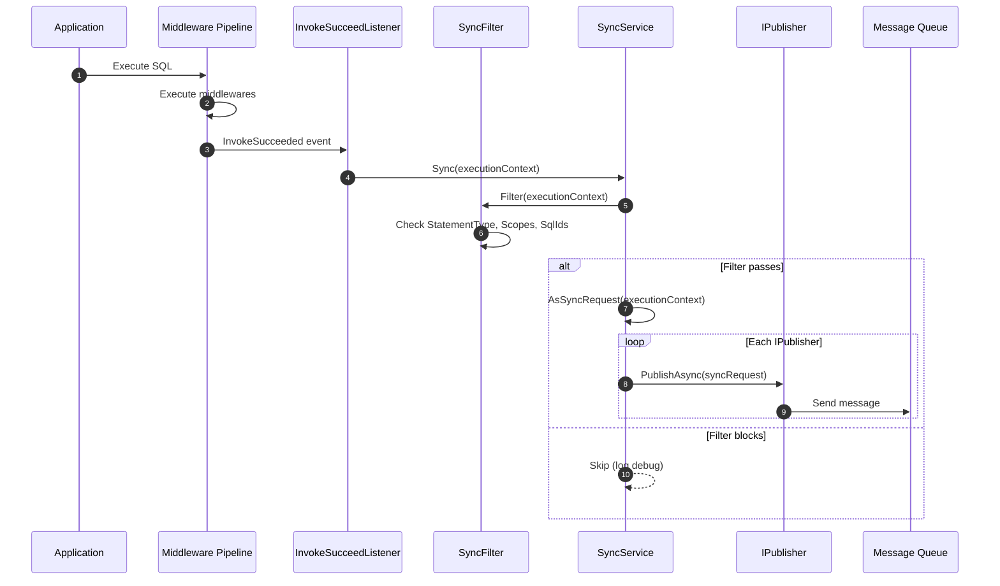
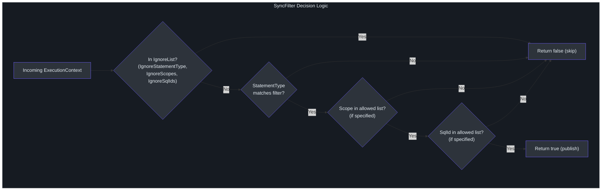
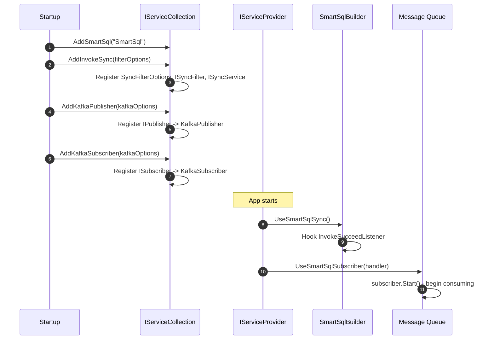

# InvokeSync & Messaging

Modern distributed systems often need to replicate database changes to other services, search indexes, or data warehouses. The `SmartSql.InvokeSync` package provides a framework for publishing SQL invocation events to message queues, enabling downstream consumers to react to data changes. With companion packages for Kafka and RabbitMQ, you can plug into either messaging infrastructure with minimal configuration.

## At a Glance

| Package | Purpose |
|---|---|
| `SmartSql.InvokeSync` | Core abstraction: `IPublisher`, `ISubscriber`, `ISyncService`, `ISyncFilter` |
| `SmartSql.InvokeSync.Kafka` | Kafka-backed publisher and subscriber |
| `SmartSql.InvokeSync.RabbitMQ` | RabbitMQ-backed publisher and subscriber |

## Architecture



<!-- Sources: src/SmartSql.InvokeSync/SyncService.cs:8, src/SmartSql.InvokeSync/IPublisher.cs:6, src/SmartSql.InvokeSync/ISubscriber.cs:6 -->

## Sync Flow Sequence



<!-- Sources: src/SmartSql.InvokeSync/SyncService.cs:23, src/SmartSql.InvokeSync/SyncFilter.cs:16, src/SmartSql.InvokeSync/SmartSqlDIExtensions.cs:22 -->

## Core Interfaces

### IPublisher

Publishes `SyncRequest` messages to a message queue:

| Member | Type | Description |
|---|---|---|
| `PublishAsync(SyncRequest)` | `Task` | Send a sync request to the queue |
| `Dispose()` | `void` | Clean up connections |

### ISubscriber

Receives `SyncRequest` messages from a message queue:

| Member | Type | Description |
|---|---|---|
| `Received` | `event EventHandler<SyncRequest>` | Fired when a message arrives |
| `Start()` | `void` | Begin consuming messages |
| `Stop()` | `void` | Stop consuming messages |

### ISyncService

Orchestrates the sync process by applying filters and publishing:

| Member | Type | Description |
|---|---|---|
| `Sync(ExecutionContext)` | `Task` | Filter and publish the execution context |

### ISyncFilter

Determines whether a given execution should be published:

| Member | Type | Description |
|---|---|---|
| `Filter(ExecutionContext)` | `bool` | Returns true if the execution should be synced |

## SyncFilter Configuration

The `SyncFilter` applies a multi-layer filter to determine which SQL executions should be published:



<!-- Sources: src/SmartSql.InvokeSync/SyncFilter.cs:16, src/SmartSql.InvokeSync/SyncFilterOptions.cs:7 -->

### SyncFilterOptions

| Property | Type | Default | Description |
|---|---|---|---|
| `StatementType` | `StatementType` | `Write` | Which statement types to sync |
| `Scopes` | `IEnumerable<string>` | null | Whitelist of scopes (null = all) |
| `SqlIds` | `IEnumerable<string>` | null | Whitelist of SQL IDs |
| `FullSqlIds` | `IEnumerable<string>` | null | Whitelist of full SQL IDs (Scope.SqlId) |
| `IgnoreStatementType` | `StatementType?` | null | Statement types to exclude |
| `IgnoreScopes` | `IEnumerable<string>` | null | Scopes to exclude |
| `IgnoreSqlIds` | `IEnumerable<string>` | null | SQL IDs to exclude |
| `IgnoreFullSqlIds` | `IEnumerable<string>` | null | Full SQL IDs to exclude |

## Kafka Implementation

### KafkaOptions

| Property | Type | Default | Description |
|---|---|---|---|
| `Servers` | `string` | -- | Kafka broker addresses |
| `Topic` | `string` | -- | Kafka topic name |
| `Config` | `IDictionary<string, string>` | empty | Additional Confluent.Kafka config |

### Registration

```csharp
services
    .AddSmartSql("SmartSql")
    .AddInvokeSync(options =>
    {
        options.StatementType = StatementType.Write;
    })
    .AddKafkaPublisher(options =>
    {
        options.Servers = "localhost:9092";
        options.Topic = "smartsql-sync";
    })
    .AddKafkaSubscriber(options =>
    {
        options.Servers = "localhost:9092";
        options.Topic = "smartsql-sync";
    });
```

The Kafka publisher uses `IProducer<string, string>` from Confluent.Kafka. Messages are keyed by `{Scope}.{SqlId}` for partitioning locality.

## RabbitMQ Implementation

### RabbitMQOptions

| Property | Type | Default | Description |
|---|---|---|---|
| `HostName` | `string` | `"localhost"` | RabbitMQ host |
| `VirtualHost` | `string` | `"/"` | Virtual host |
| `UserName` | `string` | -- | Authentication username |
| `Password` | `string` | -- | Authentication password |
| `Exchange` | `string` | `"smartsql"` | Exchange name |
| `ExchangeType` | `string` | `"direct"` | Exchange type |
| `RoutingKey` | `string` | `"sync"` | Routing key |
| `RequestedHeartbeat` | `ushort` | `60` | Heartbeat interval |
| `AutomaticRecoveryEnabled` | `bool` | `true` | Auto-reconnect |

### Registration

```csharp
services
    .AddSmartSql("SmartSql")
    .AddInvokeSync(options => { })
    .AddRabbitMQPublisher(options =>
    {
        options.HostName = "localhost";
        options.UserName = "guest";
        options.Password = "guest";
        options.Exchange = "smartsql";
        options.RoutingKey = "smartsql.sync";
    })
    .AddRabbitMQSubscriber(options =>
    {
        options.HostName = "localhost";
        options.Exchange = "smartsql";
        options.RoutingKey = "smartsql.sync";
    });
```

## Wiring It Up

The following sequence shows the full startup flow including publisher and subscriber registration:



<!-- Sources: src/SmartSql.InvokeSync/SmartSqlDIExtensions.cs:11, src/SmartSql.InvokeSync.Kafka/SmartSqlDIExtensions.cs:11, src/SmartSql.InvokeSync.RabbitMQ/SmartSqlDIExtensions.cs:11 -->

## SyncRequest Payload

The `SyncRequest` object published to the message queue contains:

| Property | Type | Description |
|---|---|---|
| `Id` | `Guid` | Unique message identifier |
| `Scope` | `string` | SQL map scope |
| `SqlId` | `string` | Statement ID |
| `StatementType` | `StatementType?` | Select, Insert, Update, Delete |
| `RealSql` | `string` | The actual SQL executed |
| `Parameters` | `IDictionary<string, object>` | SQL parameter values |
| `Result` | `object` | Execution result (row count, entity, etc.) |
| `DataSourceChoice` | `DataSourceChoice` | Read or Write source used |
| `Transaction` | `IsolationLevel?` | Transaction isolation level if active |
| `IsStatementSql` | `bool` | Whether this was a real SQL operation |

## Cross-References

- **[Cache Sync](./cache-sync.md)** -- Uses `ISubscriber` to invalidate local caches on remote changes.
- **[Redis Cache](./redis-cache.md)** -- Distributed caching that benefits from cache synchronization.
- **[DI Integration](./di-extension.md)** -- Registration patterns shared with SmartSql DI.
- **[AOP Transactions](./aop.md)** -- Transactions can encompass multiple sync-triggering operations.

## References

- [SyncService.cs](https://github.com/dotnetcore/SmartSql/blob/master/src/SmartSql.InvokeSync/SyncService.cs) -- Core sync orchestration
- [IPublisher.cs](https://github.com/dotnetcore/SmartSql/blob/master/src/SmartSql.InvokeSync/IPublisher.cs) -- Publisher interface
- [ISubscriber.cs](https://github.com/dotnetcore/SmartSql/blob/master/src/SmartSql.InvokeSync/ISubscriber.cs) -- Subscriber interface
- [SyncFilter.cs](https://github.com/dotnetcore/SmartSql/blob/master/src/SmartSql.InvokeSync/SyncFilter.cs) -- Filter implementation
- [SyncFilterOptions.cs](https://github.com/dotnetcore/SmartSql/blob/master/src/SmartSql.InvokeSync/SyncFilterOptions.cs) -- Filter configuration
- [SyncRequest.cs](https://github.com/dotnetcore/SmartSql/blob/master/src/SmartSql.InvokeSync/SyncRequest.cs) -- Message payload
- [ExecutionContextExtensions.cs](https://github.com/dotnetcore/SmartSql/blob/master/src/SmartSql.InvokeSync/ExecutionContextExtensions.cs) -- AsSyncRequest mapping
- [KafkaPublisher.cs](https://github.com/dotnetcore/SmartSql/blob/master/src/SmartSql.InvokeSync.Kafka/KafkaPublisher.cs) -- Kafka publisher
- [KafkaSubscriber.cs](https://github.com/dotnetcore/SmartSql/blob/master/src/SmartSql.InvokeSync.Kafka/KafkaSubscriber.cs) -- Kafka subscriber
- [RabbitMQPublisher.cs](https://github.com/dotnetcore/SmartSql/blob/master/src/SmartSql.InvokeSync.RabbitMQ/RabbitMQPublisher.cs) -- RabbitMQ publisher
