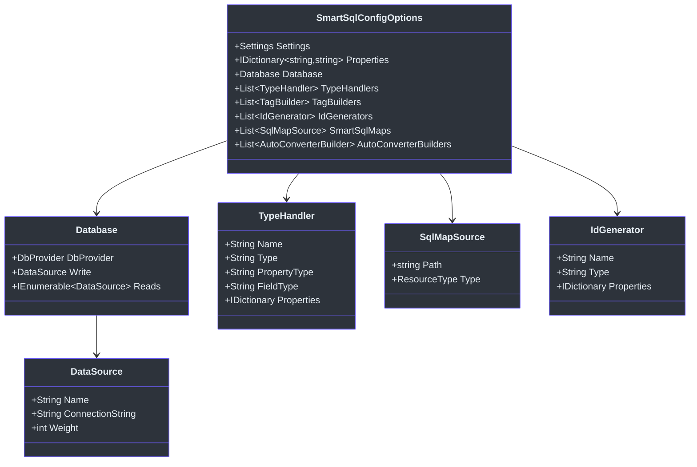
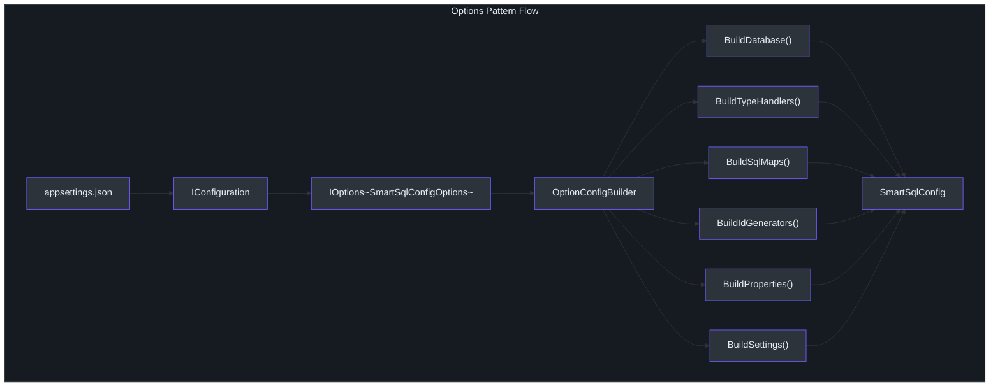
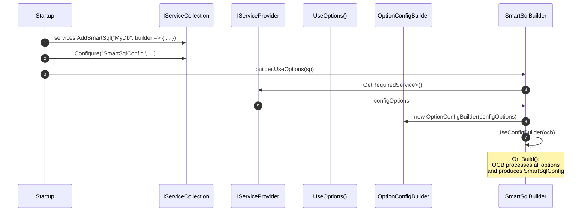

# Options Pattern Configuration

The `SmartSql.Options` package lets you configure SmartSql entirely from `appsettings.json` (or any `IConfiguration` source) using the standard ASP.NET Core Options pattern. Instead of writing and maintaining XML configuration files, you define your database connections, type handlers, SQL map sources, and settings directly in JSON and bind them via `IOptions<SmartSqlConfigOptions>`.

## At a Glance

| Feature | Description |
|---------|-------------|
| Package | `SmartSql.Options` |
| Entry Point | `SmartSqlBuilder.UseOptions(serviceProvider)` |
| Options Class | `SmartSqlConfigOptions` |
| Config Builder | `OptionConfigBuilder` (extends `AbstractConfigBuilder`) |
| Bind Pattern | `IOptionsSnapshot<SmartSqlConfigOptions>` keyed by alias |
| Still Supports | XML SqlMap files referenced from JSON |

## Configuration Structure

The `SmartSqlConfigOptions` class defines the full JSON structure:



<!-- Sources: src/SmartSql.Options/SmartSqlConfigOptions.cs:8, src/SmartSql.Options/Database.cs:8, src/SmartSql.Options/DataSource.cs:7, src/SmartSql.Options/SqlMapSource.cs:7 -->

## JSON Configuration Example

```json
{
  "SmartSqlConfig": {
    "Settings": {
      "IgnoreParameterCase": true,
      "ParameterPrefix": "?"
    },
    "Properties": {
      "ConnectionString": "Server=localhost;Database=SmartSqlDb;Uid=root;Pwd=123456;"
    },
    "Database": {
      "DbProvider": {
        "Name": "MySql",
        "ParameterPrefix": "?"
      },
      "Write": {
        "Name": "Write",
        "ConnectionString": "${ConnectionString}"
      },
      "Reads": [
        {
          "Name": "Read",
          "ConnectionString": "${ConnectionString}",
          "Weight": 100
        }
      ]
    },
    "TypeHandlers": [
      {
        "Name": "Json",
        "Type": "SmartSql.TypeHandler.JsonTypeHandler, SmartSql.TypeHandler"
      }
    ],
    "SmartSqlMaps": [
      {
        "Path": "Maps",
        "Type": "Directory"
      }
    ]
  }
}
```

## How It Works

The `OptionConfigBuilder` extends `AbstractConfigBuilder` and translates the options into the same internal `SmartSqlConfig` structure that XML configuration produces:



<!-- Sources: src/SmartSql.Options/OptionConfigBuilder.cs:14, src/SmartSql.Options/SmartSqlOptionsExtensions.cs:12 -->

## Using in ASP.NET Core



<!-- Sources: src/SmartSql.Options/SmartSqlOptionsExtensions.cs:12, src/SmartSql.Options/OptionConfigBuilder.cs:14 -->

## API Reference

### SmartSqlOptionsExtensions

| Method | Description |
|---|---|
| `SmartSqlBuilder.UseOptions(IServiceProvider)` | Bind the builder to options resolved from DI, keyed by the builder's alias |

### OptionConfigBuilder (Internal)

| Method | Description |
|---|---|
| `BuildDatabase()` | Maps `Database.Write` and `Database.Reads` to `WriteDataSource` / `ReadDataSource` |
| `BuildTypeHandlers()` | Registers each `TypeHandler` entry, resolving generic type arguments |
| `BuildSqlMaps()` | Loads each `SqlMapSource` by `ResourceType` and `Path` |
| `BuildIdGenerators()` | Builds and registers named ID generators |
| `BuildProperties()` | Imports key-value properties into `SmartSqlConfig.Properties` |
| `BuildSettings()` | Applies `Settings` (IgnoreParameterCase, ParameterPrefix, etc.) |
| `BuildTagBuilders()` | Registers custom tag builder types |

## Key Classes

| Class | File | Description |
|---|---|---|
| `SmartSqlConfigOptions` | [SmartSqlConfigOptions.cs](https://github.com/dotnetcore/SmartSql/blob/master/src/SmartSql.Options/SmartSqlConfigOptions.cs) | Root options object |
| `Database` | [Database.cs](https://github.com/dotnetcore/SmartSql/blob/master/src/SmartSql.Options/Database.cs) | DB provider + write/read sources |
| `DataSource` | [DataSource.cs](https://github.com/dotnetcore/SmartSql/blob/master/src/SmartSql.Options/DataSource.cs) | Name, connection string, weight |
| `TypeHandler` | [TypeHandler.cs](https://github.com/dotnetcore/SmartSql/blob/master/src/SmartSql.Options/TypeHandler.cs) | Type handler registration |
| `SqlMapSource` | [SqlMapSource.cs](https://github.com/dotnetcore/SmartSql/blob/master/src/SmartSql.Options/SqlMapSource.cs) | SQL map file path and resource type |
| `IdGenerator` | [IdGenerator.cs](https://github.com/dotnetcore/SmartSql/blob/master/src/SmartSql.Options/IdGenerator.cs) | Named ID generator config |
| `TagBuilder` | [TagBuilder.cs](https://github.com/dotnetcore/SmartSql/blob/master/src/SmartSql.Options/TagBuilder.cs) | Custom tag builder registration |
| `OptionConfigBuilder` | [OptionConfigBuilder.cs](https://github.com/dotnetcore/SmartSql/blob/master/src/SmartSql.Options/OptionConfigBuilder.cs) | Translates options into SmartSqlConfig |

## Cross-References

- **[DI Integration](./di-extension.md)** -- Combine `AddSmartSql()` with `UseOptions()` for full DI-based configuration.
- **[Type Handlers](./type-handlers.md)** -- Register type handlers in the `TypeHandlers` array.
- **[Configuration (XML)](../guide/configuration.md)** -- XML config that Options pattern can reference via `SmartSqlMaps`.

## References

- [SmartSqlConfigOptions.cs](https://github.com/dotnetcore/SmartSql/blob/master/src/SmartSql.Options/SmartSqlConfigOptions.cs)
- [OptionConfigBuilder.cs](https://github.com/dotnetcore/SmartSql/blob/master/src/SmartSql.Options/OptionConfigBuilder.cs)
- [SmartSqlOptionsExtensions.cs](https://github.com/dotnetcore/SmartSql/blob/master/src/SmartSql.Options/SmartSqlOptionsExtensions.cs)
- [Database.cs](https://github.com/dotnetcore/SmartSql/blob/master/src/SmartSql.Options/Database.cs)
- [DataSource.cs](https://github.com/dotnetcore/SmartSql/blob/master/src/SmartSql.Options/DataSource.cs)
- [SqlMapSource.cs](https://github.com/dotnetcore/SmartSql/blob/master/src/SmartSql.Options/SqlMapSource.cs)
