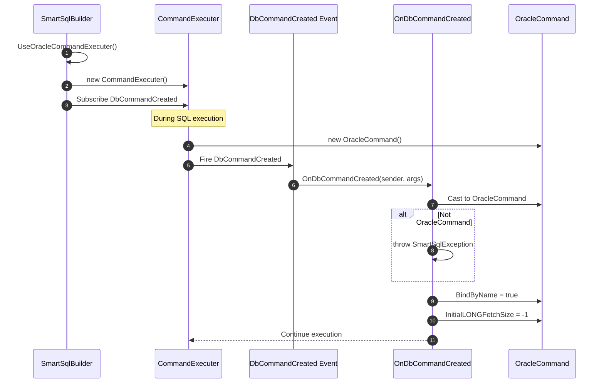
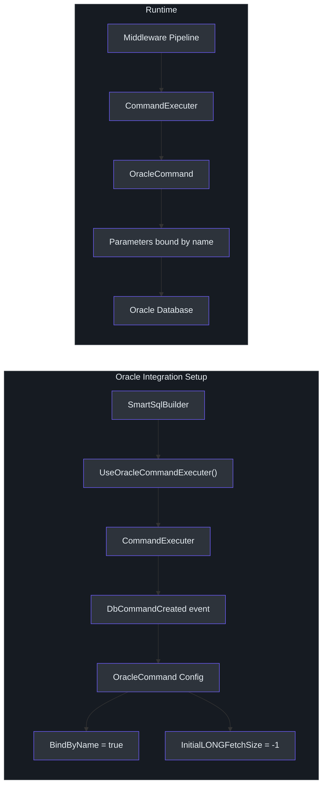

# Oracle Support

While SmartSql's core can work with any ADO.NET provider, Oracle's `OracleCommand` requires specific configuration that deviates from the standard ADO.NET behavior. The `SmartSql.Oracle` package provides a custom `CommandExecuter` that configures Oracle-specific properties (`BindByName`, `InitialLONGFetchSize`) on every command before execution.

## At a Glance

| Feature | Description |
|---------|-------------|
| Package | `SmartSql.Oracle` |
| Provider | Oracle.ManagedDataAccess (ODP.NET) |
| Key Feature | Auto-sets `BindByName = true` and `InitialLONGFetchSize = -1` |
| Entry Point | `SmartSqlBuilder.UseOracleCommandExecuter()` |

## Why Oracle Needs Special Handling

By default, Oracle's ODP.NET driver binds parameters by position rather than by name. This conflicts with SmartSql's XML-based parameter binding, which uses named parameters (`:Name`, `:Age`, etc.). Setting `BindByName = true` on every `OracleCommand` fixes this, and the `SmartSql.Oracle` package automates that configuration.


<!-- Sources: src/SmartSql.Oracle/SmartSqlBuilderExtensions.cs:10, src/SmartSql.Oracle/SmartSqlBuilderExtensions.cs:24 -->

## How It Works

The extension hooks into the `DbCommandCreated` event of the `CommandExecuter`. Every time a new `DbCommand` is created, the handler checks if it is an `OracleCommand` and configures the required properties:



<!-- Sources: src/SmartSql.Oracle/SmartSqlBuilderExtensions.cs:24 -->

## Configuration Properties Set

| Property | Value | Purpose |
|---|---|---|
| `BindByName` | `true` | Enables named parameter binding (essential for SmartSql XML maps) |
| `InitialLONGFetchSize` | `-1` | Fetches entire LONG/LONG RAW column values (Oracle default is 0, which returns only the length) |

## Setup

### Basic Registration

```csharp
var smartSqlBuilder = new SmartSqlBuilder()
    .UseOracleCommandExecuter()
    .UseXmlConfig(ResourceType.File, "SmartSqlMapConfig.xml")
    .Build();
```

### With DI Integration

```csharp
services.AddSmartSql((sp, builder) =>
{
    builder
        .UseProperties(Configuration)
        .UseOracleCommandExecuter(sp.GetService<ILoggerFactory>());
});
```

### With Custom LoggerFactory

```csharp
builder.UseOracleCommandExecuter(loggerFactory);
```

## Integration Architecture



<!-- Sources: src/SmartSql.Oracle/SmartSqlBuilderExtensions.cs:10, src/SmartSql.Oracle/SmartSqlBuilderExtensions.cs:24 -->

Both overloads accept an optional `ILoggerFactory`. The parameterless version uses the `SmartSqlBuilder.LoggerFactory` that was already configured.

## XML Configuration for Oracle

Your SmartSql XML configuration should specify the Oracle database provider:

```xml
<SmartSqlMapConfig>
  <Database>
    <DbProvider Name="Oracle" ParameterPrefix=":"/>
    <Write Name="Write" ConnectionString="Data Source=...;User Id=...;Password=...;"/>
    <Reads>
      <Read Name="Read" ConnectionString="Data Source=...;User Id=...;Password=...;" Weight="100"/>
    </Reads>
  </Database>
  <SmartSqlMaps>
    <SmartSqlMap Path="Maps" Type="Directory"/>
  </SmartSqlMaps>
</SmartSqlMapConfig>
```

::: warning
Oracle's parameter prefix is `:`, not `@` (SqlServer) or `?` (MySql). Make sure your XML maps use the correct prefix, or configure `ParameterPrefix` in your database provider settings.
:::

## Error Handling

If the `DbCommandCreated` event fires but the command is not an `OracleCommand` (for example, if the wrong ADO.NET provider is configured), the handler throws a `SmartSqlException`:

```
The ADO.NET Driver is not [Oracle.ManagedDataAccess.Core].
```

This ensures fail-fast behavior when the Oracle extension is registered but the wrong database provider is in use.

## API Reference

### SmartSqlBuilderExtensions (Oracle)

| Method | Description |
|---|---|
| `UseOracleCommandExecuter(SmartSqlBuilder)` | Register Oracle command executer using the builder's logger factory |
| `UseOracleCommandExecuter(SmartSqlBuilder, ILoggerFactory)` | Register Oracle command executer with an explicit logger factory |

## Cross-References

- **[DI Integration](./di-extension.md)** -- Combine Oracle support with ASP.NET Core DI.
- **[Configuration (XML)](../guide/configuration.md)** -- XML database provider configuration.
- **[Bulk Insert](./bulk-insert.md)** -- Note: there is no Oracle-specific bulk insert provider; use SmartSql's standard insert mechanisms for Oracle.

## References

- [SmartSqlBuilderExtensions.cs](https://github.com/dotnetcore/SmartSql/blob/master/src/SmartSql.Oracle/SmartSqlBuilderExtensions.cs) -- Full implementation with event hook
- [SmartSqlBuilder.cs](https://github.com/dotnetcore/SmartSql/blob/master/src/SmartSql/SmartSqlBuilder.cs) -- Central builder (UseCommandExecuter method)
- [CommandExecuter.cs](https://github.com/dotnetcore/SmartSql/blob/master/src/SmartSql/Command/CommandExecuter.cs) -- Base command executer with DbCommandCreated event
- [SmartSqlConfig.cs](https://github.com/dotnetcore/SmartSql/blob/master/src/SmartSql/Configuration/SmartSqlConfig.cs) -- Configuration holding database provider settings
- [DbProvider.cs](https://github.com/dotnetcore/SmartSql/blob/master/src/SmartSql/DataSource/DbProvider.cs) -- Database provider abstraction
