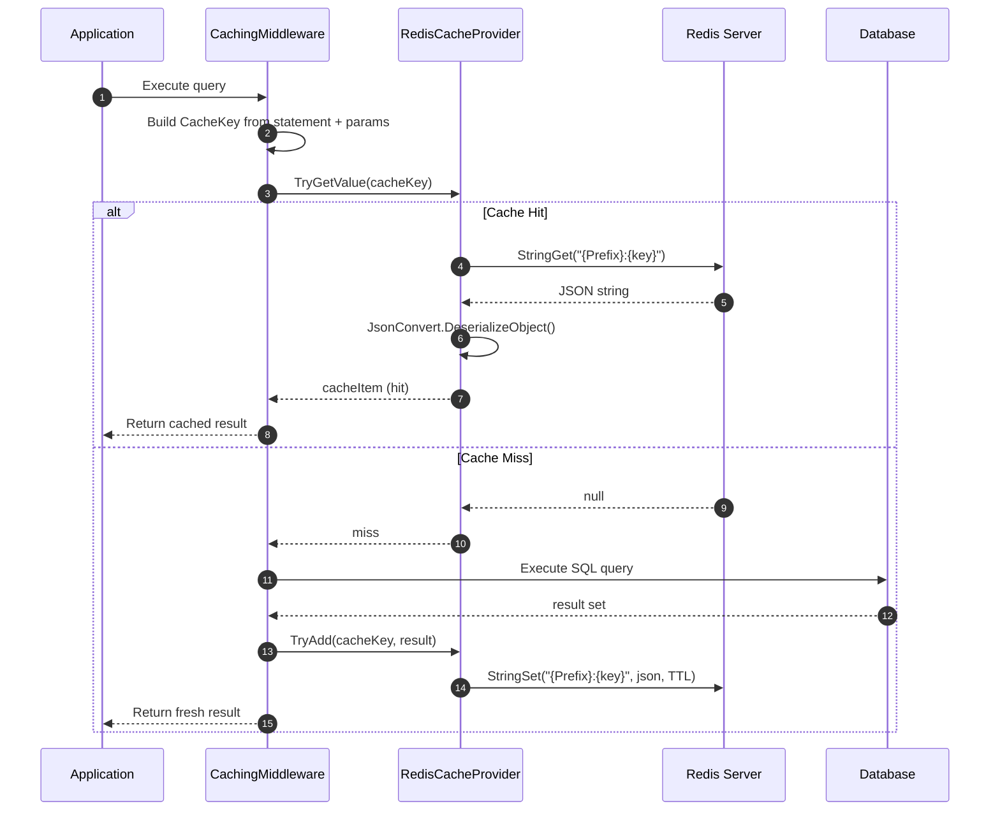
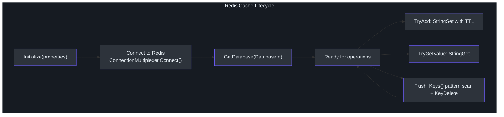
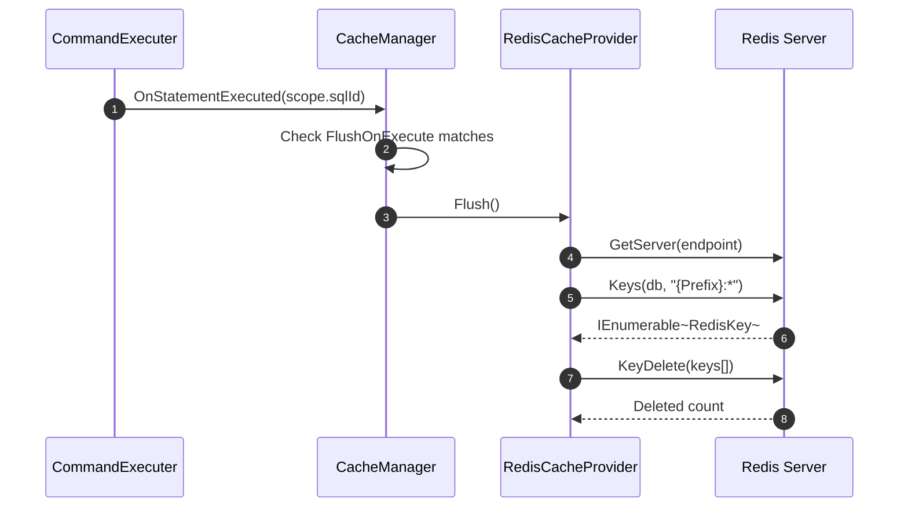

# Redis Cache Provider

SmartSql's built-in caching supports memory-based providers out of the box, but memory caches are local to a single application instance. In a multi-instance deployment (web farm, containers, microservices), each instance maintains its own isolated cache, leading to stale data and redundant database queries. The `SmartSql.Cache.Redis` package provides a Redis-backed cache provider that shares cached query results across all application instances.

## At a Glance

| Feature | Description |
|---------|-------------|
| Package | `SmartSql.Cache.Redis` |
| Interface | `ICacheProvider` |
| Serialization | JSON (via Newtonsoft.Json) |
| Key Format | `{Prefix}:{CacheKey}` |
| Expiration | Via `FlushInterval` mapped to Redis TTL |
| Flush Support | Pattern-based key deletion (`{Prefix}:*`) |
| Database Selection | Configurable via `DatabaseId` property |

## How Redis Caching Works



<!-- Sources: src/SmartSql.Cache.Redis/RedisCacheProvider.cs:49, src/SmartSql.Cache.Redis/RedisCacheProvider.cs:66 -->

## Configuration

The `RedisCacheProvider` is configured through properties defined in your XML cache configuration:

### XML Configuration

```xml
<Cache Id="UserCache" Type="LRU">
  <Properties>
    <Property Key="CacheSize" Value="100"/>
    <Property Key="FlushInterval" Value="300"/>
    <Property Key="ConnectionString" Value="localhost:6379,password=123456"/>
    <Property Key="Prefix" Value="SmartSql:UserCache"/>
    <Property Key="DatabaseId" Value="0"/>
  </Properties>
  <FlushOnExecute Statement="User.Insert"/>
  <FlushOnExecute Statement="User.Update"/>
  <FlushOnExecute Statement="User.Delete"/>
</Cache>
```

### Configuration Properties

| Property | Required | Default | Description |
|---|---|---|---|
| `ConnectionString` | Yes | -- | Redis connection string (StackExchange.Redis format) |
| `Prefix` | No | Cache.Id | Key prefix in Redis |
| `FlushInterval` | No | None | TTL in seconds; maps to Redis key expiry |
| `DatabaseId` | No | Default (0) | Redis database number |

## Cache Lifecycle



<!-- Sources: src/SmartSql.Cache.Redis/RedisCacheProvider.cs:19 -->

## Flush Behavior

When a statement marked with `FlushOnExecute` is executed (e.g., an INSERT, UPDATE, or DELETE), the cache is flushed. The `Flush()` method performs a pattern-based scan and delete:

1. Connects to the first Redis endpoint
2. Scans for all keys matching `{Prefix}:*`
3. Deletes all matched keys in batch



<!-- Sources: src/SmartSql.Cache.Redis/RedisCacheProvider.cs:55 -->

## API Reference

### RedisCacheProvider

| Method | Description |
|---|---|
| `Initialize(IDictionary<string, object>)` | Parse properties, connect to Redis |
| `TryAdd(CacheKey, object)` | Serialize and store with TTL |
| `TryGetValue(CacheKey, out object)` | Fetch and deserialize from Redis |
| `Flush()` | Delete all keys matching prefix pattern |
| `Dispose()` | Close the Redis connection |

| Property | Type | Description |
|---|---|---|
| `SupportExpire` | `bool` | Always `true` -- Redis supports TTL natively |

### Serialization

All cache values are serialized to JSON using `Newtonsoft.Json.JsonConvert`:

- **Write**: `JsonConvert.SerializeObject(cacheItem)`
- **Read**: `JsonConvert.DeserializeObject(cacheStr, cacheKey.ResultType)`

The `CacheKey.ResultType` ensures deserialized objects match the expected query result type.

## Integration with Cache Sync

In a distributed environment, you can combine Redis caching with the [Cache Sync](./cache-sync.md) extension to flush local Redis caches when data changes on other instances via message queue notifications.

## Cross-References

- **[Cache Sync](./cache-sync.md)** -- Distributed cache invalidation via pub/sub.
- **[Type Handlers](./type-handlers.md)** -- JSON serialization used in Redis cache is similar to JsonTypeHandler.
- **[Configuration](../guide/configuration.md)** -- Define cache elements in XML SmartSqlMap files.

## References

- [RedisCacheProvider.cs](https://github.com/dotnetcore/SmartSql/blob/master/src/SmartSql.Cache.Redis/RedisCacheProvider.cs) -- Full implementation
- [ICacheProvider.cs](https://github.com/dotnetcore/SmartSql/blob/master/src/SmartSql/Cache/ICacheProvider.cs) -- Core cache provider interface
- [ICacheManager.cs](https://github.com/dotnetcore/SmartSql/blob/master/src/SmartSql/Cache/ICacheManager.cs) -- Cache manager interface
- [AbstractCacheManager.cs](https://github.com/dotnetcore/SmartSql/blob/master/src/SmartSql/Cache/AbstractCacheManager.cs) -- Base cache manager with FlushOnExecute support
- [CachingMiddleware.cs](https://github.com/dotnetcore/SmartSql/blob/master/src/SmartSql/Cache/CachingMiddleware.cs) -- Middleware that invokes cache operations in the pipeline
