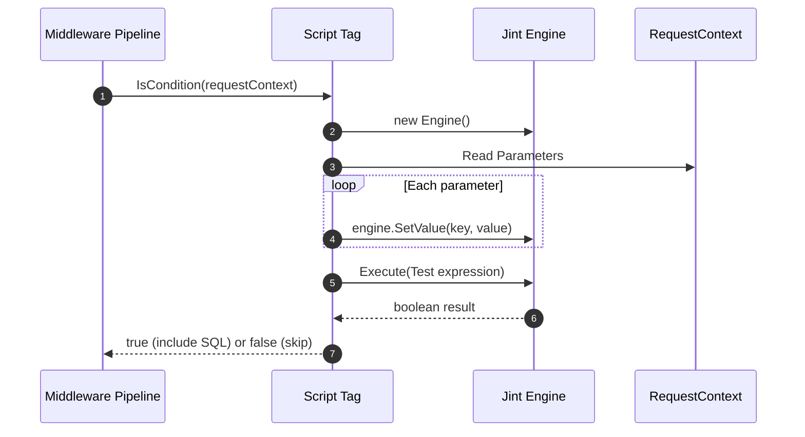
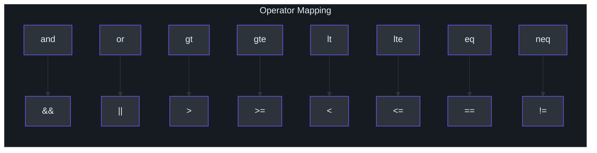
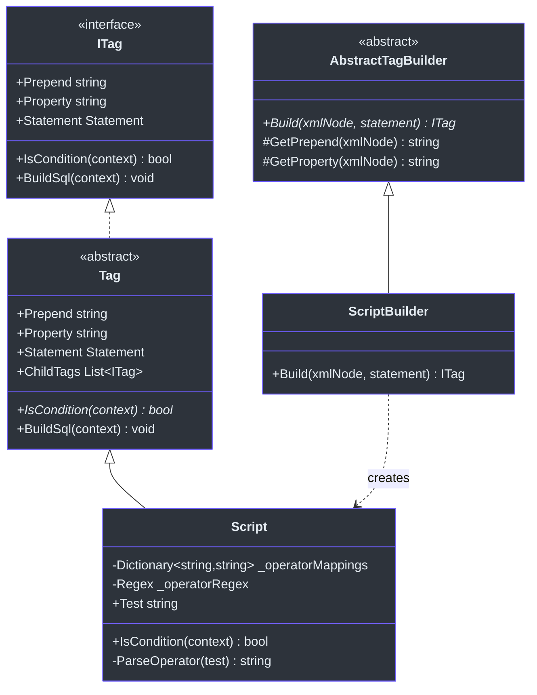

# Script Tag

SmartSql's built-in XML tags (`<IsNotEmpty>`, `<IsEqual>`, `<Switch>`, etc.) handle most conditional SQL generation, but sometimes you need more expressive logic. The `SmartSql.ScriptTag` package adds a `<Script>` tag that evaluates JavaScript expressions using the [Jint](https://github.com/sebastienros/jint) engine, giving you full programmatic control over SQL generation directly in your XML maps.

## At a Glance

| Feature | Description |
|---------|-------------|
| Package | `SmartSql.ScriptTag` |
| JS Engine | Jint (pure C# JavaScript interpreter) |
| Tag Name | `<Script>` |
| Attribute | `Test` -- JavaScript expression that evaluates to boolean |
| Operator Mapping | Automatic translation of text operators to JS operators |

## How It Works

The `Script` tag extends SmartSql's `Tag` base class. When the middleware pipeline processes a statement, the `Script` tag evaluates its `Test` expression against the current request parameters:



<!-- Sources: src/SmartSql.ScriptTag/Script.cs:38, src/SmartSql.ScriptTag/Script.cs:45 -->

## Operator Mapping

The `Script` tag automatically translates human-friendly text operators to JavaScript operators. This makes the XML more readable:



<!-- Sources: src/SmartSql.ScriptTag/Script.cs:11 -->

The mapping is applied via regex replacement at construction time, so you write:

```xml
<Script Test="age gt 18 and status neq 'inactive'">
```

and it is internally converted to:

```javascript
age > 18 && status != 'inactive'
```

## Tag Class Hierarchy



<!-- Sources: src/SmartSql.ScriptTag/Script.cs:9, src/SmartSql.ScriptTag/ScriptBuilder.cs:10 -->

## Usage in XML Maps

### Basic Conditional Clause

```xml
<Statement Id="QueryUsers">
  SELECT * FROM Users
  <Where>
    <Script Test="age gt 0">
      AND Age > ?Age
    </Script>
    <IsNotEmpty Prepend="And" Property="Name">
      AND Name LIKE CONCAT('%', ?Name, '%')
    </IsNotEmpty>
  </Where>
</Statement>
```

### Complex Expressions

The Script tag supports any JavaScript expression that Jint can evaluate:

```xml
<Script Test="minPrice neq null and maxPrice neq null and minPrice lt maxPrice">
  AND Price BETWEEN ?MinPrice AND ?MaxPrice
</Script>
```

### Combining with Other Tags

Script tags can be nested inside `<Where>`, `<Switch>`, or other dynamic tags just like any other SmartSql tag:

```xml
<Statement Id="AdvancedQuery">
  SELECT * FROM Products
  <Where>
    <Script Test="categoryIds.length gt 0">
      AND CategoryId IN
      <For Property="categoryIds" Open="(" Close=")" Separator=",">
        ?categoryIds
      </For>
    </Script>
    <IsEqual Property="Status" CompareValue="1">
      AND IsActive = 1
    </IsEqual>
  </Where>
</Statement>
```

## Tag Builder Registration

The `ScriptBuilder` class registers the `<Script>` tag with SmartSql's tag builder system. It extends `AbstractTagBuilder` and creates `Script` instances from XML nodes:

| Method | Description |
|---|---|
| `Build(XmlNode, Statement)` | Creates a `Script` tag from the XML node's `Test` attribute |

To enable the Script tag, register the tag builder in your configuration:

```xml
<SmartSqlMapConfig>
  <TagBuilders>
    <TagBuilder Name="Script"
      Type="SmartSql.ScriptTag.ScriptBuilder, SmartSql.ScriptTag"/>
  </TagBuilders>
</SmartSqlMapConfig>
```

Or via Options pattern:

```json
{
  "TagBuilders": [
    {
      "Name": "Script",
      "Type": "SmartSql.ScriptTag.ScriptBuilder, SmartSql.ScriptTag"
    }
  ]
}
```

## Jint Engine Configuration

The Script tag creates Jint engines with these settings:

| Setting | Value | Purpose |
|---|---|---|
| `Strict` | `false` | Allow non-strict JavaScript |
| `DebugMode` | `false` | No debugging support |
| `AllowDebuggerStatement` | `false` | Prevent debugger statements |

When `context.Parameters` is null, the expression is evaluated without any variables set.

## Cross-References

- **[Options Pattern](./options.md)** -- Register `TagBuilders` in `appsettings.json`.
- **[Configuration (XML)](../guide/configuration.md)** -- XML tag system that Script extends.
- **[Dynamic Repository](./dy-repository.md)** -- Repository methods can use statements that include Script tags.

## References

- [Script.cs](https://github.com/dotnetcore/SmartSql/blob/master/src/SmartSql.ScriptTag/Script.cs) -- Core Script tag implementation
- [ScriptBuilder.cs](https://github.com/dotnetcore/SmartSql/blob/master/src/SmartSql.ScriptTag/ScriptBuilder.cs) -- Tag builder for XML registration
- [AbstractTagBuilder.cs](https://github.com/dotnetcore/SmartSql/blob/master/src/SmartSql/Configuration/Tags/TagBuilders/AbstractTagBuilder.cs) -- Base class for tag builders
- [Tag.cs](https://github.com/dotnetcore/SmartSql/blob/master/src/SmartSql/Configuration/Tags/Tag.cs) -- Base tag class that Script extends
- [ITag.cs](https://github.com/dotnetcore/SmartSql/blob/master/src/SmartSql/Configuration/Tags/ITag.cs) -- Tag interface defining IsCondition and BuildSql
