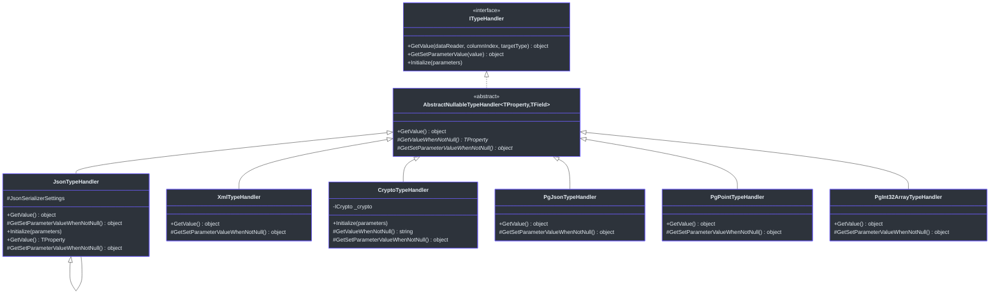
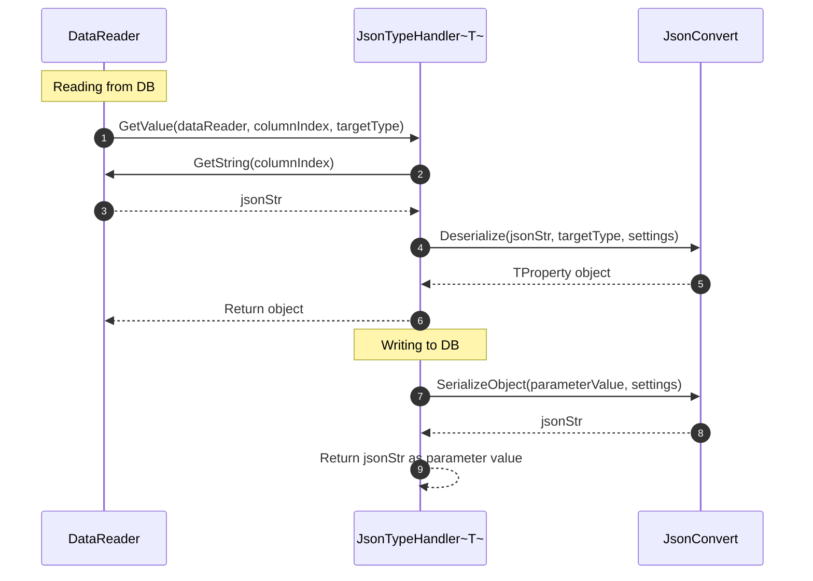
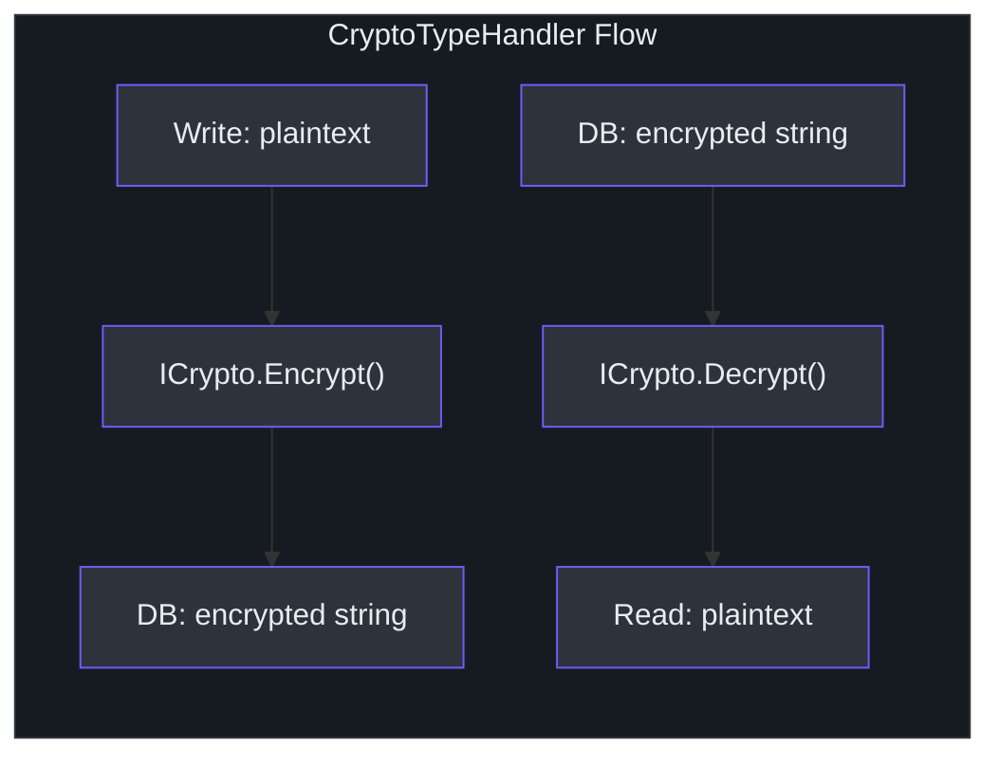

# Type Handlers

SmartSql's type handler system bridges the gap between .NET types and database column types. While the core library provides handlers for standard primitive types, the `SmartSql.TypeHandler` and `SmartSql.TypeHandler.PostgreSql` packages add handlers for complex serialization needs: JSON objects stored in text columns, encrypted strings, XML-serialized values, and PostgreSQL-specific types like arrays, geometric shapes, and network addresses.

## At a Glance

| Package | Purpose | Key Handlers |
|---|---|---|
| `SmartSql.TypeHandler` | JSON, XML, Crypto serialization | `JsonTypeHandler`, `XmlTypeHandler`, `CryptoTypeHandler` |
| `SmartSql.TypeHandler.PostgreSql` | PostgreSQL native types | `JsonTypeHandler`, `PointTypeHandler`, array handlers, etc. |

## Type Handler Hierarchy



<!-- Sources: src/SmartSql.TypeHandler/JsonTypeHandler.cs:10, src/SmartSql.TypeHandler/JsonTypeHandler`1.cs:11, src/SmartSql.TypeHandler/XmlTypeHandler.cs:10, src/SmartSql.TypeHandler/CryptoTypeHandler.cs:9 -->

## JSON Type Handler

The `JsonTypeHandler<TProperty>` serializes and deserializes complex .NET objects to/from JSON strings stored in database text columns. It supports configurable naming strategies and date formats.

### How It Works



<!-- Sources: src/SmartSql.TypeHandler/JsonTypeHandler`1.cs:52, src/SmartSql.TypeHandler/JsonTypeHandler`1.cs:59 -->

### Configuration Properties

| Property | Values | Description |
|---|---|---|
| `DateFormat` | e.g. `"yyyy-MM-dd"` | Custom date format for serialization |
| `NamingStrategy` | `"Camel"`, `"Snake"`, default | Property naming convention in JSON |

### XML Configuration

```xml
<TypeHandlers>
  <TypeHandler Name="Json"
    Type="SmartSql.TypeHandler.JsonTypeHandler`1, SmartSql.TypeHandler">
    <Properties>
      <Property Key="NamingStrategy" Value="Camel"/>
      <Property Key="DateFormat" Value="yyyy-MM-dd"/>
    </Properties>
  </TypeHandler>
</TypeHandlers>
```

### Non-Generic Usage

The non-generic `JsonTypeHandler` extends `JsonTypeHandler<Object>` and works as a drop-in for any type:

```xml
<TypeHandler Name="Json"
  Type="SmartSql.TypeHandler.JsonTypeHandler, SmartSql.TypeHandler"/>
```

## XML Type Handler

The `XmlTypeHandler` serializes objects to XML strings and deserializes them back using `System.Xml.Serialization`:

```csharp
// Reading: xmlStr -> XmlDeserialize -> object
// Writing: object -> XmlSerialize -> xmlStr
```

## Crypto Type Handler

The `CryptoTypeHandler` transparently encrypts data on write and decrypts on read, using a pluggable `ICrypto` implementation:



<!-- Sources: src/SmartSql.TypeHandler/CryptoTypeHandler.cs:9 -->

The crypto implementation is selected via the `Initialize(parameters)` method. Configure it in XML by providing properties that `CryptoFactory.Create()` understands.

## PostgreSQL Type Handlers

The `SmartSql.TypeHandler.PostgreSql` package provides handlers for PostgreSQL-specific types:

| Handler | .NET Type | PostgreSQL Type |
|---|---|---|
| `JsonTypeHandler` | `object` | `json` / `jsonb` |
| `JsonTypeHandler<T>` | `T` | `json` / `jsonb` |
| `PointTypeHandler` | `NpgsqlPoint` | `point` |
| `LineTypeHandler` | `NpgsqlLine` | `line` |
| `LineSegmentTypeHandler` | `NpgsqlLSeg` | `lseg` |
| `BoxTypeHandler` | `NpgsqlBox` | `box` |
| `PathTypeHandler` | `NpgsqlPath` | `path` |
| `PolygonTypeHandler` | `NpgsqlPolygon` | `polygon` |
| `CircleTypeHandler` | `NpgsqlCircle` | `circle` |
| `InetTypeHandler` | `NpgsqlInet` | `inet` |
| `StringArrayTypeHandler` | `string[]` | `text[]` |
| `Int16ArrayTypeHandler` | `short[]` | `smallint[]` |
| `Int32ArrayTypeHandler` | `int[]` | `integer[]` |
| `Int64ArrayTypeHandler` | `long[]` | `bigint[]` |
| `DecimalArrayTypeHandler` | `decimal[]` | `numeric[]` |
| `GuidArrayTypeHandler` | `Guid[]` | `uuid[]` |
| `DictionaryTypeHandler` | `Dictionary` | `hstore` |

### Array Handler Usage

```xml
<TypeHandler Name="IntArray"
  Type="SmartSql.TypeHandler.PostgreSql.Int32ArrayTypeHandler, SmartSql.TypeHandler.PostgreSql"/>
```

## Registering Custom Type Handlers

### In XML Configuration

```xml
<SmartSqlMap Scope="MyScope">
  <TypeHandlers>
    <TypeHandler Name="MyJson"
      Type="SmartSql.TypeHandler.JsonTypeHandler`1, SmartSql.TypeHandler">
      <Properties>
        <Property Key="NamingStrategy" Value="Camel"/>
      </Properties>
    </TypeHandler>
  </TypeHandlers>
</SmartSqlMap>
```

### In Options Pattern (appsettings.json)

```json
{
  "TypeHandlers": [
    {
      "Name": "Json",
      "Type": "SmartSql.TypeHandler.JsonTypeHandler`1, SmartSql.TypeHandler",
      "Properties": {
        "NamingStrategy": "Camel"
      }
    }
  ]
}
```

### In SmartSqlBuilder

```csharp
builder.AddTypeHandler(typeof(MyEntity), new JsonTypeHandler<MyEntity>());
```

### Via `[Param]` Attribute on Repository

```csharp
[Statement(Sql = "INSERT INTO Orders (Data) VALUES (?data)")]
int InsertOrder([Param("data", TypeHandler = "Json")] OrderData data);
```

## How Type Handlers Integrate with Bulk Insert

When using `BulkExtensions.ToDataTable<T>()`, the entity metadata cache uses registered type handlers to convert property values to database-compatible values in the `DataTable`:

```csharp
// In BulkExtensions.ToDataTable:
if (columnIndex.Value.Handler != null)
{
    dataRow[columnIndex.Key] = columnIndex.Value.Handler.GetSetParameterValue(propertyVal);
}
```

## Cross-References

- **[Options Pattern](./options.md)** -- Register type handlers in `appsettings.json`.
- **[Bulk Insert](./bulk-insert.md)** -- Type handlers affect bulk data conversion.
- **[Dynamic Repository](./dy-repository.md)** -- Use `[Param(TypeHandler = "...")]` to specify handlers per parameter.

## References

- [JsonTypeHandler.cs](https://github.com/dotnetcore/SmartSql/blob/master/src/SmartSql.TypeHandler/JsonTypeHandler.cs) -- Non-generic JSON handler
- [JsonTypeHandler`1.cs](https://github.com/dotnetcore/SmartSql/blob/master/src/SmartSql.TypeHandler/JsonTypeHandler%601.cs) -- Generic JSON handler with settings
- [XmlTypeHandler.cs](https://github.com/dotnetcore/SmartSql/blob/master/src/SmartSql.TypeHandler/XmlTypeHandler.cs) -- XML serialization handler
- [CryptoTypeHandler.cs](https://github.com/dotnetcore/SmartSql/blob/master/src/SmartSql.TypeHandler/CryptoTypeHandler.cs) -- Encryption/decryption handler
- [PointTypeHandler.cs](https://github.com/dotnetcore/SmartSql/blob/master/src/SmartSql.TypeHandler.PostgreSql/PointTypeHandler.cs) -- PostgreSQL point type
- [Int32ArrayTypeHandler.cs](https://github.com/dotnetcore/SmartSql/blob/master/src/SmartSql.TypeHandler.PostgreSql/Int32ArrayTypeHandler.cs) -- PostgreSQL integer array
- [BulkExtensions.cs](https://github.com/dotnetcore/SmartSql/blob/master/src/SmartSql.Bulk/BulkExtensions.cs) -- ToDataTable uses type handlers
