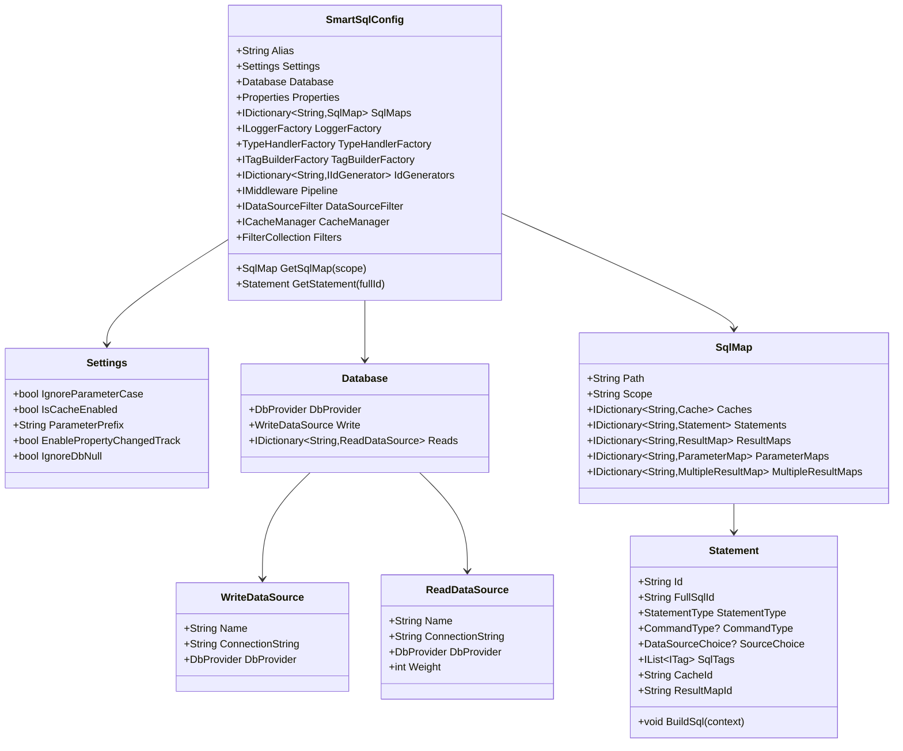
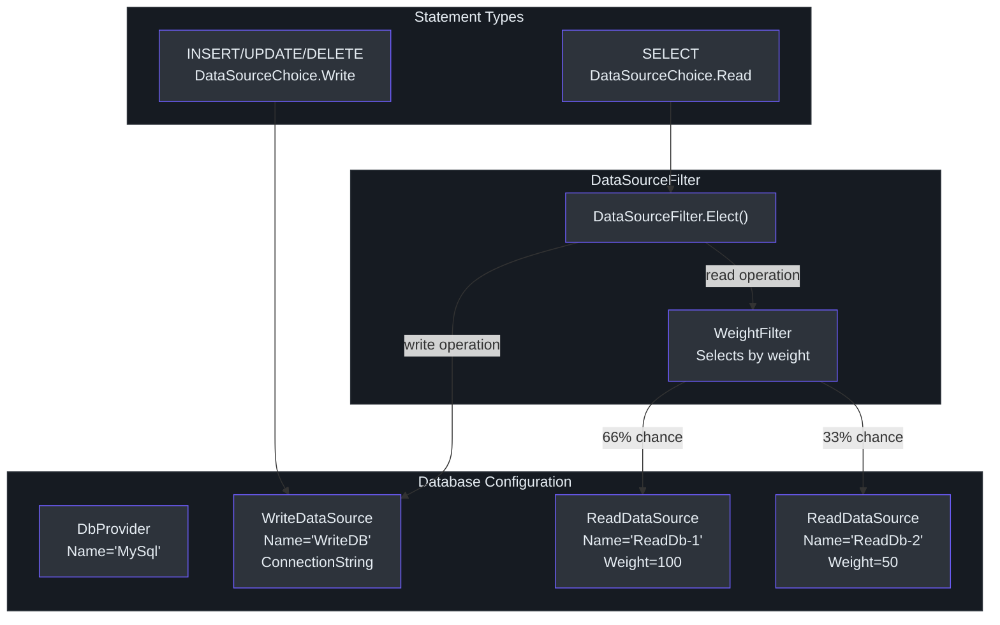
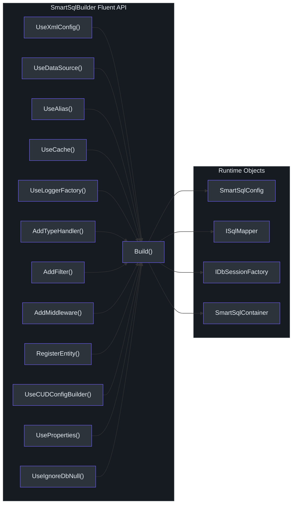

# Configuration

SmartSql supports two configuration approaches: **XML configuration** via `SmartSqlMapConfig.xml` and **programmatic configuration** via the `SmartSqlBuilder` fluent API. Both produce the same `SmartSqlConfig` object at runtime. The XML approach is the primary and most common method.

## Configuration Hierarchy


<!-- Sources: src/SmartSql/Configuration/SmartSqlConfig.cs:21-112, src/SmartSql/Configuration/SqlMap.cs:8-75, src/SmartSql/Configuration/Statement.cs:10-48, src/SmartSql/DataSource/Database.cs:8-12 -->

## XML Configuration Structure

The root element of `SmartSqlMapConfig.xml` is `<SmartSqlMapConfig>`. Its child elements define all configuration sections:

```xml
<?xml version="1.0" encoding="utf-8" ?>
<SmartSqlMapConfig xmlns="http://SmartSql.net/schemas/SmartSqlMapConfig.xsd">
  <Settings />
  <Properties />
  <Database />
  <TypeHandlers />
  <TagBuilders />
  <IdGenerators />
  <SmartSqlMaps />
</SmartSqlMapConfig>
```

### Complete Example

This example is based on the actual test configuration from [src/SmartSql.Test/SmartSqlMapConfig.xml](https://github.com/dotnetcore/SmartSql/blob/master/src/SmartSql.Test/SmartSqlMapConfig.xml):

```xml
<?xml version="1.0" encoding="utf-8" ?>
<SmartSqlMapConfig xmlns="http://SmartSql.net/schemas/SmartSqlMapConfig.xsd">
  <Settings IgnoreParameterCase="false"
            ParameterPrefix="$"
            IsCacheEnabled="true"
            EnablePropertyChangedTrack="true" />
  <Properties>
    <Property Name="JsonTypeHandler`"
              Value="SmartSql.TypeHandler.JsonTypeHandler`1,SmartSql.TypeHandler" />
    <Property Name="Redis" Value="127.0.0.1" />
  </Properties>
  <Database>
    <DbProvider Name="SqlServer" />
    <Write Name="WriteDB" ConnectionString="${ConnectionString}" />
    <Read Name="ReadDb-1" ConnectionString="${ConnectionString}" Weight="100" />
    <Read Name="ReadDb-2" ConnectionString="${ConnectionString}" Weight="100" />
  </Database>
  <TypeHandlers>
    <TypeHandler Name="Json" Type="${JsonTypeHandler}">
      <Properties>
        <Property Name="DateFormat" Value="yyyy-MM-dd mm:ss" />
        <Property Name="NamingStrategy" Value="Camel" />
      </Properties>
    </TypeHandler>
    <TypeHandler PropertyType="SmartSql.Test.Entities.NumericalEnum,SmartSql.Test"
                 Type="SmartSql.TypeHandlers.EnumTypeHandler`1, SmartSql" />
  </TypeHandlers>
  <TagBuilders>
    <TagBuilder Name="Script" Type="${ScriptBuilder}" />
  </TagBuilders>
  <IdGenerators>
    <IdGenerator Name="SnowflakeId" Type="SnowflakeId">
      <Properties>
        <Property Name="WorkerIdBits" Value="8" />
        <Property Name="WorkerId" Value="8" />
        <Property Name="Sequence" Value="1" />
      </Properties>
    </IdGenerator>
  </IdGenerators>
  <SmartSqlMaps>
    <SmartSqlMap Path="Maps" Type="Directory" />
  </SmartSqlMaps>
</SmartSqlMapConfig>
```

## Settings

The `<Settings>` element configures global runtime behavior. Defaults are defined in [src/SmartSql/Configuration/SmartSqlConfig.cs:115-131](https://github.com/dotnetcore/SmartSql/blob/master/src/SmartSql/Configuration/SmartSqlConfig.cs#L115-L131):

| Attribute | Type | Default | Description |
|-----------|------|---------|-------------|
| `IgnoreParameterCase` | `bool` | `false` | When `true`, parameter name matching is case-insensitive |
| `ParameterPrefix` | `string` | `"$"` | The prefix used in XML for template variables (e.g., `${PropertyName}`) |
| `IsCacheEnabled` | `bool` | `false` | Enables the caching middleware in the pipeline |
| `EnablePropertyChangedTrack` | `bool` | `false` | Tracks entity property changes for partial UPDATE statements |
| `IgnoreDbNull` | `bool` | `false` | When `true`, DBNull values are ignored during parameter binding |

```xml
<Settings IgnoreParameterCase="false"
          ParameterPrefix="$"
          IsCacheEnabled="true"
          EnablePropertyChangedTrack="false"
          IgnoreDbNull="false" />
```

## Properties

The `<Properties>` section defines variables that can be referenced elsewhere in the configuration using `${PropertyName}` syntax. This is processed by the `RootConfigBuilder` during config initialization ([src/SmartSql/SmartSqlBuilder.cs:157](https://github.com/dotnetcore/SmartSql/blob/master/src/SmartSql/SmartSqlBuilder.cs#L157)).

```xml
<Properties>
  <Property Name="ConnectionString"
            Value="Server=localhost;Database=MyDB;Uid=root;Pwd=123456;" />
  <Property Name="JsonTypeHandler"
            Value="SmartSql.TypeHandler.JsonTypeHandler,SmartSql.TypeHandler" />
</Properties>
```

Properties can also be injected programmatically:

```csharp
var builder = new SmartSqlBuilder()
    .UseProperties(new Dictionary<string, string>
    {
        { "ConnectionString", "Server=localhost;..." }
    })
    .UseXmlConfig()
    .Build();
```

Or loaded from environment variables:

```csharp
builder.UsePropertiesFromEnv(EnvironmentVariableTarget.Process);
```

## Database

The `<Database>` element defines the data source configuration. SmartSql supports read/write splitting with weighted load balancing for read replicas.


<!-- Sources: src/SmartSql/DataSource/Database.cs:8-12, src/SmartSql/DataSource/DataSourceFilter.cs:24-63 -->

### DbProvider

Specifies which ADO.NET provider to use:

| Provider Name | Database | NuGet Package |
|--------------|----------|---------------|
| `MySql` | MySQL | `MySqlConnector` or `MySql.Data` |
| `PostgreSql` | PostgreSQL | `Npgsql` |
| `SqlServer` | SQL Server | `System.Data.SqlClient` |
| `SQLite` | SQLite | `Microsoft.Data.Sqlite` |
| `Oracle` | Oracle | `Oracle.ManagedDataAccess` |

```xml
<Database>
  <DbProvider Name="MySql" />
</Database>
```

### Write Data Source

A single write data source is required:

```xml
<Write Name="WriteDB" ConnectionString="${ConnectionString}" />
```

### Read Data Sources (Read/Write Splitting)

Zero or more read data sources with `Weight` for weighted round-robin selection:

```xml
<Read Name="ReadDb-1" ConnectionString="${ConnectionString}" Weight="100" />
<Read Name="ReadDb-2" ConnectionString="${ConnectionString}" Weight="50" />
```

The `DataSourceFilter` selects read vs. write based on the statement's `StatementType` ([src/SmartSql/DataSource/DataSourceFilter.cs:33-62](https://github.com/dotnetcore/SmartSql/blob/master/src/SmartSql/DataSource/DataSourceFilter.cs#L33-L62)):
- `INSERT`, `UPDATE`, `DELETE` statements route to the write source
- `SELECT` statements route to a read source, selected by weight
- If no read sources are defined, all operations use the write source
- A statement can force a specific read source with `ReadDb="ReadDb-1"`
- An active transaction always uses the same data source as the session

### Programmatic Data Source

```csharp
var builder = new SmartSqlBuilder()
    .UseDataSource("MySql", "Server=localhost;Database=MyDB;Uid=root;Pwd=123456;")
    .Build();
```

Or with full control:

```csharp
var writeSource = new WriteDataSource
{
    Name = "Write",
    ConnectionString = "...",
    DbProvider = DbProviderManager.Instance.Get("MySql")
};
var builder = new SmartSqlBuilder()
    .UseDataSource(writeSource)
    .Build();
```

## TypeHandlers

Type handlers control how .NET types are converted to and from database parameters and result columns. The `<TypeHandlers>` section registers custom handlers.

### Named Type Handlers

Referenced by name in SQL maps via `TypeHandler="Json"`:

```xml
<TypeHandlers>
  <TypeHandler Name="Json" Type="${JsonTypeHandler}">
    <Properties>
      <Property Name="DateFormat" Value="yyyy-MM-dd" />
    </Properties>
  </TypeHandler>
</TypeHandlers>
```

### Property-Type-Bound Type Handlers

Automatically applied to all properties of the specified .NET type:

```xml
<TypeHandler PropertyType="SmartSql.Test.Entities.UserInfo,SmartSql.Test"
             Type="${JsonTypeHandler`}">
  <Properties>
    <Property Name="DateFormat" Value="yyyy-MM-dd mm:ss" />
  </Properties>
</TypeHandler>
```

### Built-in Type Handlers

| Handler | Type | Description |
|---------|------|-------------|
| `EnumTypeHandler<T>` | Enums | Maps enum values to/from database integers |
| `JsonTypeHandler` | Any object | Serializes/deserializes JSON strings (in `SmartSql.TypeHandler` package) |

### Programmatic Registration

```csharp
builder.AddTypeHandler(new MyCustomTypeHandler());
```

## TagBuilders

Tag builders extend the XML tag system with custom tags. The `<TagBuilders>` section registers custom `ITagBuilder` implementations.

```xml
<TagBuilders>
  <TagBuilder Name="Script" Type="${ScriptBuilder}" />
</TagBuilders>
```

The built-in tag builders handle all standard tags (`Where`, `IsNotEmpty`, `Switch`, etc.) automatically. Custom tag builders are needed only for extension tags like `Script` (from the `SmartSql.ScriptTag` package).

## IdGenerators

The `<IdGenerators>` section configures ID generation strategies used by the `<IdGenerator>` tag in SQL maps.

```xml
<IdGenerators>
  <IdGenerator Name="SnowflakeId" Type="SnowflakeId">
    <Properties>
      <Property Name="WorkerIdBits" Value="8" />
      <Property Name="WorkerId" Value="8" />
      <Property Name="Sequence" Value="1" />
    </Properties>
  </IdGenerator>
</IdGenerators>
```

| Generator | Type Value | Description |
|-----------|-----------|-------------|
| SnowflakeId | `SnowflakeId` | Twitter Snowflake distributed ID algorithm (default, always registered) |
| DbSequence | `DbSequence` | Database sequence-based ID generation |

The `SnowflakeId.Default` instance is always registered automatically in `SmartSqlConfig` ([src/SmartSql/Configuration/SmartSqlConfig.cs:101-104](https://github.com/dotnetcore/SmartSql/blob/master/src/SmartSql/Configuration/SmartSqlConfig.cs#L101-L104)).

## SmartSqlMaps

The `<SmartSqlMaps>` section tells SmartSql where to find XML SQL map files:

```xml
<SmartSqlMaps>
  <!-- Load all .xml files from a directory -->
  <SmartSqlMap Path="Maps" Type="Directory" />

  <!-- Load a specific file -->
  <SmartSqlMap Path="Maps/Custom.xml" Type="File" />
</SmartSqlMaps>
```

| Type | Description |
|------|-------------|
| `Directory` | Loads all `.xml` files from the specified directory |
| `File` | Loads a single XML file |

Each loaded file becomes a `SqlMap` object keyed by its `Scope` attribute. Statements within are keyed by `Scope.Id` (full SQL ID).

## SmartSqlBuilder Fluent API

The `SmartSqlBuilder` ([src/SmartSql/SmartSqlBuilder.cs](https://github.com/dotnetcore/SmartSql/blob/master/src/SmartSql/SmartSqlBuilder.cs)) provides a programmatic alternative to XML configuration.


<!-- Sources: src/SmartSql/SmartSqlBuilder.cs:283-530 -->

### Fluent API Methods

| Method | Description |
|--------|-------------|
| `UseXmlConfig()` | Loads `SmartSqlMapConfig.xml` (default path) |
| `UseXmlConfig(ResourceType, path)` | Loads from file or embedded resource |
| `UseDataSource(dbProviderName, connStr)` | Programmatic data source (no XML needed) |
| `UseDataSource(WriteDataSource)` | Full control over write data source |
| `UseNativeConfig(SmartSqlConfig)` | Use a pre-built `SmartSqlConfig` object |
| `UseAlias("MyAlias")` | Sets the instance alias (default: `"SmartSql"`) |
| `UseCache()` | Enables caching middleware |
| `UseCacheManager(ICacheManager)` | Custom cache manager (e.g., Redis) |
| `UseLoggerFactory(ILoggerFactory)` | Inject logging |
| `UseIgnoreDbNull(true)` | Ignore DBNull parameters |
| `UseProperties(dict)` | Inject configuration properties |
| `UsePropertiesFromEnv()` | Load properties from environment variables |
| `UseDataSourceFilter(IDataSourceFilter)` | Custom data source selection logic |
| `UseCommandExecuter(ICommandExecuter)` | Custom command execution logic |
| `AddTypeHandler(handler)` | Register a type handler |
| `AddFilter<TFilter>()` | Register a pipeline filter |
| `AddFilter(IFilter)` | Register a pipeline filter instance |
| `AddDeserializer(deserializer)` | Register a custom data reader deserializer |
| `AddMiddleware(middleware)` | Add a custom middleware to the pipeline |
| `RegisterEntity(type)` | Register entity for CUD / metadata cache |
| `RegisterEntity(TypeScanOptions)` | Register entities by assembly scanning |
| `UseCUDConfigBuilder()` | Enable auto-generated CUD statements |
| `RegisterToContainer(false)` | Skip registration in `SmartSqlContainer` |
| `ListenInvokeSucceeded(callback)` | Hook into successful command executions |

### Minimal Fluent Setup

```csharp
var builder = new SmartSqlBuilder()
    .UseDataSource("MySql", "Server=localhost;Database=MyDB;Uid=root;Pwd=123456;")
    .Build();

ISqlMapper mapper = builder.GetSqlMapper();
```

This creates a working setup without any XML files -- useful for simple scenarios.

### Full Fluent Setup

```csharp
var builder = new SmartSqlBuilder()
    .UseAlias("UserDB")
    .UseLoggerFactory(loggerFactory)
    .UseXmlConfig()
    .UseCache()
    .UseCacheManager(new RedisCacheManager(redisConnection))
    .AddTypeHandler(new JsonTypeHandler())
    .AddFilter<CustomAuditFilter>()
    .RegisterEntity(typeof(User))
    .RegisterEntity(typeof(Order))
    .UseCUDConfigBuilder()
    .AddMiddleware(new CustomLoggingMiddleware())
    .ListenInvokeSucceeded(ctx =>
    {
        logger.LogInformation("Executed: {0}", ctx.Request.FullSqlId);
    })
    .Build();
```

## ASP.NET Core Integration

The `SmartSql.DIExtension` package provides `AddSmartSql()` for service registration:

```csharp
services.AddSmartSql((sp, builder) =>
{
    builder.UseProperties(Configuration);
    // Access IServiceProvider for other services:
    // var loggerFactory = sp.GetRequiredService<ILoggerFactory>();
    // builder.UseLoggerFactory(loggerFactory);
});
```

This registers `ISqlMapper` and `IDbSessionFactory` as singletons. For dynamic repositories:

```csharp
services.AddSmartSql((sp, builder) => { ... })
    .AddRepositoryFromAssembly(o =>
    {
        o.AssemblyString = "MyApp";
        o.Filter = (type) => type.Namespace == "MyApp.Repositories";
    });
```

## Filters

Filters are hooks that execute before and after middleware invocations. They implement `IFilter` and can be registered via the builder:

```csharp
builder.AddFilter<CustomAuditFilter>();
```

Built-in filter interfaces include:
- `IPrepareStatementFilter` -- hooks into `PrepareStatementMiddleware`
- `IInvokeMiddlewareFilter` -- generic middleware invocation hooks

## Configuration Resolution Order

When both XML and programmatic settings exist, programmatic settings override XML values:

1. XML `SmartSqlMapConfig.xml` is parsed first by `XmlConfigBuilder`
2. `SmartSqlBuilder` applies overrides: `IsCacheEnabled`, `IgnoreDbNull`, `DataSourceFilter`, `CommandExecuter`
3. Builder-registered `TypeHandlers`, `Filters`, `Deserializers`, and `Middlewares` are merged into the config
4. The middleware pipeline is built last

## Cross-References

- [Quick Start](./quick-start.md) -- Basic setup walkthrough
- [XML SQL Maps](./xml-sql-maps.md) -- Writing SmartSqlMap XML files
- [Changelog](./changelog.md) -- Version history

## References

- [SmartSqlConfig.cs](https://github.com/dotnetcore/SmartSql/blob/master/src/SmartSql/Configuration/SmartSqlConfig.cs) -- Central configuration class with `Settings` defaults
- [SmartSqlBuilder.cs](https://github.com/dotnetcore/SmartSql/blob/master/src/SmartSql/SmartSqlBuilder.cs) -- Fluent builder API
- [Database.cs](https://github.com/dotnetcore/SmartSql/blob/master/src/SmartSql/DataSource/Database.cs) -- Database model (write + read sources)
- [DataSourceFilter.cs](https://github.com/dotnetcore/SmartSql/blob/master/src/SmartSql/DataSource/DataSourceFilter.cs) -- Weighted read/write selection
- [ReadDataSource.cs](https://github.com/dotnetcore/SmartSql/blob/master/src/SmartSql/DataSource/ReadDataSource.cs) -- Read source with `Weight` property
- [XmlConfigBuilder.cs](https://github.com/dotnetcore/SmartSql/blob/master/src/SmartSql/ConfigBuilder/XmlConfigBuilder.cs) -- XML config parser
- [SmartSqlMapConfig.xml (test)](https://github.com/dotnetcore/SmartSql/blob/master/src/SmartSql.Test/SmartSqlMapConfig.xml) -- Full configuration example
