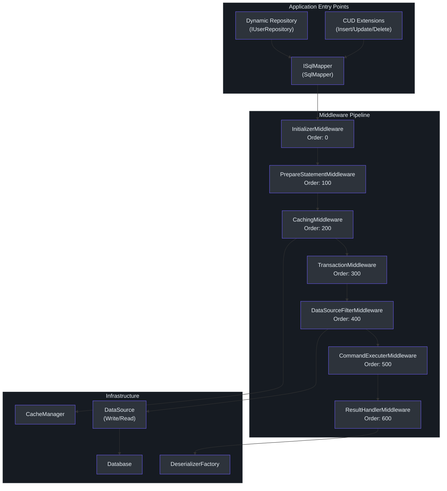
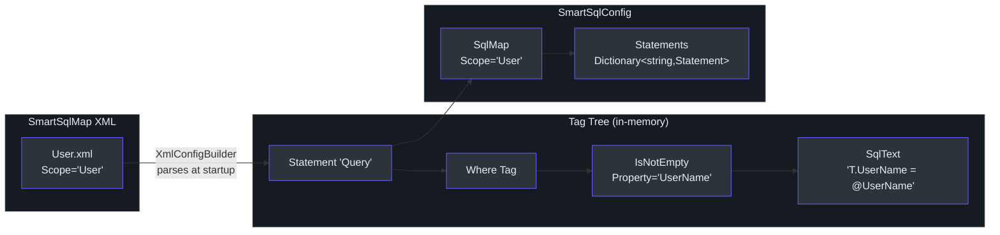
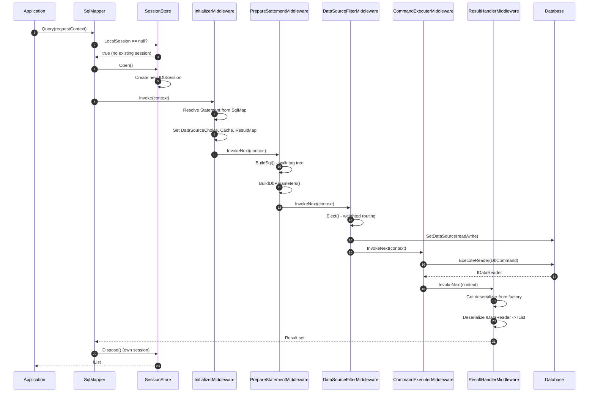

# SmartSql Introduction

SmartSql is a .NET ORM library inspired by [MyBatis](https://mybatis.org/mybatis-3/). Instead of hiding SQL behind LINQ expressions or code-generation wizards, SmartSql embraces SQL as a first-class citizen -- managed in external XML files rather than scattered across C# code. It targets `netstandard2.0` and C# 7.3, making it compatible with both .NET Framework 4.6.1+ and .NET Core/.NET 5+.

## Why SmartSql?

The .NET ecosystem offers several data-access approaches. Entity Framework Core gives you a full change-tracking ORM with LINQ. Dapper gives you raw speed with hand-written SQL mapping. SmartSql occupies a deliberate middle ground: it provides the **SQL control of Dapper** with the **infrastructure features of an ORM** -- caching, read/write splitting, dynamic repositories, bulk inserts, AOP transactions, and diagnostics -- all without forcing you to write data-access code by hand.

The core philosophy is simple: **SQL belongs in XML, not in C# source code.** This separation allows DBAs to review and tune queries independently, enables dynamic SQL construction with conditional tags, and makes SQL maps reusable across projects.

## At a Glance

| Feature | Description |
|---------|-------------|
| XML-managed SQL | All SQL statements live in `.xml` SmartSqlMap files |
| Dynamic SQL tags | Conditional tags like `Where`, `IsNotEmpty`, `Switch`, `Set`, `For`, `Include` |
| Read/Write splitting | Automatic routing of reads to replicas with weighted load balancing |
| Caching | Built-in LRU/FIFO memory cache and Redis cache with flush-on-execute |
| Dynamic Repository | Interface-to-implementation proxy generation via IL emit |
| CUD Extensions | Convention-based Insert/Update/Delete/GetById without XML |
| Bulk Insert | Native bulk copy for SqlServer, MySQL, PostgreSQL |
| AOP Transactions | `[Transaction]` attribute for declarative transaction management |
| Diagnostics | `DiagnosticSource` events for APM tool integration |
| Middleware Pipeline | Extensible execution chain with custom middleware and filters |

## Comparison with Other ORMs

| Aspect | SmartSql | EF Core | Dapper |
|--------|----------|---------|--------|
| SQL management | External XML files | LINQ / raw SQL fragments | Inline C# strings |
| Dynamic SQL | Rich XML tag system | Manual string building | Manual string building |
| Read/Write splitting | Built-in with weighted routing | Manual or via library | Manual |
| Caching | Built-in memory + Redis | Second-level cache (3rd party) | None |
| Repository abstraction | Dynamic proxy via interfaces | DbContext patterns | None |
| Bulk operations | Native bulk copy providers | EF Extensions / 3rd party | None |
| Learning curve | Moderate (XML tags) | Low-Medium | Low |
| Performance | High (no change tracking overhead) | Medium | High |
| Change tracking | Optional (`EnablePropertyChangedTrack`) | Built-in | None |

## Architecture Overview

SmartSql organizes execution through a middleware pipeline. Every SQL operation -- whether a simple query or a paginated report -- flows through the same chain of middleware components, each responsible for a specific concern.

<!-- Sources: src/SmartSql/SmartSqlBuilder.cs:240-281, src/SmartSql/Middlewares/InitializerMiddleware.cs:10-215 -->

## Middleware Pipeline

The pipeline is a linked list of `IMiddleware` implementations, each with an `Order` property that determines execution sequence. The `PipelineBuilder` sorts middlewares by order and chains them via `Next` pointers ([src/SmartSql/PipelineBuilder.cs:25-39](https://github.com/dotnetcore/SmartSql/blob/master/src/SmartSql/PipelineBuilder.cs#L25-L39)).

| Middleware | Order | Responsibility |
|-----------|-------|----------------|
| `InitializerMiddleware` | 0 | Resolves the `Statement` from config, sets data source choice, cache, result maps |
| `PrepareStatementMiddleware` | 100 | Builds the final SQL string from XML tags, creates `DbParameter` instances |
| `CachingMiddleware` | 200 | Checks cache on reads; populates cache after execution (when `IsCacheEnabled=true`) |
| `TransactionMiddleware` | 300 | Wraps execution in a `DbTransaction` when `Transaction` is specified on a statement |
| `DataSourceFilterMiddleware` | 400 | Selects write or weighted-read data source based on statement type |
| `CommandExecuterMiddleware` | 500 | Executes the `DbCommand` (`ExecuteNonQuery`, `ExecuteScalar`, `ExecuteReader`) |
| `ResultHandlerMiddleware` | 600 | Deserializes `IDataReader` results through the deserializer chain |

Each middleware can short-circuit the pipeline by setting `executionContext.Result.End = true`. The `CachingMiddleware` does exactly this when a cache hit is found -- it returns the cached result without executing the SQL.

## Deserialization Chain

When results come back from the database, `DeserializerFactory` tries deserializers in order ([src/SmartSql/SmartSqlBuilder.cs:219-236](https://github.com/dotnetcore/SmartSql/blob/master/src/SmartSql/SmartSqlBuilder.cs#L219-L236)):

1. **MultipleResultDeserializer** -- handles multiple result sets (e.g., paginated queries returning both data and count)
2. **ValueTupleDeserializer** -- handles `ValueTuple` return types
3. **ValueTypeDeserializer** -- handles primitives (`int`, `string`, `Guid`, etc.)
4. **DynamicDeserializer** -- handles `dynamic` / `ExpandoObject` returns
5. **EntityDeserializer** -- maps columns to strongly-typed entity properties (default fallback)

Custom deserializers can be registered at the front of the chain via `SmartSqlBuilder.AddDeserializer()`.

## XML-Managed SQL Philosophy

SmartSql stores all SQL in XML files called **SmartSqlMaps**. Each map has a `Scope` (namespace) and contains `Statement` elements that define individual SQL operations. The XML is processed at startup by `XmlConfigBuilder` and converted into in-memory `Statement` objects with tag trees.

<!-- Sources: src/SmartSql/Configuration/SqlMap.cs:1-75, src/SmartSql/Configuration/Statement.cs:1-48 -->

At runtime, when you call `ISqlMapper.Query<T>(requestContext)`, the `PrepareStatementMiddleware` invokes `Statement.BuildSql()` which walks the tag tree. Each tag evaluates its condition against the current request parameters and appends its SQL fragment if the condition passes. This produces the final SQL with only the relevant WHERE clauses, SET columns, or ORDER BY columns.

## Key Components

| Component | File | Purpose |
|-----------|------|---------|
| `SmartSqlBuilder` | [src/SmartSql/SmartSqlBuilder.cs](https://github.com/dotnetcore/SmartSql/blob/master/src/SmartSql/SmartSqlBuilder.cs) | Fluent builder that constructs the entire runtime |
| `SmartSqlConfig` | [src/SmartSql/Configuration/SmartSqlConfig.cs](https://github.com/dotnetcore/SmartSql/blob/master/src/SmartSql/Configuration/SmartSqlConfig.cs) | Central configuration holding all resolved settings |
| `SqlMapper` | [src/SmartSql/SqlMapper.cs](https://github.com/dotnetcore/SmartSql/blob/master/src/SmartSql/SqlMapper.cs) | Main entry point wrapping `IDbSession` |
| `SqlMap` | [src/SmartSql/Configuration/SqlMap.cs](https://github.com/dotnetcore/SmartSql/blob/master/src/SmartSql/Configuration/SqlMap.cs) | Single XML file model (scope, statements, caches, result maps) |
| `Statement` | [src/SmartSql/Configuration/Statement.cs](https://github.com/dotnetcore/SmartSql/blob/master/src/SmartSql/Configuration/Statement.cs) | Individual SQL operation with tag tree |
| `DataSourceFilter` | [src/SmartSql/DataSource/DataSourceFilter.cs](https://github.com/dotnetcore/SmartSql/blob/master/src/SmartSql/DataSource/DataSourceFilter.cs) | Weighted read/write data source selection |
| `Database` | [src/SmartSql/DataSource/Database.cs](https://github.com/dotnetcore/SmartSql/blob/master/src/SmartSql/DataSource/Database.cs) | Holds write source + read sources |
| `PipelineBuilder` | [src/SmartSql/PipelineBuilder.cs](https://github.com/dotnetcore/SmartSql/blob/master/src/SmartSql/PipelineBuilder.cs) | Builds the middleware linked list |

## How a Query Flows Through the System

<!-- Sources: src/SmartSql/SqlMapper.cs:90-111, src/SmartSql/Middlewares/InitializerMiddleware.cs:14-20, src/SmartSql/Middlewares/PrepareStatementMiddleware.cs:26-35, src/SmartSql/Middlewares/DataSourceFilterMiddleware.cs:11-18, src/SmartSql/Middlewares/CommandExecuterMiddleware.cs:12-53, src/SmartSql/Middlewares/ResultHandlerMiddleware.cs:15-37 -->

## When to Choose SmartSql

**Choose SmartSql when you:**
- Want full control over SQL without sacrificing ORM infrastructure features
- Need read/write splitting with weighted load balancing out of the box
- Prefer externalized SQL that DBAs can review and optimize
- Want convention-based dynamic repositories without writing implementation code
- Need built-in caching (memory or Redis) without additional libraries
- Want APM integration via `DiagnosticSource`

**Consider alternatives when you:**
- Prefer code-first database migrations (EF Core is stronger here)
- Want minimal infrastructure and maximum simplicity (Dapper)
- Need full change-tracking and lazy-loading ORM behavior (EF Core)

## Next Steps

- [Quick Start](./quick-start.md) -- Get up and running in 5 minutes
- [Configuration](./configuration.md) -- Complete guide to SmartSqlMapConfig.xml and the fluent builder API
- [XML SQL Maps](./xml-sql-maps.md) -- Writing SmartSqlMap files with dynamic SQL tags

## References

- [SmartSqlBuilder.cs](https://github.com/dotnetcore/SmartSql/blob/master/src/SmartSql/SmartSqlBuilder.cs) -- Fluent builder
- [SqlMapper.cs](https://github.com/dotnetcore/SmartSql/blob/master/src/SmartSql/SqlMapper.cs) -- Main entry point
- [SmartSqlConfig.cs](https://github.com/dotnetcore/SmartSql/blob/master/src/SmartSql/Configuration/SmartSqlConfig.cs) -- Central configuration
- [PipelineBuilder.cs](https://github.com/dotnetcore/SmartSql/blob/master/src/SmartSql/PipelineBuilder.cs) -- Middleware pipeline construction
- [ExecutionContext.cs](https://github.com/dotnetcore/SmartSql/blob/master/src/SmartSql/ExecutionContext.cs) -- Execution context carrying all state
