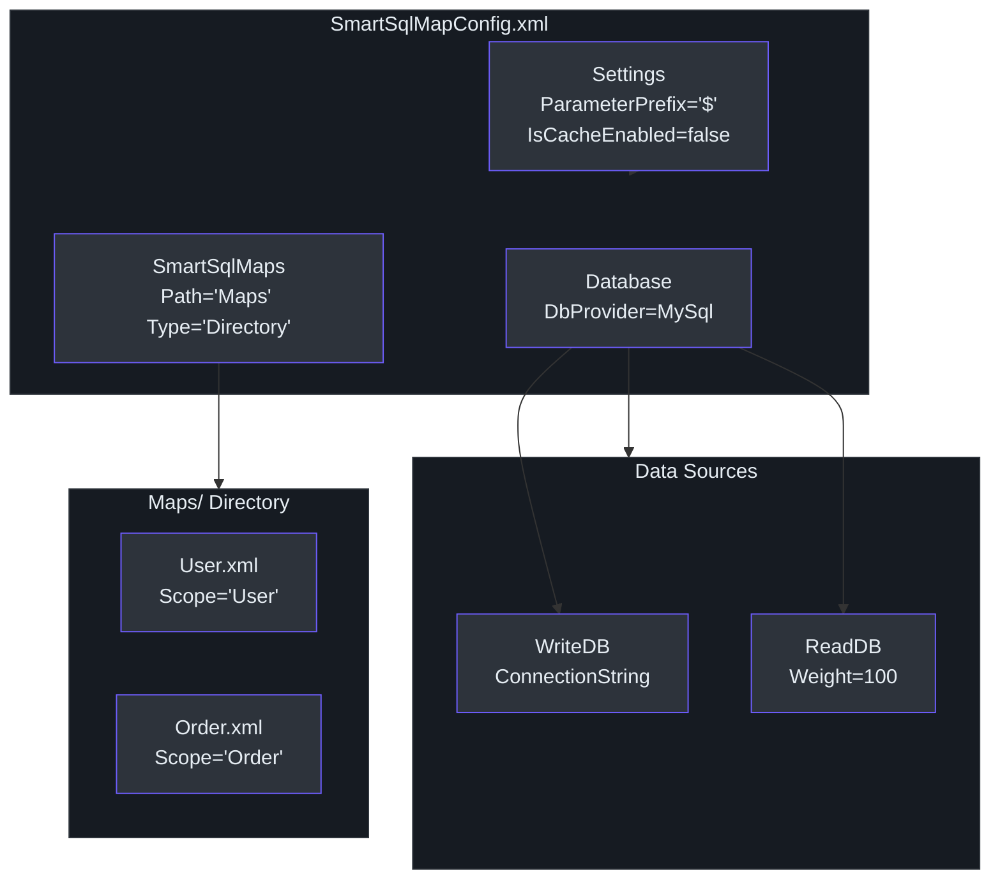
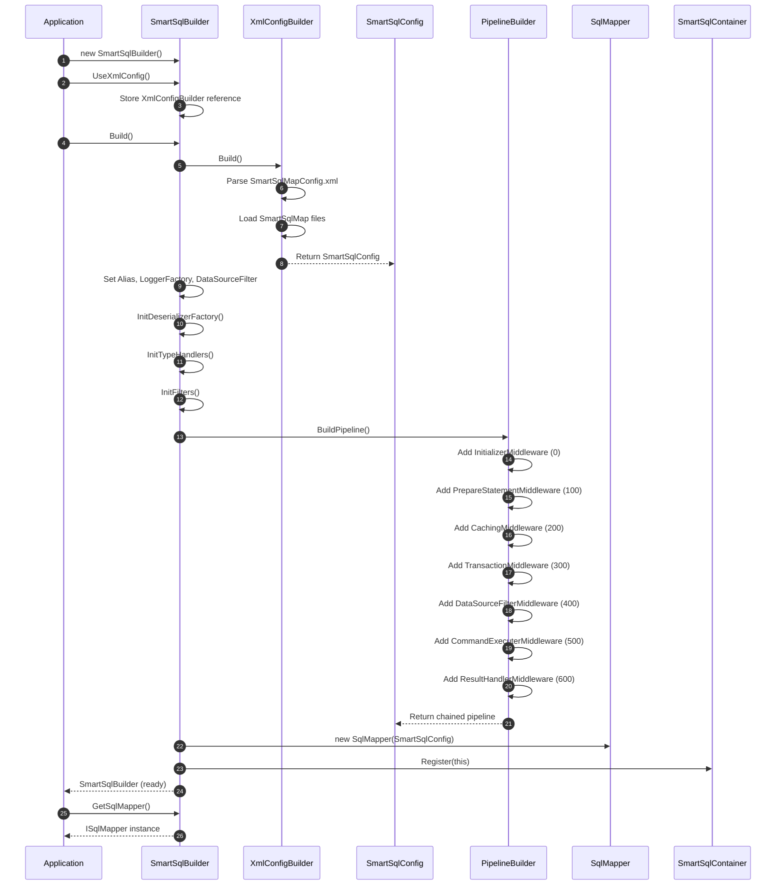
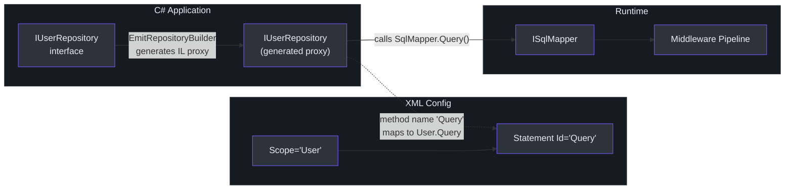

# Quick Start

This guide walks you from zero to a working SmartSql setup. By the end you will have a `SmartSqlBuilder` configured with XML, a running `ISqlMapper`, and a dynamic repository interface performing queries against your database.

## Installation

Install the core package from NuGet:

```bash
dotnet add package SmartSql
```

For ASP.NET Core dependency injection integration:

```bash
dotnet add package SmartSql.DIExtension
```

For dynamic repository support:

```bash
dotnet add package SmartSql.DyRepository
```

| Package | Purpose |
|---------|---------|
| `SmartSql` | Core library -- builder, mapper, middleware pipeline, XML config |
| `SmartSql.DIExtension` | `services.AddSmartSql()` and `AddRepositoryFromAssembly()` |
| `SmartSql.DyRepository` | Dynamic proxy repository generation |
| `SmartSql.Cache.Redis` | Redis cache provider |
| `SmartSql.TypeHandler` | JSON and custom type handlers |
| `SmartSql.Bulk.MySqlConnector` | MySQL bulk insert (and similar for other databases) |

## Step 1: Create the XML Configuration

Every SmartSql application needs a `SmartSqlMapConfig.xml` file. This file defines your database connections, settings, type handlers, and where to find SQL map files.

Create `SmartSqlMapConfig.xml` in your project root:

```xml
<?xml version="1.0" encoding="utf-8" ?>
<SmartSqlMapConfig xmlns="http://SmartSql.net/schemas/SmartSqlMapConfig.xsd">
  <Settings IgnoreParameterCase="false"
            ParameterPrefix="$"
            IsCacheEnabled="false" />
  <Database>
    <DbProvider Name="MySql" />
    <Write Name="WriteDB"
           ConnectionString="Server=localhost;Database=SmartSqlDB;Uid=root;Pwd=123456;" />
    <Read Name="ReadDB"
          ConnectionString="Server=localhost;Database=SmartSqlDB;Uid=root;Pwd=123456;"
          Weight="100" />
  </Database>
  <SmartSqlMaps>
    <SmartSqlMap Path="Maps" Type="Directory" />
  </SmartSqlMaps>
</SmartSqlMapConfig>
```

Set the file properties to **Copy to Output Directory: Copy if newer**.


<!-- Sources: src/SmartSql/SmartSqlBuilder.cs:468-472, src/SmartSql/ConfigBuilder/XmlConfigBuilder.cs -->

## Step 2: Create a SQL Map

Create a `Maps/User.xml` file to define SQL statements for a User entity:

```xml
<?xml version="1.0" encoding="utf-8" ?>
<SmartSqlMap Scope="User"
             xmlns="http://SmartSql.net/schemas/SmartSqlMap.xsd">
  <Statements>
    <Statement Id="Insert">
      INSERT INTO T_User (UserName, Status)
      VALUES (@UserName, @Status)
      ;SELECT LAST_INSERT_ID();
    </Statement>

    <Statement Id="Delete">
      DELETE FROM T_User WHERE Id = @Id
    </Statement>

    <Statement Id="Update">
      UPDATE T_User
      <Set>
        <IsProperty Prepend="," Property="UserName">
          UserName = @UserName
        </IsProperty>
        <IsProperty Prepend="," Property="Status">
          Status = @Status
        </IsProperty>
      </Set>
      WHERE Id = @Id
    </Statement>

    <Statement Id="GetEntity">
      SELECT T.* FROM T_User T
      <Where>
        <IsNotEmpty Prepend="AND" Property="Id">
          T.Id = @Id
        </IsNotEmpty>
      </Where>
      LIMIT 1
    </Statement>

    <Statement Id="Query">
      SELECT T.* FROM T_User T
      <Where>
        <IsNotEmpty Prepend="AND" Property="UserName">
          T.UserName = @UserName
        </IsNotEmpty>
        <IsNotEmpty Prepend="AND" Property="Status">
          T.Status = @Status
        </IsNotEmpty>
      </Where>
      ORDER BY T.Id DESC
    </Statement>
  </Statements>
</SmartSqlMap>
```

The `Scope` attribute on `<SmartSqlMap>` acts as a namespace. Statement IDs are referenced as `Scope.Id` (e.g., `User.Query`). This is the pattern used in the [sample application](https://github.com/dotnetcore/SmartSql/blob/master/sample/SmartSql.Sample.AspNetCore/Maps/User.xml).

## Step 3: Build SmartSqlMapper with the Fluent API

### Console Application

```csharp
using SmartSql;

var smartSqlBuilder = new SmartSqlBuilder()
    .UseXmlConfig()                          // loads SmartSqlMapConfig.xml
    .UseCache()                              // enable caching
    .Build();

ISqlMapper sqlMapper = smartSqlBuilder.GetSqlMapper();
```

The `SmartSqlBuilder.Build()` method ([src/SmartSql/SmartSqlBuilder.cs:60-76](https://github.com/dotnetcore/SmartSql/blob/master/src/SmartSql/SmartSqlBuilder.cs#L60-L76)) triggers the entire initialization chain:

1. `XmlConfigBuilder` parses `SmartSqlMapConfig.xml`
2. Database providers, type handlers, and id generators are resolved
3. SQL map XML files are loaded and parsed into `Statement` objects
4. The middleware pipeline is assembled
5. The `SmartSqlBuilder` is registered in `SmartSqlContainer`


<!-- Sources: src/SmartSql/SmartSqlBuilder.cs:60-76, src/SmartSql/SmartSqlBuilder.cs:155-201, src/SmartSql/PipelineBuilder.cs:24-39 -->

### ASP.NET Core Application

For ASP.NET Core, use the DI extension methods shown in the [sample Startup.cs](https://github.com/dotnetcore/SmartSql/blob/master/sample/SmartSql.Sample.AspNetCore/Startup.cs):

```csharp
// In Startup.cs / ConfigureServices
services.AddSmartSql((sp, builder) =>
{
    builder.UseProperties(Configuration);
})
.AddRepositoryFromAssembly(o =>
{
    o.AssemblyString = "MyApp";
    o.Filter = (type) => type.Namespace == "MyApp.Repositories";
});
```

`AddSmartSql()` registers `ISqlMapper`, `IDbSessionFactory`, and the `SmartSqlConfig` as singletons. `AddRepositoryFromAssembly()` scans the specified assembly for interfaces and generates dynamic proxy implementations.

## Step 4: Using ISqlMapper

`ISqlMapper` ([src/SmartSql/ISqlMapper.cs](https://github.com/dotnetcore/SmartSql/blob/master/src/SmartSql/ISqlMapper.cs)) is the primary API. It wraps `IDbSession` with automatic session lifecycle management -- opening a session if none exists, and disposing it after execution.

| Method | Return Type | Description |
|--------|-------------|-------------|
| `Execute(requestContext)` | `int` | Executes non-query (INSERT/UPDATE/DELETE), returns rows affected |
| `ExecuteScalar<T>(requestContext)` | `T` | Returns a single scalar value |
| `Query<T>(requestContext)` | `IList<T>` | Returns a list of entities |
| `QuerySingle<T>(requestContext)` | `T` | Returns a single entity |
| `GetDataTable(requestContext)` | `DataTable` | Returns raw `DataTable` |
| `GetDataSet(requestContext)` | `DataSet` | Returns raw `DataSet` with multiple result sets |
| All above | `Task<T>` | Async variants (`ExecuteAsync`, `QueryAsync`, etc.) |

### Building Request Contexts

SmartSql uses `RequestContext` objects to carry statement identity and parameters. The most common approach uses the `AbstractRequestContext.Create` factory or direct construction:

```csharp
// Query with parameters
var users = sqlMapper.Query<User>(new RequestContext
{
    Scope = "User",
    SqlId = "Query",
    Request = new { UserName = "SmartSql", Status = 1 }
});

// Get single entity by ID
var user = sqlMapper.GetEntity<User, long>("User", "GetEntity", 42);

// Execute insert and return affected rows
var rows = sqlMapper.Execute(new RequestContext
{
    Scope = "User",
    SqlId = "Insert",
    Request = new { UserName = "NewUser", Status = 1 }
});
```

## Step 5: Using Dynamic Repository

Dynamic Repository eliminates the need to call `ISqlMapper` directly. Define an interface, and SmartSql generates the implementation at runtime using IL emit ([src/SmartSql.DyRepository/](https://github.com/dotnetcore/SmartSql/tree/master/src/SmartSql.DyRepository)).

```csharp
using SmartSql.DyRepository.Annotations;

public interface IUserRepository : IRepository
{
    long Insert(User entity);

    [Statement(Id = "GetEntity")]
    User GetById([Param("Id")] long id);

    IEnumerable<User> Query([Param("Taken")] int taken);

    [Statement(Id = "QueryByPage")]
    Task<TPageResult> GetByPage<TPageResult>(object request);

    Task<IEnumerable<User>> QueryAsync([Param("Taken")] int taken);

    int Update(User entity);
}
```

Method-to-statement mapping rules:

| Convention | Maps To Statement |
|-----------|-------------------|
| Method name `Insert` | `Scope.Insert` |
| Method name `Update` | `Scope.Update` |
| Method name `Query` | `Scope.Query` |
| `[Statement(Id = "GetEntity")]` | `Scope.GetEntity` |
| Parameter `[Param("Id")]` | Maps parameter name to `@Id` in SQL |

The `Scope` is derived from the XML `Scope` attribute on the `SmartSqlMap` element that contains the matching statements. If multiple scopes have statements with the same ID, use `[Statement(Scope = "User")]` to disambiguate.


<!-- Sources: src/SmartSql.DyRepository/IRepository.cs:1-39, sample/SmartSql.Sample.AspNetCore/DyRepositories/IUserRepository.cs:1-24 -->

## Step 6: Using CUD Extensions

For simple CRUD operations, SmartSql can auto-generate SQL statements at runtime -- no XML required. The CUD system uses entity metadata and column attributes to build INSERT, UPDATE, DELETE, and SELECT statements ([src/SmartSql/CUD/CUDSqlGenerator.cs](https://github.com/dotnetcore/SmartSql/blob/master/src/SmartSql/CUD/CUDSqlGenerator.cs)).

```csharp
// Enable CUD in SmartSqlBuilder
var builder = new SmartSqlBuilder()
    .UseXmlConfig()
    .RegisterEntity(typeof(AllPrimitive))
    .UseCUDConfigBuilder()
    .Build();

var mapper = builder.GetSqlMapper();

// These work without any XML statement definitions:
long id = mapper.Insert<AllPrimitive, long>(entity);
var entity = mapper.GetById<AllPrimitive, long>(id);
int updated = mapper.Update<AllPrimitive>(entity);
int deleted = mapper.DeleteById<AllPrimitive, long>(id);
int deleted = mapper.DeleteMany<AllPrimitive, long>(new[] { 1L, 2L, 3L });
```

The `CUDSqlGenerator` automatically produces statements like:

| Generated Method | SQL |
|-----------------|-----|
| `Insert` | `INSERT INTO T_AllPrimitive (Col1, Col2, ...) VALUES (@Prop1, @Prop2, ...)` |
| `InsertReturnId` | Above + `SELECT LAST_INSERT_ID()` (database-specific) |
| `Update` | `UPDATE T_AllPrimitive SET Col1=@Prop1, ... WHERE Id=@Id` |
| `DeleteById` | `DELETE FROM T_AllPrimitive WHERE Id=@Id` |
| `DeleteMany` | `DELETE FROM T_AllPrimitive WHERE Id IN @Ids` |
| `GetEntity` | `SELECT * FROM T_AllPrimitive WHERE Id=@Id` |

## Transaction Management

### Manual Transactions

```csharp
try
{
    sqlMapper.BeginTransaction();
    sqlMapper.Execute(insertContext);
    sqlMapper.Execute(updateContext);
    sqlMapper.CommitTransaction();
}
catch
{
    sqlMapper.RollbackTransaction();
    throw;
}
```

### Statement-Level Transactions

You can declare a transaction isolation level directly on a `<Statement>` element in XML:

```xml
<Statement Id="InsertByStatementTransaction" Transaction="Unspecified">
    INSERT INTO T_AllPrimitive (...) VALUES (...)
</Statement>
```

The `TransactionMiddleware` ([src/SmartSql/Middlewares/TransactionMiddleware.cs](https://github.com/dotnetcore/SmartSql/blob/master/src/SmartSql/Middlewares/TransactionMiddleware.cs)) will automatically wrap this statement in a transaction.

### AOP Transactions (via SmartSql.AOP)

```csharp
[Transaction]
public long AddWithTranWrap(User user)
{
    var id = _userRepository.Insert(user);
    // other operations...
    return id;
}
```

## Working with Multiple Result Sets

For queries that return multiple result sets (common in pagination), use `MultipleResultMap` and `ValueTuple`:

```xml
<Statement Id="GetByPage_ValueTuple">
  SELECT T.* FROM T_AllPrimitive T
  <Include RefId="QueryParams"/>
  ORDER BY T.Id DESC
  LIMIT ?Offset, ?PageSize;

  SELECT COUNT(1) FROM T_AllPrimitive T
  <Include RefId="QueryParams"/>;
</Statement>
```

```csharp
var (list, total) = sqlMapper.GetByPage_ValueTuple<(IList<AllPrimitive>, int)>(
    new { Offset = 0, PageSize = 10 });
```

## Next Steps

- [Configuration](./configuration.md) -- Deep dive into SmartSqlMapConfig.xml and the fluent builder
- [XML SQL Maps](./xml-sql-maps.md) -- All dynamic SQL tags with examples
- [Changelog](./changelog.md) -- Version history and milestones

## References

- [SmartSqlBuilder.cs](https://github.com/dotnetcore/SmartSql/blob/master/src/SmartSql/SmartSqlBuilder.cs) -- Fluent builder with `UseXmlConfig()`, `UseDataSource()`, `UseCache()`, etc.
- [ISqlMapper.cs](https://github.com/dotnetcore/SmartSql/blob/master/src/SmartSql/ISqlMapper.cs) -- Mapper interface with sync/async methods
- [SqlMapper.cs](https://github.com/dotnetcore/SmartSql/blob/master/src/SmartSql/SqlMapper.cs) -- Mapper implementation
- [IRepository.cs](https://github.com/dotnetcore/SmartSql/blob/master/src/SmartSql.DyRepository/IRepository.cs) -- Repository base interfaces
- [CUDSqlGenerator.cs](https://github.com/dotnetcore/SmartSql/blob/master/src/SmartSql/CUD/CUDSqlGenerator.cs) -- Auto-generated CRUD SQL
- [Startup.cs (sample)](https://github.com/dotnetcore/SmartSql/blob/master/sample/SmartSql.Sample.AspNetCore/Startup.cs) -- ASP.NET Core integration example
- [UserController.cs (sample)](https://github.com/dotnetcore/SmartSql/blob/master/sample/SmartSql.Sample.AspNetCore/Controllers/UserController.cs) -- Using dynamic repository in a controller
