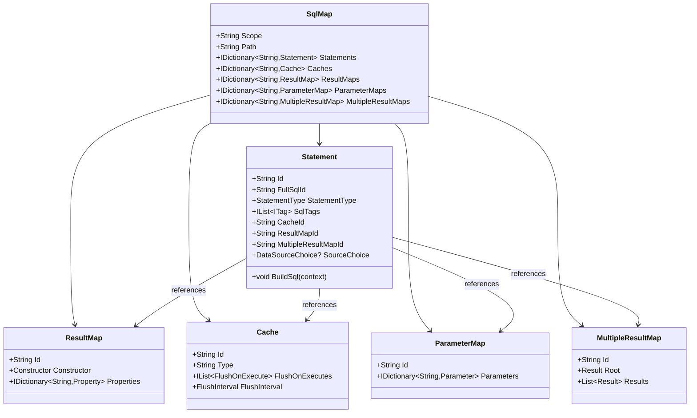
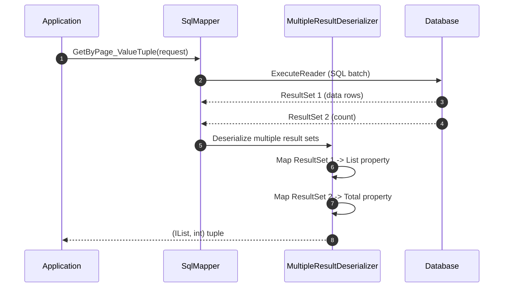
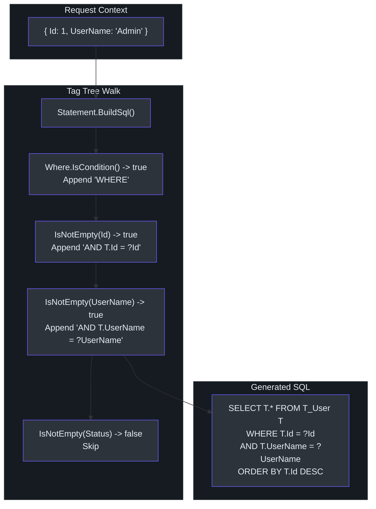

# XML SQL Maps

SmartSql stores all SQL statements in XML files called **SmartSqlMaps**. Each file defines a `Scope` (namespace) and contains `Statement` elements for SQL operations, `ResultMap` elements for column-to-property mapping, `Cache` elements for caching configuration, and `ParameterMap` elements for parameter type binding. This externalization of SQL is the defining feature of SmartSql -- it separates data-access logic from application code, allowing DBAs to review and tune queries independently.

## SmartSqlMap Structure

Each `.xml` file follows this top-level structure:

```xml
<?xml version="1.0" encoding="utf-8" ?>
<SmartSqlMap Scope="User"
             xmlns="http://SmartSql.net/schemas/SmartSqlMap.xsd">
  <Caches>
    <!-- Cache definitions -->
  </Caches>
  <ParameterMaps>
    <!-- Parameter type mappings -->
  </ParameterMaps>
  <ResultMaps>
    <!-- Column-to-property mappings -->
  </ResultMaps>
  <MultipleResultMaps>
    <!-- Multi-result-set mappings -->
  </MultipleResultMaps>
  <Statements>
    <!-- SQL statements -->
  </Statements>
</SmartSqlMap>
```

The `Scope` attribute is the namespace for all statements in this file. Statements are referenced as `Scope.Id` (e.g., `User.Query`, `User.Insert`). This model is defined in [src/SmartSql/Configuration/SqlMap.cs](https://github.com/dotnetcore/SmartSql/blob/master/src/SmartSql/Configuration/SqlMap.cs).


<!-- Sources: src/SmartSql/Configuration/SqlMap.cs:8-75, src/SmartSql/Configuration/Statement.cs:10-48 -->

## Statement

A `<Statement>` defines a single SQL operation. It has an `Id` attribute (unique within its scope) and contains dynamic SQL tags as child elements.

```xml
<Statement Id="Query">
  SELECT T.* FROM T_User T
  <Where>
    <IsNotEmpty Prepend="AND" Property="UserName">
      T.UserName = @UserName
    </IsNotEmpty>
    <IsNotEmpty Prepend="AND" Property="Status">
      T.Status = @Status
    </IsNotEmpty>
  </Where>
  ORDER BY T.Id DESC
</Statement>
```

### Statement Attributes

| Attribute | Type | Description |
|-----------|------|-------------|
| `Id` | `string` | Unique identifier within the scope. Referenced as `Scope.Id` |
| `ResultMap` | `string` | ID of a `ResultMap` for column-to-property mapping |
| `MultipleResultMap` | `string` | ID of a `MultipleResultMap` for multiple result sets |
| `Cache` | `string` | ID of a `Cache` to use for this statement |
| `ParameterMap` | `string` | ID of a `ParameterMap` for parameter type binding |
| `CommandType` | `CommandType` | `Text` (default), `StoredProcedure`, or `TableDirect` |
| `SourceChoice` | `DataSourceChoice` | Force `Read` or `Write` data source |
| `ReadDb` | `string` | Force a specific read data source by name |
| `Transaction` | `IsolationLevel` | Wrap this statement in a transaction (e.g., `Unspecified`, `ReadCommitted`) |
| `EnablePropertyChangedTrack` | `bool` | Enable property change tracking for partial updates |
| `CommandTimeout` | `int` | Command timeout in seconds |

### StatementType

SmartSql automatically determines whether a statement is a read or write operation by analyzing the SQL text. This drives the data source routing in `DataSourceFilterMiddleware`:

| Type | SQL Keywords | Data Source |
|------|-------------|-------------|
| `Read` | `SELECT` | Read (weighted) |
| `Write` | `INSERT`, `UPDATE`, `DELETE` | Write |
| `Unknown` | Other (e.g., stored procedures) | Write (default) |

## ResultMap

A `<ResultMap>` maps database column names to .NET property names. Use this when column names differ from property names or when you need nested property access.

```xml
<ResultMaps>
  <ResultMap Id="NestedPropertyResultMap">
    <Result Column="Id" Property="Id" />
    <Result Column="String" Property="NestedProp1.NestedProp2.NestedProp3" />
  </ResultMap>
</ResultMaps>
```

Reference it on a Statement:

```xml
<Statement Id="QueryNestedPropertyResult" ResultMap="NestedPropertyResultMap">
  SELECT T.* FROM T_AllPrimitive T ...
</Statement>
```

Result maps support:
- Simple column-to-property mapping
- Nested/chained property access via dot notation (e.g., `NestedProp1.NestedProp2.NestedProp3`)
- Custom `TypeHandler` per column via the `Handler` attribute

## MultipleResultMap

A `<MultipleResultMap>` maps multiple result sets from a single statement to different properties of a response object. This is essential for paginated queries that return both data rows and a total count.

```xml
<MultipleResultMaps>
  <MultipleResultMap Id="QueryByPageResult">
    <Result Property="List" />
    <Result Property="Total" />
    <Result Property="UserName" />
  </MultipleResultMap>
</MultipleResultMaps>
```

The corresponding statement uses multiple SQL batches separated by semicolons:

```xml
<Statement Id="QueryByPage" MultipleResultMap="QueryByPageResult">
  SELECT T.* FROM T_User T
  <Include RefId="QueryParams" />
  LIMIT @PageSize OFFSET 0;

  SELECT COUNT(1) FROM T_User T
  <Include RefId="QueryParams" />;

  SELECT 'SmartSql';
</Statement>
```

Each result set maps to the corresponding `<Result>` in order: the first query maps to `List`, the second to `Total`, and the third to `UserName`.

### Root Result

A `<MultipleResultMap>` can optionally specify a `<Root>` result that maps to the root object itself rather than a property:

```xml
<MultipleResultMap Id="MultiRoot">
  <Root />
  <Result Property="List" />
</MultipleResultMap>
```


<!-- Sources: src/SmartSql/Configuration/MultipleResultMap.cs:8-30, src/SmartSql.Test.Unit/Maps/AllPrimitive.xml:17-26 -->

## Cache

Caching is configured per-scope in the `<Caches>` section and referenced by individual statements.

```xml
<Caches>
  <Cache Id="UserCache" Type="Lru">
    <FlushOnExecute Statement="Update" />
    <FlushOnExecute Statement="Delete" />
  </Cache>
</Caches>
```

| Cache Type | Description |
|-----------|-------------|
| `Lru` | Least Recently Used eviction policy |
| `Fifo` | First In First Out eviction policy |

### Cache Attributes

| Attribute | Description |
|-----------|-------------|
| `Id` | Unique cache identifier within the scope |
| `Type` | Cache implementation type (`Lru` or `Fifo`) |

### FlushOnExecute

Invalidates the cache when a specified statement is executed. This ensures that writes automatically clear stale cached reads:

```xml
<Cache Id="UserCache" Type="Lru">
  <FlushOnExecute Statement="Update" />
  <FlushOnExecute Statement="Delete" />
</Cache>
```

### FlushInterval

Time-based cache expiration:

```xml
<Cache Id="UserCache" Type="Lru">
  <FlushInterval Hours="0" Minutes="5" Seconds="0" />
</Cache>
```

### Referencing a Cache

```xml
<Statement Id="GetEntity" Cache="UserCache">
  SELECT T.* FROM T_User T WHERE T.Id = @Id
</Statement>
```

Cache is only active when `IsCacheEnabled="true"` is set in `<Settings>`. When enabled, the `CachingMiddleware` (Order: 200) checks the cache before SQL execution and populates it after execution ([src/SmartSql/Middlewares/CachingMiddleware.cs:13-29](https://github.com/dotnetcore/SmartSql/blob/master/src/SmartSql/Middlewares/CachingMiddleware.cs#L13-L29)).

## ParameterMap

A `<ParameterMap>` explicitly maps parameter names to database types and type handlers:

```xml
<ParameterMaps>
  <ParameterMap Id="UserParamMap">
    <Parameter Property="Id" DbType="Int64" />
    <Parameter Property="UserName" DbType="String" />
  </ParameterMap>
</ParameterMaps>
```

Reference it on a Statement:

```xml
<Statement Id="GetEntity" ParameterMap="UserParamMap">
  ...
</Statement>
```

## Dynamic SQL Tags

SmartSql provides a rich set of XML tags for building SQL dynamically based on request parameters. At runtime, each tag evaluates its `IsCondition()` method and only appends its SQL fragment if the condition passes. The tag tree is walked by `Statement.BuildSql()` ([src/SmartSql/Configuration/Statement.cs:41-47](https://github.com/dotnetcore/SmartSql/blob/master/src/SmartSql/Configuration/Statement.cs#L41-L47)).

```mermaid
flowchart TD
    subgraph tags["Tag Inheritance Hierarchy"]
        style tags fill:#161b22,stroke:#30363d,color:#e6edf3
        ITag["ITag<br>IsCondition(), BuildSql()"]
        TAG["Tag (abstract)<br>Prepend, Property, Required"]
        DYNAMIC["Dynamic<br>Min"]
        COMPARE["CompareTag&lt;T&gt;<br>CompareValue"]
        NC["NumericalCompareTag<br>(Decimal)"]
        SC["StringCompareTag<br>(String)"]
    end

    TAG --> ITag
    DYNAMIC --> TAG
    COMPARE --> TAG
    NC --> COMPARE
    SC --> COMPARE

    subgraph concrete["Concrete Tags"]
        style concrete fill:#161b22,stroke:#30363d,color:#e6edf3
        WHERE["Where"]
        SET["Set"]
        ISE["IsNotEmpty"]
        ISN["IsNotNull"]
        ISP["IsProperty"]
        EQ["IsEqual"]
        NE["IsNotEqual"]
        GT["IsGreaterThan"]
        LT["IsLessThan"]
        GE["IsGreaterEqual"]
        LE["IsLessEqual"]
        RNG["Range"]
        SW["Switch"]
        FOR["For"]
        INC["Include"]
        ENV["Env"]
        NOW["Now"]
        UUID["UUID"]
        IDG["IdGenerator"]
        PH["Placeholder"]
        OB["OrderBy"]
        IST["IsTrue"]
        ISF["IsFalse"]
        ISEm["IsEmpty"]
    end

    WHERE --> DYNAMIC
    SET --> DYNAMIC
    ISE --> TAG
    ISN --> TAG
    ISP --> TAG
    EQ --> SC
    NE --> SC
    GT --> NC
    LT --> NC
    GE --> NC
    LE --> NC
    RNG --> TAG
    SW --> TAG
    FOR --> TAG
    INC --> TAG
    ENV --> TAG
    NOW --> TAG
    UUID --> TAG
    PH --> TAG
    OB --> TAG
    IST --> TAG
    ISF --> TAG
    ISEm --> TAG

    style ITag fill:#2d333b,stroke:#6d5dfc,color:#e6edf3
    style TAG fill:#2d333b,stroke:#6d5dfc,color:#e6edf3
    style DYNAMIC fill:#2d333b,stroke:#6d5dfc,color:#e6edf3
    style COMPARE fill:#2d333b,stroke:#6d5dfc,color:#e6edf3
    style NC fill:#2d333b,stroke:#6d5dfc,color:#e6edf3
    style SC fill:#2d333b,stroke:#6d5dfc,color:#e6edf3
    style WHERE fill:#2d333b,stroke:#6d5dfc,color:#e6edf3
    style SET fill:#2d333b,stroke:#6d5dfc,color:#e6edf3
    style ISE fill:#2d333b,stroke:#6d5dfc,color:#e6edf3
    style ISN fill:#2d333b,stroke:#6d5dfc,color:#e6edf3
    style ISP fill:#2d333b,stroke:#6d5dfc,color:#e6edf3
    style EQ fill:#2d333b,stroke:#6d5dfc,color:#e6edf3
    style NE fill:#2d333b,stroke:#6d5dfc,color:#e6edf3
    style GT fill:#2d333b,stroke:#6d5dfc,color:#e6edf3
    style LT fill:#2d333b,stroke:#6d5dfc,color:#e6edf3
    style GE fill:#2d333b,stroke:#6d5dfc,color:#e6edf3
    style LE fill:#2d333b,stroke:#6d5dfc,color:#e6edf3
    style RNG fill:#2d333b,stroke:#6d5dfc,color:#e6edf3
    style SW fill:#2d333b,stroke:#6d5dfc,color:#e6edf3
    style FOR fill:#2d333b,stroke:#6d5dfc,color:#e6edf3
    style INC fill:#2d333b,stroke:#6d5dfc,color:#e6edf3
    style ENV fill:#2d333b,stroke:#6d5dfc,color:#e6edf3
    style NOW fill:#2d333b,stroke:#6d5dfc,color:#e6edf3
    style UUID fill:#2d333b,stroke:#6d5dfc,color:#e6edf3
    style PH fill:#2d333b,stroke:#6d5dfc,color:#e6edf3
    style OB fill:#2d333b,stroke:#6d5dfc,color:#e6edf3
    style IST fill:#2d333b,stroke:#6d5dfc,color:#e6edf3
    style ISF fill:#2d333b,stroke:#6d5dfc,color:#e6edf3
    style ISEm fill:#2d333b,stroke:#6d5dfc,color:#e6edf3
    style IDG fill:#2d333b,stroke:#6d5dfc,color:#e6edf3
```


<!-- Sources: src/SmartSql/Configuration/Tags/ITag.cs:8-16, src/SmartSql/Configuration/Tags/Tag.cs:8-62, src/SmartSql/Configuration/Tags/Dynamic.cs:9-59 -->

### Tag Reference Table

| Tag | Base Class | Condition | Description |
|-----|-----------|-----------|-------------|
| `Where` | `Dynamic` | At least one child condition passes | Prepends `WHERE` and strips leading `AND`/`OR` |
| `Set` | `Dynamic` | At least one child condition passes | Prepends `SET` and strips trailing commas |
| `Dynamic` | `Tag` | At least one child condition passes | Generic container with configurable `Prepend` |
| `IsNotEmpty` | `Tag` | Property exists and is not null/empty | Most commonly used condition tag |
| `IsNotEmpty` + `Required` | `Tag` | Must exist, throws `TagRequiredFailException` if missing | Enforces required parameters |
| `IsNull` | `Tag` | Property value is null | |
| `IsNotNull` | `Tag` | Property value is not null | |
| `IsEmpty` | `Tag` | Property is null or empty string | |
| `IsProperty` | `Tag` | Property exists in parameters (regardless of value) | Used in `Set` for partial updates |
| `IsNotProperty` | `Tag` | Property does NOT exist in parameters | |
| `IsEqual` | `StringCompareTag` | Property value equals `CompareValue` | String comparison |
| `IsNotEqual` | `StringCompareTag` | Property value does not equal `CompareValue` | |
| `IsGreaterThan` | `NumericalCompareTag` | Numeric value > `CompareValue` | |
| `IsGreaterEqual` | `NumericalCompareTag` | Numeric value >= `CompareValue` | |
| `IsLessThan` | `NumericalCompareTag` | Numeric value < `CompareValue` | |
| `IsLessEqual` | `NumericalCompareTag` | Numeric value <= `CompareValue` | |
| `IsTrue` | `Tag` | Boolean property is `true` | |
| `IsFalse` | `Tag` | Boolean property is `false` | |
| `Range` | `Tag` | Numeric value is between `Min` and `Max` (inclusive) | |
| `Switch` | `Tag` | Matches `Case` children by value, falls back to `Default` | |
| `For` | `Tag` | Collection property is non-empty | Iterates a collection |
| `Include` | `Tag` | Included statement has passing conditions | Includes another statement's tag tree |
| `Env` | `Tag` | Current `DbProvider.Name` matches | Database-provider-specific SQL |
| `Now` | `Tag` | Always true | Injects `DateTime.Now` as parameter |
| `UUID` | `Tag` | Always true | Injects `Guid.NewGuid()` as parameter |
| `IdGenerator` | N/A | Always true | Generates ID via configured `IIdGenerator` |
| `Placeholder` | `Tag` | Property exists | Raw string substitution (not parameterized) |
| `OrderBy` | `Tag` | Property is a `KeyValuePair<string,string>` or collection | Dynamic ORDER BY clause |

### Common Tag Attributes

| Attribute | Applies To | Description |
|-----------|-----------|-------------|
| `Prepend` | All tags | SQL text prepended when condition passes (e.g., `"And"`, `","`) |
| `Property` | All tags | The request parameter name to check |
| `Required` | All tags | If `true` and condition fails, throws `TagRequiredFailException` |
| `CompareValue` | `IsEqual`, `IsGreaterThan`, etc. | The value to compare against |
| `Min` | `Where`, `Dynamic`, `Range` | Minimum matching child tags (for `Where`/`Dynamic`) or minimum numeric value (for `Range`) |
| `Max` | `Range` | Maximum numeric value |

## Where

The `<Where>` tag generates a `WHERE` clause only if at least one child condition passes. It automatically strips leading `AND`/`OR` from the first included fragment ([src/SmartSql/Configuration/Tags/Where.cs:10-33](https://github.com/dotnetcore/SmartSql/blob/master/src/SmartSql/Configuration/Tags/Where.cs#L10-L33)).

```xml
<Statement Id="QueryParams">
  <Where>
    <IsNotEmpty Prepend="AND" Property="Id">
      T.Id = ?Id
    </IsNotEmpty>
    <IsNotEmpty Prepend="AND" Property="UserName">
      T.UserName = ?UserName
    </IsNotEmpty>
    <IsNotEmpty Prepend="AND" Property="Status">
      T.Status = ?Status
    </IsNotEmpty>
  </Where>
</Statement>
```

With `{ Id = 1, UserName = null, Status = null }` this produces: `WHERE T.Id = ?Id`

With `{ Id = null, UserName = null, Status = null }` this produces nothing (no WHERE clause).

The `Min` attribute enforces a minimum number of matching conditions. If fewer child tags match, a `TagMinMatchedFailException` is thrown:

```xml
<Where Min="1">
  <IsNotEmpty Prepend="AND" Property="Id">
    T.Id = ?Id
  </IsNotEmpty>
</Where>
```

## Set

The `<Set>` tag generates a `SET` clause for UPDATE statements, automatically stripping the trailing comma from the last included fragment ([src/SmartSql/Configuration/Tags/Set.cs](https://github.com/dotnetcore/SmartSql/blob/master/src/SmartSql/Configuration/Tags/Set.cs)).

```xml
<Statement Id="Update">
  UPDATE T_User
  <Set>
    <IsProperty Prepend="," Property="UserName">
      UserName = @UserName
    </IsProperty>
    <IsProperty Prepend="," Property="Status" PropertyChanged="Ignore">
      Status = @Status
    </IsProperty>
  </Set>
  WHERE Id = @Id
</Statement>
```

With `{ Id = 1, UserName = "NewName" }` (no Status), this produces: `UPDATE T_User SET UserName = @UserName WHERE Id = @Id`

The `PropertyChanged` attribute on `IsProperty` can be set to `Ignore` to skip the field during property change tracking, useful when `EnablePropertyChangedTrack` is active.

## IsNotEmpty

The most commonly used conditional tag. Passes when the property exists in the request and is not null, not an empty string, and (for collections) has at least one element ([src/SmartSql/Configuration/Tags/IsNotEmpty.cs:10-27](https://github.com/dotnetcore/SmartSql/blob/master/src/SmartSql/Configuration/Tags/IsNotEmpty.cs#L10-L27)).

```xml
<IsNotEmpty Prepend="AND" Property="UserName">
  T.UserName = @UserName
</IsNotEmpty>
```

With `Required="true"`, throws `TagRequiredFailException` if the property is missing or empty:

```xml
<IsNotEmpty Prepend="AND" Property="Id" Required="true">
  T.Id = ?Id
</IsNotEmpty>
```

## Comparison Tags

### IsEqual / IsNotEqual

String-based equality comparison. Works with enums (compared as integer values):

```xml
<IsEqual Prepend="AND" Property="Status" CompareValue="1">
  T.Status = 1
</IsEqual>
```

### IsGreaterThan / IsGreaterEqual / IsLessThan / IsLessEqual

Numerical comparison tags. Parse the property value as `Decimal` and compare against `CompareValue` ([src/SmartSql/Configuration/Tags/IsGreaterThan.cs:10-26](https://github.com/dotnetcore/SmartSql/blob/master/src/SmartSql/Configuration/Tags/IsGreaterThan.cs#L10-L26)):

```xml
<IsGreaterThan Property="Property" CompareValue="10">
  Property IsGreaterThan 10
</IsGreaterThan>
```

```xml
<IsLessThan Property="Property" CompareValue="10">
  Property IsLessThan 10
</IsLessThan>
```

### Range

Checks that a numeric property value falls within `[Min, Max]` (inclusive):

```xml
<Range Min="0" Max="10" Property="Property">
  Property BETWEEN 0 AND 10
</Range>
```

With `Required="true"`, throws if the value is outside the range:

```xml
<Range Min="0" Max="10" Property="Property" Required="true">
  Property BETWEEN 0 AND 10
</Range>
```

## Switch

The `<Switch>` tag matches a property value against `<Case>` elements, similar to a C# `switch` statement. If no `Case` matches, the `<Default>` block is used ([src/SmartSql/Configuration/Tags/Switch.cs:6-57](https://github.com/dotnetcore/SmartSql/blob/master/src/SmartSql/Configuration/Tags/Switch.cs#L6-L57)).

```xml
<Statement Id="Query">
  SELECT T.* FROM T_User T
  <Include RefId="QueryParams" />
  <Switch Prepend="ORDER BY" Property="OrderBy">
    <Case CompareValue="1">T.UserName ASC</Case>
    <Case CompareValue="2">T.CreateTime DESC</Case>
    <Default>T.Id DESC</Default>
  </Switch>
</Statement>
```

Nested case with other dynamic tags:

```xml
<Switch Prepend="AND" Property="Index">
  <Case CompareValue="1">1=1</Case>
</Switch>
```

## For

The `<For>` tag iterates over a collection property, generating SQL for each element. It supports both direct values (primitives, strings) and complex objects ([src/SmartSql/Configuration/Tags/For.cs:12-163](https://github.com/dotnetcore/SmartSql/blob/master/src/SmartSql/Configuration/Tags/For.cs#L12-L163)).

### For Direct Values

```xml
<Statement Id="ForWhenDirectValue">
  <For Property="Items" Open="(" Separator="," Close=")" Key="Item">
    ?Item
  </For>
</Statement>
```

With `{ Items = [1, 2, 3] }`, this produces: `(1, 2, 3)`

### For Complex Objects

```xml
<Statement Id="ForWhenNotDirectValueWithKey">
  <For Property="Items" Open="(" Separator="," Close=")" Key="Item">
    ?Item.Id
  </For>
</Statement>
```

With `{ Items = [{Id: 1}, {Id: 2}] }`, this produces: `(1, 2)`

### For Attributes

| Attribute | Description |
|-----------|-------------|
| `Property` | The request parameter name holding the collection |
| `Key` | Variable name for each item in the iteration |
| `Open` | String prepended before the iteration (e.g., `"("`) |
| `Separator` | String between items (e.g., `","`) |
| `Close` | String appended after the iteration (e.g., `")"`) |

## Include

The `<Include>` tag includes the tag tree from another statement in the same scope. This enables SQL fragment reuse ([src/SmartSql/Configuration/Tags/Include.cs:7-30](https://github.com/dotnetcore/SmartSql/blob/master/src/SmartSql/Configuration/Tags/Include.cs#L7-L30)).

First, define a reusable fragment:

```xml
<Statement Id="QueryParams">
  <Where>
    <IsNotEmpty Prepend="AND" Property="Id">
      T.Id = ?Id
    </IsNotEmpty>
    <IsNotEmpty Prepend="AND" Property="UserName">
      T.UserName = ?UserName
    </IsNotEmpty>
  </Where>
</Statement>
```

Then include it in other statements:

```xml
<Statement Id="Query">
  SELECT T.* FROM T_User T
  <Include RefId="QueryParams" />
  ORDER BY T.Id DESC
</Statement>

<Statement Id="GetRecord">
  SELECT COUNT(1) FROM T_User T
  <Include RefId="QueryParams" />
</Statement>

<Statement Id="GetEntity">
  SELECT T.* FROM T_User T
  <Where Min="1">
    <IsNotEmpty Prepend="AND" Property="Id">
      T.Id = @Id
    </IsNotEmpty>
  </Where>
  LIMIT 1
</Statement>
```

With `Required="true"`, the include throws if none of its child conditions pass.

## Env

The `<Env>` tag conditionally includes SQL based on the current database provider. This allows writing database-specific SQL in a single map file ([src/SmartSql/Configuration/Tags/Env.cs:7-15](https://github.com/dotnetcore/SmartSql/blob/master/src/SmartSql/Configuration/Tags/Env.cs#L7-L15)).

```xml
<Statement Id="Env">
  <Env DbProvider="SqlServer" Prepend="AND">
    SqlServer
  </Env>
  <Env DbProvider="MySql">
    <IsNotEmpty Property="Property">
      Mysql
    </IsNotEmpty>
  </Env>
</Statement>
```

The `DbProvider` attribute matches against `SmartSqlConfig.Database.DbProvider.Name`.

## Now

The `<Now>` tag injects the current date/time as a parameter. The `Kind` attribute controls UTC vs local time ([src/SmartSql/Configuration/Tags/Now.cs](https://github.com/dotnetcore/SmartSql/blob/master/src/SmartSql/Configuration/Tags/Now.cs)):

```xml
<Statement Id="Now">
  <Now Property="NowTime" />
  ?NowTime
</Statement>
```

```xml
<!-- UTC variant -->
<Now Property="CreateTime" Kind="UTC" />
```

## UUID

The `<UUID>` tag injects a new `Guid` as a parameter. The optional `Format` attribute applies a format string ([src/SmartSql/Configuration/Tags/UUID.cs](https://github.com/dotnetcore/SmartSql/blob/master/src/SmartSql/Configuration/Tags/UUID.cs)):

```xml
<Statement Id="UUID">
  <UUID Property="UUID" />
  ?UUID
</Statement>
```

With `Format="N"`, the GUID is formatted without hyphens:

```xml
<UUID Property="UUID" Format="N" />
```

## IdGenerator

The `<IdGenerator>` tag generates an ID using a configured `IIdGenerator` (e.g., SnowflakeId). The `Id` attribute specifies which parameter receives the generated ID. The `Assign` attribute controls whether the ID is also set back on the request object ([src/SmartSql/Configuration/Tags/IdGenerator.cs:12-34](https://github.com/dotnetcore/SmartSql/blob/master/src/SmartSql/Configuration/Tags/IdGenerator.cs#L12-L34)):

```xml
<Statement Id="InsertByIdGen">
  <IdGenerator Id="Int64" Assign="false" />
  INSERT INTO T_AllPrimitive (..., Int64, ...)
  VALUES (..., ?Int64, ...)
  ;SELECT ?Int64;
</Statement>
```

```xml
<Statement Id="InsertByIdGenAssignId">
  <IdGenerator Id="Int64" />
  INSERT INTO T_AllPrimitive (..., Int64, ...)
  VALUES (..., ?Int64, ...)
</Statement>
```

When `Assign="true"` (default), the generated ID is written back to the request entity's `Int64` property.

## Placeholder

The `<Placeholder>` tag performs raw string substitution -- not parameterized. The property value is inserted directly into the SQL text. Use with caution (SQL injection risk for user input) ([src/SmartSql/Configuration/Tags/Placeholder.cs](https://github.com/dotnetcore/SmartSql/blob/master/src/SmartSql/Configuration/Tags/Placeholder.cs)):

```xml
<Statement Id="Placeholder">
  <Placeholder Property="Placeholder" />
</Statement>
```

Supports nested properties with dot notation:

```xml
<Placeholder Property="Nest.Placeholder" />
```

## OrderBy

The `<OrderBy>` tag generates a dynamic `ORDER BY` clause from a `KeyValuePair<string, string>` or collection of pairs ([src/SmartSql/Configuration/Tags/OrderBy.cs:8-60](https://github.com/dotnetcore/SmartSql/blob/master/src/SmartSql/Configuration/Tags/OrderBy.cs#L8-L60)):

```xml
<Statement Id="OrderBy">
  <OrderBy Property="OrderBy" />
</Statement>
```

Pass the ordering as a dictionary:

```csharp
var result = sqlMapper.Query<Entity>(new
{
    OrderBy = new Dictionary<string, string>
    {
        { "T.UserName", "ASC" },
        { "T.CreateTime", "DESC" }
    }
});
```

This produces: `ORDER BY T.UserName ASC, T.CreateTime DESC`

## Script Tag

The `Script` tag (from `SmartSql.ScriptTag`) allows embedding C# script code for complex dynamic SQL logic. It requires a custom `TagBuilder` registration:

```xml
<!-- In SmartSqlMapConfig.xml -->
<TagBuilders>
  <TagBuilder Name="Script" Type="${ScriptBuilder}" />
</TagBuilders>
```

```xml
<Script>
  // C# script code here
</Script>
```

## How Tags Compose SQL

At runtime, `Statement.BuildSql()` walks the tag tree depth-first. Each tag's `BuildSql()` method checks `IsCondition()` first, then appends its SQL fragment to `context.SqlBuilder`. The `Dynamic` base class (parent of `Where` and `Set`) manages the "prepend on first child" behavior.


<!-- Sources: src/SmartSql/Configuration/Statement.cs:41-47, src/SmartSql/Configuration/Tags/Tag.cs:21-36, src/SmartSql/Configuration/Tags/Dynamic.cs:32-58 -->

## Full Example: User CRUD

This example is based on the [sample application](https://github.com/dotnetcore/SmartSql/blob/master/sample/SmartSql.Sample.AspNetCore/Maps/User.xml):

```xml
<?xml version="1.0" encoding="utf-8" ?>
<SmartSqlMap Scope="User" xmlns="http://SmartSql.net/schemas/SmartSqlMap.xsd">
  <Caches>
    <Cache Id="UserCache" Type="Lru">
      <FlushOnExecute Statement="Update" />
      <FlushOnExecute Statement="Delete" />
    </Cache>
  </Caches>

  <MultipleResultMaps>
    <MultipleResultMap Id="QueryByPageResult">
      <Result Property="List" />
      <Result Property="Total" />
      <Result Property="UserName" />
    </MultipleResultMap>
  </MultipleResultMaps>

  <Statements>
    <!-- Reusable WHERE fragment -->
    <Statement Id="QueryParams">
      <Where>
        <IsNotEmpty Prepend="And" Property="Id">
          T.Id = @Id
        </IsNotEmpty>
        <IsNotEmpty Prepend="And" Property="UserName">
          T.UserName = @UserName
        </IsNotEmpty>
        <IsNotEmpty Prepend="And" Property="Status">
          T.Status = @Status
        </IsNotEmpty>
      </Where>
    </Statement>

    <!-- INSERT -->
    <Statement Id="Insert">
      INSERT INTO T_User (UserName, Status)
      VALUES (@UserName, @Status)
      ;SELECT LAST_INSERT_ROWID() FROM T_User
    </Statement>

    <!-- DELETE -->
    <Statement Id="Delete">
      DELETE FROM T_User WHERE Id = @Id
    </Statement>

    <!-- UPDATE with partial-set support -->
    <Statement Id="Update">
      UPDATE T_User
      <Set>
        <IsProperty Prepend="," Property="UserName">
          UserName = @UserName
        </IsProperty>
        <IsProperty Prepend="," Property="Status"
                     PropertyChanged="Ignore">
          Status = @Status
        </IsProperty>
      </Set>
      WHERE Id = @Id
    </Statement>

    <!-- QUERY with dynamic filters -->
    <Statement Id="Query">
      SELECT T.* FROM T_User T
      <Include RefId="QueryParams" />
      <Switch Prepend="ORDER BY" Property="OrderBy">
        <Default>T.Id DESC</Default>
      </Switch>
      <IsNotEmpty Property="Taken">
        LIMIT @Taken
      </IsNotEmpty>
    </Statement>

    <!-- PAGINATION with multiple result sets -->
    <Statement Id="QueryByPage" MultipleResultMap="QueryByPageResult">
      SELECT T.* FROM T_User T
      <Include RefId="QueryParams" />
      LIMIT @PageSize OFFSET 0;
      SELECT COUNT(1) FROM T_User T
      <Include RefId="QueryParams" />;
      SELECT 'SmartSql';
    </Statement>

    <!-- GET SINGLE ENTITY with required ID -->
    <Statement Id="GetEntity">
      SELECT T.* FROM T_User T
      <Where Min="1">
        <IsNotEmpty Prepend="And" Property="Id">
          T.Id = @Id
        </IsNotEmpty>
      </Where>
      LIMIT 1
    </Statement>
  </Statements>
</SmartSqlMap>
```

## Cross-References

- [Introduction](./index.md) -- Architecture overview and middleware pipeline
- [Quick Start](./quick-start.md) -- Getting started with SmartSql
- [Configuration](./configuration.md) -- SmartSqlMapConfig.xml and builder API

## References

- [Statement.cs](https://github.com/dotnetcore/SmartSql/blob/master/src/SmartSql/Configuration/Statement.cs) -- Statement model with `BuildSql()` method
- [SqlMap.cs](https://github.com/dotnetcore/SmartSql/blob/master/src/SmartSql/Configuration/SqlMap.cs) -- SQL map model
- [ITag.cs](https://github.com/dotnetcore/SmartSql/blob/master/src/SmartSql/Configuration/Tags/ITag.cs) -- Tag interface
- [Tag.cs](https://github.com/dotnetcore/SmartSql/blob/master/src/SmartSql/Configuration/Tags/Tag.cs) -- Tag base class
- [Where.cs](https://github.com/dotnetcore/SmartSql/blob/master/src/SmartSql/Configuration/Tags/Where.cs) -- Where tag implementation
- [Dynamic.cs](https://github.com/dotnetcore/SmartSql/blob/master/src/SmartSql/Configuration/Tags/Dynamic.cs) -- Dynamic tag (parent of Where/Set)
- [Set.cs](https://github.com/dotnetcore/SmartSql/blob/master/src/SmartSql/Configuration/Tags/Set.cs) -- Set tag
- [Switch.cs](https://github.com/dotnetcore/SmartSql/blob/master/src/SmartSql/Configuration/Tags/Switch.cs) -- Switch/Case/Default tags
- [For.cs](https://github.com/dotnetcore/SmartSql/blob/master/src/SmartSql/Configuration/Tags/For.cs) -- For iteration tag
- [Include.cs](https://github.com/dotnetcore/SmartSql/blob/master/src/SmartSql/Configuration/Tags/Include.cs) -- Include tag
- [ResultMap.cs](https://github.com/dotnetcore/SmartSql/blob/master/src/SmartSql/Configuration/ResultMap.cs) -- Result map model
- [MultipleResultMap.cs](https://github.com/dotnetcore/SmartSql/blob/master/src/SmartSql/Configuration/MultipleResultMap.cs) -- Multiple result map model
- [Cache.cs](https://github.com/dotnetcore/SmartSql/blob/master/src/SmartSql/Configuration/Cache.cs) -- Cache configuration model
- [ParameterMap.cs](https://github.com/dotnetcore/SmartSql/blob/master/src/SmartSql/Configuration/ParameterMap.cs) -- Parameter map model
- [User.xml (sample)](https://github.com/dotnetcore/SmartSql/blob/master/sample/SmartSql.Sample.AspNetCore/Maps/User.xml) -- Complete User CRUD example
- [AllPrimitive.xml (test)](https://github.com/dotnetcore/SmartSql/blob/master/src/SmartSql.Test.Unit/Maps/AllPrimitive.xml) -- Full entity CRUD example
- [TagTest.xml (test)](https://github.com/dotnetcore/SmartSql/blob/master/src/SmartSql.Test.Unit/Maps/TagTest.xml) -- Tag usage examples
