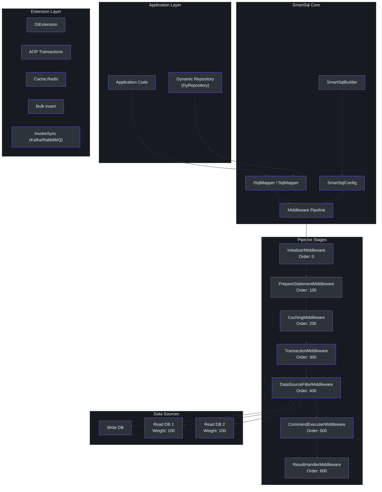
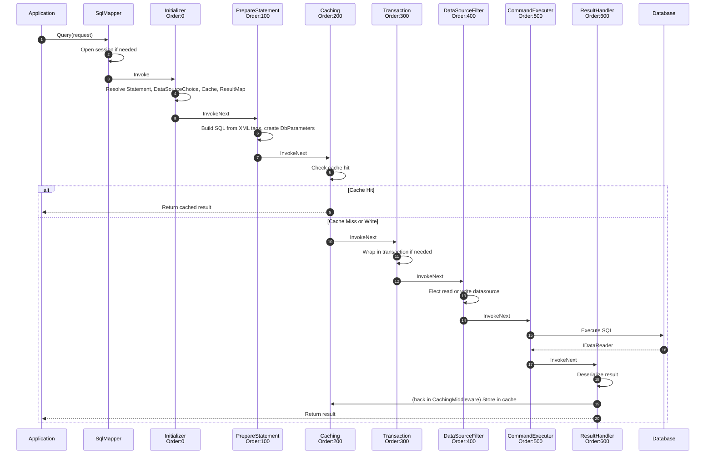
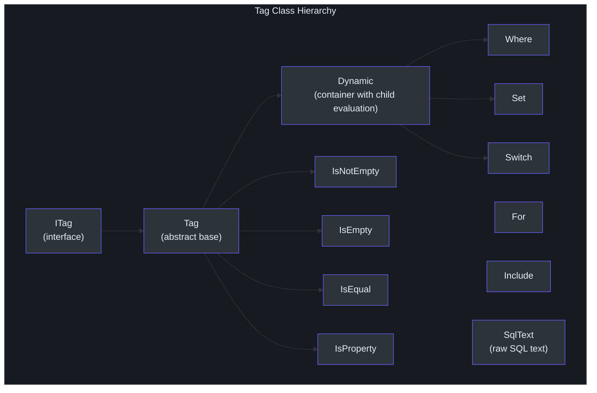
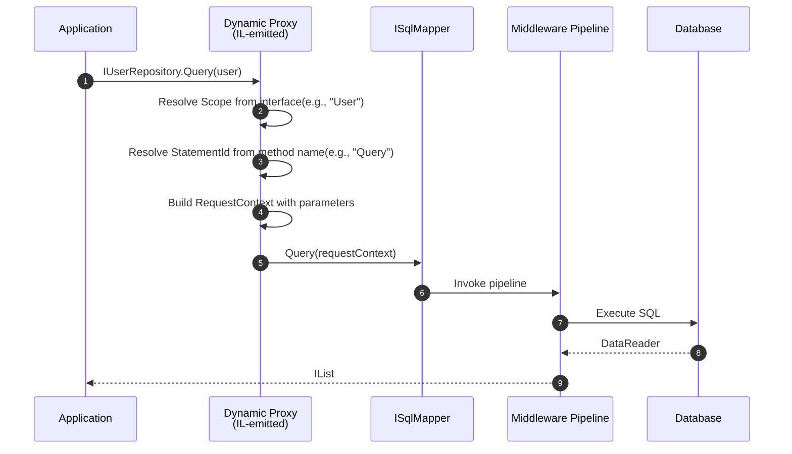

# Contributor Guide

Welcome to the SmartSql contributor guide. This document takes you from zero context to being a productive contributor. SmartSql is a .NET ORM library inspired by MyBatis, using XML to manage SQL statements. If you have .NET experience but have never touched SmartSql, this guide is for you.

---

## Part I: .NET ORM Foundations

### What Is an ORM?

An Object-Relational Mapper (ORM) bridges the gap between object-oriented code in C# and relational data in a database. Instead of writing raw SQL strings inline, you declare mappings and let the ORM handle parameter binding, result deserialization, and connection management.

### The .NET ORM Landscape

The three most common choices in the .NET ecosystem are:

| Feature | Entity Framework Core | Dapper | SmartSql |
|---|---|---|---|
| SQL Management | LINQ / Fluent API | Inline strings | XML files |
| Mapping Strategy | Code-first or DB-first | Manual | XML-declared |
| Change Tracking | Yes | No | Optional (`PropertyChangedTrack`) |
| Migration Support | Built-in | None | None |
| Middleware Pipeline | No | No | Yes |
| Caching | Second-level cache provider | No | Built-in LRU/FIFO/Redis |
| Read/Write Splitting | Via libraries | Manual | Built-in with weighted routing |
| Dynamic Repositories | No | No | Yes (IL emit proxies) |
| Bulk Insert | Via extensions | Via SqlBulkCopy | Built-in per-provider |
| Learning Curve | Medium-High | Low | Medium |
| Performance | Varies | Very fast | Fast (minimal overhead) |

### Why MyBatis-Style XML?

SmartSql's defining design choice is MyBatis-style XML SQL management. Rather than generating SQL from LINQ expressions (EF Core) or embedding SQL as string literals (Dapper), SmartSql externalizes SQL into XML files. This has several practical benefits:

- **SQL visibility**: Every query is in an XML file, making it easy to review, optimize, and tune SQL without recompiling.
- **Dynamic SQL**: XML tags (`<Where>`, `<IsNotEmpty>`, `<Switch>`, `<For>`, `<Include>`) let you build conditional queries without string concatenation in C# code.
- **DBA-friendly**: Database administrators can read and modify SQL without navigating C# source code.
- **Separation of concerns**: Application logic and SQL are in different files, following the principle of separation.

### MyBatis Parallels

If you have used MyBatis or MyBatis-Plus in Java, you will recognize many concepts:

| MyBatis Concept | SmartSql Equivalent |
|---|---|
| `mybatis-config.xml` | `SmartSqlMapConfig.xml` |
| Mapper XML (`<mapper>`) | SmartSqlMap XML (`<SmartSqlMap>`) |
| `<select>`, `<insert>` | `<Statement>` with `StatementType` |
| `<if>`, `<where>`, `<choose>` | `<IsNotEmpty>`, `<Where>`, `<Switch>` |
| `#{param}` | `@Param` |
| `ResultMap` | `ResultMap` |
| `TypeHandler` | `TypeHandler` |

---

## Part II: SmartSql Architecture

### High-Level Architecture


<!-- Sources: src/SmartSql/SmartSqlBuilder.cs, src/SmartSql/SqlMapper.cs, src/SmartSql/Configuration/SmartSqlConfig.cs -->

### The Middleware Pipeline

SmartSql processes every SQL operation through a linked-list middleware pipeline. Each middleware implements `IMiddleware` and has an `Order` property that determines its position in the chain.


<!-- Sources: src/SmartSql/Middlewares/AbstractMiddleware.cs:15-25, src/SmartSql/SmartSqlBuilder.cs:240-281 -->

#### Middleware Order Reference

| Order | Middleware | Responsibility |
|-------|-----------|----------------|
| 0 | `InitializerMiddleware` | Resolves the `Statement` from config, sets `DataSourceChoice`, `Cache`, `ResultMap`, `AutoConverter` |
| 100 | `PrepareStatementMiddleware` | Builds final SQL from XML tags, creates `DbParameter` objects with type handlers |
| 200 | `CachingMiddleware` | Checks cache on reads, stores results after execution (skipped when cache disabled) |
| 300 | `TransactionMiddleware` | Wraps the execution in a transaction when `Request.Transaction` is set |
| 400 | `DataSourceFilterMiddleware` | Selects write or read data source using weighted election |
| 500 | `CommandExecuterMiddleware` | Executes the `DbCommand` against the database |
| 600 | `ResultHandlerMiddleware` | Deserializes the `IDataReader` into typed results via the deserializer chain |

Each middleware can short-circuit the pipeline by not calling `InvokeNext`, which is exactly how `CachingMiddleware` handles cache hits.

### The Configuration System

```mermaid
graph LR
    subgraph ConfigSources["Configuration Sources"]
        style ConfigSources fill:#161b22,stroke:#30363d,color:#e6edf3
        XML["SmartSqlMapConfig.xml"]
        Native["NativeConfigBuilder"]
        Options["Options Pattern<br>(appsettings.json)"]
    end

    subgraph ConfigBuilder["Config Builder Chain"]
        style ConfigBuilder fill:#161b22,stroke:#30363d,color:#e6edf3
        Root["RootConfigBuilder"]
        CfgBuilder["IConfigBuilder impl"]
        CUD["CUDConfigBuilder<br>(auto-generate CRUD)"]
    end

    subgraph FinalConfig["SmartSqlConfig"]
        style FinalConfig fill:#161b22,stroke:#30363d,color:#e6edf3
        Database["Database<br>(Write + Read sources)"]
        SqlMaps["SqlMaps<br>(XML statement definitions)"]
        TypeHandlers["TypeHandlerFactory"]
        TagBuilders["TagBuilderFactory"]
        CacheMgr["CacheManager"]
        IdGens["IdGenerators<br>(SnowflakeId, etc.)"]
        Pipeline["IMiddleware Pipeline"]
        Filters["FilterCollection"]
    end

    XML --> CfgBuilder
    Native --> CfgBuilder
    Options --> CfgBuilder
    Root --> CfgBuilder
    CfgBuilder --> CUD
    CUD --> FinalConfig

    style XML fill:#2d333b,stroke:#6d5dfc,color:#e6edf3
    style Native fill:#2d333b,stroke:#6d5dfc,color:#e6edf3
    style Options fill:#2d333b,stroke:#6d5dfc,color:#e6edf3
    style Root fill:#2d333b,stroke:#6d5dfc,color:#e6edf3
    style CfgBuilder fill:#2d333b,stroke:#6d5dfc,color:#e6edf3
    style CUD fill:#2d333b,stroke:#6d5dfc,color:#e6edf3
    style Database fill:#2d333b,stroke:#6d5dfc,color:#e6edf3
    style SqlMaps fill:#2d333b,stroke:#6d5dfc,color:#e6edf3
    style TypeHandlers fill:#2d333b,stroke:#6d5dfc,color:#e6edf3
    style TagBuilders fill:#2d333b,stroke:#6d5dfc,color:#e6edf3
    style CacheMgr fill:#2d333b,stroke:#6d5dfc,color:#e6edf3
    style IdGens fill:#2d333b,stroke:#6d5dfc,color:#e6edf3
    style Pipeline fill:#2d333b,stroke:#6d5dfc,color:#e6edf3
    style Filters fill:#2d333b,stroke:#6d5dfc,color:#e6edf3

```


<!-- Sources: src/SmartSql/Configuration/SmartSqlConfig.cs:22-113, src/SmartSql/SmartSqlBuilder.cs:155-201 -->

The `SmartSqlBuilder` is the fluent entry point. It chains configuration sources, builds the `SmartSqlConfig`, assembles the middleware pipeline, and registers everything in the `SmartSqlContainer`.

### XML SQL Management in Detail

Every SQL statement lives in a `SmartSqlMap` XML file. Each file declares a `Scope` (a namespace) and contains `<Statements>`, `<Caches>`, `<ResultMaps>`, and other definitions.

**Statement structure**:

```xml
<SmartSqlMap Scope="User" xmlns="http://SmartSql.net/schemas/SmartSqlMap.xsd">
    <Caches>
        <Cache Id="UserCache" Type="Lru">
            <FlushOnExecute Statement="Update"/>
            <FlushOnExecute Statement="Delete"/>
        </Cache>
    </Caches>
    <Statements>
        <Statement Id="Query">
            SELECT T.* FROM T_User T
            <Where>
                <IsNotEmpty Prepend="And" Property="UserName">
                    T.UserName = @UserName
                </IsNotEmpty>
            </Where>
        </Statement>
    </Statements>
</SmartSqlMap>
```

Statements are referenced by their full ID: `Scope.Id` (e.g., `User.Query`).

### XML Dynamic Tags

SmartSql provides a rich set of XML tags for conditional SQL construction. These are the building blocks of dynamic queries:

| Tag | Purpose | Example |
|-----|---------|---------|
| `<Where>` | Wraps children in `WHERE`, strips leading `AND`/`OR` | `<Where><IsNotEmpty Prepend="And" ...>` |
| `<Set>` | Wraps children in `SET`, strips leading commas | `<Set><IsProperty Prepend="," ...>` |
| `<IsNotEmpty>` | Include child SQL if property is not null/empty | `<IsNotEmpty Property="Name">Name=@Name</IsNotEmpty>` |
| `<IsEmpty>` | Include child SQL if property is null or empty | Opposite of `IsNotEmpty` |
| `<IsEqual>` | Compare property value to `CompareValue` | `<IsEqual Property="Status" CompareValue="1">` |
| `<IsNotEqual>` | Include if property does not equal value | `<IsNotEqual Property="Status" CompareValue="0">` |
| `<IsGreaterThan>` | Numeric or string comparison | `<IsGreaterThan Property="Age" CompareValue="18">` |
| `<IsLessThan>` | Numeric or string comparison | `<IsLessThan Property="Price" CompareValue="100">` |
| `<IsProperty>` | Include if the property exists in the request | `<IsProperty Property="Status">Status=@Status</IsProperty>` |
| `<IsTrue>` / `<IsFalse>` | Boolean condition | `<IsTrue Property="IsActive">` |
| `<Switch>` / `<Case>` | Multi-branch conditional | `<Switch Property="OrderBy"><Case CompareValue="1">ORDER BY Name</Case></Switch>` |
| `<For>` | Iterate over a collection | `<For Property="Ids" Open="(" Separator="," Close=")">@Id</For>` |
| `<Include>` | Reference reusable SQL fragments | `<Include RefId="QueryParams"/>` |
| `<Env>` | Environment-specific SQL | `<Env Name="Production">LIMIT 1000</Env>` |
| `<Range>` | Check if property value falls within a range | `<Range Property="Age" Min="18" Max="65">` |

### The Tag Hierarchy


<!-- Sources: src/SmartSql/Configuration/Tags/ITag.cs, src/SmartSql/Configuration/Tags/Tag.cs, src/SmartSql/Configuration/Tags/Dynamic.cs -->

### Read/Write Splitting

SmartSql has built-in support for read/write data source splitting with weighted load balancing. The `DataSourceFilterMiddleware` uses the `DataSourceChoice` determined by the `InitializerMiddleware`:

- **Write statements** (INSERT, UPDATE, DELETE) always go to the write data source.
- **Read statements** (SELECT) go to a read data source, elected by weight.
- **Explicit routing**: You can specify `ReadDb="ReadDb-2"` on a statement to pin it to a specific read replica.

The `WeightFilter` uses a weighted random selection algorithm across available read replicas.

### Caching Architecture

SmartSql supports two levels of caching:

1. **Built-in memory cache** with LRU and FIFO eviction policies
2. **Redis cache** via the `SmartSql.Cache.Redis` extension

Cache invalidation is declarative -- you specify which statements flush the cache:

```xml
<Cache Id="UserCache" Type="Lru">
    <FlushOnExecute Statement="Update"/>
    <FlushOnExecute Statement="Delete"/>
</Cache>
```

The `CachingMiddleware` intercepts read operations and returns cached results when available. For writes, it flushes relevant caches. Cache is automatically bypassed within transactions.

### Dynamic Repository (DyRepository)

The `SmartSql.DyRepository` extension generates runtime proxy implementations of repository interfaces using IL emit. Interface methods automatically map to SQL statements by naming convention.


<!-- Sources: src/SmartSql.DyRepository/IRepository.cs, src/SmartSql.DyRepository/EmitRepositoryBuilder.cs -->

The generic repository interface `IRepository<TEntity, TPrimary>` provides built-in CRUD operations (Insert, Update, Delete, GetEntity, Query, QueryByPage, GetRecord, IsExist) that map to auto-generated SQL via `CUDConfigBuilder`.

### Deserialization Chain

When query results come back from the database, `ResultHandlerMiddleware` delegates to the deserializer factory, which tries deserializers in order:


<!-- Sources: src/SmartSql/SmartSqlBuilder.cs:219-236 -->

Each deserializer is asked if it can handle the target type. The chain is ordered so that more specific deserializers are tried first. The `EntityDeserializer` at the end handles general POCO mapping.

### Extension Projects

| Project | Location | Purpose |
|---------|----------|---------|
| `SmartSql.DyRepository` | `src/SmartSql.DyRepository/` | Dynamic proxy repository generation via IL emit |
| `SmartSql.DIExtension` | `src/SmartSql.DIExtension/` | ASP.NET Core dependency injection integration |
| `SmartSql.Options` | `src/SmartSql.Options/` | Options-pattern configuration from `appsettings.json` |
| `SmartSql.AOP` | `src/SmartSql.AOP/` | AOP transaction support using `[Transaction]` attribute (AspectCore) |
| `SmartSql.Cache.Redis` | `src/SmartSql.Cache.Redis/` | Redis cache provider |
| `SmartSql.Cache.Sync` | `src/SmartSql.Cache.Sync/` | Cache synchronization across instances |
| `SmartSql.TypeHandler` | `src/SmartSql.TypeHandler/` | JSON and custom type handlers |
| `SmartSql.TypeHandler.PostgreSql` | `src/SmartSql.TypeHandler.PostgreSql/` | PostgreSQL-specific type handlers |
| `SmartSql.Bulk.SqlServer` | `src/SmartSql.Bulk.SqlServer/` | Bulk insert for SQL Server |
| `SmartSql.Bulk.MsSqlServer` | `src/SmartSql.Bulk.MsSqlServer/` | Bulk insert for Microsoft.Data.SqlClient |
| `SmartSql.Bulk.MySql` | `src/SmartSql.Bulk.MySql/` | Bulk insert for MySQL |
| `SmartSql.Bulk.MySqlConnector` | `src/SmartSql.Bulk.MySqlConnector/` | Bulk insert for MySqlConnector |
| `SmartSql.Bulk.PostgreSql` | `src/SmartSql.Bulk.PostgreSql/` | Bulk insert for PostgreSQL |
| `SmartSql.InvokeSync` | `src/SmartSql.InvokeSync/` | Data synchronization core |
| `SmartSql.InvokeSync.Kafka` | `src/SmartSql.InvokeSync.Kafka/` | Kafka-based sync |
| `SmartSql.InvokeSync.RabbitMQ` | `src/SmartSql.InvokeSync.RabbitMQ/` | RabbitMQ-based sync |
| `SmartSql.ScriptTag` | `src/SmartSql.ScriptTag/` | Script tag support for dynamic SQL |
| `SmartSql.Extensions` | `src/SmartSql.Extensions/` | General extensions |
| `SmartSql.Oracle` | `src/SmartSql.Oracle/` | Oracle database provider |

---

## Part III: Getting Productive

### Development Environment Setup

**Prerequisites**:

- .NET SDK (targeting netstandard2.0, C# 7.3)
- An IDE: Visual Studio, Rider, or VS Code with C# extension
- MySQL database (for running tests)
- Redis (optional, for cache tests)

**Steps**:

1. Clone the repository:
   ```bash
   git clone https://github.com/dotnetcore/SmartSql.git
   cd SmartSql
   ```

2. Restore dependencies:
   ```bash
   dotnet restore SmartSql.sln
   ```

3. Build the entire solution:
   ```bash
   dotnet build SmartSql.sln
   ```

4. Run the unit tests:
   ```bash
   dotnet test
   ```

5. Run a specific test project:
   ```bash
   dotnet test src/SmartSql.Test.Unit/SmartSql.Test.Unit.csproj
   ```

6. Run tests by name filter:
   ```bash
   dotnet test src/SmartSql.Test.Unit/SmartSql.Test.Unit.csproj \
     --filter "FullyQualifiedName~SmartSql.Test.Unit.Tests.CacheTest"
   ```

### Solution Structure

```
SmartSql/
├── build/
│   └── version.props          # Version management (currently 4.1.68)
├── doc/                        # Documentation
├── sample/
│   └── SmartSql.Sample.AspNetCore/  # Demo application
├── src/
│   ├── SmartSql/               # Core library (netstandard2.0)
│   ├── SmartSql.DyRepository/  # Dynamic repository proxies
│   ├── SmartSql.DIExtension/   # ASP.NET Core DI integration
│   ├── SmartSql.Options/       # Options pattern config
│   ├── SmartSql.AOP/           # AOP transaction attribute
│   ├── SmartSql.Cache.Redis/   # Redis cache provider
│   ├── SmartSql.Cache.Sync/    # Cache synchronization
│   ├── SmartSql.TypeHandler/   # JSON and custom type handlers
│   ├── SmartSql.Bulk.*/        # Bulk insert providers
│   ├── SmartSql.InvokeSync.*/  # Kafka/RabbitMQ sync
│   ├── SmartSql.ScriptTag/     # Script tag support
│   ├── SmartSql.Extensions/    # General extensions
│   ├── SmartSql.Oracle/        # Oracle provider
│   ├── SmartSql.Test.Unit/     # Unit tests (xUnit)
│   ├── SmartSql.Test.Performance/ # BenchmarkDotNet tests
│   └── SmartSql.Test/          # Integration test helpers
└── SmartSql.sln
```

### Key File Reference

| File | Path | What It Does |
|------|------|--------------|
| `SmartSqlBuilder.cs` | [`src/SmartSql/SmartSqlBuilder.cs`](https://github.com/dotnetcore/SmartSql/blob/master/src/SmartSql/SmartSqlBuilder.cs) | Fluent builder that assembles the entire SmartSql runtime |
| `SqlMapper.cs` | [`src/SmartSql/SqlMapper.cs`](https://github.com/dotnetcore/SmartSql/blob/master/src/SmartSql/SqlMapper.cs) | Main entry point for all query operations |
| `SmartSqlConfig.cs` | [`src/SmartSql/Configuration/SmartSqlConfig.cs`](https://github.com/dotnetcore/SmartSql/blob/master/src/SmartSql/Configuration/SmartSqlConfig.cs) | Central configuration object holding all runtime state |
| `ISqlMapper.cs` | [`src/SmartSql/ISqlMapper.cs`](https://github.com/dotnetcore/SmartSql/blob/master/src/SmartSql/ISqlMapper.cs) | Interface defining all mapper operations |
| `AbstractMiddleware.cs` | [`src/SmartSql/Middlewares/AbstractMiddleware.cs`](https://github.com/dotnetcore/SmartSql/blob/master/src/SmartSql/Middlewares/AbstractMiddleware.cs) | Base class for all middleware with linked-list chaining |
| `InitializerMiddleware.cs` | [`src/SmartSql/Middlewares/InitializerMiddleware.cs`](https://github.com/dotnetcore/SmartSql/blob/master/src/SmartSql/Middlewares/InitializerMiddleware.cs) | Resolves statements and initializes request context |
| `PrepareStatementMiddleware.cs` | [`src/SmartSql/Middlewares/PrepareStatementMiddleware.cs`](https://github.com/dotnetcore/SmartSql/blob/master/src/SmartSql/Middlewares/PrepareStatementMiddleware.cs) | Builds SQL from XML tags and creates DbParameters |
| `CachingMiddleware.cs` | [`src/SmartSql/Middlewares/CachingMiddleware.cs`](https://github.com/dotnetcore/SmartSql/blob/master/src/SmartSql/Middlewares/CachingMiddleware.cs) | Cache read/write interception |
| `TransactionMiddleware.cs` | [`src/SmartSql/Middlewares/TransactionMiddleware.cs`](https://github.com/dotnetcore/SmartSql/blob/master/src/SmartSql/Middlewares/TransactionMiddleware.cs) | Transaction wrapping |
| `DataSourceFilterMiddleware.cs` | [`src/SmartSql/Middlewares/DataSourceFilterMiddleware.cs`](https://github.com/dotnetcore/SmartSql/blob/master/src/SmartSql/Middlewares/DataSourceFilterMiddleware.cs) | Read/write data source election |
| `CommandExecuterMiddleware.cs` | [`src/SmartSql/Middlewares/CommandExecuterMiddleware.cs`](https://github.com/dotnetcore/SmartSql/blob/master/src/SmartSql/Middlewares/CommandExecuterMiddleware.cs) | Executes DbCommand against the database |
| `ResultHandlerMiddleware.cs` | [`src/SmartSql/Middlewares/ResultHandlerMiddleware.cs`](https://github.com/dotnetcore/SmartSql/blob/master/src/SmartSql/Middlewares/ResultHandlerMiddleware.cs) | Deserializes IDataReader into typed results |
| `Tag.cs` | [`src/SmartSql/Configuration/Tags/Tag.cs`](https://github.com/dotnetcore/SmartSql/blob/master/src/SmartSql/Configuration/Tags/Tag.cs) | Abstract base for all XML tags |
| `Dynamic.cs` | [`src/SmartSql/Configuration/Tags/Dynamic.cs`](https://github.com/dotnetcore/SmartSql/blob/master/src/SmartSql/Configuration/Tags/Dynamic.cs) | Container tag with conditional child evaluation |
| `Where.cs` | [`src/SmartSql/Configuration/Tags/Where.cs`](https://github.com/dotnetcore/SmartSql/blob/master/src/SmartSql/Configuration/Tags/Where.cs) | Dynamic WHERE clause construction |
| `Set.cs` | [`src/SmartSql/Configuration/Tags/Set.cs`](https://github.com/dotnetcore/SmartSql/blob/master/src/SmartSql/Configuration/Tags/Set.cs) | Dynamic SET clause construction |
| `DataSourceFilter.cs` | [`src/SmartSql/DataSource/DataSourceFilter.cs`](https://github.com/dotnetcore/SmartSql/blob/master/src/SmartSql/DataSource/DataSourceFilter.cs) | Weighted read/write data source selection |
| `AbstractTypeHandler.cs` | [`src/SmartSql/TypeHandlers/AbstractTypeHandler.cs`](https://github.com/dotnetcore/SmartSql/blob/master/src/SmartSql/TypeHandlers/AbstractTypeHandler.cs) | Base class for type handlers |
| `TypeHandlerFactory.cs` | [`src/SmartSql/TypeHandlers/TypeHandlerFactory.cs`](https://github.com/dotnetcore/SmartSql/blob/master/src/SmartSql/TypeHandlers/TypeHandlerFactory.cs) | Registry of all type handlers |
| `IRepository.cs` | [`src/SmartSql.DyRepository/IRepository.cs`](https://github.com/dotnetcore/SmartSql/blob/master/src/SmartSql.DyRepository/IRepository.cs) | Dynamic repository base interfaces |
| `TransactionAttribute.cs` | [`src/SmartSql.AOP/TransactionAttribute.cs`](https://github.com/dotnetcore/SmartSql/blob/master/src/SmartSql.AOP/TransactionAttribute.cs) | AOP transaction interceptor |
| `SmartSqlMapConfig.xml` | [`sample/SmartSql.Sample.AspNetCore/SmartSqlMapConfig.xml`](https://github.com/dotnetcore/SmartSql/blob/master/sample/SmartSql.Sample.AspNetCore/SmartSqlMapConfig.xml) | Sample configuration file |
| `User.xml` | [`sample/SmartSql.Sample.AspNetCore/Maps/User.xml`](https://github.com/dotnetcore/SmartSql/blob/master/sample/SmartSql.Sample.AspNetCore/Maps/User.xml) | Sample SQL map file |

### How to Add a New Middleware

Middleware is the primary extension point in SmartSql. Here is a step-by-step guide to adding a custom middleware.

**Step 1**: Create the middleware class implementing `AbstractMiddleware`:

```csharp
using SmartSql.Middlewares;
using System.Threading.Tasks;

namespace SmartSql.Middlewares
{
    public class LoggingMiddleware : AbstractMiddleware
    {
        private readonly ILogger _logger;

        // Order determines position in the pipeline.
        // Use a value between existing middleware orders.
        // For example, 150 puts it between PrepareStatement (100) and Caching (200).
        public override int Order => 150;

        public override void SetupSmartSql(SmartSqlBuilder smartSqlBuilder)
        {
            base.SetupSmartSql(smartSqlBuilder);
            _logger = smartSqlBuilder.SmartSqlConfig.LoggerFactory
                .CreateLogger<LoggingMiddleware>();
        }

        protected override void SelfInvoke<TResult>(ExecutionContext executionContext)
        {
            _logger.LogInformation(
                "Executing statement: {FullSqlId}",
                executionContext.Request.FullSqlId);
        }

        protected override Task SelfInvokeAsync<TResult>(ExecutionContext executionContext)
        {
            _logger.LogInformation(
                "Executing statement: {FullSqlId}",
                executionContext.Request.FullSqlId);
            return Task.CompletedTask;
        }
    }
}
```

**Step 2**: Register the middleware when building SmartSql:

```csharp
var smartSql = new SmartSqlBuilder()
    .UseXmlConfig()
    .AddMiddleware(new LoggingMiddleware())
    .Build();
```

The `PipelineBuilder` (used internally in `SmartSqlBuilder.BuildPipeline()`) sorts all middleware by `Order` and chains them via `Next` pointers.

**Key points**:

- Override `SelfInvoke<TResult>` for sync and `SelfInvokeAsync<TResult>` for async logic.
- Call `InvokeNext<TResult>(executionContext)` to pass control to the next middleware. If you do not call this, the pipeline is short-circuited.
- Use the `Order` property to control your position. Existing orders are 0, 100, 200, 300, 400, 500, 600.
- Override `SetupSmartSql` to receive the `SmartSqlBuilder` and extract configuration dependencies.
- Use `Filters` (via `FilterType`) to attach middleware-specific filter hooks.

### How to Add a New XML Tag

SmartSql's XML tags are the core of its dynamic SQL capability. Here is how to add a custom tag.

**Step 1**: Create the tag class:

```csharp
using SmartSql.Configuration.Tags;

namespace SmartSql.Configuration.Tags
{
    public class IsNull : Tag
    {
        public override bool IsCondition(AbstractRequestContext context)
        {
            object reqVal = EnsurePropertyValue(context);
            return reqVal == null;
        }
    }
}
```

**Step 2**: Register a `TagBuilder` in the `TagBuilderFactory`. The `TagBuilderFactory` maps XML element names to tag builder functions. You can register via XML config or programmatically:

```csharp
// In the TagBuilders section of SmartSqlMapConfig.xml
<TagBuilders>
    <TagBuilder Name="IsNull" Type="MyNamespace.IsNull,MyAssembly"/>
</TagBuilders>
```

**Step 3**: Use the tag in your XML maps:

```xml
<Statement Id="GetUser">
    SELECT * FROM T_User
    <Where>
        <IsNull Property="DeletedAt">
            T.DeletedAt IS NULL
        </IsNull>
        <IsNotEmpty Prepend="And" Property="UserName">
            T.UserName = @UserName
        </IsNotEmpty>
    </Where>
</Statement>
```

**Tag design rules**:

- Extend `Tag` for simple conditional tags (include/exclude based on a condition).
- Extend `Dynamic` for container tags that wrap children and manage prepends (like `Where` and `Set`).
- Implement `IsCondition(AbstractRequestContext context)` to return `true` when the child SQL should be included.
- Use `EnsurePropertyValue(context)` to safely retrieve the property value and honor the `Required` flag.
- Set `Prepend` to define what keyword is prepended (e.g., `"And"`, `"Or"`, `"Where"`, `"Set"`).

### How to Add a New Type Handler

Type handlers control how .NET types are converted to and from database types.

**Step 1**: Create a type handler class:

```csharp
using SmartSql.TypeHandlers;
using SmartSql.Data;
using System;
using System.Data;

public class DateTimeOffsetTypeHandler : AbstractTypeHandler<DateTimeOffset, DateTime>
{
    public override DateTimeOffset GetValue(
        DataReaderWrapper dataReader,
        int columnIndex,
        Type targetType)
    {
        var dateTime = dataReader.GetDateTime(columnIndex);
        return new DateTimeOffset(dateTime, TimeSpan.Zero);
    }

    protected override object GetSetParameterValueWhenNotNull(object parameterValue)
    {
        var dto = (DateTimeOffset)parameterValue;
        return dto.UtcDateTime;
    }
}
```

**Step 2**: Register the type handler:

```csharp
var smartSql = new SmartSqlBuilder()
    .UseXmlConfig()
    .AddTypeHandler(new DateTimeOffsetTypeHandler())
    .Build();
```

Or register via XML config:

```xml
<TypeHandlers>
    <TypeHandler PropertyType="System.DateTimeOffset, System.Runtime"
                 Type="MyNamespace.DateTimeOffsetTypeHandler, MyAssembly"/>
</TypeHandlers>
```

**Type handler design rules**:

- Extend `AbstractTypeHandler<TProperty, TField>` where `TProperty` is the .NET type and `TField` is the database field type.
- Override `GetValue(DataReaderWrapper, int, Type)` to read from the data reader.
- Override `GetSetParameterValueWhenNotNull(object)` to convert the .NET value for the database parameter.
- Optionally override `Initialize(IDictionary<string, object>)` to accept configuration properties from XML.
- `SetParameter(IDataParameter, object)` is called to bind the value to the DbParameter.

### How to Write and Run Tests

SmartSql uses xUnit for all testing. The test infrastructure is in `src/SmartSql.Test.Unit/`.

**Test fixture**: `SmartSqlFixture` initializes a `SmartSqlBuilder` with XML config, registers test repositories, and seeds test data. Tests use `IClassFixture<SmartSqlFixture>` to share the fixture.

**Running tests**:

```bash
# All tests
dotnet test

# Single test project
dotnet test src/SmartSql.Test.Unit/SmartSql.Test.Unit.csproj

# Specific test class
dotnet test src/SmartSql.Test.Unit/SmartSql.Test.Unit.csproj \
  --filter "FullyQualifiedName~SmartSql.Test.Unit.Tests.MapperTest"

# Specific test method
dotnet test src/SmartSql.Test.Unit/SmartSql.Test.Unit.csproj \
  --filter "FullyQualifiedName~SmartSql.Test.Unit.Tests.MapperTest.Query"
```

**Performance benchmarks**: `src/SmartSql.Test.Performance/` contains BenchmarkDotNet tests for measuring performance. Run with:

```bash
dotnet run -c Release --project src/SmartSql.Test.Performance/SmartSql.Test.Performance.csproj
```

### Debugging Tips

1. **Enable debug logging**: Set the logger factory to see SQL generation and data source selection:
   ```csharp
   var smartSql = new SmartSqlBuilder()
       .UseLoggerFactory(loggerFactory)
       .UseXmlConfig()
       .Build();
   ```
   `PrepareStatementMiddleware` logs the final SQL at Debug level, and `DataSourceFilter` logs data source selection.

2. **Inspect the pipeline**: The `SmartSqlConfig.Pipeline` property holds the linked list of middleware. Walk `Pipeline.Next` to see the chain order.

3. **Examine XML tag evaluation**: Set breakpoints in `Tag.BuildSql()` and `Tag.IsCondition()` to trace how dynamic SQL is assembled.

4. **Check Statement resolution**: In `InitializerMiddleware.InitByStatement()`, the statement is resolved from the config. If a statement is not found, `SmartSqlConfig.GetStatement(fullId)` throws a `SmartSqlException`.

### Contributing Workflow

1. **Fork and branch**: Fork the repository and create a feature branch from `master`.
2. **Make changes**: Follow existing code style. The project targets `netstandard2.0` with C# 7.3 -- avoid newer C# features.
3. **Write tests**: Add or update xUnit tests in `src/SmartSql.Test.Unit/`.
4. **Build and test**: Run `dotnet build SmartSql.sln` and `dotnet test` to ensure everything passes.
5. **Submit PR**: Open a pull request against the `master` branch with a clear description of changes.

### Version Management

Version is defined in [`build/version.props`](https://github.com/dotnetcore/SmartSql/blob/master/build/version.props):

```xml
<Project>
    <PropertyGroup>
        <VersionMajor>4</VersionMajor>
        <VersionMinor>1</VersionMinor>
        <VersionPatch>68</VersionPatch>
        <VersionPrefix>$(VersionMajor).$(VersionMinor).$(VersionPatch)</VersionPrefix>
    </PropertyGroup>
</Project>
```

To release a new version, update `VersionPatch` (or `VersionMinor`/`VersionMajor` for breaking changes) in this file.

### License

SmartSql is released under the MIT License.

### How to Add a Custom Deserializer

If SmartSql's built-in deserializers cannot handle your result shape (e.g., nested graph objects, DDD value objects with private constructors), you can add a custom deserializer.

**Step 1**: Implement the `IDataReaderDeserializer` interface:

```csharp
using SmartSql.Deserializer;
using System;
using System.Collections.Generic;
using System.Data;
using System.Threading.Tasks;

public class GraphDeserializer : IDataReaderDeserializer
{
    public TResult ToSingle<TResult>(ExecutionContext executionContext)
    {
        var dataReader = executionContext.DataReaderWrapper;
        // Custom mapping logic for graph objects
        var result = new TResult();
        // ... populate from dataReader
        return result;
    }

    public IList<TResult> ToList<TResult>(ExecutionContext executionContext)
    {
        var dataReader = executionContext.DataReaderWrapper;
        var results = new List<TResult>();
        while (dataReader.Read())
        {
            results.Add(ToSingle<TResult>(executionContext));
        }
        return results;
    }

    public bool CanDeserialize(ExecutionContext context, Type targetType, bool isMultiple)
    {
        // Return true when this deserializer can handle the target type
        return targetType == typeof(MyGraphEntity);
    }

    // Async variants...
    public Task<TResult> ToSingleAsync<TResult>(ExecutionContext executionContext)
    {
        return Task.FromResult(ToSingle<TResult>(executionContext));
    }

    public Task<IList<TResult>> ToListAsync<TResult>(ExecutionContext executionContext)
    {
        return Task.FromResult(ToList<TResult>(executionContext));
    }
}
```

**Step 2**: Register the deserializer:

```csharp
var smartSql = new SmartSqlBuilder()
    .UseXmlConfig()
    .AddDeserializer(new GraphDeserializer())
    .Build();
```

Custom deserializers are added to the end of the chain by default. The `DeserializerFactory` iterates through all registered deserializers and uses the first one whose `CanDeserialize` returns `true`.

### How to Add a Custom Filter

Filters provide hooks before and after middleware execution. This is useful for logging, metrics, and auditing.

**Step 1**: Implement the appropriate filter interface:

```csharp
using SmartSql.Middlewares.Filters;

public class MetricsFilter : IExecutionFilter
{
    private readonly ILogger _logger;

    public MetricsFilter(ILogger logger)
    {
        _logger = logger;
    }

    public void OnInvoking(ExecutionContext context)
    {
        context.Request.Extend.Set("StartTime", DateTime.UtcNow);
    }

    public void OnInvoked(ExecutionContext context)
    {
        var startTime = (DateTime)context.Request.Extend.Get("StartTime");
        var elapsed = DateTime.UtcNow - startTime;
        _logger.LogInformation(
            "Statement {FullId} executed in {Elapsed}ms",
            context.Request.FullSqlId,
            elapsed.TotalMilliseconds);
    }

    // Async variants
    public Task OnInvokingAsync(ExecutionContext context)
    {
        OnInvoking(context);
        return Task.CompletedTask;
    }

    public Task OnInvokedAsync(ExecutionContext context)
    {
        OnInvoked(context);
        return Task.CompletedTask;
    }
}
```

**Step 2**: Register the filter:

```csharp
var smartSql = new SmartSqlBuilder()
    .UseXmlConfig()
    .AddFilter(new MetricsFilter(logger))
    .Build();
```

Available filter interfaces:
- `IExecutionFilter` -- hooks around the execution lifecycle
- `IStatementFilter` -- hooks around statement resolution
- `IPrepareStatementFilter` -- hooks around SQL preparation
- `ICommandExecuterFilter` -- hooks around command execution

### How to Use the Sample Application

The repository includes a working sample application at `sample/SmartSql.Sample.AspNetCore/`. This is the best starting point for understanding how SmartSql works in a real application.

**What the sample demonstrates**:

1. **Configuration**: `SmartSqlMapConfig.xml` shows how to configure database providers, data sources (with read/write splitting), type handlers, tag builders, ID generators, and SQL map references.

2. **SQL Maps**: The `Maps/User.xml` file demonstrates all common patterns: dynamic `WHERE` clauses, `SET` clauses, `INCLUDE` references, `SWITCH` statements, pagination with `MultipleResultMap`, and LRU caching with `FlushOnExecute`.

3. **ASP.NET Core Integration**: The `Startup.cs` shows how to register SmartSql with the dependency injection container using `services.AddSmartSql()`.

**To run the sample**:

```bash
cd sample/SmartSql.Sample.AspNetCore
dotnet run
```

The sample uses SQLite and creates the database schema on startup. No external database setup is required.

### Common Patterns and Recipes

#### Pattern: Paginated Query with Total Count

A common requirement is fetching a page of results along with the total count. SmartSql handles this with `MultipleResultMap`:

```xml
<MultipleResultMaps>
    <MultipleResultMap Id="QueryByPageResult">
        <Result Property="List"/>
        <Result Property="Total"/>
    </MultipleResultMap>
</MultipleResultMaps>

<Statement Id="QueryByPage" MultipleResultMap="QueryByPageResult">
    SELECT T.* FROM T_User T
    <Include RefId="QueryParams"/>
    LIMIT @PageSize OFFSET @Offset;
    SELECT COUNT(1) FROM T_User T
    <Include RefId="QueryParams"/>;
</Statement>
```

The `MultipleResultMap` maps each result set in order to the corresponding property of the return type.

#### Pattern: Conditional Update

Update only the fields that are provided:

```xml
<Statement Id="Update">
    UPDATE T_User
    <Set>
        <IsProperty Prepend="," Property="UserName">
            UserName = @UserName
        </IsProperty>
        <IsProperty Prepend="," Property="Status">
            Status = @Status
        </IsProperty>
    </Set>
    WHERE Id = @Id
</Statement>
```

The `<Set>` tag automatically strips the leading comma. `<IsProperty>` only includes the field if the property exists in the request.

#### Pattern: IN Clause with Collection

Query by a list of IDs:

```xml
<Statement Id="QueryByIds">
    SELECT * FROM T_User
    WHERE Id IN
    <For Property="Ids" Open="(" Separator="," Close=")">
        @Id
    </For>
</Statement>
```

The `<For>` tag iterates over the `Ids` collection, generating the `(1, 2, 3)` syntax.

#### Pattern: Reusable SQL Fragments

Define shared SQL fragments with `<Statement>` and reference them with `<Include>`:

```xml
<Statement Id="QueryParams">
    <Where>
        <IsNotEmpty Prepend="And" Property="Status">
            T.Status = @Status
        </IsNotEmpty>
        <IsNotEmpty Prepend="And" Property="UserName">
            T.UserName = @UserName
        </IsNotEmpty>
    </Where>
</Statement>

<Statement Id="Query">
    SELECT T.* FROM T_User T
    <Include RefId="QueryParams"/>
</Statement>

<Statement Id="GetRecord">
    SELECT COUNT(1) FROM T_User T
    <Include RefId="QueryParams"/>
</Statement>
```

#### Pattern: Explicit Data Source Routing

Override automatic read/write routing:

```xml
<Statement Id="Query" ReadDb="ReadDb-2">
    SELECT * FROM T_User WHERE Id = @Id
</Statement>
```

The `ReadDb` attribute pins this statement to a specific read replica.

#### Pattern: Custom ID Generation

Use SnowflakeId for distributed ID generation:

```xml
<IdGenerators>
    <IdGenerator Name="SnowflakeId" Type="SnowflakeId">
        <Properties>
            <Property Name="WorkerId" Value="1"/>
        </Properties>
    </IdGenerator>
</IdGenerators>

<Statement Id="Insert">
    INSERT INTO T_User (Id, UserName)
    VALUES (@Id, @UserName)
</Statement>
```

In code, set the ID before calling insert:

```csharp
var id = SmartSqlId.Default.NextId();
```

### CI/CD Recommendations

When building CI/CD pipelines for SmartSql projects:

1. **Validate XML schemas**: Run XML validation against the provided XSD schemas (`SmartSqlMapConfig.xsd`, `SmartSqlMap.xsd`) as a build step.

2. **Test SQL maps**: Include integration tests that exercise every Statement in your XML maps. The `SmartSqlFixture` pattern used in the test project is a good template.

3. **Version control XML files**: Treat XML SQL maps with the same discipline as source code. Use pull request reviews for SQL changes.

4. **Database test containers**: Use Testcontainers or similar tools to spin up test databases in CI, ensuring XML SQL maps are validated against the actual database engine.

5. **Monitor cache effectiveness**: In staging environments, log cache hit rates to verify caching configurations are effective before production deployment.

---

## Glossary

| Term | Definition |
|------|-----------|
| **SmartSqlBuilder** | Fluent builder that assembles the complete SmartSql runtime: config, pipeline, cache, type handlers, and filters |
| **SmartSqlConfig** | Central configuration object holding database connections, SQL maps, middleware pipeline, type handlers, cache manager, and all resolved settings |
| **ISqlMapper** | Main interface for executing SQL operations (Execute, ExecuteScalar, Query, QuerySingle, GetDataTable, GetDataSet) |
| **SqlMapper** | Concrete implementation of ISqlMapper that manages session lifecycle |
| **Middleware Pipeline** | Linked-list of `IMiddleware` nodes that process every SQL operation in order |
| **Statement** | A single SQL operation defined in XML, identified by `Scope.Id` |
| **SqlMap** | An XML file containing Statements, Caches, ResultMaps, and other definitions, identified by its `Scope` |
| **Scope** | Namespace for a SmartSqlMap XML file; used as prefix in full statement IDs |
| **Tag** | An XML element in a Statement that conditionally builds SQL (e.g., `<Where>`, `<IsNotEmpty>`) |
| **TagBuilder** | Factory that creates Tag instances from XML elements |
| **TypeHandler** | Converts between .NET types and database types during parameter binding and result reading |
| **TypeHandlerFactory** | Registry of all TypeHandlers, resolving the right handler for a given .NET type |
| **ResultMap** | Mapping definition from database columns to object properties |
| **ParameterMap** | Mapping definition for stored procedure parameters with explicit type handler assignments |
| **MultipleResultMap** | Defines how multiple result sets from a single statement map to different properties |
| **ExecutionContext** | Carries `SmartSqlConfig`, `IDbSession`, `AbstractRequestContext`, and `ResultContext` through the pipeline |
| **AbstractRequestContext** | Holds the statement reference, SQL builder, parameters, data source choice, cache ID, and execution options |
| **DataSourceChoice** | Enum: `Read` or `Write`, determining which data source to use |
| **WeightFilter** | Algorithm for weighted random selection of read data sources |
| **IDbSession** | Database session wrapping a connection and optional transaction |
| **IDbSessionStore** | Thread-local storage for the current session (using `AsyncLocal`) |
| **DyRepository** | Dynamic repository -- IL-emitted proxy that maps interface methods to SQL statements |
| **CUDConfigBuilder** | Auto-generates Create/Update/Delete SQL statements for registered entity types |
| **SnowflakeId** | Built-in distributed ID generator (Twitter Snowflake algorithm) |
| **AOP Transaction** | Declarative transaction management via `[Transaction]` attribute using AspectCore |
| **DiagnosticSource** | .NET diagnostic event emitter for command execution, session lifecycle, and errors |
| **FullId** | The combined identifier for a statement: `Scope.StatementId` (e.g., `User.Query`) |
| **InvokeSucceedListener** | Event listener invoked after successful SQL execution, used for cache flushing and sync |
| **SmartSqlContainer** | Singleton registry holding all SmartSqlBuilder instances by alias |
