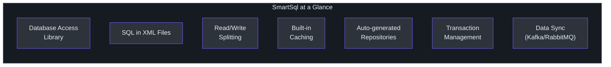
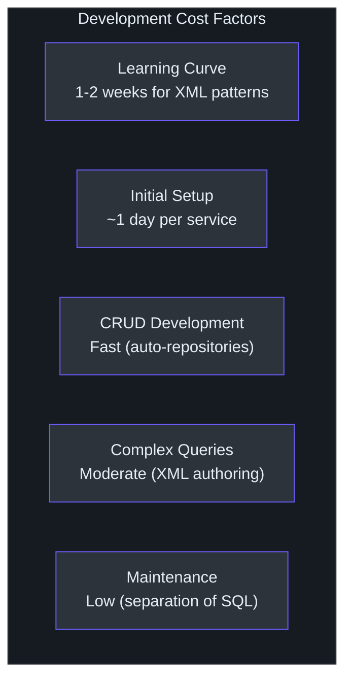
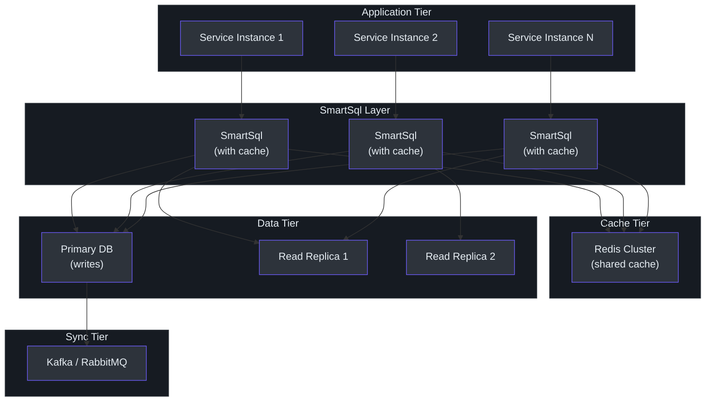

# Executive Guide

This guide is written for VP-level and director-level engineering leaders evaluating SmartSql as a technology investment. It focuses on capabilities, risks, cost models, and actionable recommendations -- not implementation details.

---

## What SmartSql Is

SmartSql is an open-source .NET library (MIT License) for connecting applications to databases. It is version 4.1.68, has been under active development, and is used in production environments.

Its distinguishing feature is **XML-based SQL management**: database queries are written in dedicated XML files rather than embedded in application code. This approach originated in the Java ecosystem (MyBatis) and has been proven at scale across thousands of enterprise applications.

<!-- Sources: src/SmartSql/SmartSqlBuilder.cs, src/SmartSql/Configuration/SmartSqlConfig.cs -->

---

## Capability Map

### Core Capabilities

| Capability | Description | Business Value |
|-----------|-------------|----------------|
| **XML SQL Management** | SQL is written in XML files, separate from application code | Database administrators can review and optimize queries without C# expertise. Faster query tuning cycles. |
| **Read/Write Splitting** | Automatic routing of reads to replicas, writes to master | Reduces database load by distributing read traffic. No external load balancer required. |
| **Built-in Caching** | LRU, FIFO, and Redis cache support | Reduces database round-trips for frequently accessed data. Lower database costs. |
| **Dynamic Repositories** | Auto-generated data access interfaces | Reduces boilerplate code. Faster development for CRUD operations. |
| **Transaction Management** | Declarative transaction support via attributes | Reduces transaction-related bugs. Simplifies multi-step operations. |
| **Bulk Insert** | Per-database bulk insert support | Fast data loading for migrations, ETL, and batch operations. |
| **Data Synchronization** | Kafka and RabbitMQ integration | Enables event-driven architectures and data pipeline synchronization. |
| **Diagnostics** | Built-in performance monitoring events | Integration with APM tools for production observability. |

### Database Support

| Database | Support Level |
|----------|--------------|
| SQL Server | Full (including bulk insert) |
| MySQL | Full (including bulk insert) |
| PostgreSQL | Full (including bulk insert) |
| SQLite | Full |
| Oracle | Supported (via extension) |
| Any ADO.NET provider | Basic support via standard interfaces |

### Deployment Compatibility

SmartSql targets .NET Standard 2.0, which means it runs on:

- .NET Framework 4.6.1 and later
- .NET Core 2.0 and later
- .NET 5, 6, 7, 8, and later
- Azure App Service, AWS Lambda, Docker containers, Kubernetes

---

## Technology Investment Thesis

### Why Consider SmartSql

**1. SQL is a long-lived asset.** Application code is rewritten every 3-5 years. Database schemas and queries often outlive the applications that use them. SmartSql's XML-based approach treats SQL as a first-class, version-controlled asset, increasing the long-term value of SQL investments.

**2. Database team autonomy.** When SQL lives in XML files, database administrators and performance engineers can work independently of application developers. This parallel workflow reduces bottlenecks in performance tuning cycles.

**3. Infrastructure cost reduction.** Built-in read/write splitting and caching reduce the need for external infrastructure (load balancers, separate caching layers). This simplifies the architecture and lowers operational costs.

**4. Development velocity for data-heavy applications.** Auto-generated repositories, bulk insert support, and declarative transaction management reduce the amount of boilerplate code developers need to write for database operations.

**5. Migration readiness.** For organizations migrating from Java/MyBatis to .NET, SmartSql provides the closest equivalent experience, reducing retraining costs and preserving existing SQL assets.

### Risk Factors

| Risk | Severity | Mitigation |
|------|----------|-----------|
| **Smaller community** than EF Core or Dapper | Medium | The codebase is well-structured and extensible. Critical issues can be self-fixed. |
| **No migration tooling** | Medium | Use standalone migration tools (Flyway, DbUp) alongside SmartSql. |
| **XML is runtime-validated** | Low | Include XML schema validation in CI/CD pipeline. SmartSql provides XSD schemas. |
| **Limited third-party ecosystem** | Medium | Core features (caching, bulk insert, DI, transactions) are built-in. Less need for third-party add-ons. |
| **Dependency on a single OSS project** | Medium | MIT License. Can be forked. Core ADO.NET abstractions are standard .NET types. |

---

## Cost and Scaling Model

### Development Cost

<!-- Sources: src/SmartSql.DyRepository/IRepository.cs, src/SmartSql.DIExtension/SmartSqlDIExtensions.cs -->

- **Learning curve**: Developers familiar with .NET need 1-2 weeks to become productive with XML SQL management. MyBatis-experienced developers need 2-3 days.
- **CRUD operations**: The dynamic repository system auto-generates standard CRUD operations, reducing development time by an estimated 40-60% compared to manual implementations.
- **Complex queries**: Custom queries require XML authoring. This is slightly slower than LINQ-based query building but produces more maintainable and optimizable SQL.
- **Maintenance**: Separation of SQL from code reduces the cognitive load of maintaining data access layers. SQL changes do not require C# recompilation.

### Operational Cost

| Factor | Without SmartSql | With SmartSql |
|--------|-----------------|---------------|
| Load balancer for read replicas | Required | Built-in weighted routing |
| External cache layer (Redis setup) | Manual integration | Built-in via `Cache.Redis` extension |
| Database monitoring | Separate APM setup | Built-in DiagnosticSource events |
| Connection management | Manual per-operation | Automatic session-per-operation |
| Transaction error handling | Manual try/catch/rollback | Declarative `[Transaction]` attribute |

### Scaling Characteristics

- **Horizontal**: SmartSql is stateless at the application level. Each instance manages its own connections. Scale horizontally by adding application instances.
- **Database**: Read/write splitting distributes read load across replicas. Bulk insert supports large data volumes. No ORM-level connection pooling (relies on ADO.NET pooling).
- **Caching**: LRU memory cache is per-instance. Redis cache is shared across instances via `Cache.Redis` + `Cache.Sync` extensions.

---

## Team Impact Assessment

### Engineering Team

| Aspect | Impact |
|--------|--------|
| **Learning curve** | 1-2 weeks for developers new to XML SQL management. Faster for teams with MyBatis experience. |
| **Development velocity (CRUD)** | Improved -- auto-generated repositories eliminate boilerplate for standard operations. |
| **Development velocity (complex queries)** | Comparable -- XML authoring is slightly slower than LINQ but produces more reviewable SQL. |
| **DBA collaboration** | Significantly improved -- DBAs can review and modify SQL in dedicated XML files without C# expertise. |
| **Code review** | Improved -- SQL changes are in separate files, making reviews more focused. |
| **Debugging** | Comparable -- diagnostic events provide query visibility. XML issues are runtime, not compile-time. |
| **Onboarding** | New developers need orientation on XML SQL patterns. Existing MyBatis experience transfers directly. |

### Operations Team

| Aspect | Impact |
|--------|--------|
| **Deployment** | XML files are deployed alongside the application. SQL changes can be deployed without recompilation. |
| **Monitoring** | Built-in DiagnosticSource events integrate with standard .NET APM tools. |
| **Database operations** | Improved visibility into query patterns. Read/write splitting simplifies replica management. |
| **Incident response** | SQL is in XML files, making it easier to identify and modify problematic queries during incidents. |

### Database Team

| Aspect | Impact |
|--------|--------|
| **Query optimization** | DBAs can directly modify SQL in XML files without navigating C# code. |
| **Schema changes** | SQL changes map directly to XML files. Impact analysis is straightforward. |
| **Performance tuning** | Cache configuration and data source routing are declarative and visible in XML. |

---

## Compliance and Governance

### Security

SmartSql uses parameterized queries by default, which is the standard defense against SQL injection. The parameter binding mechanism uses ADO.NET's built-in parameterization, which is industry-standard.

Connection strings support environment variable substitution, enabling secrets management through standard DevOps practices.

### Audit Trail

SmartSql's diagnostic events can be captured and logged for audit purposes. Every SQL execution emits events that include the statement identifier, execution time, and data source used.

### License

SmartSql is released under the MIT License -- one of the most permissive open-source licenses. It allows commercial use, modification, distribution, and private use without restriction. There are no copyleft obligations.

---

## Service-Level Architecture

<!-- Sources: src/SmartSql/DataSource/DataSourceFilter.cs, src/SmartSql.Cache.Redis/, src/SmartSql.InvokeSync/ -->

This diagram shows a production deployment with SmartSql handling the database access layer across multiple service instances, with shared caching via Redis and data synchronization via message queues.

---

## Organizational Considerations

### Skill Requirements

| Role | Skills Needed | Ramp-up Time |
|------|--------------|-------------|
| Application Developer | C#, basic XML, SQL | 1-2 weeks |
| Database Administrator | SQL, XML | Minimal (XML is DBA-friendly) |
| DevOps Engineer | Standard .NET deployment | Minimal (no special infrastructure) |
| QA Engineer | Standard testing practices | Minimal (standard database testing) |

### Training Investment

- **Internal workshop**: 2-day hands-on workshop covering XML SQL patterns, caching configuration, and read/write splitting setup.
- **Pair programming**: Pair new SmartSql developers with experienced team members for the first sprint.
- **Reference documentation**: The sample application (`SmartSql.Sample.AspNetCore`) serves as a working reference.
- **MyBatis resources**: The Java MyBatis community has extensive documentation on XML SQL patterns that transfer directly to SmartSql.

### Migration Risk Mitigation

For teams considering adoption, these strategies reduce risk:

1. **Start with low-risk services**: Apply SmartSql to internal tools or non-critical services first.
2. **Run in parallel**: Keep the existing data access layer working while SmartSql is being adopted for new features.
3. **Establish XML conventions**: Define naming conventions, file organization, and review processes for XML SQL files before widespread adoption.
4. **Invest in CI validation**: Add XML schema validation to the build pipeline to catch configuration errors early.
5. **Create internal knowledge base**: Document common patterns, troubleshooting steps, and best practices specific to your team's usage.

### Budget Impact

| Item | Cost |
|------|------|
| SmartSql license | Free (MIT License) |
| Developer training | 2-day workshop + 1-2 week ramp-up per developer |
| Infrastructure savings | Reduced (built-in caching and read/write splitting replace external tools) |
| Ongoing maintenance | Low (stable library, minimal updates required) |

---

## Decision Framework

### Adopt SmartSql When:

- Your team values SQL quality and wants DBAs involved in query optimization
- You need read/write splitting without external load balancers
- You are migrating from Java/MyBatis and want familiar patterns
- Your application is data-intensive with complex query requirements
- You want built-in caching without additional library integration
- You need bulk insert support across multiple database providers

### Do NOT Adopt SmartSql When:

- Your team strongly prioritizes compile-time safety and LINQ-based query building
- You require database migration tooling from the same library
- Your application is simple CRUD where Dapper's minimal footprint is sufficient
- Your team has no XML experience and refuses to adopt it
- You need the extensive ecosystem and tooling of Entity Framework Core

### Recommended Approach

1. **Pilot**: Start with one service or module. Use SmartSql for a data-intensive component where SQL visibility and read/write splitting provide clear value.
2. **Evaluate**: Measure development velocity, SQL quality, and operational simplicity against your current approach.
3. **Standardize**: If the pilot succeeds, create internal standards for XML SQL file organization, naming conventions, and review processes.
4. **Scale**: Roll out across services that benefit from SmartSql's strengths. Continue using EF Core or Dapper for services where they are a better fit.

---

## Actionable Recommendations

### For Engineering Leaders

1. **Assess your SQL management pain.** If your team frequently debugs SQL embedded in C# code, or if DBA review is a bottleneck, SmartSql's XML-based approach addresses this directly.

2. **Evaluate migration path.** If you are considering migrating Java services (especially MyBatis-based ones) to .NET, SmartSql can preserve your existing SQL assets with minimal changes.

3. **Consider your caching strategy.** If you are planning to add caching infrastructure, SmartSql's built-in LRU/FIFO and Redis integration may eliminate the need for a separate caching library.

4. **Plan for coexistence.** SmartSql does not need to replace EF Core everywhere. Use it for services where SQL control matters most. Keep EF Core for services where migration tooling and LINQ querying are priorities.

5. **Invest in XML authoring tooling.** The XML schema files (XSD) provided by SmartSql enable IDE validation and autocompletion. Ensure your team uses these for a better authoring experience.

---

## FAQ

**Q: Is SmartSql production-ready?**
A: Yes. Version 4.1.68 indicates sustained development and iteration. The architecture is stable and well-tested.

**Q: How does it compare to Entity Framework Core?**
A: SmartSql gives you full control over SQL (written in XML files). EF Core generates SQL from LINQ expressions. SmartSql includes built-in read/write splitting and caching; EF Core relies on external libraries for these. EF Core includes migration tooling; SmartSql does not.

**Q: Can we use SmartSql alongside EF Core?**
A: Yes. They are independent libraries. You can use SmartSql for data-intensive services and EF Core for others.

**Q: What about security?**
A: SmartSql uses parameterized queries by default (`@Param` syntax), which prevents SQL injection. Parameters are bound through ADO.NET's standard parameter mechanism.

**Q: What support is available?**
A: SmartSql is open-source (MIT License). Community support is available via GitHub issues. The codebase is well-structured for self-support and customization.

**Q: What is the performance overhead?**
A: Minimal. The middleware pipeline adds negligible overhead compared to database I/O. The library uses standard ADO.NET under the hood, with the same connection pooling and performance characteristics.

**Q: Does it support async/await?**
A: Yes. All query operations have async variants (QueryAsync, ExecuteAsync, etc.). Session management is compatible with async call chains via `AsyncLocal`.

**Q: Can we migrate away from SmartSql if needed?**
A: Yes. SmartSql uses standard ADO.NET interfaces. SQL in XML files can be extracted. The migration cost is comparable to moving from any ORM to raw ADO.NET.

**Q: How many developers are needed to maintain it?**
A: SmartSql requires minimal ongoing maintenance. It is a library, not a platform. Once integrated, it runs without dedicated infrastructure or operational staff. Occasional version updates follow standard NuGet package update workflows.

**Q: What about long-term support?**
A: The MIT License ensures you can always fork and maintain the code independently. The .NET Standard 2.0 target means it will work on all current and foreseeable .NET versions. The ADO.NET interfaces it depends on are among the most stable APIs in the .NET ecosystem.

**Q: Does it support microservices architectures?**
A: Yes. Each microservice can have its own SmartSql instance with independent configuration. The `SmartSqlContainer` supports multiple named instances within a single process. The built-in Kafka and RabbitMQ integration via the InvokeSync extensions supports cross-service data synchronization patterns.

---

## Summary

SmartSql is a proven, open-source database access library for .NET that treats SQL as a first-class citizen. Its XML-based approach to SQL management provides unique advantages for teams that value query visibility, DBA collaboration, and operational simplicity. Built-in read/write splitting, caching, and transaction management reduce infrastructure complexity. The MIT License and standard .NET interfaces minimize vendor lock-in risk.

The investment is modest: free software, 1-2 weeks of developer training, and no additional infrastructure requirements. The returns compound over time as SQL quality improves, database performance increases, and team collaboration between developers and DBAs strengthens.

