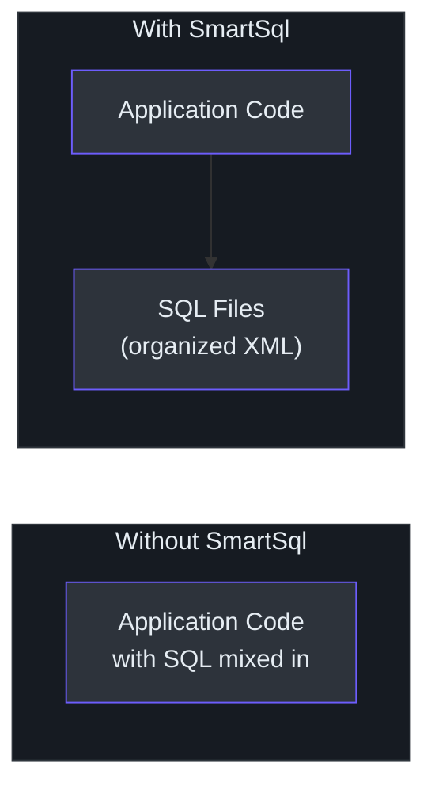
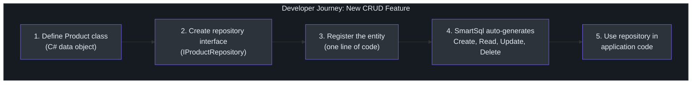
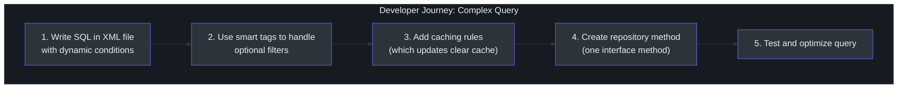
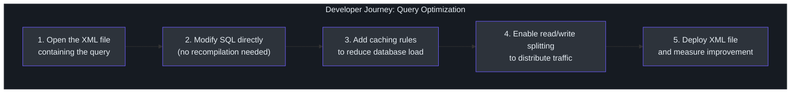
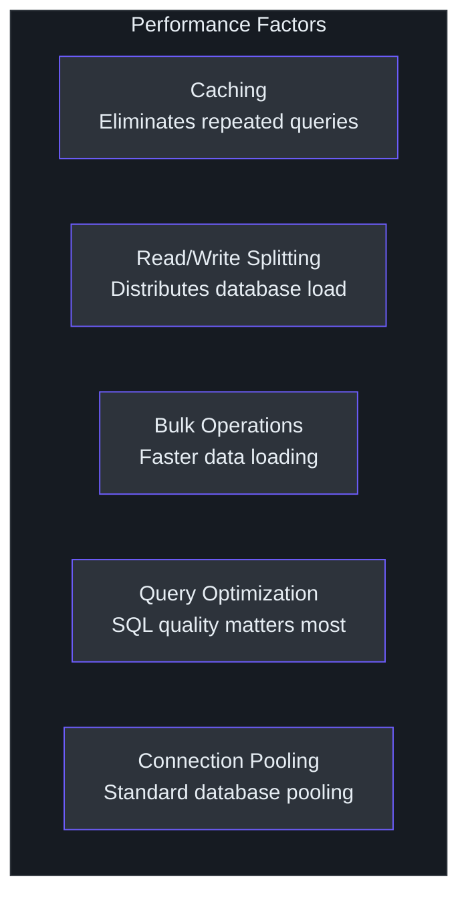
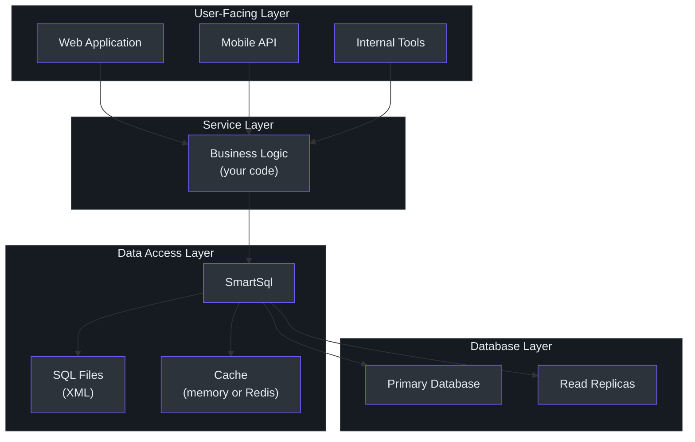

# Product Manager Guide

This guide explains SmartSql in plain language for product managers and non-engineering stakeholders. It focuses on what SmartSql enables, how developers experience it, and what its strengths and limitations mean for your product roadmap.

---

## What SmartSql Does (In Plain Language)

SmartSql is a tool that helps software applications talk to databases. When your application needs to save or retrieve data (user profiles, orders, inventory, etc.), it needs to send instructions to the database. SmartSql manages those instructions.

The key difference from other tools: **SmartSql stores database instructions in separate XML files** rather than mixing them into the application's source code. Think of it like having a dedicated filing cabinet for all database instructions, rather than scattering them throughout a notebook.

<!-- Sources: sample/SmartSql.Sample.AspNetCore/Maps/User.xml -->

---

## Feature Capability Map

### What Developers Can Do With SmartSql

| Feature | What It Means for Your Product |
|---------|-------------------------------|
| **SQL in XML files** | Database queries are organized in dedicated files. Teams can review and optimize queries without understanding the full application code. |
| **Smart queries** | Developers can write queries that automatically adjust based on what data the user provides. For example, if a search form has optional filters, the query only includes the filters the user actually filled in. |
| **Read/write splitting** | The system can automatically send "read" requests (like viewing a product page) to copies of the database, and "write" requests (like placing an order) to the main database. This improves performance without extra infrastructure. |
| **Built-in caching** | Frequently requested data can be temporarily stored in fast-access memory (or Redis), so the database does not have to be queried every time. This reduces load times and database costs. |
| **Auto-generated data access** | For standard operations (create, read, update, delete), developers can define a simple interface and SmartSql generates the underlying code automatically. This reduces development time for routine features. |
| **Transaction safety** | Multi-step operations (like transferring money between accounts) can be wrapped in a safety net: either all steps succeed, or none of them take effect. |
| **Bulk data import** | Large batches of data can be loaded quickly, which is useful for data migrations, imports, and batch processing. |
| **Data synchronization** | Changes to data can be automatically sent to message systems (Kafka, RabbitMQ) for other services to consume. This enables real-time data pipelines. |

### Supported Databases

SmartSql works with all major databases: SQL Server, MySQL, PostgreSQL, SQLite, and Oracle. It also works with any database that has a standard .NET connector.

---

## Developer Experience: User Journey Maps

### Journey 1: New Feature with Standard CRUD

This is the journey for a developer adding a typical feature (e.g., managing a "Product" entity).

<!-- Sources: src/SmartSql.DyRepository/IRepository.cs, src/SmartSql/CUD/ -->

**Time estimate**: A few hours for a developer familiar with the system. The auto-generation of standard operations eliminates the most repetitive work.

### Journey 2: Custom Complex Query

This is the journey for a developer building a more complex feature (e.g., an advanced search with multiple optional filters).

<!-- Sources: sample/SmartSql.Sample.AspNetCore/Maps/User.xml -->

**Time estimate**: Half a day to a day. The XML authoring requires some learning but produces a query that is easy to review and optimize independently.

### Journey 3: Performance Optimization

When a query is slow, the optimization workflow is streamlined:

<!-- Sources: src/SmartSql/Middlewares/CachingMiddleware.cs, src/SmartSql/DataSource/DataSourceFilter.cs -->

---

## Performance Overview

### How Fast Is It?

SmartSql adds minimal overhead to database operations. The actual time spent in the SmartSql code is a small fraction of the total request time -- the database query itself dominates. In practical terms:

- **Simple queries** (get a user by ID): The overhead is negligible (microseconds). The database round-trip determines the response time.
- **Complex queries** (search with multiple filters): The query building adds a small amount of processing time, but this is insignificant compared to the database execution.
- **Cached queries**: When data is in cache, the response is dramatically faster -- no database round-trip at all.
- **Bulk operations**: Using SmartSql's bulk insert, loading thousands of records is significantly faster than individual inserts.

### What Affects Performance

<!-- Sources: src/SmartSql/Middlewares/CachingMiddleware.cs, src/SmartSql/Middlewares/CommandExecuterMiddleware.cs -->

The biggest performance lever is always the quality of the SQL itself. SmartSql's XML approach makes SQL easier to read and optimize, which can lead to better overall application performance.

---

## Known Limitations

Understanding limitations helps you plan around them.

| Limitation | Impact | Workaround |
|-----------|--------|-----------|
| **No database migration tooling** | SmartSql does not include tools to automatically update database schemas when the data model changes. | Use a separate migration tool (Flyway, DbUp, or manual scripts). Many teams already have migration processes. |
| **XML is runtime-checked** | If there is a typo or error in the XML file, it is only discovered when the application runs, not when it is compiled. | Include XML validation in the build/CI pipeline. SmartSql provides XML schema (XSD) files for validation. |
| **Smaller community than alternatives** | Fewer blog posts, tutorials, and Stack Overflow answers compared to the most popular .NET ORM. | The documentation and codebase are well-structured. The MyBatis community (Java) has extensive transferable knowledge. |
| **No visual query builder** | There is no graphical tool for building queries. Developers work with XML directly. | IDE plugins for XML editing provide syntax highlighting and validation. The XML format is straightforward. |
| **Learning curve for XML SQL** | Developers unfamiliar with XML-based SQL management need 1-2 weeks to become productive. | MyBatis documentation is a useful reference. The patterns are well-established. |

---

## How SmartSql Fits Into Your Tech Stack

### Typical Integration

<!-- Sources: src/SmartSql.DIExtension/SmartSqlDIExtensions.cs, src/SmartSql/DataSource/Database.cs -->

SmartSql sits between your business logic and the database. It is not a full application framework -- it focuses specifically on database access. Your business logic, API layer, and user interface are built with other tools and frameworks.

---

## What Makes SmartSql Different

There are several database access tools available for .NET applications. Here is how SmartSql compares to the two most common alternatives, explained in non-technical terms.

### Comparison With Alternatives

| Aspect | SmartSql | Entity Framework Core | Dapper |
|--------|----------|----------------------|--------|
| **How queries are written** | In organized XML files, separate from code | Generated by the tool based on code instructions | Written directly inside application code |
| **Who can review queries** | Anyone who can read XML (including database experts) | Developers who understand the code | Developers who understand the code |
| **Built-in caching** | Yes (memory and Redis) | Requires separate setup | No |
| **Built-in load distribution** | Yes (automatic routing to database copies) | Requires external tools | No |
| **Database migration tools** | No | Yes | No |
| **Best for** | Data-intensive apps where query quality matters | Apps with changing data models and need for migrations | Simple apps with basic database needs |

**In plain language**: SmartSql is best when you care deeply about how your application talks to the database and want the database experts on your team to be able to work directly on improving those conversations.

---

## Impact on Product Roadmap

### Features That Become Easier

| Product Need | How SmartSql Helps |
|-------------|-------------------|
| **Search with many optional filters** | Smart queries automatically adjust based on which filters the user provides |
| **Fast page load times** | Built-in caching means frequently viewed data loads instantly |
| **Handling traffic spikes** | Read/write splitting distributes load across database copies automatically |
| **Data migration / import** | Bulk insert support loads thousands of records quickly |
| **Real-time data sync** | Built-in Kafka and RabbitMQ integration for data event streaming |
| **Multi-database support** | Works with SQL Server, MySQL, PostgreSQL, SQLite, and Oracle |

### Features That Need Workarounds

| Product Need | Workaround |
|-------------|-----------|
| **Database schema versioning** | Use a separate migration tool alongside SmartSql |
| **Rapid prototyping with auto-generated database** | Use Entity Framework Core for prototyping, migrate to SmartSql later |
| **Visual query building** | Not available; developers work with XML files |

---

## Adoption Scenarios

### Scenario 1: New Product Development

For a new product where database performance is a priority:

- Start with SmartSql from the beginning
- Define XML SQL files alongside the data model
- Enable caching and read/write splitting from day one
- Use auto-generated repositories for standard operations

**Timeline**: 1-2 weeks for team ramp-up, then full productivity.

### Scenario 2: Adding SmartSql to an Existing Product

For an existing product experiencing database-related performance issues:

- Adopt SmartSql incrementally, one service at a time
- Start with the most performance-critical database operations
- Keep existing database code for non-critical areas
- Gradually expand SmartSql adoption as the team gains confidence

**Timeline**: 2-4 weeks for initial adoption, 2-3 months for broader rollout.

### Scenario 3: Migrating from Java/MyBatis

For teams migrating from Java to .NET that currently use MyBatis:

- SmartSql's XML format is very similar to MyBatis
- Existing SQL can be adapted with minimal changes
- Team knowledge transfers directly
- Dramatically reduces migration risk

**Timeline**: 1 week for format adaptation, then parallel development.

---

## Measuring Success

After adopting SmartSql, measure these indicators:

| Metric | What It Tells You |
|--------|------------------|
| **Query response time** | Whether caching and query optimization are effective |
| **Database CPU utilization** | Whether read/write splitting is distributing load |
| **Development time for data features** | Whether auto-repositories and XML SQL are accelerating development |
| **Number of database-related incidents** | Whether query visibility is reducing production issues |
| **DBA review cycle time** | Whether XML-based SQL is improving DBA collaboration |

---

## FAQ

**Q: Do our developers need to learn a completely new system?**
A: SmartSql builds on standard .NET patterns. Developers already familiar with .NET database access will recognize the underlying concepts. The main new skill is writing SQL in XML files, which follows well-established patterns from the Java ecosystem (MyBatis). Expect 1-2 weeks of ramp-up time.

**Q: Can we use it alongside our existing database code?**
A: Yes. SmartSql is a library, not a framework. It can be added to specific parts of the application without affecting existing code. Teams often adopt it incrementally -- starting with one service or feature.

**Q: What happens if the SmartSql project stops being maintained?**
A: SmartSql is open-source under the MIT License. The code can be forked and maintained independently. It uses standard .NET interfaces, so migrating away would involve replacing the data access layer -- a significant but manageable effort.

**Q: Does it work with our database?**
A: If your database has a .NET connector (which all major databases do), SmartSql works with it. Full first-class support exists for SQL Server, MySQL, PostgreSQL, SQLite, and Oracle.

**Q: Is it secure?**
A: Yes. SmartSql uses parameterized queries by default, which is the standard defense against SQL injection attacks. User input is never concatenated directly into SQL strings.

**Q: How does it affect deployment?**
A: XML files containing SQL are deployed alongside the application. They are typically included in the deployment package. Changes to SQL (in XML files) can be deployed without recompiling the application code, which can simplify certain types of updates.

**Q: Can it handle our scale?**
A: SmartSql is used in production environments. It supports horizontal scaling (add more application instances), database read replicas (automatic load distribution), and caching (reduce database load). The library itself adds negligible overhead -- database and query quality are the typical bottlenecks.

**Q: What about monitoring and troubleshooting?**
A: SmartSql emits diagnostic events that integrate with .NET monitoring tools (Application Insights, Prometheus, SkyWalking, etc.). Developers can see which queries are running, how long they take, and whether they hit the cache.

**Q: How much does it cost?**
A: SmartSql is free and open-source (MIT License). The cost is the engineering time for adoption, learning, and maintenance -- which is comparable to any database access library.

---

## Glossary

| Term | Plain Explanation |
|------|------------------|
| **ORM** | A tool that helps application code talk to a database by translating between the two formats |
| **XML** | A structured text format for storing data. In SmartSql, it stores database instructions |
| **SQL** | The language used to communicate with databases (e.g., "get all users where status is active") |
| **Middleware** | A processing step in a chain. SmartSql processes each database request through a series of steps (build query, check cache, route to correct database, execute, return results) |
| **Read/Write Splitting** | Automatically sending "read" requests (like viewing data) to database copies, and "write" requests (like saving data) to the main database |
| **Caching** | Temporarily storing frequently requested data in fast-access memory to avoid querying the database every time |
| **LRU Cache** | Least Recently Used -- a caching strategy that removes the least recently accessed items when the cache is full |
| **Repository** | A component that handles data access for a specific type of data (e.g., a "Product Repository" handles all product-related database operations) |
| **Transaction** | A group of database operations that must all succeed or all fail together, ensuring data consistency |
| **Bulk Insert** | Loading many records into the database at once, which is much faster than loading them one at a time |
| **Dynamic Repository** | A SmartSql feature that automatically creates data access code from a simple interface definition |
| **Type Handler** | A component that converts between application data types and database data types |
| **Redis** | A popular in-memory data store used for caching. SmartSql can use Redis to share cache across multiple application instances |
| **Kafka / RabbitMQ** | Message streaming systems. SmartSql can send data changes to these systems for other services to consume |
| **DiagnosticSource** | A .NET feature for emitting performance and behavior data that monitoring tools can collect |
