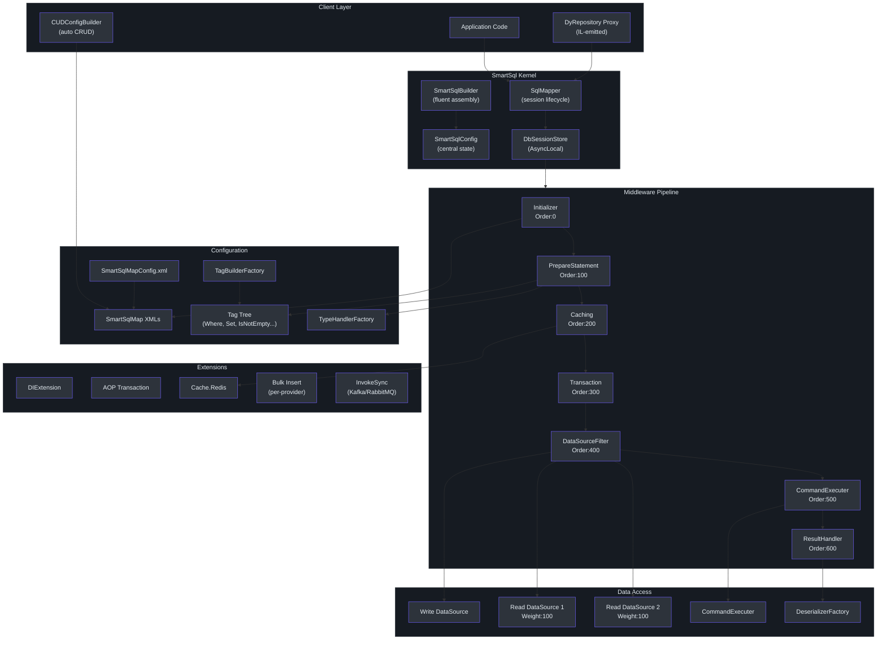
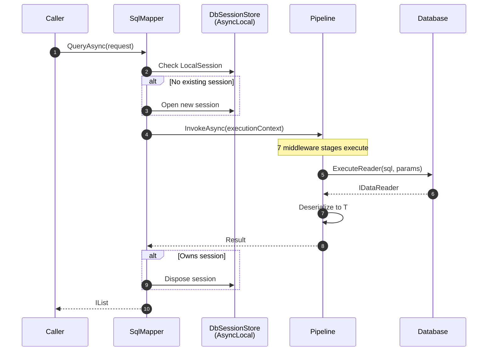
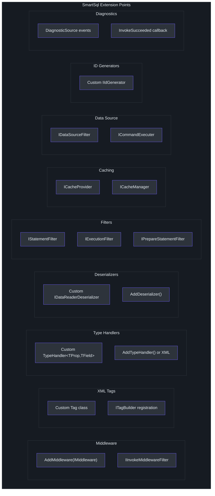
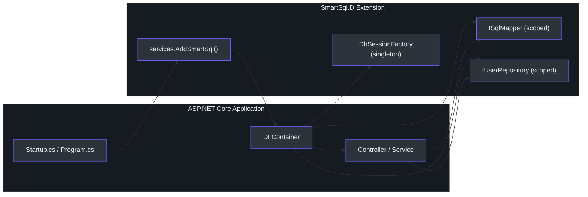
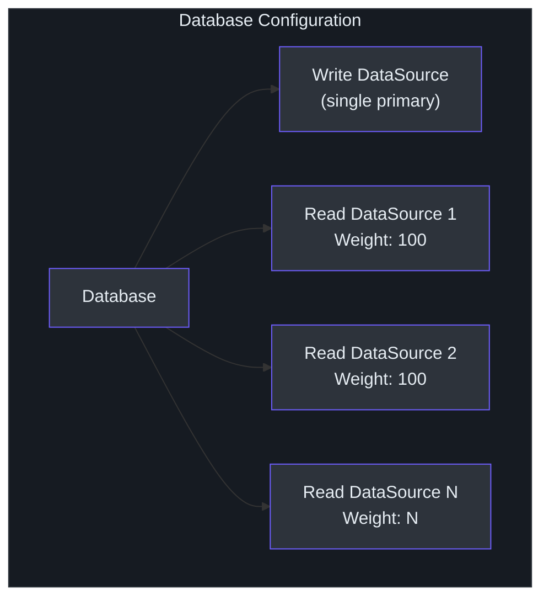
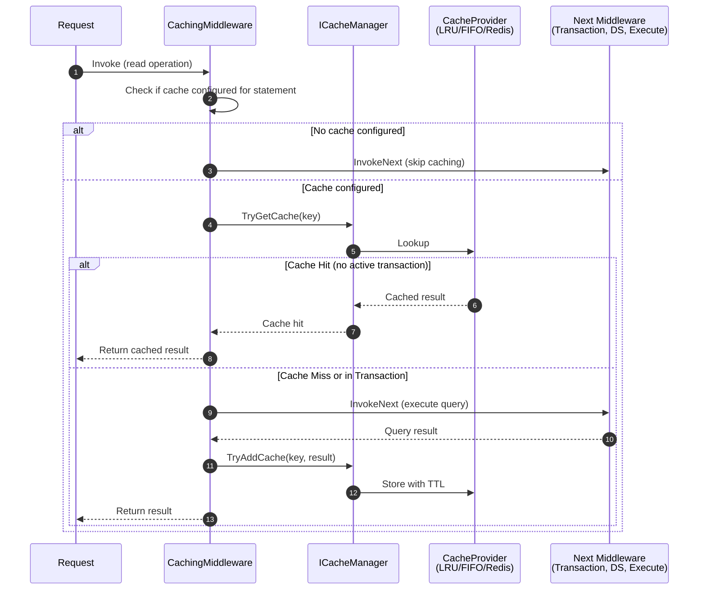
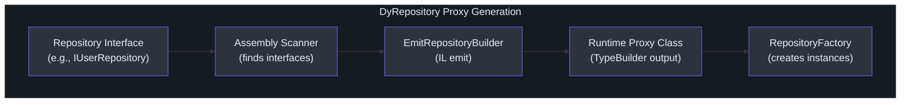

# Staff Engineer Guide

This guide provides a dense, opinionated architectural analysis of SmartSql. It is written for staff and principal engineers evaluating, extending, or leading adoption of SmartSql in production systems.

---

## The ONE Core Insight

SmartSql brings MyBatis-style XML SQL management to the .NET ecosystem. This is not merely a technical feature -- it is a philosophical commitment to **SQL as a first-class artifact** rather than a generated afterthought.

In EF Core, SQL is derived from LINQ expressions. In Dapper, SQL is embedded as string literals in C# code. SmartSql externalizes SQL into XML files, making it a distinct, reviewable, version-controlled artifact. This single design decision shapes every other architectural choice in the system.

The practical consequence: DBAs can review and optimize SQL without reading C#. Operations teams can modify query behavior by editing XML without recompiling. SQL is not an implementation detail -- it is a contract.

---

## System Architecture

### Full Architecture Diagram


<!-- Sources: src/SmartSql/SmartSqlBuilder.cs, src/SmartSql/Configuration/SmartSqlConfig.cs, src/SmartSql/SqlMapper.cs -->

### Request Lifecycle


<!-- Sources: src/SmartSql/SqlMapper.cs:90-111, src/SmartSql/SqlMapper.cs:143-164 -->

The session ownership model is significant: `SqlMapper` follows "who opens, who disposes" -- if it opens a session, it disposes it. If a caller already has an active session (e.g., via `BeginTransaction()`), the mapper reuses it without disposing.

---

## Design Tradeoff Analysis

### XML vs Attributes vs Code-First

| Dimension | XML (SmartSql) | Attributes (Dapper/RepoDB) | Code-First (EF Core) |
|-----------|---------------|---------------------------|---------------------|
| **SQL Visibility** | Excellent -- dedicated XML files | Poor -- SQL buried in code | Poor -- SQL generated at runtime |
| **DBA Collaboration** | Strong -- XML is DBA-readable | Weak -- requires C# fluency | Very weak -- opaque generation |
| **Dynamic SQL** | Rich tag system (`Where`, `Switch`, `For`) | String concatenation or manual | LINQ composition |
| **Refactoring Safety** | Weak -- XML not tracked by C# refactoring tools | Strong -- compile-time checked | Strong -- compile-time checked |
| **Code Generation** | XML is easy to template/generate | Harder to template | Mature tooling (migrations) |
| **Version Control Diffs** | Clean -- XML diffs are readable | Mixed -- code diffs conflate logic and SQL | Poor -- migration files can be noisy |
| **Runtime Flexibility** | High -- XML can be loaded from various sources | Low -- compiled into assembly | Medium -- some runtime configuration |

**SmartSql's bet**: SQL is important enough to warrant its own file format, managed separately from application code. This pays off in teams where database performance is a priority and DBAs are involved in query optimization.

### Middleware Pipeline vs Direct Execution

SmartSql's middleware pipeline is its most sophisticated architectural feature. Every SQL operation traverses 7 middleware stages, each with a well-defined responsibility.

**Advantages**:

- Clean separation of concerns (initialization, SQL building, caching, transaction, routing, execution, deserialization)
- Each middleware is independently testable
- Custom middleware can be inserted at precise points in the pipeline
- Cache and transaction behavior is declarative, not imperative
- Short-circuit capability (e.g., cache hit skips execution entirely)

**Costs**:

- Per-request allocation of `ExecutionContext`, `AbstractRequestContext`, and `ResultContext`
- Linked-list traversal overhead (though negligible compared to I/O)
- Debugging requires understanding which middleware is responsible for a given behavior
- Pipeline ordering is implicit (by `Order` integer) rather than explicit (by composition)

**Opinion**: The middleware pipeline is the right architecture for an ORM that needs to support diverse cross-cutting concerns (caching, transactions, routing, diagnostics). The cost is minimal -- the pipeline overhead is dwarfed by database I/O. The architecture mirrors the ASP.NET Core middleware model, which is well-understood by .NET developers.

### Session Management Strategy

SmartSql uses `AsyncLocal<IDbSession>` for session storage, enabling ambient session propagation across async call chains. This is similar to how `TransactionScope` works in .NET.

The key design choice: **automatic session lifecycle in SqlMapper**. If no session exists, one is opened and disposed per operation. If a session exists (started by `BeginTransaction()` or an AOP `[Transaction]` attribute), it is reused.

This is pragmatic but has implications:

- Without explicit transactions, each operation gets its own connection (no connection pooling issues, but no transactional batching)
- With explicit transactions, the caller must manage the lifecycle
- The AOP `[Transaction]` attribute provides declarative transaction boundaries

---

## Comparison Matrix

### SmartSql vs EF Core vs Dapper vs RepoDB

| Criterion | SmartSql | EF Core | Dapper | RepoDB |
|-----------|----------|---------|--------|--------|
| **SQL Control** | Full -- XML-declared | Partial -- LINQ-generated | Full -- inline strings | Full -- fluent/inline |
| **Dynamic SQL** | Rich XML tags | LINQ composition | Manual string concat | Fluent conditions |
| **Caching** | Built-in LRU/FIFO/Redis | Second-level (3rd party) | None | None |
| **Read/Write Splitting** | Built-in weighted routing | Manual via DI | Manual | Manual |
| **Bulk Operations** | Built-in per-provider | EF Extensions | SqlBulkCopy | Bulk operations |
| **Repository Pattern** | IL-emitted dynamic proxies | Manual or generic repos | Manual | Manual |
| **Transaction Management** | AOP attribute + programmatic | TransactionScope / SaveChanges | Manual (TransactionScope) | Manual |
| **Diagnostics** | DiagnosticSource events | DiagnosticSource events | None | None |
| **Schema Migrations** | None | Built-in | None | None |
| **Change Tracking** | Optional (PropertyChangedTrack) | Built-in | None | None |
| **Learning Curve** | Medium | High | Low | Low-Medium |
| **Async Support** | Full | Full | Full | Full |
| **Connection Management** | Automatic (session-per-operation) | DbContext pooling | Manual | Manual |

### When SmartSql Wins

- Teams that treat SQL as a first-class concern and want DBA-friendly workflows
- Systems requiring read/write splitting without external infrastructure
- Applications that benefit from declarative caching (LRU/Redis) without additional libraries
- Projects migrating from Java/MyBatis that want familiar patterns in .NET
- Systems with complex dynamic query requirements that are cleaner in XML than in C# string building

### When SmartSql Loses

- Teams that strongly prefer compile-time safety and code-generation tooling (EF Core wins)
- Simple CRUD applications where Dapper's minimal overhead is sufficient
- Projects requiring database migrations (EF Core is the only mature option)
- Teams that refuse to manage SQL separately from application code

---

## Performance Characteristics

### Overhead Analysis

SmartSql's per-query overhead comes from:

1. **XML tag evaluation**: The tag tree is walked to build the SQL string. This is CPU-bound string concatenation with condition checks. For simple queries, this is negligible (<1ms). For deeply nested tag trees, it scales linearly with tag count.

2. **Pipeline traversal**: 7 middleware stages, each doing minimal work (mostly null checks and delegations). This is effectively free compared to I/O.

3. **Parameter binding**: Type handlers convert .NET values to database parameters. The `AbstractTypeHandler` uses `MethodImpl(AggressiveInlining)` for hot paths.

4. **Result deserialization**: The `EntityDeserializer` uses `IObjectFactoryBuilder` (default: expression-tree based) to create and populate objects. First-call cost is higher due to expression compilation; subsequent calls are fast.

5. **Session management**: `AsyncLocal` access is cheap. The "who opens, who disposes" model means one connection acquire/release per standalone operation.

### Benchmark Infrastructure

SmartSql includes BenchmarkDotNet tests in [`src/SmartSql.Test.Performance/`](https://github.com/dotnetcore/SmartSql/blob/master/src/SmartSql.Test.Performance/). These measure raw mapper operations and can be used to detect regressions.

### Performance Tuning Points

- **XML tag complexity**: Simpler tag trees build SQL faster. Avoid deeply nested conditional structures when a flatter design suffices.
- **Caching**: The built-in LRU cache eliminates I/O entirely for cache hits. The `CachingMiddleware` short-circuits the remaining pipeline stages on hit.
- **Read/write splitting**: Distributing reads across replicas reduces load on the write master.
- **Bulk insert**: Use `SmartSql.Bulk.*` providers for large batch operations instead of row-by-row inserts.
- **Type handler selection**: Custom type handlers can be optimized for specific conversion patterns.
- **Connection string pooling**: Standard ADO.NET connection pooling applies. SmartSql does not add its own pooling layer.

---

## Extension Points and Customization Strategy

### Extension Point Map


<!-- Sources: src/SmartSql/SmartSqlBuilder.cs:331-395, src/SmartSql/Configuration/SmartSqlConfig.cs:22-46 -->

### Customization Strategy Recommendations

1. **Cross-cutting concerns** (logging, metrics, auditing): Use custom middleware via `AddMiddleware()`. Place it at the right `Order` to intercept at the desired point.

2. **Custom SQL behaviors**: Use custom XML tags for domain-specific SQL patterns. Register via `<TagBuilders>` in config.

3. **Specialized types**: Use custom type handlers for complex .NET types (encrypted fields, compressed data, custom value objects).

4. **Custom result processing**: Implement `IDataReaderDeserializer` for non-standard result shapes (e.g., graph deserialization, DDD value object mapping).

5. **Data source routing**: Implement `IDataSourceFilter` for custom routing logic beyond weighted round-robin (e.g., geo-based routing, latency-based routing).

6. **Custom ID generation**: Implement `IIdGenerator` for UUID v7, ULID, or database-sequential ID strategies.

7. **APM integration**: Subscribe to `DiagnosticSource` events or use the `InvokeSucceeded` callback for metrics and tracing.

---

## Decision Log: Architectural Choices

### D1: XML over Code-Based SQL Management

**Decision**: SQL statements are defined in XML files, not in C# code.

**Rationale**: Separation of SQL from application logic enables DBA collaboration, independent versioning, and runtime XML loading. This mirrors the MyBatis approach that has proven successful in Java enterprise systems.

**Consequence**: Loss of compile-time SQL validation. Typos in XML are runtime errors. IDE support for XML SQL is limited compared to LINQ.

### D2: Linked-List Middleware Pipeline

**Decision**: SQL execution flows through a chain of middleware objects linked by `Next` pointers, ordered by integer `Order`.

**Rationale**: Each cross-cutting concern (initialization, SQL building, caching, transactions, routing, execution, deserialization) is isolated in its own middleware. The pipeline can be extended without modifying existing code.

**Consequence**: Debugging requires tracing through the pipeline. The implicit ordering by integer can be fragile if two middlewares use the same order value.

### D3: AsyncLocal Session Storage

**Decision**: Session state is stored in `AsyncLocal<IDbSession>`, enabling ambient propagation across async call chains.

**Rationale**: This is the .NET standard pattern for ambient context (similar to `TransactionScope`, `ExecutionContext`). It works correctly with `async/await` and does not require explicit parameter passing.

**Consequence**: Session lifetime is tied to the async call chain. Code that spawns parallel tasks may not share the same session.

### D4: IL-Emit Dynamic Repositories

**Decision**: Repository interfaces are implemented at runtime via IL emit, not via Roslyn source generators or reflection.

**Rationale**: IL emit produces runtime types that are performant (no reflection overhead per call). This was the standard approach in the .NET Framework era.

**Consequence**: No compile-time verification of repository interface compatibility with XML statements. IL emit code is harder to debug than source-generated code.

### D5: Weighted Read/Write Splitting

**Decision**: Read data sources are elected by weighted random selection. Weights are configured in XML.

**Rationale**: Simple and effective for common read replica topologies. Weighted random provides natural load distribution without requiring external load balancers.

**Consequence**: No health checking or circuit breaking built in. If a read replica goes down, the application will experience connection failures until the weight is manually adjusted or the replica recovers.

### D6: Declarative Cache Invalidation

**Decision**: Cache invalidation is declared in XML (`FlushOnExecute`), not in application code.

**Rationale**: Keeps cache management close to the SQL definitions. Authors of a SQL map declare which write operations should flush which caches.

**Consequence**: Only statement-level granularity. No entity-level or row-level cache invalidation. Complex cache invalidation patterns (e.g., cross-aggregate) require external solutions.

### D7: C# 7.3 / netstandard2.0 Target

**Decision**: The core library targets netstandard2.0 with C# 7.3.

**Rationale**: Maximum compatibility across .NET Framework 4.6.1+, .NET Core 2.0+, and .NET 5+. This ensures SmartSql works in legacy and modern environments.

**Consequence**: Cannot use newer C# features (nullable reference types, pattern matching enhancements, records, spans). Performance optimizations available in newer runtimes are not leveraged.

---

## Integration Patterns

### ASP.NET Core Integration


<!-- Sources: src/SmartSql.DIExtension/SmartSqlDIExtensions.cs -->

The `DIExtension` provides `services.AddSmartSql()` which registers the builder, mapper, session factory, and optionally scans assemblies for repository interfaces to register as dynamic proxies.

### AOP Transaction Pattern

The `[Transaction]` attribute (using AspectCore) provides declarative transaction management:

```csharp
[Transaction(Alias = "SmartSql", Level = IsolationLevel.ReadCommitted)]
public async Task TransferFunds(int fromId, int toId, decimal amount)
{
    await _accountRepo.DebitAsync(fromId, amount);
    await _accountRepo.CreditAsync(toId, amount);
}
```

The interceptor checks for an existing session. If none exists, it opens one, begins a transaction, and disposes the session after the method completes.

### AOP Transaction Architecture

The `[Transaction]` attribute uses AspectCore (a dynamic proxy framework) to intercept method calls. The interceptor lifecycle:

1. Check if a session already exists with an active transaction.
2. If yes, pass through (supports nested method calls sharing the same transaction).
3. If no, open a new session, begin a transaction, execute the method, commit (or rollback on exception), and dispose the session.

This is functionally equivalent to `TransactionScope` but integrates cleanly with SmartSql's session management. The `Alias` property supports multi-SmartSql-instance scenarios where different databases need independent transactions.

### Diagnostics and Observability

SmartSql emits `DiagnosticSource` events for three categories:

1. **Command execution**: SQL text, parameters, execution time, and data source used.
2. **Session lifecycle**: Session open, close, transaction begin, commit, and rollback.
3. **Errors**: Exceptions during execution with full context.

Additionally, the `InvokeSucceeded` callback on `SmartSqlBuilder` provides a simpler hook for post-execution actions (used internally for cache invalidation and sync events).

These events integrate with .NET APM tools (Application Insights, OpenTelemetry, SkyWalking) without any SmartSql-specific instrumentation code.

---

## Deep Dive: Data Source Architecture

SmartSql's data source architecture provides transparent read/write splitting with weighted load balancing. This section analyzes the implementation in detail.

### Data Source Configuration Model


<!-- Sources: src/SmartSql/DataSource/Database.cs -->

The election algorithm in [`DataSourceFilter.Elect()`](https://github.com/dotnetcore/SmartSql/blob/master/src/SmartSql/DataSource/DataSourceFilter.cs#L24) works as follows:

1. If a local session already has a data source set (e.g., within a transaction), use it.
2. If the request is a write operation, use the write data source.
3. If a specific `ReadDb` is specified on the statement, use that named data source.
4. Otherwise, use `WeightFilter` to select a read data source by weighted random.

The `WeightFilter` implementation uses a cumulative weight approach: it sums all weights, generates a random number in [0, totalWeight), and selects the data source whose cumulative weight range contains that number. This provides proportional load distribution.

### DataSourceChoice Resolution

The `InitializerMiddleware` determines `DataSourceChoice` based on the `StatementType`:

- `StatementType.Write` (INSERT, UPDATE, DELETE): `DataSourceChoice.Write`
- `StatementType.Read` (SELECT): `DataSourceChoice.Read`
- Explicit override: `Statement.SourceChoice` can force a specific choice

This determination happens at the start of the pipeline (Order: 0), so all subsequent middleware stages can rely on it.

### Implications for High Availability

The built-in data source filtering does not include:

- **Health checking**: No automatic detection of failed replicas
- **Circuit breaking**: No automatic removal of failing replicas from the pool
- **Latency-based routing**: No preference for lower-latency replicas

For production deployments requiring these features, implement a custom `IDataSourceFilter` that wraps the default behavior with health checks and circuit breaking logic. The interface is straightforward:

```csharp
public interface IDataSourceFilter
{
    AbstractDataSource Elect(AbstractRequestContext context);
}
```

---

## Deep Dive: Caching Architecture

SmartSql's caching subsystem has two layers: the middleware integration and the cache provider abstraction.

### Cache Flow


<!-- Sources: src/SmartSql/Middlewares/CachingMiddleware.cs:14-29 -->

### Cache Key Composition

Cache keys are composed from:
- Statement full ID (Scope.Id)
- Request parameters (serialized)

### Cache Invalidation

Cache invalidation is declared in XML via `<FlushOnExecute>`:

```xml
<Cache Id="UserCache" Type="Lru">
    <FlushOnExecute Statement="Update"/>
    <FlushOnExecute Statement="Delete"/>
</Cache>
```

When the `Update` or `Delete` statement executes, the `UserCache` is flushed entirely. This is statement-level invalidation -- there is no row-level or entity-level cache invalidation.

### Redis Cache Extension

The `SmartSql.Cache.Redis` extension replaces the in-memory cache with Redis:

- Shared cache across application instances
- Supports Redis TTL
- Uses the `Cache.Sync` extension for cross-instance invalidation events

### Architectural Assessment

The caching architecture is pragmatic but limited:

- **Strengths**: Zero-configuration caching for simple cases. Declarative invalidation is easy to understand. Redis extension provides distributed caching.
- **Weaknesses**: No row-level invalidation. No cache warming. No conditional caching (cache always on for configured statements). Cache flush is all-or-nothing per cache ID.
- **Workaround for advanced needs**: Implement a custom `ICacheManager` that provides finer-grained control.

---

## Deep Dive: Dynamic Repository Internals

The DyRepository system generates runtime implementations of C# interfaces using IL emit. Understanding the internals is important for debugging and extension.

### Proxy Generation Flow


<!-- Sources: src/SmartSql.DyRepository/EmitRepositoryBuilder.cs -->

### Method-to-Statement Mapping

When a method on the repository interface is called, the IL-emitted proxy:

1. Extracts the method name (e.g., `Query`, `Insert`, `GetEntity`)
2. Combines it with the interface's `Scope` attribute to form the full statement ID (e.g., `User.Query`)
3. Builds a `RequestContext` from the method parameters
4. Delegates to `ISqlMapper` for execution

The `Scope` is resolved from the interface's `[SqlMap(Scope = "...")]` attribute, or inferred from the interface name by convention.

### CUDConfigBuilder

For entities registered via `RegisterEntity()`, the `CUDConfigBuilder` auto-generates XML statements for standard CRUD operations (Insert, Update, Delete, GetEntity, Query, QueryByPage, GetRecord, IsExist). These are generated at build time and merged into the `SmartSqlConfig.SqlMaps`.

### Trade-offs of IL Emit

- **Advantage**: No reflection overhead per call. Proxy types are actual CLR types.
- **Disadvantage**: No compile-time verification. Missing XML statements cause runtime errors. Debugging IL-emitted code is difficult.
- **Alternative**: Modern .NET could use source generators instead, but SmartSql's netstandard2.0 target and C# 7.3 constraint preclude this.

---

## Security Analysis

### SQL Injection Protection

SmartSql uses parameterized queries by default. The `PrepareStatementMiddleware` replaces `@Param` placeholders with database-provider-specific parameter syntax and binds values via `DbParameter`. User input is never concatenated into SQL strings.

The `<For>` tag generates parameterized IN clauses, avoiding the common SQL injection vector of dynamic IN clause construction.

### XML External Entity (XXE) Risk

XML parsing in .NET is configured to use `XmlReader` with safe settings. The XML configuration files are loaded at startup, not from user input. The XXE attack surface is limited to the deployment environment.

### Connection String Security

Connection strings in `SmartSqlMapConfig.xml` support property substitution:

```xml
<Properties>
    <Property Name="ConnectionString" Value="${ConnectionString}"/>
</Properties>
```

Environment variables can be injected via `UsePropertiesFromEnv()`, keeping secrets out of XML files.

---

## Risk Assessment

### Maturity

- SmartSql has been in production since early versions (currently 4.1.68), indicating sustained development.
- The architecture is stable -- the middleware pipeline pattern has not changed fundamentally.
- The target framework (netstandard2.0) ensures broad compatibility but limits access to modern .NET performance improvements.

### Community

- The project is hosted under the `dotnetcore` GitHub organization.
- The primary author is Ahoo Wang.
- The codebase shows consistent quality with clear separation of concerns.

### .NET Ecosystem Fit

- SmartSql occupies a unique niche: no other .NET ORM provides MyBatis-style XML SQL management with the same feature set.
- It competes indirectly with Dapper (simplicity) and EF Core (ecosystem tooling) but offers different tradeoffs.
- For teams migrating from Java/MyBatis, SmartSql provides the closest .NET equivalent.

### Operational Considerations

- XML configuration files need to be deployed alongside the application (typically in the content root).
- XML syntax errors are runtime errors, not compile-time errors. CI/CD pipelines should include XML validation.
- The `SmartSqlMapConfig.xml` and map files should be in source control with the same rigor as C# code.

---

## Key File Reference

| Component | File | Architectural Significance |
|-----------|------|---------------------------|
| Runtime Assembly | [`src/SmartSql/SmartSqlBuilder.cs`](https://github.com/dotnetcore/SmartSql/blob/master/src/SmartSql/SmartSqlBuilder.cs) | Fluent builder orchestrating all component creation |
| Central State | [`src/SmartSql/Configuration/SmartSqlConfig.cs`](https://github.com/dotnetcore/SmartSql/blob/master/src/SmartSql/Configuration/SmartSqlConfig.cs) | God object holding all runtime state |
| Query Entry | [`src/SmartSql/SqlMapper.cs`](https://github.com/dotnetcore/SmartSql/blob/master/src/SmartSql/SqlMapper.cs) | Session lifecycle management + query dispatch |
| Pipeline Base | [`src/SmartSql/Middlewares/AbstractMiddleware.cs`](https://github.com/dotnetcore/SmartSql/blob/master/src/SmartSql/Middlewares/AbstractMiddleware.cs) | Linked-list middleware with filter support |
| SQL Building | [`src/SmartSql/Middlewares/PrepareStatementMiddleware.cs`](https://github.com/dotnetcore/SmartSql/blob/master/src/SmartSql/Middlewares/PrepareStatementMiddleware.cs) | XML tag tree evaluation and DbParameter creation |
| Data Routing | [`src/SmartSql/DataSource/DataSourceFilter.cs`](https://github.com/dotnetcore/SmartSql/blob/master/src/SmartSql/DataSource/DataSourceFilter.cs) | Weighted read/write election |
| Repository Proxy | [`src/SmartSql.DyRepository/EmitRepositoryBuilder.cs`](https://github.com/dotnetcore/SmartSql/blob/master/src/SmartSql.DyRepository/EmitRepositoryBuilder.cs) | IL emit proxy generation |
| AOP Transaction | [`src/SmartSql.AOP/TransactionAttribute.cs`](https://github.com/dotnetcore/SmartSql/blob/master/src/SmartSql.AOP/TransactionAttribute.cs) | Declarative transaction interceptor |
| DI Integration | [`src/SmartSql.DIExtension/SmartSqlDIExtensions.cs`](https://github.com/dotnetcore/SmartSql/blob/master/src/SmartSql.DIExtension/SmartSqlDIExtensions.cs) | ASP.NET Core service registration |
| Tag Base | [`src/SmartSql/Configuration/Tags/Tag.cs`](https://github.com/dotnetcore/SmartSql/blob/master/src/SmartSql/Configuration/Tags/Tag.cs) | Abstract base for all XML dynamic tags |
| Type Handler | [`src/SmartSql/TypeHandlers/AbstractTypeHandler.cs`](https://github.com/dotnetcore/SmartSql/blob/master/src/SmartSql/TypeHandlers/AbstractTypeHandler.cs) | Type conversion base class |
| Version | [`build/version.props`](https://github.com/dotnetcore/SmartSql/blob/master/build/version.props) | Single source of truth for version |

---

## Summary

SmartSql is a mature, opinionated ORM that makes a clear architectural bet: SQL belongs in XML, not in code. The middleware pipeline provides clean separation of cross-cutting concerns. The extension model (custom middleware, tags, type handlers, deserializers, data source filters) covers the full surface area of customization needs. The built-in read/write splitting and caching reduce the need for additional infrastructure.

The tradeoffs are real: no compile-time SQL validation, no migration tooling, and the implicit coupling between XML files and C# interfaces requires discipline. But for teams that value SQL visibility and DBA collaboration, SmartSql is the strongest option in the .NET ecosystem.
