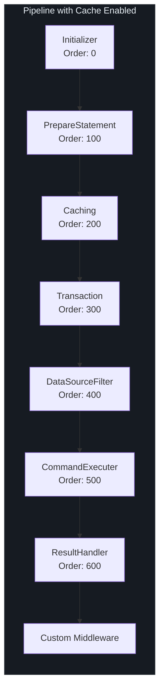

# 配置 API

SmartSql 通过 `SmartSqlBuilder` 流式 API 进行配置，该 API 构造一个包含所有运行时服务的 `SmartSqlConfig`。构建器组装中间件管道、注册类型处理器、初始化过滤器，并在生成最终的 `ISqlMapper` 和 `IDbSessionFactory` 实例之前设置缓存。

## 一览

| 概念 | 类 | 用途 |
|------|---|------|
| 构建器 | `SmartSqlBuilder` | 用于配置和构造运行时的流式 API |
| 配置 | `SmartSqlConfig` | 持有所有服务和映射的运行时配置 |
| 设置 | `Settings` | 全局开关设置（缓存、参数大小写等） |
| 数据库 | `Database` | 数据库提供程序和数据源配置 |
| 属性 | `Properties` | 用于 XML `${Property}` 替换的导入变量 |

## SmartSqlBuilder 流式 API

### 构建器流程图

```mermaid
flowchart TD
    subgraph builder["SmartSqlBuilder Configuration Flow"]
        style builder fill:#161b22,stroke:#30363d,color:#e6edf3
        Start["new SmartSqlBuilder()"] --> Source
        Source["UseXmlConfig() / UseDataSource() / UseNativeConfig()"]
        Source --> Alias["UseAlias()"]
        Alias --> Logger["UseLoggerFactory()"]
        Logger --> Cache["UseCache() / UseCacheManager()"]
        Cache --> Entities["RegisterEntity()"]
        Entities --> TH["AddTypeHandler()"]
        TH --> Filters["AddFilter()"]
        Filters --> MW["AddMiddleware()"]
        MW --> Props["UseProperties() / UsePropertiesFromEnv()"]
        Props --> CUD["UseCUDConfigBuilder()"]
        CUD --> Build["Build()"]
        Build --> Output["ISqlMapper + IDbSessionFactory"]
        Build --> Register["SmartSqlContainer.Register()"]
    end

```



<!-- Sources: src/SmartSql/SmartSqlBuilder.cs:23, src/SmartSql/SmartSqlBuilder.cs:60 -->

### 配置源方法

选择以下**一个**作为第一个调用，以确定 SmartSql 如何加载其配置：

| 方法 | 描述 |
|------|------|
| `UseXmlConfig(resourceType, path)` | 从 XML 文件加载配置。默认路径：`SmartSqlMapConfig.xml`。`resourceType` 可以是 `File`、`EmbeddedResource` 或 `Directory`。 |
| `UseDataSource(writeDataSource)` | 直接使用 `WriteDataSource` 对象（提供程序 + 连接字符串）进行配置。 |
| `UseDataSource(dbProviderName, connectionString)` | 简写形式，通过名称从 `DbProviderManager` 解析提供程序。 |
| `UseNativeConfig(smartSqlConfig)` | 直接使用预先构建的 `SmartSqlConfig` 对象。 |

```csharp
// XML configuration
var builder = new SmartSqlBuilder()
    .UseXmlConfig()
    .Build();

// Code-based configuration
var builder = new SmartSqlBuilder()
    .UseDataSource("MySql", "Server=localhost;Database=SmartSqlTest;Uid=root;Pwd=root;")
    .Build();
```

### 标识和日志

| 方法 | 默认值 | 描述 |
|------|--------|------|
| `UseAlias(alias)` | `"SmartSql"` | 设置实例名称。必须非空。用于在 `SmartSqlContainer` 中标识此实例。 |
| `UseLoggerFactory(factory)` | `NullLoggerFactory` | 为所有内部日志设置日志工厂。 |

### 缓存配置

| 方法 | 描述 |
|------|------|
| `UseCache(isCacheEnabled = true)` | 全局启用或禁用缓存中间件。 |
| `UseCacheManager(cacheManager)` | 提供自定义的 `ICacheManager` 实现（例如 Redis 缓存）。 |
| `UseIgnoreDbNull(ignoreDbNull = false)` | 为 true 时，在构建结果对象时忽略 `DBNull` 值。 |

### 实体注册

| 方法 | 描述 |
|------|------|
| `RegisterEntity(entityType)` | 注册单个实体类型，用于元数据缓存初始化和 CUD 构建器支持。 |
| `RegisterEntity(typeScanOptions)` | 根据 `TypeScanOptions` 扫描程序集并注册所有匹配的实体类型。 |

### 类型处理器和反序列化器注册

| 方法 | 描述 |
|------|------|
| `AddTypeHandler(typeHandler)` | 注册自定义 `TypeHandler` 用于参数/属性转换。 |
| `AddDeserializer(deserializer)` | 注册自定义 `IDataReaderDeserializer` 用于结果映射。 |

### 过滤器和中间件注册

| 方法 | 描述 |
|------|------|
| `AddFilter<TFilter>()` | 按类型添加过滤器（必须实现 `IFilter` 且具有无参构造函数）。 |
| `AddFilter(filter)` | 添加过滤器实例。 |
| `AddMiddleware(middleware)` | 向管道添加自定义 `IMiddleware`（插入在内置中间件之后）。参见[中间件 API](/zh/api/middleware)。 |

### 属性和环境

| 方法 | 描述 |
|------|------|
| `UseProperties(kvp)` | 导入键值属性用于 XML `${Property}` 替换。 |
| `UseProperties(dictionary)` | 从 `IDictionary` 导入。 |
| `UsePropertiesFromEnv(target)` | 从系统环境变量导入。 |

### 高级选项

| 方法 | 描述 |
|------|------|
| `UseCUDConfigBuilder()` | 启用从注册实体自动生成 CUD（Create/Update/Delete）SQL 语句。 |
| `UseCommandExecuter(executer)` | 提供自定义的 `ICommandExecuter` 实现。 |
| `UseDataSourceFilter(filter)` | 提供自定义的 `IDataSourceFilter` 用于读写分离逻辑。 |
| `RegisterToContainer(registered = false)` | 为 false 时，阻止在 `SmartSqlContainer` 中自动注册。 |
| `ListenInvokeSucceeded(callback)` | 注册每次成功命令执行的回调。 |

### Build 方法

| 方法 | 描述 |
|------|------|
| `Build()` | 构造运行时。幂等 -- 再次调用会立即返回。内部流程：配置 `SmartSqlConfig`、构建中间件管道、初始化反序列化器、注册类型处理器，并在 `SmartSqlContainer` 中注册。 |

```csharp
var builder = new SmartSqlBuilder()
    .UseAlias("MyApp")
    .UseXmlConfig()
    .UseCache()
    .RegisterEntity<User>()
    .AddFilter<CustomFilter>()
    .UseLoggerFactory(loggerFactory)
    .Build();

ISqlMapper mapper = builder.GetSqlMapper();
IDbSessionFactory factory = builder.GetDbSessionFactory();
```

## SmartSqlConfig

中央运行时配置对象。由 `SmartSqlBuilder.Build()` 构造，被所有运行时服务持有。

### 属性

| 属性 | 类型 | 描述 |
|------|------|------|
| `Alias` | `string` | 实例标识符 |
| `Settings` | `Settings` | 全局开关设置 |
| `Database` | `Database` | 数据库提供程序和数据源 |
| `Properties` | `Properties` | 导入变量 |
| `SqlMaps` | `IDictionary<string, SqlMap>` | 所有已加载的 SQL 映射作用域 |
| `LoggerFactory` | `ILoggerFactory` | 日志工厂 |
| `ObjectFactoryBuilder` | `IObjectFactoryBuilder` | 用于创建对象实例的工厂（默认：`ExpressionObjectFactoryBuilder`） |
| `DeserializerFactory` | `IDeserializerFactory` | `IDataReaderDeserializer` 实例链 |
| `TypeHandlerFactory` | `TypeHandlerFactory` | 类型处理器注册表 |
| `TagBuilderFactory` | `ITagBuilderFactory` | XML 动态标签构建器工厂 |
| `StatementAnalyzer` | `StatementAnalyzer` | 解析语句 XML |
| `SqlParamAnalyzer` | `SqlParamAnalyzer` | 分析 SQL 参数占位符 |
| `CacheTemplateAnalyzer` | `SqlParamAnalyzer` | 分析缓存模板参数 |
| `Pipeline` | `IMiddleware` | 中间件链表的头节点 |
| `DataSourceFilter` | `IDataSourceFilter` | 读/写数据源选择 |
| `SessionStore` | `IDbSessionStore` | 线程本地会话管理 |
| `DbSessionFactory` | `IDbSessionFactory` | 会话工厂 |
| `CacheManager` | `ICacheManager` | 缓存管理器 |
| `CommandExecuter` | `ICommandExecuter` | 执行 `DbCommand` 对象 |
| `InvokeSucceedListener` | `InvokeSucceedListener` | 成功调用的事件监听器 |
| `IdGenerators` | `IDictionary<string, IIdGenerator>` | ID 生成器（默认：SnowflakeId） |
| `AutoConverters` | `IDictionary<string, IAutoConverter>` | 命名自动转换器 |
| `DefaultAutoConverter` | `IAutoConverter` | 默认自动转换器（默认：`NoneAutoConverter`） |
| `Filters` | `FilterCollection` | 已注册的过滤器 |

### 查找方法

| 方法 | 描述 |
|------|------|
| `GetSqlMap(scope)` | 按作用域名称返回 `SqlMap`。未找到时抛出异常。 |
| `GetStatement(fullId)` | 按完整 ID 返回 `Statement`（例如 `"User.Query"`）。 |
| `GetCache(fullId)` | 按完整 ID 返回 `Cache`。 |
| `GetResultMap(fullId)` | 按完整 ID 返回 `ResultMap`。 |
| `GetParameterMap(fullId)` | 按完整 ID 返回 `ParameterMap`。 |
| `GetMultipleResultMap(fullId)` | 按完整 ID 返回 `MultipleResultMap`。 |

## Settings

具有合理默认值的全局开关设置：

| 设置 | 默认值 | 描述 |
|------|--------|------|
| `IgnoreParameterCase` | `false` | 为 true 时，参数名称不区分大小写 |
| `IsCacheEnabled` | `false` | 全局缓存开关 |
| `ParameterPrefix` | `"$"` | XML 中参数占位符的前缀 |
| `EnablePropertyChangedTrack` | `false` | 启用实体的属性变更跟踪 |
| `IgnoreDbNull` | `false` | 为 true 时，在结果映射过程中跳过 `DBNull` 值 |

## 构建过程内部机制

`Build()` 方法按以下顺序执行步骤：


<!-- Sources: src/SmartSql/SmartSqlBuilder.cs:60, src/SmartSql/SmartSqlBuilder.cs:155 -->

### 反序列化器链初始化

反序列化器链按特定顺序初始化。通过 `AddDeserializer()` 注册的自定义反序列化器被插入到此链中：

| 顺序 | 反序列化器 | 用途 |
|------|-----------|------|
| 1 | `MultipleResultDeserializer` | 处理多个结果集 |
| 2 | `ValueTupleDeserializer` | 映射到 `ValueTuple` 类型 |
| 3 | `ValueTypeDeserializer` | 映射到值类型（int、string 等） |
| 4 | `DynamicDeserializer` | 映射到 `dynamic` / `ExpandoObject` |
| 5 | `EntityDeserializer` | 映射到 POCO 实体（始终最后） |

### 管道构建

当 `IsCacheEnabled` 为 true 时，`CachingMiddleware` 被插入在 `PrepareStatementMiddleware` 和 `TransactionMiddleware` 之间。当为 false 时，使用 `NoneCacheManager` 且完全省略 `CachingMiddleware`。通过 `AddMiddleware()` 添加的自定义中间件被追加在所有内置中间件之后。



<!-- Sources: src/SmartSql/SmartSqlBuilder.cs:240, src/SmartSql/SmartSqlBuilder.cs:256 -->

## 交叉引用

- [API 概览](/zh/api/index) -- 包列表和入口点
- [核心接口](/zh/api/core-interfaces) -- `ISqlMapper`、`IDbSession`、`IDbSessionFactory` 方法
- [中间件 API](/zh/api/middleware) -- 中间件管道如何工作以及如何创建自定义中间件

## 参考资料

| 来源 | 描述 |
|------|------|
| [`src/SmartSql/SmartSqlBuilder.cs`](https://github.com/dotnetcore/SmartSql/blob/master/src/SmartSql/SmartSqlBuilder.cs) | 具有所有配置方法的流式构建器 |
| [`src/SmartSql/Configuration/SmartSqlConfig.cs`](https://github.com/dotnetcore/SmartSql/blob/master/src/SmartSql/Configuration/SmartSqlConfig.cs) | 中央配置类 |
| [`src/SmartSql/SqlMapper.cs`](https://github.com/dotnetcore/SmartSql/blob/master/src/SmartSql/SqlMapper.cs) | `SqlMapper` 构造函数，展示会话存储用法 |
| [`src/SmartSql/DbSession/IDbSessionFactory.cs`](https://github.com/dotnetcore/SmartSql/blob/master/src/SmartSql/DbSession/IDbSessionFactory.cs) | 会话工厂接口 |
| [`src/SmartSql/Middlewares/AbstractMiddleware.cs`](https://github.com/dotnetcore/SmartSql/blob/master/src/SmartSql/Middlewares/AbstractMiddleware.cs) | 中间件基类 |
