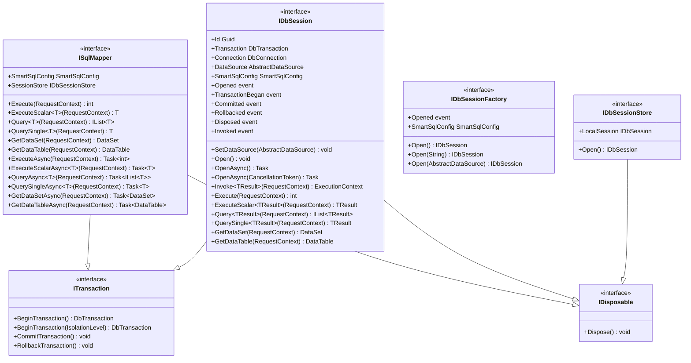
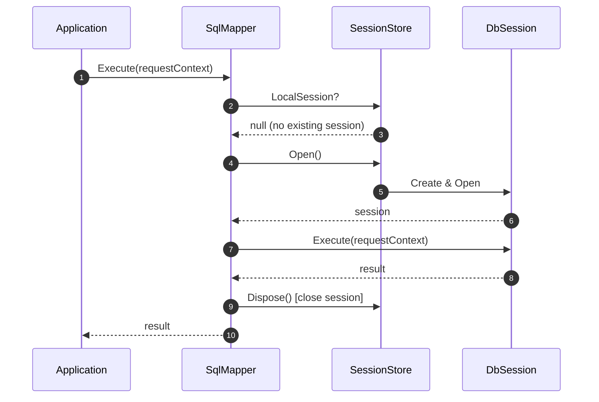
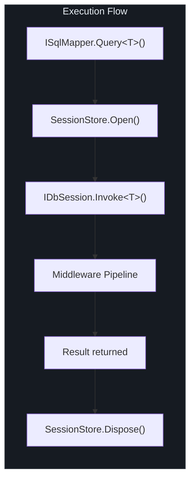

# 核心接口

SmartSql 的公共 API 建立在一小部分核心接口之上，这些接口处理数据访问、会话管理和事务控制。本页文档记录了这些接口上的每个公共方法。

## 一览

| 接口 | 用途 | 生命周期 |
|------|------|---------|
| `ISqlMapper` | 高级数据访问（同步 + 异步） | 每个 SmartSql 实例单例 |
| `IDbSession` | 底层数据库会话，包含连接和事务 | 每个请求或由会话存储管理 |
| `IDbSessionFactory` | 创建 `IDbSession` 实例 | 每个 SmartSql 实例单例 |
| `IDbSessionStore` | 线程本地会话存储 | 每个 SmartSql 实例单例 |
| `ITransaction` | 事务管理契约 | 混合在 `ISqlMapper` 和 `IDbSession` 中 |

## 接口层次结构

<!-- Sources: src/SmartSql/ISqlMapper.cs:13, src/SmartSql/DbSession/IDbSession.cs:24, src/SmartSql/DbSession/IDbSessionFactory.cs:17, src/SmartSql/DbSession/ITransaction.cs:6 -->

## ISqlMapper

数据访问的主要入口点。`ISqlMapper` 自动管理会话生命周期：在执行前打开会话，如果不存在外部会话则在执行后关闭。

### 同步方法

| 方法 | 返回类型 | 描述 |
|------|---------|------|
| `Execute(requestContext)` | `int` | 执行非查询命令（INSERT、UPDATE、DELETE）。返回受影响的行数。 |
| `ExecuteScalar<T>(requestContext)` | `T` | 执行命令并返回第一行第一列，转换为 `T`。 |
| `Query<T>(requestContext)` | `IList<T>` | 执行查询并返回类型 `T` 的实体列表。 |
| `QuerySingle<T>(requestContext)` | `T` | 执行查询并返回单个实体，未找到时返回默认值。 |
| `GetDataSet(requestContext)` | `DataSet` | 从查询结果返回非类型化的 `DataSet`。 |
| `GetDataTable(requestContext)` | `DataTable` | 从查询结果返回非类型化的 `DataTable`。 |

### 异步方法

| 方法 | 返回类型 | 描述 |
|------|---------|------|
| `ExecuteAsync(requestContext)` | `Task<int>` | `Execute` 的异步版本。 |
| `ExecuteScalarAsync<TResult>(requestContext)` | `Task<TResult>` | `ExecuteScalar` 的异步版本。 |
| `QueryAsync<TResult>(requestContext)` | `Task<IList<TResult>>` | `Query` 的异步版本。 |
| `QuerySingleAsync<TResult>(requestContext)` | `Task<TResult>` | `QuerySingle` 的异步版本。 |
| `GetDataSetAsync(requestContext)` | `Task<DataSet>` | `GetDataSet` 的异步版本。 |
| `GetDataTableAsync(requestContext)` | `Task<DataTable>` | `GetDataTable` 的异步版本。 |

### 事务方法（来自 ITransaction）

| 方法 | 描述 |
|------|------|
| `BeginTransaction()` | 打开会话并以默认隔离级别开始事务。如果本地会话已存在则抛出异常。 |
| `BeginTransaction(IsolationLevel)` | 同上，但使用显式隔离级别。 |
| `CommitTransaction()` | 提交当前事务并释放本地会话。 |
| `RollbackTransaction()` | 回滚当前事务并释放本地会话。如果没有活跃的事务则记录警告。 |

### 属性

| 属性 | 类型 | 描述 |
|------|------|------|
| `SmartSqlConfig` | `SmartSqlConfig` | 运行时配置实例。 |
| `SessionStore` | `IDbSessionStore` | 管理线程本地会话的会话存储。 |

### 会话所有权模式

<!-- Sources: src/SmartSql/SqlMapper.cs:90, src/SmartSql/SqlMapper.cs:113 -->

当本地会话已存在时（例如在事务中），`SqlMapper` 会复用它而不是创建新的。原则是：**谁打开会话谁负责释放**（会话所有权）。

## IDbSession

表示一个具有打开连接的单个数据库会话。提供对连接和事务的直接访问，以及所有数据访问方法。

### 事件

| 事件 | 委托类型 | 触发时机 |
|------|---------|---------|
| `Opened` | `DbSessionEventHandler` | 会话连接被打开时 |
| `TransactionBegan` | `DbSessionEventHandler` | 事务开始时 |
| `Committed` | `DbSessionEventHandler` | 事务提交时 |
| `Rollbacked` | `DbSessionEventHandler` | 事务回滚时 |
| `Disposed` | `DbSessionEventHandler` | 会话被释放时 |
| `Invoked` | `DbSessionInvokedEventHandler` | 任何命令完成时（携带 `ExecutionContext`） |

### 属性

| 属性 | 类型 | 描述 |
|------|------|------|
| `Id` | `Guid` | 唯一会话标识符 |
| `Transaction` | `DbTransaction` | 当前事务，或 null |
| `Connection` | `DbConnection` | 底层数据库连接 |
| `DataSource` | `AbstractDataSource` | 该会话连接的数据源 |
| `SmartSqlConfig` | `SmartSqlConfig` | 运行时配置 |

### 方法

| 方法 | 描述 |
|------|------|
| `SetDataSource(dataSource)` | 覆盖此会话的数据源 |
| `Open()` / `OpenAsync()` | 打开连接 |
| `Invoke<TResult>(requestContext)` | 完整的中间件管道调用，返回 `ExecutionContext` |

数据访问方法（`Execute`、`ExecuteScalar`、`Query`、`QuerySingle`、`GetDataSet`、`GetDataTable`）及其异步对应方法与 `ISqlMapper` 上的相同，但直接在会话上操作而不打开/关闭会话。

## IDbSessionFactory

创建 `IDbSession` 实例。工厂在 `Build()` 期间由 `SmartSqlConfig` 内部构造。

| 方法 | 描述 |
|------|------|
| `Open()` | 使用默认连接字符串创建会话 |
| `Open(connectionString)` | 使用显式连接字符串创建会话 |
| `Open(dataSource)` | 使用特定的 `AbstractDataSource` 创建会话 |

### 事件

| 事件 | 描述 |
|------|------|
| `Opened` | 当任何会话被打开时触发（用于绑定 `InvokeSucceedListener`） |

## IDbSessionStore

管理线程本地会话。当你调用 `Open()` 时，它会为当前线程创建或获取一个会话。

| 成员 | 描述 |
|------|------|
| `LocalSession` | 当前线程的会话，如果没有打开的会话则为 null |
| `Open()` | 为当前线程打开新会话 |
| `Dispose()` | 释放并清除当前线程的会话 |

## 执行流程

当 `ISqlMapper` 接收到调用时，它委托给 `IDbSession`，后者将请求通过中间件管道传递：

<!-- Sources: src/SmartSql/SqlMapper.cs:123, src/SmartSql/DbSession/IDbSession.cs:42 -->

## ExecutionContext

管道中的每个中间件都接收一个 `ExecutionContext`，它在执行链中携带所有状态：

| 属性 | 类型 | 描述 |
|------|------|------|
| `Type` | `ExecutionType` | 操作类型（Execute、ExecuteScalar、Query、QuerySingle、GetDataTable、GetDataSet） |
| `SmartSqlConfig` | `SmartSqlConfig` | 运行时配置 |
| `DbSession` | `IDbSession` | 活跃的数据库会话 |
| `Request` | `AbstractRequestContext` | 携带 SQL ID、参数和语句信息的请求 |
| `DataReaderWrapper` | `DataReaderWrapper` | 包装的 DataReader（由 CommandExecuterMiddleware 设置） |
| `Result` | `ResultContext` | 接收数据的结果容器 |

## 交叉引用

- [API 概览](/zh/api/index) -- 包列表和入口点摘要
- [配置 API](/zh/api/configuration) -- 如何创建和配置 `SmartSqlBuilder`
- [中间件 API](/zh/api/middleware) -- 在 `ISqlMapper` 和数据库之间执行的管道

## 参考资料

| 来源 | 描述 |
|------|------|
| [`src/SmartSql/ISqlMapper.cs`](https://github.com/dotnetcore/SmartSql/blob/master/src/SmartSql/ISqlMapper.cs) | `ISqlMapper` 接口定义 |
| [`src/SmartSql/SqlMapper.cs`](https://github.com/dotnetcore/SmartSql/blob/master/src/SmartSql/SqlMapper.cs) | `SqlMapper` 实现 |
| [`src/SmartSql/DbSession/IDbSession.cs`](https://github.com/dotnetcore/SmartSql/blob/master/src/SmartSql/DbSession/IDbSession.cs) | `IDbSession` 接口 |
| [`src/SmartSql/DbSession/IDbSessionFactory.cs`](https://github.com/dotnetcore/SmartSql/blob/master/src/SmartSql/DbSession/IDbSessionFactory.cs) | `IDbSessionFactory` 接口 |
| [`src/SmartSql/DbSession/IDbSessionStore.cs`](https://github.com/dotnetcore/SmartSql/blob/master/src/SmartSql/DbSession/IDbSessionStore.cs) | `IDbSessionStore` 接口 |
| [`src/SmartSql/DbSession/ITransaction.cs`](https://github.com/dotnetcore/SmartSql/blob/master/src/SmartSql/DbSession/ITransaction.cs) | `ITransaction` 接口 |
| [`src/SmartSql/ExecutionContext.cs`](https://github.com/dotnetcore/SmartSql/blob/master/src/SmartSql/ExecutionContext.cs) | `ExecutionContext` 类 |
