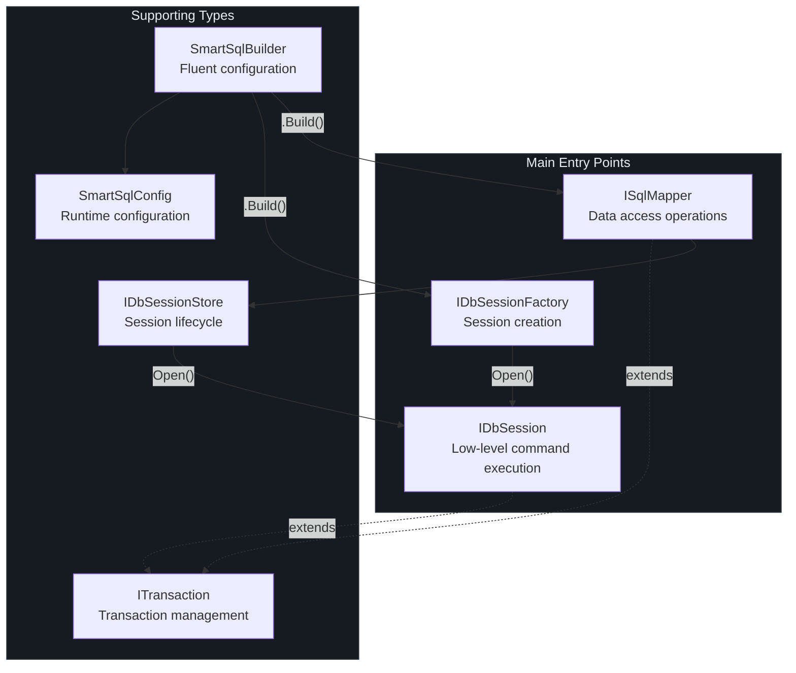
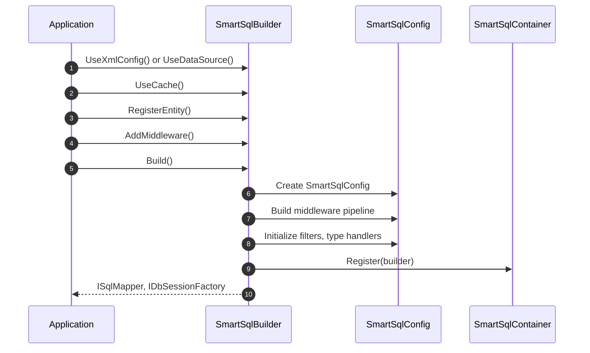

# API 参考概览

SmartSql 是一个面向 `netstandard2.0`（C# 7.3）的 .NET ORM 库，提供 XML 管理的 SQL 语句、读写分离、缓存、动态仓库代理和基于中间件的执行管道。版本 **4.1.68** 以 **Apache-2.0** 许可证发布。

本节记录了所有 SmartSql 包的公共 API 面。

## 一览

| 方面 | 详情 |
|------|------|
| 目标框架 | `netstandard2.0` |
| 语言版本 | C# 7.3 |
| 许可证 | Apache-2.0 |
| 当前版本 | 4.1.68 |
| 作者 | Ahoo Wang |
| 仓库 | [dotnetcore/SmartSql](https://github.com/dotnetcore/SmartSql) |

## 包依赖图

```mermaid
graph TD
    subgraph core["Core"]
        style core fill:#161b22,stroke:#30363d,color:#e6edf3
        SmartSql["SmartSql<br>Core ORM Library"]
    end
    subgraph extensions["Extension Packages"]
        style extensions fill:#161b22,stroke:#30363d,color:#e6edf3
        DI["SmartSql.DIExtension"]
        DyRepo["SmartSql.DyRepository"]
        Options["SmartSql.Options"]
        AOP["SmartSql.AOP"]
        Extensions["SmartSql.Extensions"]
        ScriptTag["SmartSql.ScriptTag"]
    end
    subgraph caching["Caching Packages"]
        style caching fill:#161b22,stroke:#30363d,color:#e6edf3
        CacheRedis["SmartSql.Cache.Redis"]
        CacheSync["SmartSql.Cache.Sync"]
        DistCache["SmartSql.DistributedCache"]
    end
    subgraph bulk["Bulk Insert Packages"]
        style bulk fill:#161b22,stroke:#30363d,color:#e6edf3
        BulkBase["SmartSql.Bulk"]
        BulkSQL["SmartSql.Bulk.SqlServer"]
        BulkMSSQL["SmartSql.Bulk.MsSqlServer"]
        BulkMy["SmartSql.Bulk.MySql"]
        BulkMyConn["SmartSql.Bulk.MySqlConnector"]
        BulkPG["SmartSql.Bulk.PostgreSql"]
    end
    subgraph sync["Sync Packages"]
        style sync fill:#161b22,stroke:#30363d,color:#e6edf3
        InvokeSync["SmartSql.InvokeSync"]
        SyncKafka["SmartSql.InvokeSync.Kafka"]
        SyncRMQ["SmartSql.InvokeSync.RabbitMQ"]
    end
    subgraph providers["Database Providers"]
        style providers fill:#161b22,stroke:#30363d,color:#e6edf3
        Oracle["SmartSql.Oracle"]
        TypeHandler["SmartSql.TypeHandler"]
        TypeHandlerPG["SmartSql.TypeHandler.PostgreSql"]
    end

    SmartSql --> DI
    SmartSql --> DyRepo
    SmartSql --> Options
    SmartSql --> AOP
    SmartSql --> Extensions
    SmartSql --> ScriptTag
    SmartSql --> CacheRedis
    SmartSql --> CacheSync
    SmartSql --> DistCache
    BulkBase --> BulkSQL
    BulkBase --> BulkMSSQL
    BulkBase --> BulkMy
    BulkBase --> BulkMyConn
    BulkBase --> BulkPG
    SmartSql --> BulkBase
    SmartSql --> InvokeSync
    InvokeSync --> SyncKafka
    InvokeSync --> SyncRMQ
    SmartSql --> Oracle
    SmartSql --> TypeHandler
    SmartSql --> TypeHandlerPG

```



<!-- Sources: Directory.Build.props:1, build/version.props:1 -->

## NuGet 包

### 核心

| 包 | 描述 |
|----|------|
| `SmartSql` | 核心 ORM 库，包含中间件管道、XML SQL 管理和 `ISqlMapper` |

### 扩展

| 包 | 描述 |
|----|------|
| `SmartSql.DIExtension` | ASP.NET Core 依赖注入集成（`AddSmartSql()`） |
| `SmartSql.DyRepository` | 通过 IL emit 动态生成仓库代理 |
| `SmartSql.Options` | 用于 `appsettings.json` 的 Options 模式配置构建器 |
| `SmartSql.AOP` | 使用 `[Transaction]` 特性的 AOP 事务支持 |
| `SmartSql.Extensions` | 通用扩展 |
| `SmartSql.ScriptTag` | 动态 SQL 的脚本标签支持 |
| `SmartSql.DataConnector` | 数据连接器服务 |

### 缓存

| 包 | 描述 |
|----|------|
| `SmartSql.Cache.Redis` | 基于 Redis 的分布式缓存提供程序 |
| `SmartSql.Cache.Sync` | 跨实例缓存同步 |
| `SmartSql.DistributedCache` | 分布式缓存抽象 |

### 批量插入

| 包 | 描述 |
|----|------|
| `SmartSql.Bulk` | 基础批量插入抽象 |
| `SmartSql.Bulk.SqlServer` | SQL Server 批量插入 |
| `SmartSql.Bulk.MsSqlServer` | MS SQL Server 批量插入 |
| `SmartSql.Bulk.MySql` | MySQL 批量插入 |
| `SmartSql.Bulk.MySqlConnector` | MySQL（MySqlConnector 驱动）批量插入 |
| `SmartSql.Bulk.PostgreSql` | PostgreSQL 批量插入 |

### 同步

| 包 | 描述 |
|----|------|
| `SmartSql.InvokeSync` | 通过消息队列进行数据同步 |
| `SmartSql.InvokeSync.Kafka` | 基于 Kafka 的同步传输 |
| `SmartSql.InvokeSync.RabbitMQ` | 基于 RabbitMQ 的同步传输 |

### 数据库提供程序

| 包 | 描述 |
|----|------|
| `SmartSql.Oracle` | Oracle 数据库提供程序 |
| `SmartSql.TypeHandler` | JSON 和自定义类型处理器 |
| `SmartSql.TypeHandler.PostgreSql` | PostgreSQL 专用类型处理器 |

## 主要入口点

SmartSql 暴露了三个主要接口，构成公共 API 面：



<!-- Sources: src/SmartSql/ISqlMapper.cs:1, src/SmartSql/DbSession/IDbSessionFactory.cs:17, src/SmartSql/DbSession/IDbSession.cs:24 -->

### ISqlMapper

主要的数据访问接口。提供同步和异步方法用于执行 SQL 语句、查询和获取结果。它会自动管理每个操作的会话生命周期（打开/关闭）。完整的方法列表请参阅[核心接口](/zh/api/core-interfaces)。

```csharp
// Typical usage
var list = sqlMapper.Query<User>(new RequestContext { FullSqlId = "User.Query" });
var count = await sqlMapper.ExecuteAsync(new RequestContext { FullSqlId = "User.Delete", Request = new { Id = 1 } });
```

### IDbSessionFactory

创建 `IDbSession` 实例，用于更底层的控制。当你需要显式的会话管理或自定义数据源路由时非常有用。

```csharp
var session = sessionFactory.Open();
var result = session.Query<User>(requestContext);
```

### IDbSession

最底层的接口。提供对 `DbConnection`、`DbTransaction` 和原始命令执行的直接访问。暴露事件（`Opened`、`Committed`、`Rollbacked`、`Disposed`）用于生命周期钩子。

## SmartSqlBuilder

构建整个运行时的流式入口。所有配置在调用 `Build()` 之前都流经 `SmartSqlBuilder`。完整的流式 API 请参阅[配置 API](/zh/api/configuration)。



<!-- Sources: src/SmartSql/SmartSqlBuilder.cs:60, src/SmartSql/Configuration/SmartSqlConfig.cs:21 -->

## 交叉引用

- [核心接口](/zh/api/core-interfaces) -- `ISqlMapper`、`IDbSession`、`IDbSessionFactory` 的完整文档
- [配置 API](/zh/api/configuration) -- `SmartSqlBuilder` 流式 API 和 `SmartSqlConfig`
- [中间件 API](/zh/api/middleware) -- 中间件管道、自定义中间件、过滤器

## 参考资料

| 来源 | 描述 |
|------|------|
| [`src/SmartSql/ISqlMapper.cs`](https://github.com/dotnetcore/SmartSql/blob/master/src/SmartSql/ISqlMapper.cs) | `ISqlMapper` 接口定义 |
| [`src/SmartSql/SqlMapper.cs`](https://github.com/dotnetcore/SmartSql/blob/master/src/SmartSql/SqlMapper.cs) | `SqlMapper` 实现 |
| [`src/SmartSql/SmartSqlBuilder.cs`](https://github.com/dotnetcore/SmartSql/blob/master/src/SmartSql/SmartSqlBuilder.cs) | 流式构建器 |
| [`src/SmartSql/Configuration/SmartSqlConfig.cs`](https://github.com/dotnetcore/SmartSql/blob/master/src/SmartSql/Configuration/SmartSqlConfig.cs) | 中央配置 |
| [`src/SmartSql/DbSession/IDbSession.cs`](https://github.com/dotnetcore/SmartSql/blob/master/src/SmartSql/DbSession/IDbSession.cs) | 会话接口 |
| [`src/SmartSql/DbSession/IDbSessionFactory.cs`](https://github.com/dotnetcore/SmartSql/blob/master/src/SmartSql/DbSession/IDbSessionFactory.cs) | 会话工厂接口 |
| [`Directory.Build.props`](https://github.com/dotnetcore/SmartSql/blob/master/Directory.Build.props) | 共享构建属性 |
