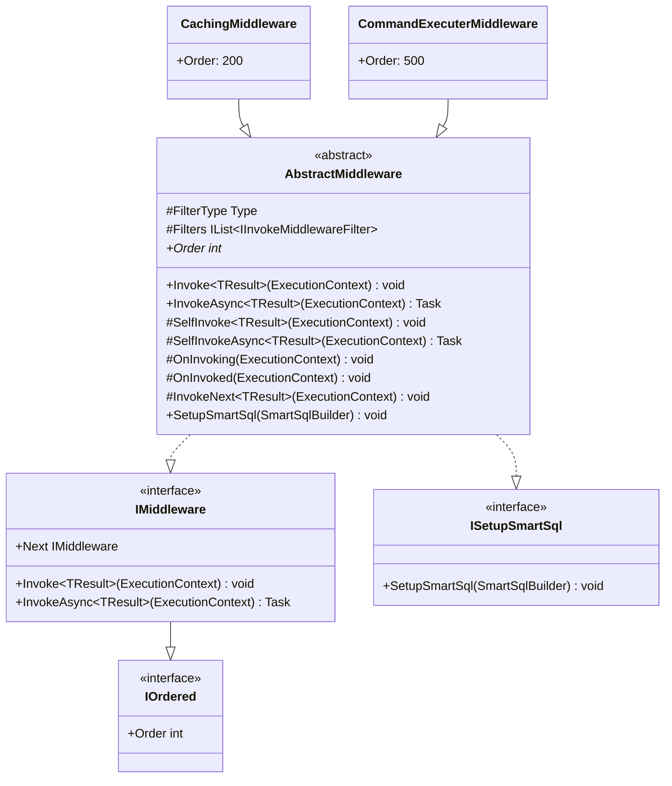
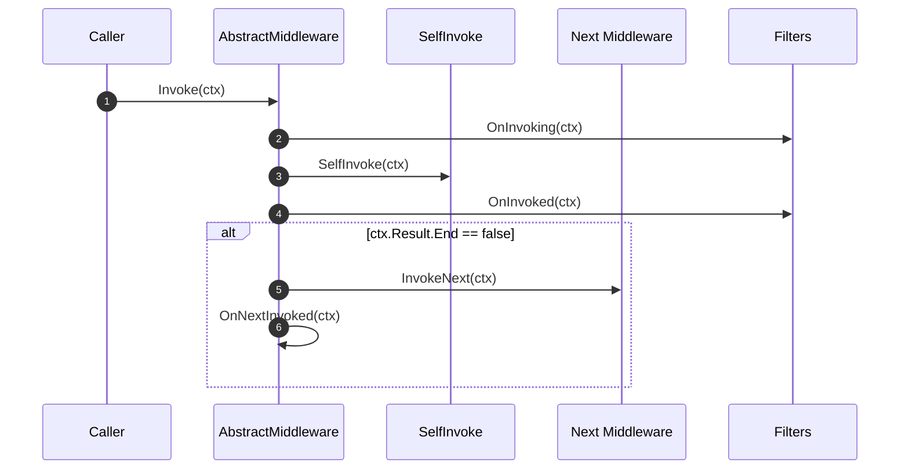
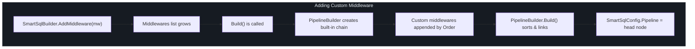
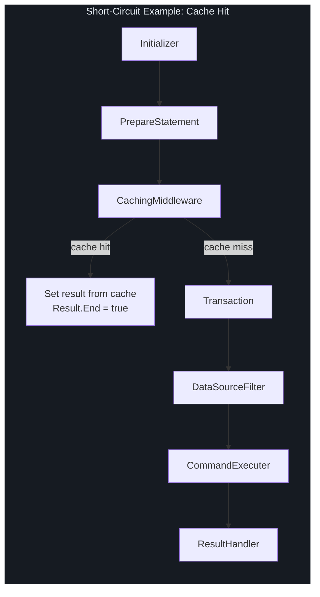

# 中间件 API

SmartSql 通过链表中间件管道执行所有 SQL 操作。每个中间件接收一个 `ExecutionContext`，执行其工作，然后委托给下一个中间件。这种设计实现了关注点的清晰分离：语句解析、SQL 准备、缓存、事务管理、数据源路由、命令执行和结果反序列化分别由独立的中间件组件处理。

## 一览

| 概念 | 描述 |
|------|------|
| `IMiddleware` | 核心接口：`Invoke<T>`、`InvokeAsync<T>` 和 `Next` 指针 |
| `IOrdered` | 通过 `int Order` 属性确定执行顺序 |
| `AbstractMiddleware` | 具有过滤器支持和生命周期钩子的基类 |
| `PipelineBuilder` | 从注册的中间件构建链表 |
| `ExecutionContext` | 流经整个管道的共享上下文 |

## 接口定义

### IMiddleware

```csharp
public interface IMiddleware : IOrdered
{
    IMiddleware Next { get; set; }
    void Invoke<TResult>(ExecutionContext executionContext);
    Task InvokeAsync<TResult>(ExecutionContext executionContext);
}
```

`Next` 指针形成一个单向链表。每个中间件调用 `Next.Invoke<TResult>()`（或异步变体）来继续管道。

### IOrdered

```csharp
public interface IOrdered
{
    int Order { get; }
}
```

`Order` 属性控制中间件在管道中的位置。较小的值先执行。内置中间件使用以下顺序：

## 内置中间件链

```mermaid
flowchart TD
    subgraph pipeline["SmartSql Middleware Pipeline"]
        style pipeline fill:#161b22,stroke:#30363d,color:#e6edf3
        M0["InitializerMiddleware<br>Order: 0<br>Resolves Statement, DataSource"]
        M1["PrepareStatementMiddleware<br>Order: 100<br>Builds SQL, creates DbParameters"]
        M2["CachingMiddleware<br>Order: 200<br>Cache check/populate (optional)"]
        M3["TransactionMiddleware<br>Order: 300<br>Wraps in transaction if requested"]
        M4["DataSourceFilterMiddleware<br>Order: 400<br>Selects read vs write data source"]
        M5["CommandExecuterMiddleware<br>Order: 500<br>Executes DbCommand"]
        M6["ResultHandlerMiddleware<br>Order: 600<br>Deserializes DataReader results"]
        Custom["Custom Middleware<br>Order: > 600<br>User-defined logic"]

        M0 --> M1 --> M2 --> M3 --> M4 --> M5 --> M6 --> Custom
    end

```



<!-- Sources: src/SmartSql/Middlewares/InitializerMiddleware.cs:214, src/SmartSql/Middlewares/PrepareStatementMiddleware.cs:155, src/SmartSql/Middlewares/CachingMiddleware.cs:58, src/SmartSql/Middlewares/TransactionMiddleware.cs:43, src/SmartSql/Middlewares/DataSourceFilterMiddleware.cs:32, src/SmartSql/Middlewares/CommandExecuterMiddleware.cs:156, src/SmartSql/Middlewares/ResultHandlerMiddleware.cs:76 -->

### 中间件详情

| 顺序 | 类 | 关键职责 |
|------|---|---------|
| 0 | `InitializerMiddleware` | 从 `SmartSqlConfig.SqlMaps` 解析 `Statement`，设置数据源选择（读/写），解析结果映射、参数映射、缓存引用和自动转换器 |
| 100 | `PrepareStatementMiddleware` | 通过评估动态 XML 标签构建最终 SQL 字符串，并使用 `TypeHandlerFactory` 从请求参数创建 `DbParameter` 对象 |
| 200 | `CachingMiddleware` | 在执行查询前检查缓存。缓存未命中时，让管道继续执行然后缓存结果。仅在语句配置了缓存且没有活跃事务时才活跃。 |
| 300 | `TransactionMiddleware` | 如果在语句/请求上指定了事务隔离级别且没有活跃事务，则将下游管道包装在 `TransactionWrap` 中 |
| 400 | `DataSourceFilterMiddleware` | 如果会话上尚未设置数据源，则使用 `IDataSourceFilter.Elect()` 选择适当的数据源（读或写） |
| 500 | `CommandExecuterMiddleware` | 通过 `ICommandExecuter` 执行实际的 `DbCommand`。对于查询，打开 `DataReader` 并将其传递给下游。对于非查询，直接设置结果并终止管道（`Result.End = true`） |
| 600 | `ResultHandlerMiddleware` | 使用 `DeserializerFactory` 选择适当的反序列化器，并将 `DataReader` 映射到实体。完成后关闭并释放 `DataReader`。 |

## AbstractMiddleware 基类

所有内置中间件都继承自 `AbstractMiddleware`，它提供：



<!-- Sources: src/SmartSql/Middlewares/AbstractMiddleware.cs:9, src/SmartSql/IMiddleware.cs:8, src/SmartSql/IOrdered.cs:3 -->

### 生命周期钩子

`AbstractMiddleware` 提供以下可重写的钩子，按此顺序执行：



<!-- Sources: src/SmartSql/Middlewares/AbstractMiddleware.cs:15 -->

| 钩子 | 调用时机 | 典型用途 |
|------|---------|---------|
| `OnInvoking(ctx)` | `SelfInvoke` 之前 | 预处理、验证 |
| `SelfInvoke<T>(ctx)` | 中间件主要逻辑 | 核心中间件工作 |
| `OnInvoked(ctx)` | `SelfInvoke` 之后 | 后处理、日志记录 |
| `InvokeNext<T>(ctx)` | 委托给 `Next` | 管道继续 |
| `OnNextInvoked<T>(ctx)` | `Next` 完成之后 | 下游完成后的清理 |

## 过滤器系统

过滤器附加到特定的中间件类型，并在该中间件的 `SelfInvoke` 之前/之后运行。这提供了横切关注点功能，而无需修改中间件本身。

### 过滤器接口

| 接口 | 方法 | 调用时机 |
|------|------|---------|
| `IInvokeFilter` | `OnInvoking(ctx)` | `SelfInvoke` 之前 |
| `IInvokeFilter` | `OnInvoked(ctx)` | `SelfInvoke` 之后 |
| `IAsyncInvokeFilter` | `OnInvokingAsync(ctx)` | 异步 `SelfInvoke` 之前 |
| `IAsyncInvokeFilter` | `OnInvokedAsync(ctx)` | 异步 `SelfInvoke` 之后 |
| `IFilter` | （标记） | 所有过滤器的基础接口 |
| `IPrepareStatementFilter` | 继承 `IInvokeMiddlewareFilter` | 针对 `PrepareStatementMiddleware` |

中间件通过 `FilterType` 属性声明它支持哪种过滤器类型。例如，`PrepareStatementMiddleware` 设置 `FilterType = typeof(IPrepareStatementFilter)`，因此只有实现了 `IPrepareStatementFilter` 的过滤器才会附加到它。

## 创建自定义中间件

要创建自定义中间件：

### 第 1 步：实现中间件

```csharp
public class LoggingMiddleware : AbstractMiddleware
{
    private ILogger _logger;

    // Order determines position in pipeline.
    // Use a value > 600 to run after built-in middlewares.
    public override int Order => 700;

    protected override void SelfInvoke<TResult>(ExecutionContext executionContext)
    {
        _logger.LogInformation(
            "Executing {Type} for {FullSqlId}",
            executionContext.Type,
            executionContext.Request.FullSqlId);
    }

    protected override async Task SelfInvokeAsync<TResult>(ExecutionContext executionContext)
    {
        _logger.LogInformation(
            "Executing {Type} for {FullSqlId}",
            executionContext.Type,
            executionContext.Request.FullSqlId);
    }

    public override void SetupSmartSql(SmartSqlBuilder smartSqlBuilder)
    {
        _logger = smartSqlBuilder.SmartSqlConfig.LoggerFactory
            .CreateLogger<LoggingMiddleware>();
    }
}
```

### 第 2 步：通过 SmartSqlBuilder 注册

```csharp
var builder = new SmartSqlBuilder()
    .UseXmlConfig()
    .AddMiddleware(new LoggingMiddleware())
    .Build();
```

自定义中间件被追加在内置链之后。`PipelineBuilder` 按 `Order` 对所有中间件进行排序，因此即使你以乱序添加它们，它们也会正确执行。

## 创建自定义过滤器

```csharp
// 1. Define a filter interface (or use IPrepareStatementFilter)
public interface IMyCustomFilter : IInvokeMiddlewareFilter { }

// 2. Implement the filter
public class AuditFilter : IMyCustomFilter
{
    public void OnInvoking(ExecutionContext context)
    {
        // Pre-execution audit
    }

    public void OnInvoked(ExecutionContext context)
    {
        // Post-execution audit
    }

    public Task OnInvokingAsync(ExecutionContext context)
    {
        OnInvoking(context);
        return Task.CompletedTask;
    }

    public Task OnInvokedAsync(ExecutionContext context)
    {
        OnInvoked(context);
        return Task.CompletedTask;
    }
}

// 3. Register the filter
var builder = new SmartSqlBuilder()
    .UseXmlConfig()
    .AddFilter(new AuditFilter())
    .Build();
```

过滤器仅在 `FilterType` 可从过滤器接口赋值的中间件上激活。

## 通过 SmartSqlBuilder 添加中间件

`SmartSqlBuilder` 上的 `AddMiddleware` 方法：



<!-- Sources: src/SmartSql/SmartSqlBuilder.cs:392, src/SmartSql/SmartSqlBuilder.cs:240 -->

## 中间件短路

某些中间件通过设置 `executionContext.Result.End = true` 来提前终止管道。当这种情况发生时，下游中间件会被跳过。

| 中间件 | 短路条件 |
|--------|---------|
| `CommandExecuterMiddleware` | 对于 `Execute`、`ExecuteScalar`、`GetDataSet` 和 `GetDataTable` 操作 -- 直接设置结果而不调用 `ResultHandlerMiddleware` |
| `CachingMiddleware` | 当找到缓存命中时（无活跃事务） -- 从缓存设置结果，完全跳过命令执行 |



<!-- Sources: src/SmartSql/Middlewares/CachingMiddleware.cs:20, src/SmartSql/Middlewares/CommandExecuterMiddleware.cs:14 -->

## 交叉引用

- [API 概览](/zh/api/index) -- 包列表和入口点
- [配置 API](/zh/api/configuration) -- `SmartSqlBuilder` 流式 API 和管道构建
- [核心接口](/zh/api/core-interfaces) -- `ExecutionContext`、`ISqlMapper`、`IDbSession`

## 参考资料

| 来源 | 描述 |
|------|------|
| [`src/SmartSql/IMiddleware.cs`](https://github.com/dotnetcore/SmartSql/blob/master/src/SmartSql/IMiddleware.cs) | `IMiddleware` 接口 |
| [`src/SmartSql/IOrdered.cs`](https://github.com/dotnetcore/SmartSql/blob/master/src/SmartSql/IOrdered.cs) | `IOrdered` 接口 |
| [`src/SmartSql/Middlewares/AbstractMiddleware.cs`](https://github.com/dotnetcore/SmartSql/blob/master/src/SmartSql/Middlewares/AbstractMiddleware.cs) | 具有生命周期钩子和过滤器支持的基类 |
| [`src/SmartSql/Middlewares/InitializerMiddleware.cs`](https://github.com/dotnetcore/SmartSql/blob/master/src/SmartSql/Middlewares/InitializerMiddleware.cs) | 语句解析中间件 |
| [`src/SmartSql/Middlewares/PrepareStatementMiddleware.cs`](https://github.com/dotnetcore/SmartSql/blob/master/src/SmartSql/Middlewares/PrepareStatementMiddleware.cs) | SQL 构建和参数创建 |
| [`src/SmartSql/Middlewares/CachingMiddleware.cs`](https://github.com/dotnetcore/SmartSql/blob/master/src/SmartSql/Middlewares/CachingMiddleware.cs) | 缓存检查和填充 |
| [`src/SmartSql/Middlewares/TransactionMiddleware.cs`](https://github.com/dotnetcore/SmartSql/blob/master/src/SmartSql/Middlewares/TransactionMiddleware.cs) | 事务包装 |
| [`src/SmartSql/Middlewares/DataSourceFilterMiddleware.cs`](https://github.com/dotnetcore/SmartSql/blob/master/src/SmartSql/Middlewares/DataSourceFilterMiddleware.cs) | 读/写数据源选择 |
| [`src/SmartSql/Middlewares/CommandExecuterMiddleware.cs`](https://github.com/dotnetcore/SmartSql/blob/master/src/SmartSql/Middlewares/CommandExecuterMiddleware.cs) | 命令执行 |
| [`src/SmartSql/Middlewares/ResultHandlerMiddleware.cs`](https://github.com/dotnetcore/SmartSql/blob/master/src/SmartSql/Middlewares/ResultHandlerMiddleware.cs) | 结果反序列化 |
| [`src/SmartSql/Middlewares/Filters/IInvokeMiddlewareFilter.cs`](https://github.com/dotnetcore/SmartSql/blob/master/src/SmartSql/Middlewares/Filters/IInvokeMiddlewareFilter.cs) | 中间件过滤器接口 |
| [`src/SmartSql/Filters/IFilter.cs`](https://github.com/dotnetcore/SmartSql/blob/master/src/SmartSql/Filters/IFilter.cs) | 基础过滤器标记接口 |
| [`src/SmartSql/Filters/IInvokeFilter.cs`](https://github.com/dotnetcore/SmartSql/blob/master/src/SmartSql/Filters/IInvokeFilter.cs) | 同步过滤器接口 |
| [`src/SmartSql/SmartSqlBuilder.cs`](https://github.com/dotnetcore/SmartSql/blob/master/src/SmartSql/SmartSqlBuilder.cs) | 具有 `AddMiddleware` 和 `AddFilter` 的构建器 |
