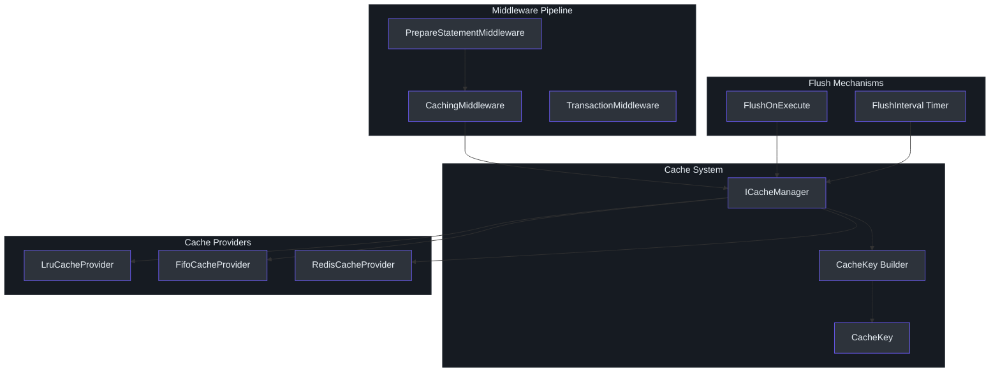
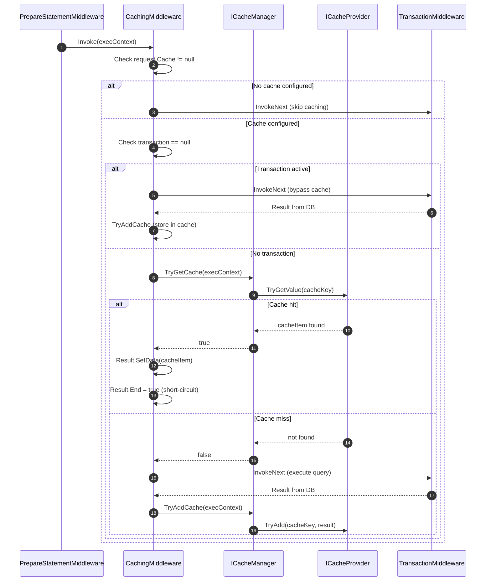
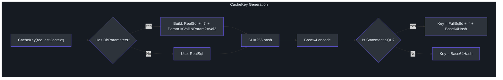
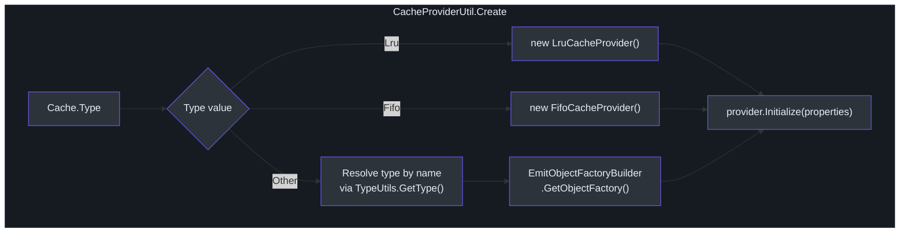
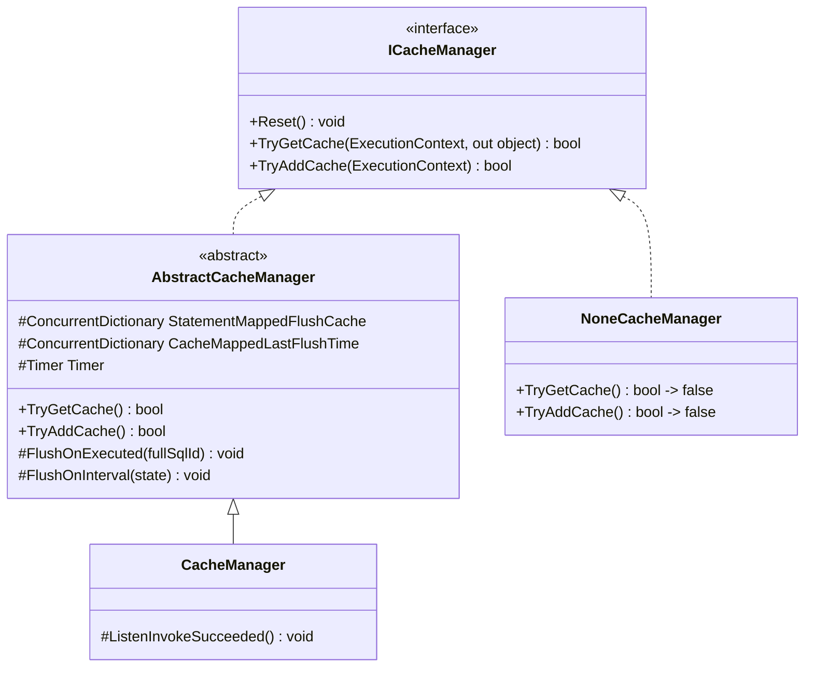

# 缓存架构

SmartSql 包含一个内置缓存层，位于中间件管道中 SQL 准备和事务管理之间。当查询语句有关联的缓存定义时，`CachingMiddleware` 在对数据库执行之前检查缓存结果。这可以显著减少频繁执行的参数化查询的数据库负载。系统开箱即用地支持内存 LRU 和 FIFO 缓存，另外还支持 Redis 用于分布式缓存场景。

## 概要

| 方面 | 详情 |
|------|------|
| 缓存接口 | `ICacheProvider`，具有 `TryGetValue`、`TryAdd`、`Flush` |
| 管理器接口 | `ICacheManager`，具有 `TryGetCache`、`TryAddCache` |
| 内置提供程序 | `LruCacheProvider`、`FifoCacheProvider` |
| 分布式提供程序 | `RedisCacheProvider`（独立包 `SmartSql.Cache.Redis`） |
| 缓存键 | SQL + 参数的 SHA256 哈希，以 FullSqlId 为前缀 |
| 刷新策略 | `FlushOnExecute`（事件驱动）和 `FlushInterval`（基于定时器） |
| 事务绕过 | 当事务活跃时不使用缓存 |

## 缓存架构概览



<!-- Sources: src/SmartSql/Middlewares/CachingMiddleware.cs:9, src/SmartSql/Cache/AbstractCacheManager.cs:10, src/SmartSql/Cache/CacheProviderUtil.cs:10 -->

## 缓存命中/未命中流程

以下序列图展示了 `CachingMiddleware` 如何处理配置了缓存的查询。



<!-- Sources: src/SmartSql/Middlewares/CachingMiddleware.cs:12, src/SmartSql/Middlewares/CachingMiddleware.cs:20 -->

## 缓存键生成

`CacheKey` 由请求的最终 SQL 和所有参数值构建。键是 SHA256 哈希，以避免冲突同时保持内存使用受控。



<!-- Sources: src/SmartSql/Cache/CacheKey.cs:10, src/SmartSql/Cache/CacheKey.cs:21 -->

语句 SQL 的结果键格式为：`Scope.StatementId:SHA256Base64`，确保不同语句和参数组合之间的唯一性。

## 内置缓存提供程序

### LruCacheProvider（最近最少使用）

维护一个有边界的缓存结果字典。当缓存超过 `CacheSize` 时，最近最少使用的条目被淘汰。在 `TryGetValue` 时，访问的键被移动到键列表末尾，标记为最近使用。

| 参数 | 默认值 | 描述 |
|------|--------|------|
| `CacheSize` | 100 | 最大缓存条目数 |

```csharp
// XML 配置
<Cache Id="UserCache" Type="Lru">
  <Parameter Name="CacheSize" Value="500"/>
  <FlushInterval Interval="00:05:00"/>
  <FlushOnExecute Statement="InsertUser"/>
</Cache>
```

<!-- Sources: src/SmartSql/Cache/Default/LruCacheProvider.cs:10, src/SmartSql/Cache/Default/LruCacheProvider.cs:31 -->

### FifoCacheProvider（先进先出）

维护一个有边界的缓存结果队列。当缓存超过 `CacheSize` 时，最旧的条目被淘汰。比 LRU 更简单但不考虑访问模式。

| 参数 | 默认值 | 描述 |
|------|--------|------|
| `CacheSize` | 100 | 最大缓存条目数 |

<!-- Sources: src/SmartSql/Cache/Default/FifoCacheProvider.cs:10, src/SmartSql/Cache/Default/FifoCacheProvider.cs:34 -->

### NoneCacheProvider

当缓存被全局禁用时，`NoneCacheManager` 返回的空操作提供程序。总是返回缓存未命中。

<!-- Sources: src/SmartSql/Cache/Default/NoneCacheProvider.cs -->

## ICacheProvider 接口

```csharp
public interface ICacheProvider : IDisposable
{
    bool SupportExpire { get; }
    void Initialize(IDictionary<string, object> properties);
    bool TryGetValue(CacheKey cacheKey, out object cacheItem);
    bool TryAdd(CacheKey cacheKey, object cacheItem);
    void Flush();
}
```

| 方法 | 用途 |
|------|------|
| `SupportExpire` | 如果为 true，提供程序自行处理过期（例如 Redis TTL）并跳过 `FlushInterval` |
| `Initialize` | 从 XML 参数配置提供程序 |
| `TryGetValue` | 按键检索缓存值 |
| `TryAdd` | 将值存储到缓存 |
| `Flush` | 清除此提供程序的所有条目 |

<!-- Sources: src/SmartSql/Cache/ICacheProvider.cs:8 -->

## 缓存管理器和刷新策略

`AbstractCacheManager` 实现了两种刷新策略：

### FlushOnExecute（事件驱动）

当 XML 缓存定义包含 `<FlushOnExecute Statement="SomeStatement"/>` 时，每当该语句成功执行，缓存会自动刷新。这通过 `InvokeSucceedListener` 连接，它在每次成功命令执行后触发。

```xml
<Cache Id="UserListCache" Type="Lru">
  <Parameter Name="CacheSize" Value="200"/>
  <FlushOnExecute Statement="InsertUser"/>
  <FlushOnExecute Statement="UpdateUser"/>
  <FlushOnExecute Statement="DeleteUser"/>
</Cache>
```

### FlushInterval（基于定时器）

后台 `Timer` 每 1 分钟运行一次（从 1 分钟后开始），检查每个缓存的 `FlushInterval`。如果自上次刷新以来经过的时间超过间隔，则刷新缓存。`SupportExpire = true` 的提供程序（如 Redis）会被跳过，因为它们原生处理过期。

```xml
<Cache Id="UserListCache" Type="Lru">
  <Parameter Name="CacheSize" Value="200"/>
  <FlushInterval Interval="00:10:00"/>
</Cache>
```

<!-- Sources: src/SmartSql/Cache/AbstractCacheManager.cs:10, src/SmartSql/Cache/AbstractCacheManager.cs:50, src/SmartSql/Cache/AbstractCacheManager.cs:83 -->

## 缓存提供程序选择

`CacheProviderUtil.Create()` 从缓存定义解析提供程序类型：



<!-- Sources: src/SmartSql/Cache/CacheProviderUtil.cs:10, src/SmartSql/Cache/CacheProviderUtil.cs:15 -->

## Redis 缓存集成

`SmartSql.Cache.Redis` 包提供了使用 StackExchange.Redis 的 `RedisCacheProvider` 用于分布式缓存。

| 参数 | 必填 | 描述 |
|------|------|------|
| `ConnectionString` | 是 | Redis 连接字符串 |
| `Prefix` | 否 | 键前缀（默认为 Cache.Id） |
| `DatabaseId` | 否 | Redis 数据库编号（默认为 0） |
| `FlushInterval` | 否 | 如果设置，使用 Redis 键过期（TTL） |

```xml
<Cache Id="UserCache" Type="SmartSql.Cache.Redis.RedisCacheProvider, SmartSql.Cache.Redis">
  <Parameter Name="ConnectionString" Value="localhost:6379"/>
  <Parameter Name="Prefix" Value="SmartSql:UserCache"/>
  <Parameter Name="DatabaseId" Value="0"/>
  <FlushInterval Interval="00:05:00"/>
  <FlushOnExecute Statement="InsertUser"/>
</Cache>
```

`RedisCacheProvider` 的关键特性：

- `SupportExpire = true` -- `FlushInterval` 定时器不会刷新此提供程序，因为 Redis 原生处理 TTL
- `Flush()` 执行基于模式的 `KEYS` 扫描和缓存前缀的批量删除
- 值使用 `Newtonsoft.Json` 序列化以实现跨进程兼容性

<!-- Sources: src/SmartSql.Cache.Redis/RedisCacheProvider.cs:10, src/SmartSql.Cache.Redis/RedisCacheProvider.cs:18 -->

## 启用缓存

通过 `SmartSqlBuilder.UseCache()` 或通过 XML 配置全局启用缓存：

```csharp
new SmartSqlBuilder()
    .UseXmlConfig()
    .UseCache()
    .Build();
```

当 `IsCacheEnabled` 为 true 时，管道包含 `CachingMiddleware` 并分配真正的 `CacheManager`。为 false 时，使用 `NoneCacheManager`，`CachingMiddleware` 从管道中排除。

<!-- Sources: src/SmartSql/SmartSqlBuilder.cs:238, src/SmartSql/SmartSqlBuilder.cs:248 -->

## ICacheManager 层次结构



<!-- Sources: src/SmartSql/Cache/ICacheManager.cs:9, src/SmartSql/Cache/AbstractCacheManager.cs:10, src/SmartSql/Cache/CacheManager.cs:9, src/SmartSql/Cache/NoneCacheManager.cs:7 -->

## 相关页面

- [架构概览](./index.md) -- 缓存在中间件管道中的位置
- [中间件管道](./middleware-pipeline.md) -- 顺序 200 的 `CachingMiddleware`
- [数据源与读写分离](./datasource.md) -- 事务上下文绕过缓存

## 参考资料

- [ICacheProvider.cs](https://github.com/dotnetcore/SmartSql/blob/master/src/SmartSql/Cache/ICacheProvider.cs)
- [ICacheManager.cs](https://github.com/dotnetcore/SmartSql/blob/master/src/SmartSql/Cache/ICacheManager.cs)
- [AbstractCacheManager.cs](https://github.com/dotnetcore/SmartSql/blob/master/src/SmartSql/Cache/AbstractCacheManager.cs)
- [CacheManager.cs](https://github.com/dotnetcore/SmartSql/blob/master/src/SmartSql/Cache/CacheManager.cs)
- [NoneCacheManager.cs](https://github.com/dotnetcore/SmartSql/blob/master/src/SmartSql/Cache/NoneCacheManager.cs)
- [CacheKey.cs](https://github.com/dotnetcore/SmartSql/blob/master/src/SmartSql/Cache/CacheKey.cs)
- [LruCacheProvider.cs](https://github.com/dotnetcore/SmartSql/blob/master/src/SmartSql/Cache/Default/LruCacheProvider.cs)
- [FifoCacheProvider.cs](https://github.com/dotnetcore/SmartSql/blob/master/src/SmartSql/Cache/Default/FifoCacheProvider.cs)
- [CacheProviderUtil.cs](https://github.com/dotnetcore/SmartSql/blob/master/src/SmartSql/Cache/CacheProviderUtil.cs)
- [RedisCacheProvider.cs](https://github.com/dotnetcore/SmartSql/blob/master/src/SmartSql.Cache.Redis/RedisCacheProvider.cs)
- [CachingMiddleware.cs](https://github.com/dotnetcore/SmartSql/blob/master/src/SmartSql/Middlewares/CachingMiddleware.cs)
