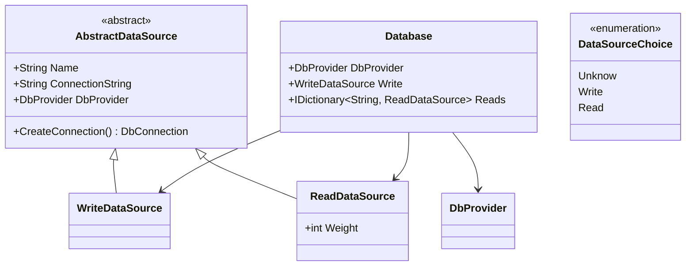
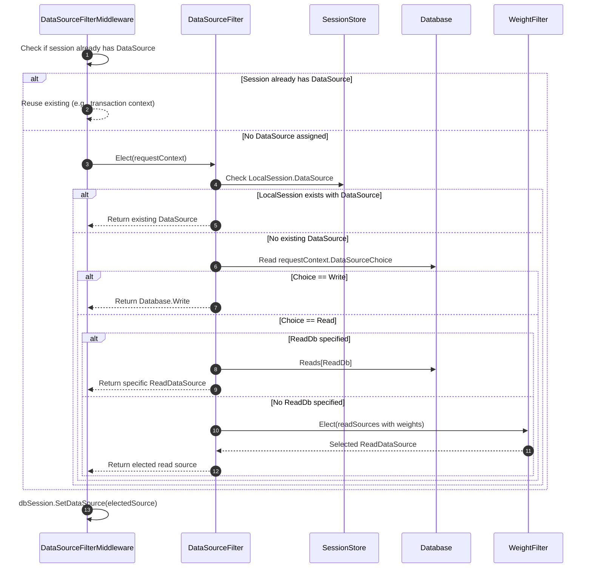
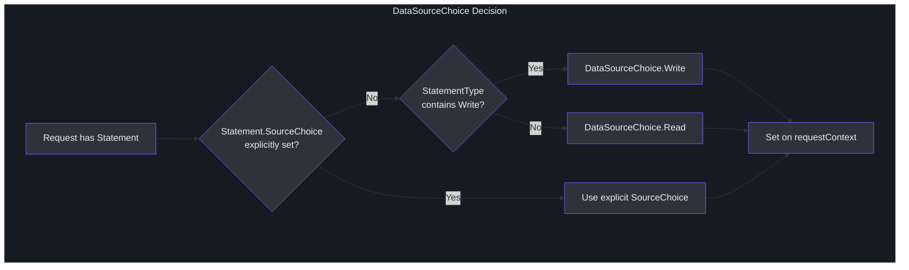
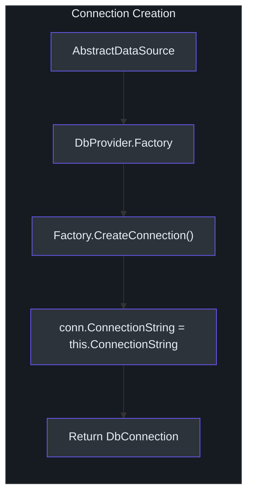

# 数据源与读写分离

SmartSql 内置了读写分离支持，允许你将读查询定向到一个或多个读副本，同时将写操作路由到单个主库。此功能对于扩展读密集型应用至关重要，通过 XML 或编程式 API 进行配置。路由决策在中间件管道内通过 `DataSourceFilterMiddleware` 完成，它委托给 `IDataSourceFilter` 实现。

## 概要

| 方面 | 详情 |
|------|------|
| 抽象基类 | `AbstractDataSource`，具有 Name、ConnectionString、DbProvider |
| 写入源 | `WriteDataSource` -- 单个主库 |
| 读取源 | `ReadDataSource` -- 一个或多个副本，具有 `Weight` 属性 |
| 过滤器接口 | `IDataSourceFilter`，具有 `Elect(AbstractRequestContext)` |
| 默认过滤器 | `DataSourceFilter`，通过 `WeightFilter<T>` 进行加权负载均衡 |
| 选择逻辑 | 语句类型（`Read`/`Write`）决定源选择 |
| 扩展点 | 通过 `SmartSqlBuilder.UseDataSourceFilter()` 替换 `IDataSourceFilter` |

## DataSource 类层次结构



<!-- Sources: src/SmartSql/DataSource/AbstractDataSource.cs:9, src/SmartSql/DataSource/WriteDataSource.cs:7, src/SmartSql/DataSource/ReadDataSource.cs:7, src/SmartSql/DataSource/Database.cs:7 -->

## 数据源选择工作原理

当中间件管道到达 `DataSourceFilterMiddleware` 时，它委托给 `IDataSourceFilter.Elect()` 来确定使用哪个数据库连接。



<!-- Sources: src/SmartSql/Middlewares/DataSourceFilterMiddleware.cs:7, src/SmartSql/DataSource/DataSourceFilter.cs:11, src/SmartSql/DataSource/DataSourceFilter.cs:24 -->

## DataSourceChoice 判定

`DataSourceChoice`（读或写）在 `InitializerMiddleware` 阶段根据语句的 `StatementType` 确定：

| StatementType 映射 | 结果选择 |
|-------------------|---------|
| `StatementType.Write`（或包含 Write 标志） | `DataSourceChoice.Write` |
| 所有其他类型（Select 等） | `DataSourceChoice.Read` |
| Statement 上显式的 `SourceChoice` | 覆盖自动检测 |



<!-- Sources: src/SmartSql/Middlewares/InitializerMiddleware.cs:64, src/SmartSql/DataSource/DataSourceChoice.cs:7 -->

## 读副本加权负载均衡

当配置了多个读副本且未指定特定 `ReadDb` 时，`DataSourceFilter` 使用 `WeightFilter<T>` 执行加权随机选择。每个 `ReadDataSource` 有一个 `Weight` 属性影响选择概率。

| 副本 | 权重 | 选择概率 |
|------|------|---------|
| Read-1 | 100 | 50% |
| Read-2 | 60 | 30% |
| Read-3 | 40 | 20% |

这允许你将更多流量导向更强大的副本，同时仍保持负载分配。

## XML 配置

数据库源在 `SmartSqlMapConfig.xml` 文件中配置：

```xml
<SmartSqlMapConfig>
  <Database>
    <DbProvider Name="MySql"/>
    <Write Name="WriteDB"
           ConnectionString="Server=master-db;Database=MyDb;Uid=root;Pwd=123456;"/>
    <Read Name="ReadDB-1" Weight="100"
          ConnectionString="Server=replica-1;Database=MyDb;Uid=readonly;Pwd=123456;"/>
    <Read Name="ReadDB-2" Weight="60"
          ConnectionString="Server=replica-2;Database=MyDb;Uid=readonly;Pwd=123456;"/>
  </Database>
  <SmartSqlMaps>
    <SmartSqlMap Resource="Maps/User.xml"/>
  </SmartSqlMaps>
</SmartSqlMapConfig>
```

## 编程式配置

使用 `SmartSqlBuilder` 时，可以直接配置数据源而无需 XML：

```csharp
// 单数据库（无读写分离）
new SmartSqlBuilder()
    .UseDataSource("MySql", connectionString)
    .Build();

// 或使用 WriteDataSource 对象
new SmartSqlBuilder()
    .UseDataSource(new WriteDataSource
    {
        Name = "Write",
        ConnectionString = masterConnectionString,
        DbProvider = dbProvider
    })
    .Build();
```

## 显式 ReadDb 选择

个别语句或请求上下文可以指定 `ReadDb` 属性以定向到特定读副本，绕过加权选择：

```xml
<Statement Id="GetReport" ReadDb="ReadDB-1">
  SELECT * FROM Reports WHERE Id = @Id
</Statement>
```

## 事务行为

当事务活跃时（`IDbSession.Transaction != null`），`DataSourceFilter` 始终返回已分配给会话的数据源。这确保事务内的所有操作都访问同一个数据库连接，无论读写指定。

## IDataSourceFilter 接口

```csharp
public interface IDataSourceFilter
{
    AbstractDataSource Elect(AbstractRequestContext context);
}
```

要实现自定义路由逻辑（例如基于租户、区域或延迟），创建一个实现 `IDataSourceFilter` 的类并注册：

```csharp
new SmartSqlBuilder()
    .UseDataSourceFilter(new MyCustomDataSourceFilter())
    .Build();
```

<!-- Sources: src/SmartSql/DataSource/IDataSourceFilter.cs:11, src/SmartSql/DataSource/DataSourceFilter.cs:11 -->

## 连接创建

`AbstractDataSource.CreateConnection()` 使用 `DbProvider.Factory` 创建新的 `DbConnection` 实例并分配 `ConnectionString`：



<!-- Sources: src/SmartSql/DataSource/AbstractDataSource.cs:23 -->

## 相关页面

- [架构概览](./index.md) -- DataSource 在分层架构中的位置
- [中间件管道](./middleware-pipeline.md) -- 顺序 400 的 `DataSourceFilterMiddleware`
- [缓存架构](./caching.md) -- 事务上下文中的缓存行为差异

## 参考资料

- [AbstractDataSource.cs](https://github.com/dotnetcore/SmartSql/blob/master/src/SmartSql/DataSource/AbstractDataSource.cs)
- [WriteDataSource.cs](https://github.com/dotnetcore/SmartSql/blob/master/src/SmartSql/DataSource/WriteDataSource.cs)
- [ReadDataSource.cs](https://github.com/dotnetcore/SmartSql/blob/master/src/SmartSql/DataSource/ReadDataSource.cs)
- [Database.cs](https://github.com/dotnetcore/SmartSql/blob/master/src/SmartSql/DataSource/Database.cs)
- [DataSourceFilter.cs](https://github.com/dotnetcore/SmartSql/blob/master/src/SmartSql/DataSource/DataSourceFilter.cs)
- [IDataSourceFilter.cs](https://github.com/dotnetcore/SmartSql/blob/master/src/SmartSql/DataSource/IDataSourceFilter.cs)
- [DataSourceChoice.cs](https://github.com/dotnetcore/SmartSql/blob/master/src/SmartSql/DataSource/DataSourceChoice.cs)
- [DataSourceFilterMiddleware.cs](https://github.com/dotnetcore/SmartSql/blob/master/src/SmartSql/Middlewares/DataSourceFilterMiddleware.cs)
