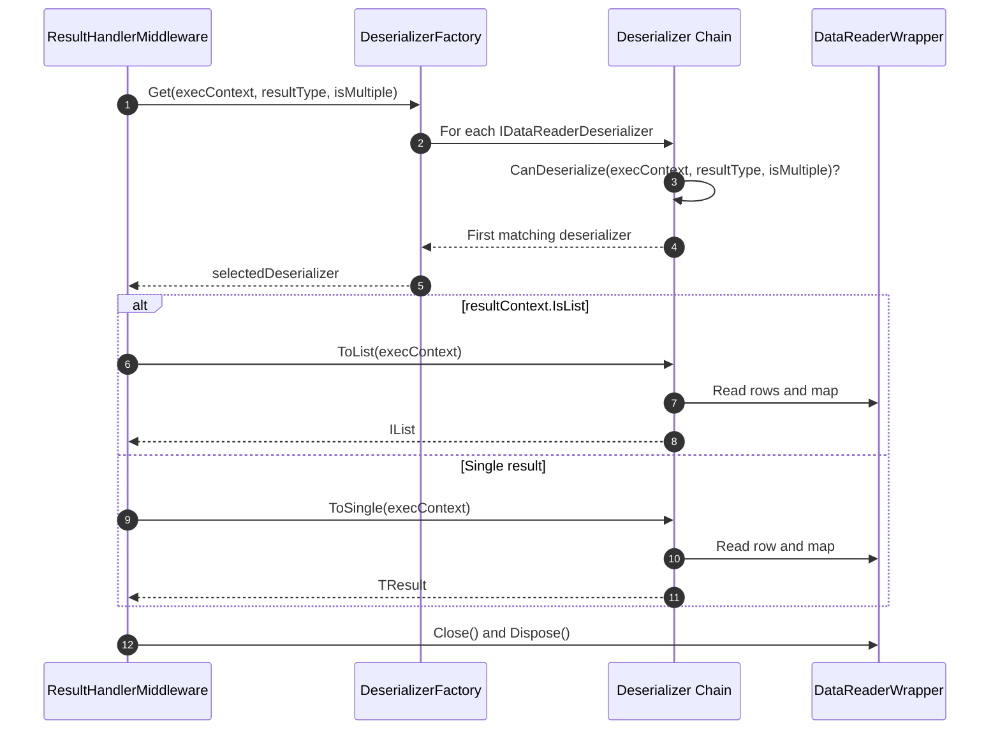
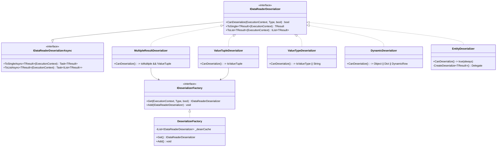

# 反序列化

在 SQL 查询执行并返回 `DataReader` 之后，SmartSql 必须将原始列数据转换为强类型的 .NET 对象。此反序列化步骤由 `IDataReaderDeserializer` 实现链处理，每个实现负责特定的结果类型。`DeserializerFactory` 从链中选择第一个能处理请求类型的反序列化器。SmartSql 的 `EntityDeserializer` 使用 IL emit 在运行时生成高性能的反序列化委托，避免了重复调用的反射开销。

## 概要

| 方面 | 详情 |
|------|------|
| 接口 | `IDataReaderDeserializer`，具有 `CanDeserialize`、`ToSingle`、`ToList` |
| 工厂 | `DeserializerFactory` -- 从有序列表中首次匹配选择 |
| 默认链 | MultipleResult -> ValueTuple -> ValueType -> Dynamic -> Entity |
| IL Emit | `EntityDeserializer` 生成 `DynamicMethod` 委托实现零反射映射 |
| 扩展点 | `SmartSqlBuilder.AddDeserializer()` 可前置自定义反序列化器 |

## 反序列化器链顺序

反序列化器链在 `SmartSqlBuilder.InitDeserializerFactory()` 中按特定顺序注册。工厂遍历所有已注册的反序列化器，返回第一个 `CanDeserialize` 方法返回 `true` 的。

```mermaid
flowchart LR
    subgraph Chain["Deserializer Chain (in order)"]
        style Chain fill:#161b22,stroke:#30363d,color:#e6edf3
        D1["1. MultipleResultDeserializer"]
        D2["2. ValueTupleDeserializer"]
        D3["3. ValueTypeDeserializer"]
        D4["4. DynamicDeserializer"]
        D5["5. EntityDeserializer"]
    end

    D1 -->|"Can't handle"| D2
    D2 -->|"Can't handle"| D3
    D3 -->|"Can't handle"| D4
    D4 -->|"Can't handle"| D5
    D5 -->|"Always true"| Result["Selected Deserializer"]

    style D1 fill:#2d333b,stroke:#6d5dfc,color:#e6edf3
    style D2 fill:#2d333b,stroke:#6d5dfc,color:#e6edf3
    style D3 fill:#2d333b,stroke:#6d5dfc,color:#e6edf3
    style D4 fill:#2d333b,stroke:#6d5dfc,color:#e6edf3
    style D5 fill:#2d333b,stroke:#6d5dfc,color:#e6edf3
    style Result fill:#2d333b,stroke:#6d5dfc,color:#e6edf3
```



<!-- Sources: src/SmartSql/SmartSqlBuilder.cs:219, src/SmartSql/Deserializer/DeserializerFactory.cs:9 -->

## 反序列化解析流程

当 `ResultHandlerMiddleware` 执行时，它委托给 `DeserializerFactory` 查找适当的反序列化器，然后调用 `ToList` 或 `ToSingle`。



<!-- Sources: src/SmartSql/Middlewares/ResultHandlerMiddleware.cs:14, src/SmartSql/Deserializer/DeserializerFactory.cs:9 -->

## 反序列化器类层次结构



<!-- Sources: src/SmartSql/Deserializer/IDataReaderDeserializer.cs:7, src/SmartSql/Deserializer/DeserializerFactory.cs:9 -->

## 各反序列化器详情

### 1. MultipleResultDeserializer

处理多结果集场景（例如存储过程返回多个结果集）。仅在 `isMultiple = true` 且结果类型不是 `ValueTuple` 时激活。它先反序列化根结果集，然后通过调用 `DataReader.NextResult()` 遍历 `MultipleResultMap.Results` 填充子属性。

不支持 `ToList` -- 如果调用会抛出 `SmartSqlException`。

<!-- Sources: src/SmartSql/Deserializer/MultipleResultDeserializer.cs:14, src/SmartSql/Deserializer/MultipleResultDeserializer.cs:24 -->

### 2. ValueTupleDeserializer

处理 `ValueTuple` 结果类型（例如 `(List<User>, int)`）。它遍历每个泛型类型参数，委托给工厂进行子反序列化，并通过 `NextResult()` 推进 DataReader。结果通过 `ValueTupleConvert` 组装成 `ValueTuple`。

不支持 `ToList` -- 如果调用会抛出 `SmartSqlException`。

<!-- Sources: src/SmartSql/Deserializer/ValueTupleDeserializer.cs:10, src/SmartSql/Deserializer/ValueTupleDeserializer.cs:19 -->

### 3. ValueTypeDeserializer

处理基本值类型和字符串。使用 `TypeHandlerCache<T, AnyFieldType>.Handler.GetValue()` 读取单列（序号 0）。

| CanDeserialize 条件 | `resultType.IsValueType` 或 `resultType == typeof(string)` |
|---------------------|------------------------------------------------------------|

对于列表结果，它迭代行并将值收集到 `List<TResult>` 中。

<!-- Sources: src/SmartSql/Deserializer/ValueTypeDeserializer.cs:10, src/SmartSql/Deserializer/ValueTypeDeserializer.cs:14 -->

### 4. DynamicDeserializer

处理无类型结果：`object`、`Dictionary<string, object>` 和 `DynamicRow`。对于每行，它读取所有列值到对象数组中并包装在提供字典风格列访问的 `DynamicRow` 中。

| CanDeserialize 条件 | `resultType == object` 或 `Dictionary<string, object>` 或 `DynamicRow` |
|---------------------|------------------------------------------------------------------------|

<!-- Sources: src/SmartSql/Deserializer/DynamicDeserializer.cs:11, src/SmartSql/Deserializer/DynamicDeserializer.cs:13 -->

### 5. EntityDeserializer

将 DataReader 列映射到强类型实体属性的主力反序列化器。这是回退方案 -- `CanDeserialize` 总是返回 `true`。

**关键特性：**

- **IL Emit**：在运行时生成 `DynamicMethod`，执行直接属性赋值而无需反射。生成的委托按 `DeserializeIdentity`（Alias + ResultIndex + RealSql）缓存。
- **ResultMap 支持**：遵循 XML 结果映射中的显式 `<Result>` 映射，包括属性链（例如 `Department.Name`）。
- **实体元数据缓存**：当没有显式结果映射时回退到 `EntityMetaDataCache<T>` 的列到属性映射。
- **属性变更跟踪**：当 `EnablePropertyChangedTrack = true` 时，创建实现 `IEntityPropertyChangedTrackProxy` 的实体代理。
- **构造函数映射**：通过结果映射中的 `<Constructor>` 支持参数化构造函数。
- **IgnoreDbNull**：当 `Settings.IgnoreDbNull` 为 true 时，跳过数据库 NULL 值的属性设置。
- **TypeHandler 解析**：为每列从结果映射定义、参数映射或 `TypeHandlerFactory` 解析 `TypeHandler`。

<!-- Sources: src/SmartSql/Deserializer/EntityDeserializer.cs:21, src/SmartSql/Deserializer/EntityDeserializer.cs:86, src/SmartSql/Deserializer/EntityDeserializer.cs:95 -->

## EntityDeserializer IL Emit 流程

`EntityDeserializer` 使用 `System.Reflection.Emit.DynamicMethod` 在运行时生成高性能反序列化代码：

```mermaid
flowchart TD
    subgraph EmitProcess["EntityDeserializer.CreateDeserialize"]
        style EmitProcess fill:#161b22,stroke:#30363d,color:#e6edf3
        Start["CreateDeserialize&lt;TResult&gt;()"] --> CheckCache{"Cached delegate exists?"}
        CheckCache -->|Yes| Return["Return cached delegate"]
        CheckCache -->|No| Create["Create DynamicMethod"]
        Create --> IL["Generate IL instructions"]
        IL --> New["Newobj: call constructor"]
        New --> Columns["For each DataReader column"]
        Columns --> Resolve["Resolve property from ResultMap<br>or EntityMetaDataCache"]
        Resolve --> HasProp{"Property found<br>& writable?"}
        HasProp -->|No| Skip["Skip column"]
        HasProp -->|Yes| NullCheck{"IgnoreDbNull?"}
        NullCheck -->|Yes| CheckNull["IL: if IsDBNull goto skipLabel"]
        NullCheck -->|No| Load["IL: Load entity, call TypeHandler.GetValue, call set_Property"]
        CheckNull --> Load
        Load --> Next["Next column"]
        Skip --> Next
        Next --> More{"More columns?"}
        More -->|Yes| Columns
        More -->|No| Finish["IL: return entity"]
        Finish --> Cache["Cache delegate by DeserializeIdentity"]
        Cache --> Return
    end

    style Start fill:#2d333b,stroke:#6d5dfc,color:#e6edf3
    style CheckCache fill:#2d333b,stroke:#6d5dfc,color:#e6edf3
    style Return fill:#2d333b,stroke:#6d5dfc,color:#e6edf3
    style Create fill:#2d333b,stroke:#6d5dfc,color:#e6edf3
    style IL fill:#2d333b,stroke:#6d5dfc,color:#e6edf3
    style New fill:#2d333b,stroke:#6d5dfc,color:#e6edf3
    style Columns fill:#2d333b,stroke:#6d5dfc,color:#e6edf3
    style Resolve fill:#2d333b,stroke:#6d5dfc,color:#e6edf3
    style HasProp fill:#2d333b,stroke:#6d5dfc,color:#e6edf3
    style NullCheck fill:#2d333b,stroke:#6d5dfc,color:#e6edf3
    style Load fill:#2d333b,stroke:#6d5dfc,color:#e6edf3
    style Skip fill:#2d333b,stroke:#6d5dfc,color:#e6edf3
    style Next fill:#2d333b,stroke:#6d5dfc,color:#e6edf3
    style More fill:#2d333b,stroke:#6d5dfc,color:#e6edf3
    style Finish fill:#2d333b,stroke:#6d5dfc,color:#e6edf3
    style Cache fill:#2d333b,stroke:#6d5dfc,color:#e6edf3
```



<!-- Sources: src/SmartSql/Deserializer/EntityDeserializer.cs:95, src/SmartSql/Deserializer/EntityDeserializer.cs:125 -->

## DeserializerFactory

工厂维护一个有序的反序列化器列表。`Get()` 使用 `FirstOrDefault(d => d.CanDeserialize(...))` 执行线性扫描，返回第一个匹配项。

```csharp
public IDataReaderDeserializer Get(ExecutionContext executionContext,
    Type resultType = null, bool isMultiple = false)
{
    resultType = resultType ?? executionContext.Result.ResultType;
    return _deserCache.FirstOrDefault(d =>
        d.CanDeserialize(executionContext, resultType, isMultiple));
}
```

通过 `SmartSqlBuilder.AddDeserializer()` 添加的自定义反序列化器追加到列表末尾（`EntityDeserializer` 之后）。

<!-- Sources: src/SmartSql/Deserializer/DeserializerFactory.cs:9, src/SmartSql/Deserializer/DeserializerFactory.cs:12 -->

## IDeserializerFactory 接口

```csharp
public interface IDeserializerFactory
{
    IDataReaderDeserializer Get(ExecutionContext executionContext,
        Type resultType = null, bool isMultiple = false);
    void Add(IDataReaderDeserializer deserializer);
}
```

<!-- Sources: src/SmartSql/Deserializer/IDeserializerFactory.cs -->

## 相关页面

- [架构概览](./index.md) -- 反序列化在管道中的位置
- [中间件管道](./middleware-pipeline.md) -- 顺序 600 的 `ResultHandlerMiddleware`
- [XML 标签系统](./xml-tags.md) -- ResultMap XML 定义如何驱动 `EntityDeserializer`

## 参考资料

- [IDataReaderDeserializer.cs](https://github.com/dotnetcore/SmartSql/blob/master/src/SmartSql/Deserializer/IDataReaderDeserializer.cs)
- [DeserializerFactory.cs](https://github.com/dotnetcore/SmartSql/blob/master/src/SmartSql/Deserializer/DeserializerFactory.cs)
- [MultipleResultDeserializer.cs](https://github.com/dotnetcore/SmartSql/blob/master/src/SmartSql/Deserializer/MultipleResultDeserializer.cs)
- [ValueTupleDeserializer.cs](https://github.com/dotnetcore/SmartSql/blob/master/src/SmartSql/Deserializer/ValueTupleDeserializer.cs)
- [ValueTypeDeserializer.cs](https://github.com/dotnetcore/SmartSql/blob/master/src/SmartSql/Deserializer/ValueTypeDeserializer.cs)
- [DynamicDeserializer.cs](https://github.com/dotnetcore/SmartSql/blob/master/src/SmartSql/Deserializer/DynamicDeserializer.cs)
- [EntityDeserializer.cs](https://github.com/dotnetcore/SmartSql/blob/master/src/SmartSql/Deserializer/EntityDeserializer.cs)
- [ResultHandlerMiddleware.cs](https://github.com/dotnetcore/SmartSql/blob/master/src/SmartSql/Middlewares/ResultHandlerMiddleware.cs)
- [SmartSqlBuilder.cs](https://github.com/dotnetcore/SmartSql/blob/master/src/SmartSql/SmartSqlBuilder.cs) -- 反序列化器链初始化
