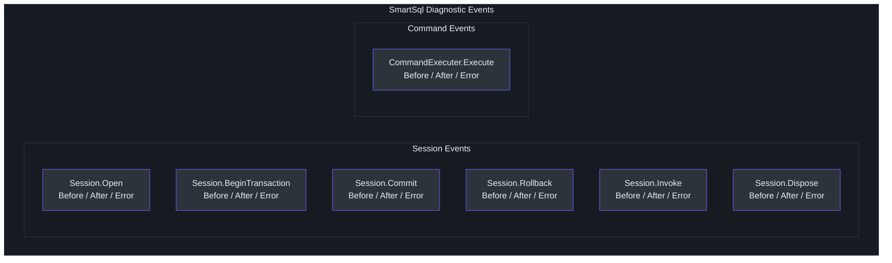
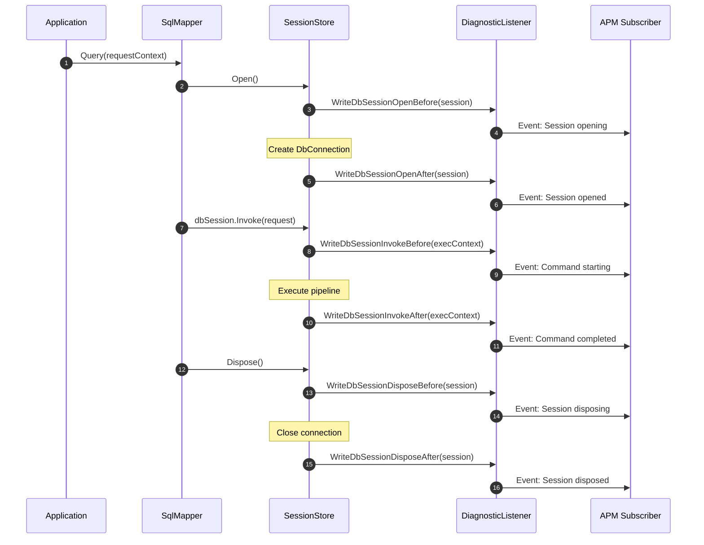
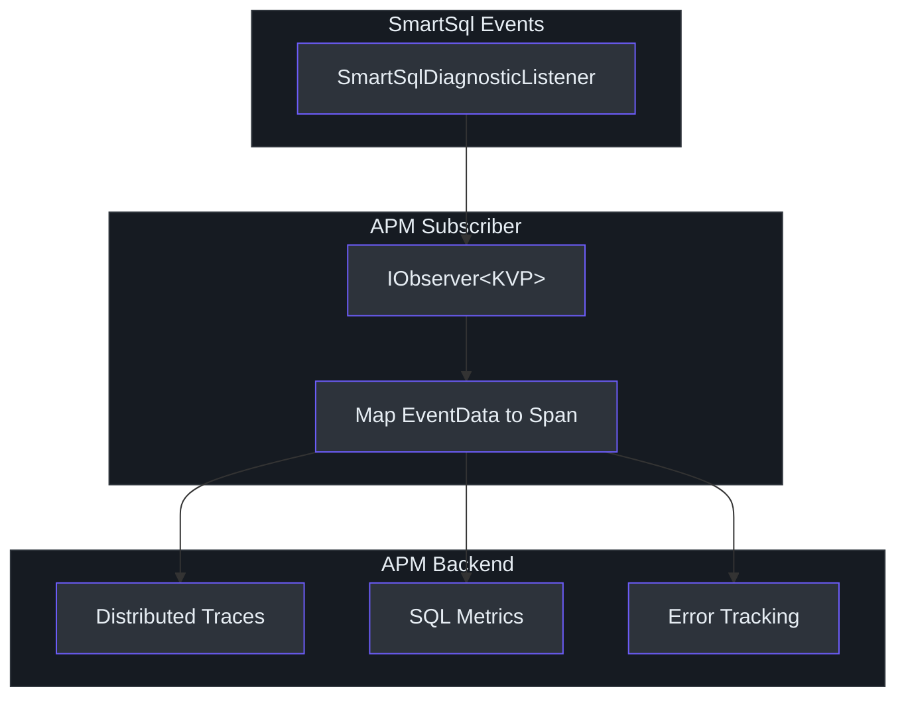
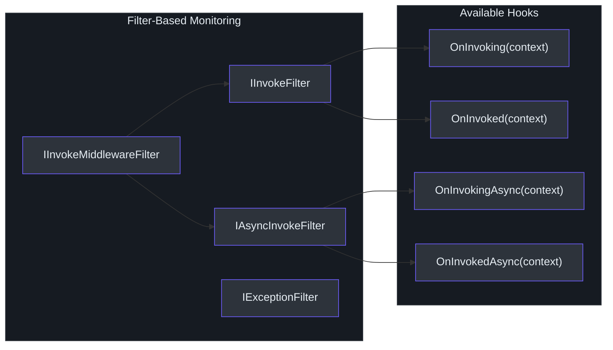

# 诊断与监控

SmartSql 在数据库交互的每个关键阶段使用 .NET 的 `System.Diagnostics.DiagnosticSource` 发出结构化诊断事件。这允许外部监控工具和 APM 代理（如 SkyWalking）无需修改应用程序代码即可订阅 SmartSql 事件。诊断系统涵盖会话生命周期、命令执行和错误传播，为 SQL 操作提供完整的可观测性。

## 概要

| 方面 | 详情 |
|------|------|
| 事件源 | 名为 `"SmartSqlDiagnosticListener"` 的 `DiagnosticListener` |
| 事件前缀 | `"SmartSql."` 后跟事件名 |
| 事件模式 | 每个操作的 Before/After/Error 三元组 |
| 事件数据 | 强类型 `EventData` 子类携带上下文 |
| 集成 | 通过 `IObserver<KeyValuePair<string, object>>` 订阅 |
| 扩展方法 | `SmartSqlDiagnosticListenerExtensions` 用于事件发出 |

## 诊断事件类别

SmartSql 发出两大类事件：**会话生命周期** 和 **命令执行**。每个操作遵循 Before/After/Error 三元组模式。



<!-- Sources: src/SmartSql/Diagnostics/SmartSqlDiagnosticListenerExtensions.cs:10 -->

## 完整事件目录

### 会话生命周期事件

| 事件名称 | 常量 | 触发时机 |
|----------|------|---------|
| `SmartSql.WriteDbSessionOpenBefore` | `SMART_SQL_BEFORE_DB_SESSION_OPEN` | 打开新数据库会话之前 |
| `SmartSql.WriteDbSessionOpenAfter` | `SMART_SQL_AFTER_DB_SESSION_OPEN` | 会话成功打开之后 |
| `SmartSql.WriteDbSessionOpenError` | `SMART_SQL_ERROR_DB_SESSION_OPEN` | 会话打开失败时 |
| `SmartSql.WriteDbSessionBeginTransactionBefore` | `SMART_SQL_BEFORE_DB_SESSION_BEGINTRANSACTION` | 开始事务之前 |
| `SmartSql.WriteDbSessionBeginTransactionAfter` | `SMART_SQL_AFTER_DB_SESSION_BEGINTRANSACTION` | 事务开始之后 |
| `SmartSql.WriteDbSessionBeginTransactionError` | `SMART_SQL_ERROR_DB_SESSION_BEGINTRANSACTION` | 事务启动失败时 |
| `SmartSql.WriteDbSessionCommitBefore` | `SMART_SQL_BEFORE_DB_SESSION_COMMIT` | 提交之前 |
| `SmartSql.WriteDbSessionCommitAfter` | `SMART_SQL_AFTER_DB_SESSION_COMMIT` | 提交之后 |
| `SmartSql.WriteDbSessionCommitError` | `SMART_SQL_ERROR_DB_SESSION_COMMIT` | 提交失败时 |
| `SmartSql.WriteDbSessionRollbackBefore` | `SMART_SQL_BEFORE_DB_SESSION_ROLLBACK` | 回滚之前 |
| `SmartSql.WriteDbSessionRollbackAfter` | `SMART_SQL_AFTER_DB_SESSION_ROLLBACK` | 回滚之后 |
| `SmartSql.WriteDbSessionRollbackError` | `SMART_SQL_ERROR_DB_SESSION_ROLLBACK` | 回滚失败时 |
| `SmartSql.WriteDbSessionInvokeBefore` | `SMART_SQL_BEFORE_DB_SESSION_INVOKE` | 通过会话调用命令之前 |
| `SmartSql.WriteDbSessionInvokeAfter` | `SMART_SQL_AFTER_DB_SESSION_INVOKE` | 命令调用之后 |
| `SmartSql.WriteDbSessionInvokeError` | `SMART_SQL_ERROR_DB_SESSION_INVOKE` | 命令调用失败时 |
| `SmartSql.WriteDbSessionDisposeBefore` | `SMART_SQL_BEFORE_DB_SESSION_DISPOSE` | 销毁会话之前 |
| `SmartSql.WriteDbSessionDisposeAfter` | `SMART_SQL_AFTER_DB_SESSION_DISPOSE` | 销毁会话之后 |
| `SmartSql.WriteDbSessionDisposeError` | `SMART_SQL_ERROR_DB_SESSION_DISPOSE` | 销毁失败时 |

### 命令执行事件

| 事件名称 | 常量 | 触发时机 |
|----------|------|---------|
| `SmartSql.WriteCommandExecuterExecuteBefore` | `SMART_SQL_BEFORE_COMMAND_EXECUTER_EXECUTE` | `ICommandExecuter` 执行 DbCommand 之前 |
| `SmartSql.WriteCommandExecuterExecuteAfter` | `SMART_SQL_AFTER_COMMAND_EXECUTER_EXECUTE` | 命令成功执行之后 |
| `SmartSql.WriteCommandExecuterExecuteError` | `SMART_SQL_ERROR_COMMAND_EXECUTER_EXECUTE` | 命令执行失败时 |

<!-- Sources: src/SmartSql/Diagnostics/SmartSqlDiagnosticListenerExtensions.cs:17, src/SmartSql/Diagnostics/SmartSqlDiagnosticListenerExtensions.cs:269 -->

## 事件数据层次结构

所有诊断事件数据类派生自 `EventData`，它携带一个 `OperationId`（关联同一操作的 Before/After/Error 事件的 GUID）和一个 `Operation` 名称。

```mermaid
classDiagram
    class EventData {
        +Guid OperationId
        +string Operation
    }
    class IErrorEventData {
        <<interface>>
        +Exception Exception
    }
    class DbSessionEventData {
        +IDbSession DbSession
    }
    class DbSessionInvokeEventData {
        +IDbSession DbSession
        +ExecutionContext ExecutionContext
    }
    class CommandExecuterEventData {
        +ExecutionContext ExecutionContext
    }

    EventData <|-- DbSessionEventData
    EventData <|-- DbSessionInvokeEventData
    EventData <|-- CommandExecuterEventData

    DbSessionEventData <|-- DbSessionOpenBeforeEventData
    DbSessionEventData <|-- DbSessionOpenAfterEventData
    DbSessionEventData <|-- DbSessionBeginTransactionBeforeEventData
    DbSessionEventData <|-- DbSessionCommitBeforeEventData
    DbSessionEventData <|-- DbSessionRollbackBeforeEventData
    DbSessionEventData <|-- DbSessionDisposeBeforeEventData

    DbSessionInvokeEventData <|-- DbSessionInvokeBeforeEventData
    DbSessionInvokeEventData <|-- DbSessionInvokeAfterEventData
    DbSessionInvokeEventData <|-- DbSessionInvokeErrorEventData

    CommandExecuterEventData <|-- CommandExecuterExecuteBeforeEventData
    CommandExecuterEventData <|-- CommandExecuterExecuteAfterEventData
    CommandExecuterEventData <|-- CommandExecuterExecuteErrorEventData

    IErrorEventData <|.. DbSessionOpenErrorEventData
    IErrorEventData <|.. DbSessionInvokeErrorEventData
    IErrorEventData <|.. CommandExecuterExecuteErrorEventData
```



<!-- Sources: src/SmartSql/Diagnostics/EventData.cs:7, src/SmartSql/Diagnostics/EventData.DbSession.cs:9, src/SmartSql/Diagnostics/EventData.CommandExecuter.cs:7, src/SmartSql/Diagnostics/IErrorEventData.cs:7 -->

## 诊断事件流

下图展示了典型查询执行期间诊断事件的发出过程：



<!-- Sources: src/SmartSql/Diagnostics/SmartSqlDiagnosticListenerExtensions.cs:21, src/SmartSql/Diagnostics/SmartSqlDiagnosticListenerExtensions.cs:181 -->

## 订阅诊断事件

### 基本订阅

你可以通过观察静态 `DiagnosticListener` 实例来订阅 SmartSql 事件：

```csharp
using System.Diagnostics;
using SmartSql.Diagnostics;

// 订阅所有 SmartSql 事件
SmartSqlDiagnosticListenerExtensions.Instance.Subscribe(new MyObserver());

class MyObserver : IObserver<KeyValuePair<string, object>>
{
    public void OnNext(KeyValuePair<string, object> value)
    {
        Console.WriteLine($"Event: {value.Key}");
        if (value.Value is EventData eventData)
        {
            Console.WriteLine($"  OperationId: {eventData.OperationId}");
            Console.WriteLine($"  Operation: {eventData.Operation}");
        }
    }

    public void OnError(Exception error) { }
    public void OnCompleted() { }
}
```

### 订阅特定事件

使用带过滤谓词的 `IObserver` 来只处理你关心的事件：

```csharp
SmartSqlDiagnosticListenerExtensions.Instance
    .SubscribeWithAdapter(new MyDiagnosticObserver());

// 示例：跟踪命令执行计时
SmartSqlDiagnosticListenerExtensions.Instance.Subscribe(
    Observer.Create<KeyValuePair<string, object>>(kv =>
    {
        switch (kv.Value)
        {
            case CommandExecuterExecuteBeforeEventData before:
                // 开始计时
                break;
            case CommandExecuterExecuteAfterEventData after:
                // 停止计时，记录指标
                break;
            case CommandExecuterExecuteErrorEventData error:
                // 记录异常
                break;
        }
    }));
```

### 条件订阅

事件仅在其对应的事件名称在 `DiagnosticListener` 上启用时才会发出。你可以使用 `IsEnabled` 检查来避免在没有订阅者监听时的事件发出开销：

```csharp
// 仅在有订阅者活跃于该事件名时才写入事件
if (@this.IsEnabled(SMART_SQL_BEFORE_COMMAND_EXECUTER_EXECUTE))
{
    @this.Write(SMART_SQL_BEFORE_COMMAND_EXECUTER_EXECUTE, eventData);
}
```

<!-- Sources: src/SmartSql/Diagnostics/SmartSqlDiagnosticListenerExtensions.cs:273, src/SmartSql/Diagnostics/SmartSqlDiagnosticListenerExtensions.cs:24 -->

## 与 APM 工具集成

### SkyWalking 集成

SmartSql 的诊断事件通过 .NET 代理与 Apache SkyWalking 集成。SkyWalking 的 SmartSql 插件订阅 `DiagnosticListener` 并自动捕获：

- SQL 语句文本和参数
- 执行持续时间（从 Before 到 After 事件）
- 错误详情（从 Error 事件）
- 数据库连接元数据

### 自定义 APM 集成

对于自定义 APM 工具，实现一个将 SmartSql 事件映射到 APM 的 span/trace 模型的订阅者：



<!-- Sources: src/SmartSql/Diagnostics/SmartSqlDiagnosticListenerExtensions.cs:13 -->

## InvokeSucceeded 监听器

与 `DiagnosticSource` 系统分离，SmartSql 还在 `SmartSqlConfig` 上提供了 `InvokeSucceedListener`，它在每次成功命令执行后触发。此监听器在内部被缓存系统用于 `FlushOnExecute`，但也可用于简单的成功回调：

```csharp
new SmartSqlBuilder()
    .ListenInvokeSucceeded(context =>
    {
        Console.WriteLine($"Executed: {context.Request.FullSqlId}");
    })
    .Build();
```

<!-- Sources: src/SmartSql/Configuration/SmartSqlConfig.cs:42, src/SmartSql/SmartSqlBuilder.cs:291 -->

## 基于过滤器的可观测性

除了诊断事件之外，SmartSql 的过滤器系统提供了另一个可观测性钩子。`IInvokeFilter` 和 `IAsyncInvokeFilter` 可以全局注册以拦截所有调用：



| 过滤器接口 | 方法 | 范围 |
|-----------|------|------|
| `IInvokeFilter` | `OnInvoking`、`OnInvoked` | 所有调用的同步钩子 |
| `IAsyncInvokeFilter` | `OnInvokingAsync`、`OnInvokedAsync` | 所有调用的异步钩子 |
| `IInvokeMiddlewareFilter` | 以上所有 | 组合，用于中间件级别的过滤 |
| `IExceptionFilter` | （标记接口） | 为未来异常处理保留 |

<!-- Sources: src/SmartSql/Filters/IInvokeFilter.cs:5, src/SmartSql/Filters/IAsyncInvokeFilter.cs:5, src/SmartSql/Middlewares/Filters/IInvokeMiddlewareFilter.cs:5 -->

## DiagnosticEvent 名称常量

所有事件名称常量遵循模式 `SmartSql.{Category}{Operation}{Phase}`：

| 常量 | 值 |
|------|-----|
| `SMART_SQL_DIAGNOSTIC_LISTENER` | `"SmartSqlDiagnosticListener"` |
| `SMART_SQL_PREFIX` | `"SmartSql."` |
| `SMART_SQL_BEFORE_DB_SESSION_OPEN` | `"SmartSql.WriteDbSessionOpenBefore"` |
| `SMART_SQL_AFTER_DB_SESSION_OPEN` | `"SmartSql.WriteDbSessionOpenAfter"` |
| `SMART_SQL_ERROR_DB_SESSION_OPEN` | `"SmartSql.WriteDbSessionOpenError"` |
| `SMART_SQL_BEFORE_COMMAND_EXECUTER_EXECUTE` | `"SmartSql.WriteCommandExecuterExecuteBefore"` |
| `SMART_SQL_AFTER_COMMAND_EXECUTER_EXECUTE` | `"SmartSql.WriteCommandExecuterExecuteAfter"` |
| `SMART_SQL_ERROR_COMMAND_EXECUTER_EXECUTE` | `"SmartSql.WriteCommandExecuterExecuteError"` |

<!-- Sources: src/SmartSql/Diagnostics/SmartSqlDiagnosticListenerExtensions.cs:14, src/SmartSql/Diagnostics/SmartSqlDiagnosticListenerExtensions.cs:269 -->

## 相关页面

- [架构概览](./index.md) -- 诊断在整体系统中的位置
- [中间件管道](./middleware-pipeline.md) -- 中间件如何与诊断事件交互
- [缓存架构](./caching.md) -- `InvokeSucceeded` 如何驱动 `FlushOnExecute`

## 参考资料

- [SmartSqlDiagnosticListenerExtensions.cs](https://github.com/dotnetcore/SmartSql/blob/master/src/SmartSql/Diagnostics/SmartSqlDiagnosticListenerExtensions.cs) -- 事件发出方法和常量
- [EventData.cs](https://github.com/dotnetcore/SmartSql/blob/master/src/SmartSql/Diagnostics/EventData.cs) -- 基础事件数据类
- [EventData.DbSession.cs](https://github.com/dotnetcore/SmartSql/blob/master/src/SmartSql/Diagnostics/EventData.DbSession.cs) -- 会话事件数据基类
- [EventData.CommandExecuter.cs](https://github.com/dotnetcore/SmartSql/blob/master/src/SmartSql/Diagnostics/EventData.CommandExecuter.cs) -- 命令事件数据基类
- [IErrorEventData.cs](https://github.com/dotnetcore/SmartSql/blob/master/src/SmartSql/Diagnostics/IErrorEventData.cs) -- 错误事件接口
- [IFilter.cs](https://github.com/dotnetcore/SmartSql/blob/master/src/SmartSql/Filters/IFilter.cs) -- 基础过滤器接口
- [IInvokeFilter.cs](https://github.com/dotnetcore/SmartSql/blob/master/src/SmartSql/Filters/IInvokeFilter.cs) -- 同步调用过滤器
- [IAsyncInvokeFilter.cs](https://github.com/dotnetcore/SmartSql/blob/master/src/SmartSql/Filters/IAsyncInvokeFilter.cs) -- 异步调用过滤器
- [IInvokeMiddlewareFilter.cs](https://github.com/dotnetcore/SmartSql/blob/master/src/SmartSql/Middlewares/Filters/IInvokeMiddlewareFilter.cs) -- 中间件级别过滤器
