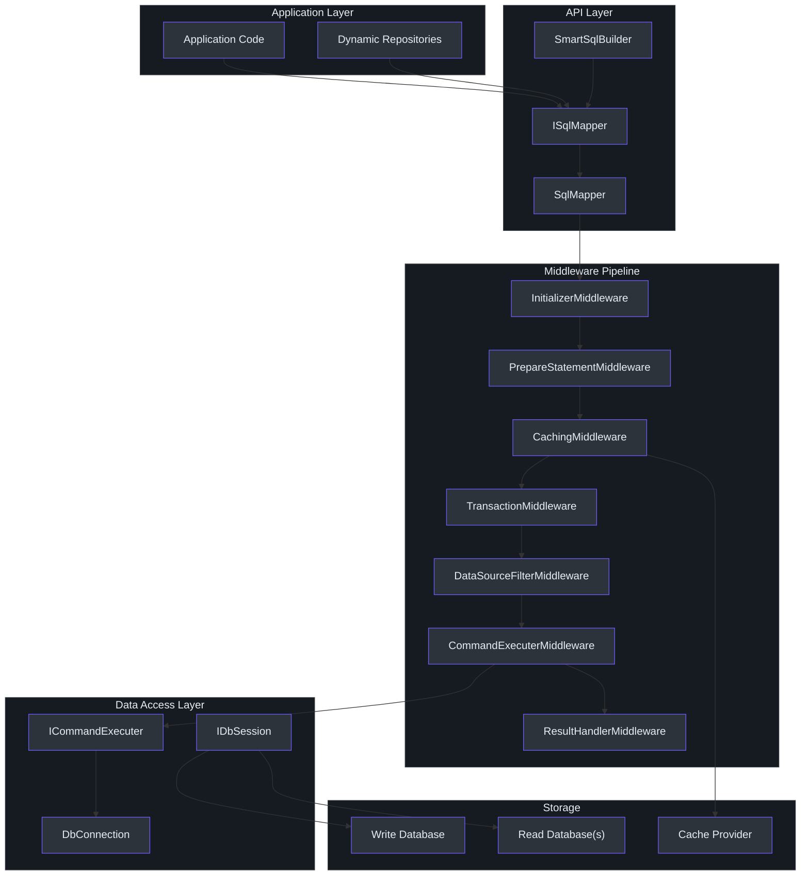
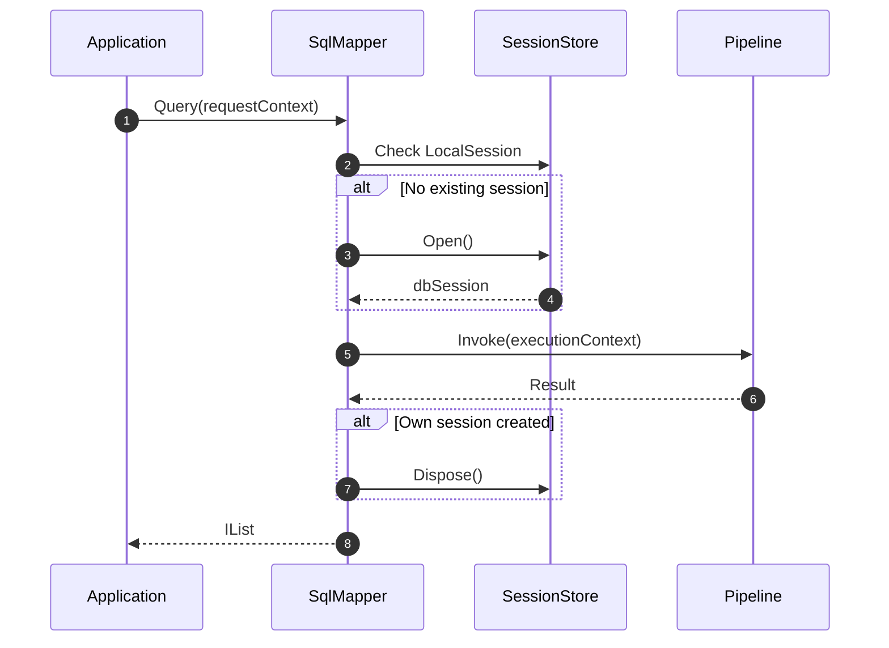
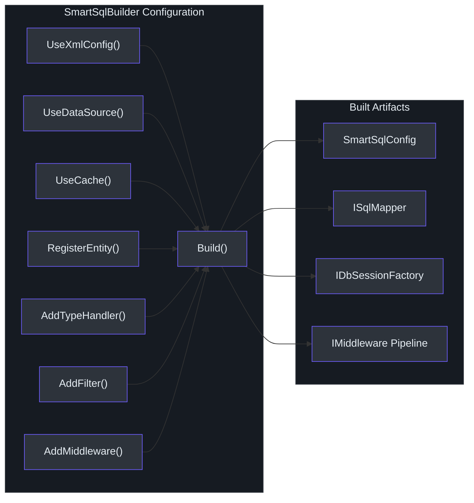
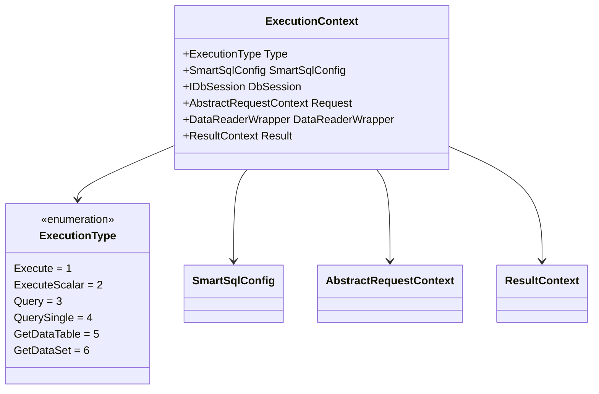

# 架构概览

SmartSql 是一个受 MyBatis 启发的 .NET ORM，使用 XML 管理的 SQL 和基于中间件的执行管道。架构将关注点分离为不同层次：面向开发者的 API、处理每次 SQL 调用的可配置中间件管道，以及数据库访问层。这种设计使得可以在不修改核心逻辑的情况下拦截、转换和观察 SQL 执行的每一步。

## 概要

| 组件 | 类 | 职责 |
|------|---|------|
| API 表面 | `ISqlMapper` / `SqlMapper` | 开发者进行查询、命令和事务的入口点 |
| 构建器 | `SmartSqlBuilder` | 配置整个运行时的流式构建器 |
| 中央配置 | `SmartSqlConfig` | 保存 Database、SqlMaps、Pipeline、Caches、Filters、TypeHandlers |
| 执行上下文 | `ExecutionContext` | 在管道中承载请求、会话、配置和结果 |
| 中间件管道 | `IMiddleware` 链 | 处理执行各阶段的中间件链表 |
| 数据源过滤器 | `IDataSourceFilter` | 根据语句类型选择读或写数据库 |

## 分层架构

SmartSql 遵循三层架构。应用程序代码与 `ISqlMapper` 交互，`ISqlMapper` 委托给中间件管道，中间件管道最终执行数据库命令。

<!-- Sources: src/SmartSql/SmartSqlBuilder.cs:60, src/SmartSql/SqlMapper.cs:14, src/SmartSql/Configuration/SmartSqlConfig.cs:21 -->

## 核心抽象

### ISqlMapper

`ISqlMapper` 是主要的面向开发者的接口。它为所有常见数据库操作提供同步和异步方法。实现类 `SqlMapper` 自动管理会话生命周期 -- 如果在 `SessionStore` 中没有找到现有会话，它会打开一个，通过管道执行，然后销毁。

<!-- Sources: src/SmartSql/SqlMapper.cs:90, src/SmartSql/ISqlMapper.cs:13 -->

关键 API 方法如下：

| 方法 | 返回类型 | 描述 |
|------|----------|------|
| `Execute` | `int` | 执行非查询 SQL，返回受影响的行数 |
| `ExecuteScalar<T>` | `T` | 执行 SQL 并返回单个标量值 |
| `Query<T>` | `IList<T>` | 执行 SQL 并返回映射实体列表 |
| `QuerySingle<T>` | `T` | 执行 SQL 并返回单个实体 |
| `GetDataTable` | `DataTable` | 返回原始 `DataTable` 结果 |
| `GetDataSet` | `DataSet` | 返回原始 `DataSet` 结果 |
| `BeginTransaction` | `DbTransaction` | 启动手动事务 |
| `CommitTransaction` | `void` | 提交活跃事务 |
| `RollbackTransaction` | `void` | 回滚活跃事务 |

所有方法都有异步对应方法（例如 `QueryAsync<T>`、`ExecuteAsync`）。

### SmartSqlBuilder

`SmartSqlBuilder` 是构建整个 SmartSql 运行时的流式构建器。它配置数据库连接、XML 映射、缓存、过滤器、类型处理器、反序列化器和中间件管道，然后将构建的实例注册到 `SmartSqlContainer`。

<!-- Sources: src/SmartSql/SmartSqlBuilder.cs:23, src/SmartSql/SmartSqlBuilder.cs:60 -->

### SmartSqlConfig

`SmartSqlConfig` 是中央配置对象，保存所有已解析的设置和服务。它在 `Build()` 阶段构建，并在所有组件间共享。

| 属性 | 类型 | 用途 |
|------|------|------|
| `Alias` | `string` | `SmartSqlContainer` 的实例标识符 |
| `Settings` | `Settings` | 全局设置（IgnoreParameterCase、IsCacheEnabled 等） |
| `Database` | `Database` | 写入/读取数据源定义 |
| `SqlMaps` | `IDictionary<string, SqlMap>` | 所有已加载的 SQL 映射，以 Scope 为键 |
| `Pipeline` | `IMiddleware` | 中间件链的头部 |
| `CacheManager` | `ICacheManager` | 读查询的缓存管理 |
| `TypeHandlerFactory` | `TypeHandlerFactory` | 类型处理器注册表 |
| `DeserializerFactory` | `IDeserializerFactory` | DataReader 反序列化器链 |
| `Filters` | `FilterCollection` | 全局调用过滤器 |
| `DataSourceFilter` | `IDataSourceFilter` | 读写源选择逻辑 |
| `CommandExecuter` | `ICommandExecuter` | 对数据库执行 DbCommand |
| `SessionStore` | `IDbSessionStore` | 线程本地会话存储 |
| `IdGenerators` | `IDictionary<string, IIdGenerator>` | ID 生成器（Snowflake 等） |

### ExecutionContext

`ExecutionContext` 是流经每个中间件的请求范围对象。它承载配置、活跃数据库会话、请求上下文和结果上下文。

<!-- Sources: src/SmartSql/ExecutionContext.cs:9, src/SmartSql/Configuration/SmartSqlConfig.cs:21 -->

## 中间件管道执行顺序

管道由 `PipelineBuilder` 构建，它按 `IOrdered.Order` 值排序中间件并通过 `Next` 指针链接。当缓存启用时，管道包含 `CachingMiddleware`；禁用时，替换为 `NoneCacheManager`。

| 顺序 | 中间件 | 职责 |
|------|--------|------|
| 0 | `InitializerMiddleware` | 从配置解析 Statement、DataSourceChoice、Cache、ResultMap |
| 100 | `PrepareStatementMiddleware` | 构建最终 SQL 字符串，创建 DbParameters |
| 200 | `CachingMiddleware` | 检查/填充缓存（仅在缓存启用时） |
| 300 | `TransactionMiddleware` | 如果已配置则将执行包装在事务中 |
| 400 | `DataSourceFilterMiddleware` | 选择读取或写入数据源 |
| 500 | `CommandExecuterMiddleware` | 对数据库执行 DbCommand |
| 600 | `ResultHandlerMiddleware` | 通过反序列化链反序列化 DataReader 结果 |

有关每个中间件的详细说明，请参阅[中间件管道](./middleware-pipeline.md)。

## 组件依赖图

```mermaid
graph TD
    subgraph Config["SmartSqlConfig"]
        style Config fill:#161b22,stroke:#30363d,color:#e6edf3
        SC["SmartSqlConfig"]
    end

    subgraph Components["Runtime Components"]
        style Components fill:#161b22,stroke:#30363d,color:#e6edf3
        SM["SqlMapper"]
        SS["SessionStore"]
        DF["DeserializerFactory"]
        CM["CacheManager"]
        TH["TypeHandlerFactory"]
        DS["IDataSourceFilter"]
        CE["ICommandExecuter"]
        FC["FilterCollection"]
        TB["TagBuilderFactory"]
    end

    subgraph Maps["XML Configuration"]
        style Maps fill:#161b22,stroke:#30363d,color:#e6edf3
        SQLM["SqlMap(s)"]
        STMT["Statement(s)"]
        RMAP["ResultMap(s)"]
        CDEF["Cache Definition(s)"]
    end

    SC --> SM
    SC --> SS
    SC --> DF
    SC --> CM
    SC --> TH
    SC --> DS
    SC --> CE
    SC --> FC
    SC --> TB
    SC --> SQLM
    SQLM --> STMT
    SQLM --> RMAP
    SQLM --> CDEF

    style SC fill:#2d333b,stroke:#6d5dfc,color:#e6edf3
    style SM fill:#2d333b,stroke:#6d5dfc,color:#e6edf3
    style SS fill:#2d333b,stroke:#6d5dfc,color:#e6edf3
    style DF fill:#2d333b,stroke:#6d5dfc,color:#e6edf3
    style CM fill:#2d333b,stroke:#6d5dfc,color:#e6edf3
    style TH fill:#2d333b,stroke:#6d5dfc,color:#e6edf3
    style DS fill:#2d333b,stroke:#6d5dfc,color:#e6edf3
    style CE fill:#2d333b,stroke:#6d5dfc,color:#e6edf3
    style FC fill:#2d333b,stroke:#6d5dfc,color:#e6edf3
    style TB fill:#2d333b,stroke:#6d5dfc,color:#e6edf3
    style SQLM fill:#2d333b,stroke:#6d5dfc,color:#e6edf3
    style STMT fill:#2d333b,stroke:#6d5dfc,color:#e6edf3
    style RMAP fill:#2d333b,stroke:#6d5dfc,color:#e6edf3
    style CDEF fill:#2d333b,stroke:#6d5dfc,color:#e6edf3
```

<!-- Sources: src/SmartSql/Configuration/SmartSqlConfig.cs:21, src/SmartSql/SmartSqlBuilder.cs:240 -->

## 解决方案结构

| 项目 | 用途 |
|------|------|
| `SmartSql` | 以 netstandard2.0 为目标的核心库 |
| `SmartSql.DyRepository` | 通过 IL emit 进行动态仓储代理生成 |
| `SmartSql.DIExtension` | ASP.NET Core DI 集成（`services.AddSmartSql()`） |
| `SmartSql.Options` | 从 `appsettings.json` 使用选项模式配置 |
| `SmartSql.Cache.Redis` | Redis 缓存提供程序 |
| `SmartSql.Cache.Sync` | 跨实例缓存同步 |
| `SmartSql.TypeHandler` | JSON 和自定义类型处理器 |
| `SmartSql.AOP` | 通过 `[Transaction]` 属性支持 AOP 事务 |
| `SmartSql.Bulk.*` | SqlServer、MySql、PostgreSql 的批量插入 |
| `SmartSql.InvokeSync.*` | 通过 Kafka/RabbitMQ 进行数据同步 |

## 相关页面

- [中间件管道](./middleware-pipeline.md) -- 每个中间件阶段的深入解析
- [XML 标签系统](./xml-tags.md) -- 使用 XML 标签进行动态 SQL 构建
- [数据源与读写分离](./datasource.md) -- 数据库源选择
- [缓存架构](./caching.md) -- LRU、FIFO 和 Redis 缓存
- [反序列化](./deserialization.md) -- DataReader 到对象的映射
- [诊断与监控](./diagnostics.md) -- 通过 DiagnosticSource 实现可观测性

## 参考资料

- [SmartSqlBuilder.cs](https://github.com/dotnetcore/SmartSql/blob/master/src/SmartSql/SmartSqlBuilder.cs) -- 流式构建器
- [SqlMapper.cs](https://github.com/dotnetcore/SmartSql/blob/master/src/SmartSql/SqlMapper.cs) -- 主入口点
- [ISqlMapper.cs](https://github.com/dotnetcore/SmartSql/blob/master/src/SmartSql/ISqlMapper.cs) -- 映射器接口
- [SmartSqlConfig.cs](https://github.com/dotnetcore/SmartSql/blob/master/src/SmartSql/Configuration/SmartSqlConfig.cs) -- 中央配置
- [ExecutionContext.cs](https://github.com/dotnetcore/SmartSql/blob/master/src/SmartSql/ExecutionContext.cs) -- 执行上下文
