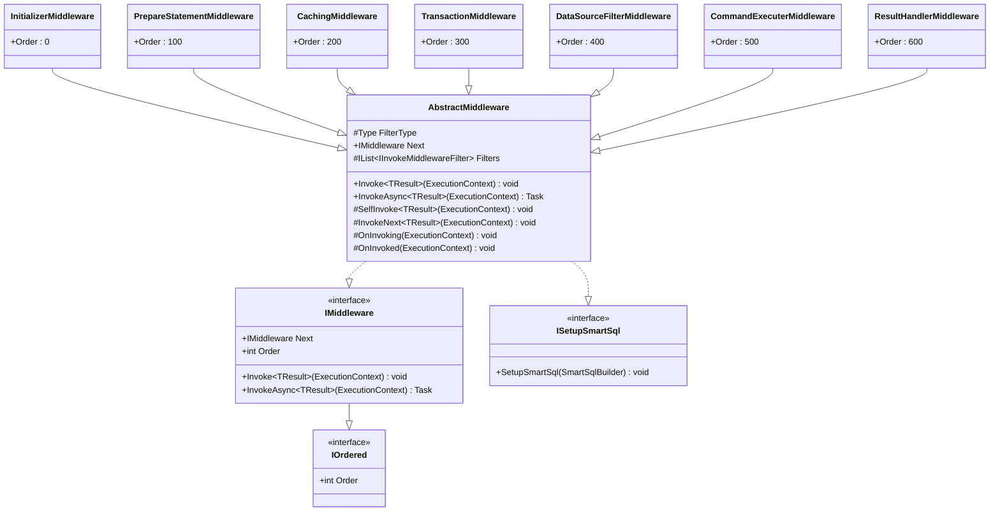
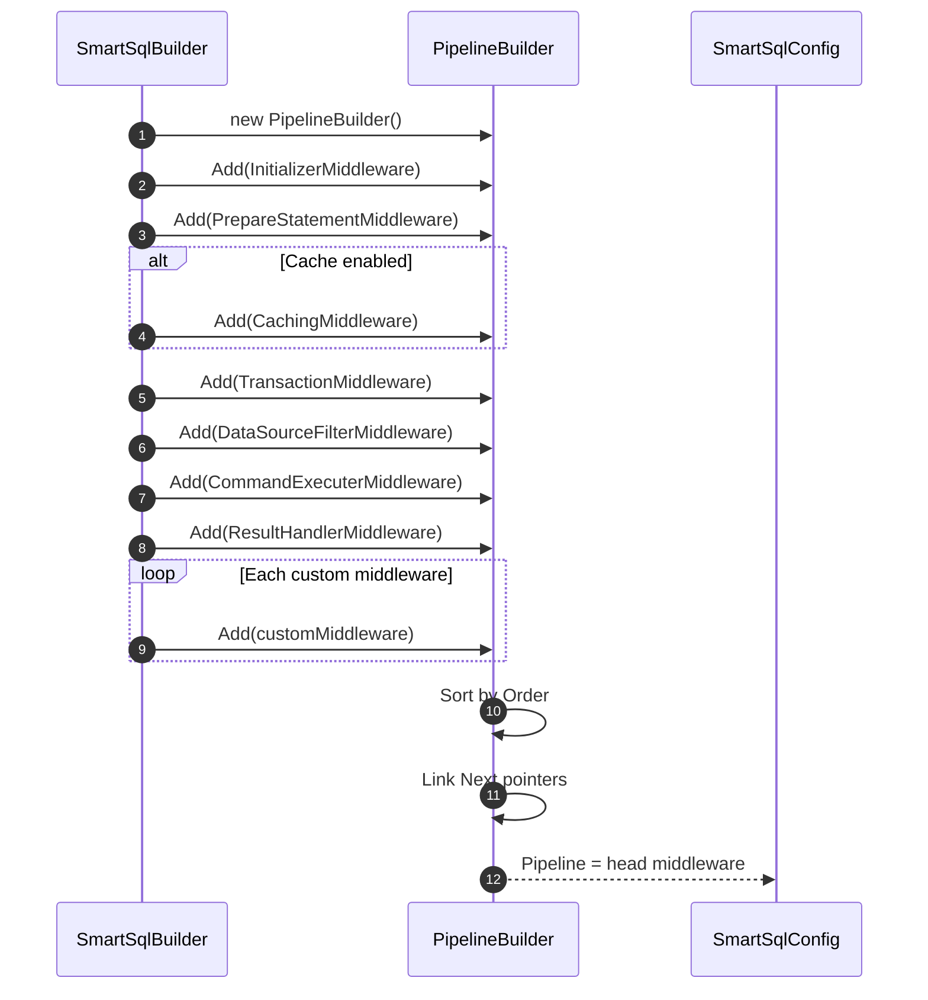
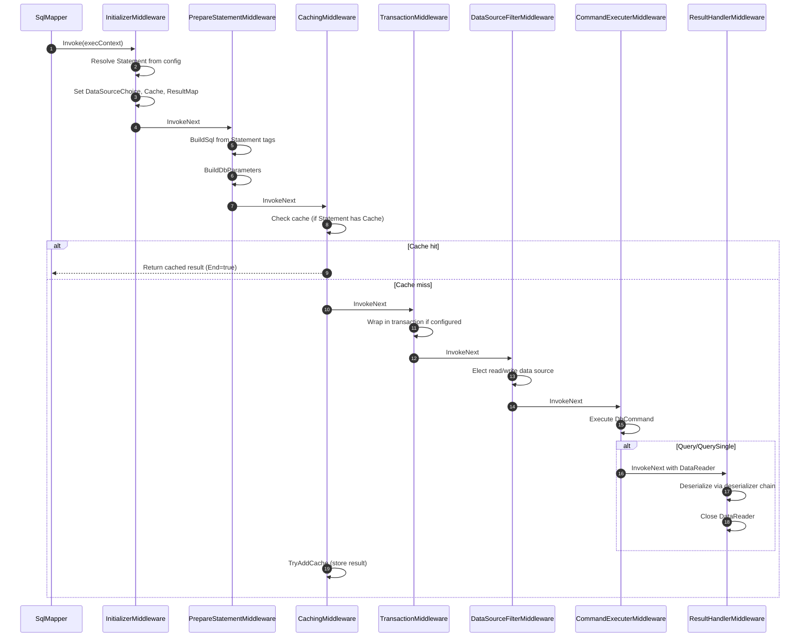
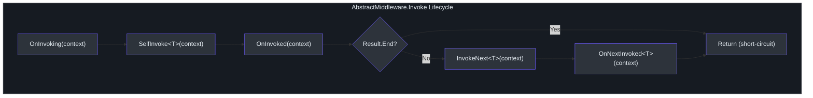

# 中间件管道

SmartSql 通过中间件管道处理每次 SQL 调用 -- 一个 `IMiddleware` 实现的链表，每个实现负责执行的特定阶段。这种设计以显式的、有序的链取代了传统的 AOP 或装饰器模式，易于扩展、检查和调试。任何自定义中间件都可以在特定位置插入以添加横切关注点行为，如日志记录、审计或动态数据源路由。

## 概要

| 方面 | 详情 |
|------|------|
| 接口 | `IMiddleware`，带有用于链接的 `Next` 指针 |
| 基类 | `AbstractMiddleware` 提供过滤器钩子和生命周期 |
| 构建器 | `PipelineBuilder` 按 `IOrdered.Order` 排序并链接链 |
| 扩展点 | `SmartSqlBuilder.AddMiddleware()` 追加自定义中间件 |
| 过滤器支持 | 每个中间件可以声明一个 `FilterType` 用于中间件级别的过滤器 |

## IMiddleware 接口

`IMiddleware` 接口定义了管道阶段的契约。每个中间件通过 `Next` 属性持有对链中下一个中间件的引用。



<!-- Sources: src/SmartSql/Middlewares/AbstractMiddleware.cs:9, src/SmartSql/Middlewares/InitializerMiddleware.cs:10 -->

## 管道构建

`PipelineBuilder` 累积中间件实例，按 `Order` 排序，并将它们链接成链。结果链的头部存储在 `SmartSqlConfig.Pipeline` 中。



<!-- Sources: src/SmartSql/SmartSqlBuilder.cs:240, src/SmartSql/SmartSqlBuilder.cs:256 -->

### 构建逻辑

当调用 `SmartSqlBuilder.Build()` 时，管道在 `BuildPipeline()` 中构建：

- **缓存启用**（`Settings.IsCacheEnabled = true`）：注册所有七个中间件，包括 `CachingMiddleware`。
- **缓存禁用**：省略 `CachingMiddleware`。取而代之，`NoneCacheManager` 被分配给 `SmartSqlConfig.CacheManager`，它总是返回缓存未命中。
- **自定义中间件**：通过 `AddMiddleware()` 添加的任何中间件会追加在内置链之后。

## 中间件执行流程

当 `SqlMapper` 调用管道时，执行按顺序流经每个中间件。每个中间件调用 `InvokeNext<TResult>()` 将控制权传递给下一个阶段，除非结果已被标记为 `End`（短路）。



<!-- Sources: src/SmartSql/SmartSqlBuilder.cs:256, src/SmartSql/Middlewares/AbstractMiddleware.cs:15 -->

## AbstractMiddleware 基类

`AbstractMiddleware` 为所有中间件实现提供脚手架。其 `Invoke<TResult>` 方法协调生命周期：

1. **OnInvoking** -- 处理前调用过滤器钩子
2. **SelfInvoke** -- 中间件自身的逻辑（重写点）
3. **OnInvoked** -- 处理后调用过滤器钩子
4. **InvokeNext** -- 传递给下一个中间件（除非 `Result.End` 为 true）
5. **OnNextInvoked** -- 下一个中间件返回后调用



<!-- Sources: src/SmartSql/Middlewares/AbstractMiddleware.cs:15, src/SmartSql/Middlewares/AbstractMiddleware.cs:50 -->

### 中间件级过滤器

每个中间件可以声明一个 `FilterType`。在设置期间（`SetupSmartSql`），基类扫描 `SmartSqlConfig.Filters` 中匹配的过滤器并存储它们。在 `SelfInvoke` 前后，中间件通过 `OnInvoking` 和 `OnInvoked` 调用所有匹配的过滤器。这允许在特定管道阶段进行细粒度拦截。

| 过滤器接口 | 用途 |
|-----------|------|
| `IInvokeFilter` | 任何调用前后的同步钩子 |
| `IAsyncInvokeFilter` | 任何调用前后的异步钩子 |
| `IInvokeMiddlewareFilter` | 同步 + 异步钩子的组合，用于中间件级别的过滤 |
| `IPrepareStatementFilter` | 特定于 `PrepareStatementMiddleware` 的钩子 |

## 各中间件详情

### 1. InitializerMiddleware（顺序：0）

根据请求的 `FullSqlId` 从 XML 配置解析 `Statement` 对象。根据语句的 `StatementType` 设置 `DataSourceChoice`（读或写）。将缓存配置、结果映射、参数映射和命令类型附加到请求上下文。

如果请求提供原始 SQL 字符串而非语句 ID，则绕过语句解析，作为直接 SQL 执行。

<!-- Sources: src/SmartSql/Middlewares/InitializerMiddleware.cs:10, src/SmartSql/Middlewares/InitializerMiddleware.cs:32 -->

### 2. PrepareStatementMiddleware（顺序：100）

通过调用 `Statement.BuildSql()` 来构建最终 SQL 字符串，该方法处理所有 XML 标签。然后使用数据库提供程序工厂从参数集合创建 `DbParameter` 对象。处理可枚举参数的 `IN` 子句展开。支持 `IPrepareStatementFilter` 钩子。

<!-- Sources: src/SmartSql/Middlewares/PrepareStatementMiddleware.cs:18, src/SmartSql/Middlewares/PrepareStatementMiddleware.cs:127 -->

### 3. CachingMiddleware（顺序：200）

仅在语句有相关联的 `Cache` 定义时活跃。对于查询操作，先检查 `ICacheManager.TryGetCache()`。如果找到缓存命中且没有活跃事务，设置结果并标记 `Result.End = true` 以短路管道。缓存未命中时，将执行传递给下一个中间件，然后通过 `TryAddCache()` 存储结果。

<!-- Sources: src/SmartSql/Middlewares/CachingMiddleware.cs:9, src/SmartSql/Middlewares/CachingMiddleware.cs:12 -->

### 4. TransactionMiddleware（顺序：300）

如果语句的 `Transaction` 属性已设置且没有活跃事务，则将下游执行包装在数据库事务中。使用 `IDbSession.TransactionWrap()` 开始事务、调用操作，并根据成功或失败提交/回滚。

<!-- Sources: src/SmartSql/Middlewares/TransactionMiddleware.cs:9, src/SmartSql/Middlewares/TransactionMiddleware.cs:11 -->

### 5. DataSourceFilterMiddleware（顺序：400）

委托给 `IDataSourceFilter.Elect()` 以选择适当的数据源。如果会话已有分配的数据源（例如来自显式事务），则复用它。否则，过滤器根据请求的 `DataSourceChoice` 确定读或写，并在读副本间进行加权负载均衡。

<!-- Sources: src/SmartSql/Middlewares/DataSourceFilterMiddleware.cs:7, src/SmartSql/Middlewares/DataSourceFilterMiddleware.cs:22 -->

### 6. CommandExecuterMiddleware（顺序：500）

通过 `ICommandExecuter` 执行实际的 `DbCommand`。行为因 `ExecutionType` 而异：

| ExecutionType | 操作 |
|---------------|------|
| `Execute` | `ExecuteNonQuery` -- 返回受影响的行数 |
| `ExecuteScalar` | `ExecuteScalar` -- 返回带类型转换的单个值 |
| `Query` / `QuerySingle` | `ExecuteReader` -- 将 DataReader 传递给 `ResultHandlerMiddleware` |
| `GetDataTable` | 返回原始 `DataTable` |
| `GetDataSet` | 返回原始 `DataSet` |

对于查询操作，DataReader 被包装在 `DataReaderWrapper` 中并向前传递；对于非查询操作，结果直接设置在 `ResultContext` 上。

<!-- Sources: src/SmartSql/Middlewares/CommandExecuterMiddleware.cs:9, src/SmartSql/Middlewares/CommandExecuterMiddleware.cs:14 -->

### 7. ResultHandlerMiddleware（顺序：600）

使用 `IDeserializerFactory` 的反序列化链将 `DataReaderWrapper` 结果反序列化为类型化对象。根据结果上下文是列表还是单个结果选择 `ToList<TResult>` 或 `ToSingle<TResult>`。始终在 `finally` 块中关闭和销毁 DataReader。

<!-- Sources: src/SmartSql/Middlewares/ResultHandlerMiddleware.cs:10, src/SmartSql/Middlewares/ResultHandlerMiddleware.cs:14 -->

## 扩展管道

自定义中间件可以通过 `SmartSqlBuilder.AddMiddleware()` 添加。自定义中间件追加在内置链之后并按其 `Order` 值排序。要插入到特定位置，选择一个介于相邻中间件顺序之间的 `Order` 值。

```csharp
public class LoggingMiddleware : AbstractMiddleware
{
    public override int Order => 150; // 介于 PrepareStatement 和 Caching 之间

    protected override void SelfInvoke<TResult>(ExecutionContext executionContext)
    {
        // 记录 SQL、计时、参数等
    }
}

// 注册
new SmartSqlBuilder()
    .UseXmlConfig()
    .AddMiddleware(new LoggingMiddleware())
    .Build();
```

## 相关页面

- [架构概览](./index.md) -- 分层架构和核心抽象
- [XML 标签系统](./xml-tags.md) -- Statement 标签如何构建 SQL 字符串
- [数据源与读写分离](./datasource.md) -- DataSourceFilterMiddleware 如何选择源
- [缓存架构](./caching.md) -- CachingMiddleware 如何与缓存系统交互
- [反序列化](./deserialization.md) -- ResultHandlerMiddleware 如何反序列化 DataReader
- [诊断与监控](./diagnostics.md) -- 管道执行的可观测性钩子

## 参考资料

- [AbstractMiddleware.cs](https://github.com/dotnetcore/SmartSql/blob/master/src/SmartSql/Middlewares/AbstractMiddleware.cs)
- [InitializerMiddleware.cs](https://github.com/dotnetcore/SmartSql/blob/master/src/SmartSql/Middlewares/InitializerMiddleware.cs)
- [PrepareStatementMiddleware.cs](https://github.com/dotnetcore/SmartSql/blob/master/src/SmartSql/Middlewares/PrepareStatementMiddleware.cs)
- [CachingMiddleware.cs](https://github.com/dotnetcore/SmartSql/blob/master/src/SmartSql/Middlewares/CachingMiddleware.cs)
- [TransactionMiddleware.cs](https://github.com/dotnetcore/SmartSql/blob/master/src/SmartSql/Middlewares/TransactionMiddleware.cs)
- [DataSourceFilterMiddleware.cs](https://github.com/dotnetcore/SmartSql/blob/master/src/SmartSql/Middlewares/DataSourceFilterMiddleware.cs)
- [CommandExecuterMiddleware.cs](https://github.com/dotnetcore/SmartSql/blob/master/src/SmartSql/Middlewares/CommandExecuterMiddleware.cs)
- [ResultHandlerMiddleware.cs](https://github.com/dotnetcore/SmartSql/blob/master/src/SmartSql/Middlewares/ResultHandlerMiddleware.cs)
- [SmartSqlBuilder.cs](https://github.com/dotnetcore/SmartSql/blob/master/src/SmartSql/SmartSqlBuilder.cs) -- 管道构建
