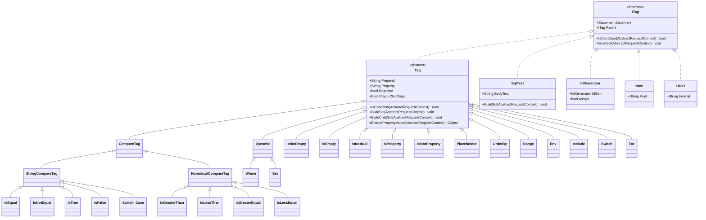
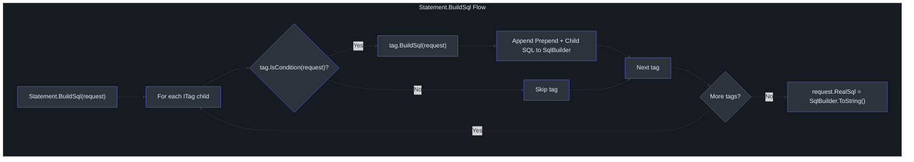

# XML 标签系统

SmartSql 使用 XML 定义 SQL 语句，但与静态 SQL 映射器不同，它提供了一套丰富的标签系统用于动态 SQL 构建。标签在运行时根据请求参数进行评估，以有条件地包含 SQL 片段、迭代集合、按值切换以及注入生成的值。该系统受 MyBatis 动态 SQL 的启发，但针对 .NET 类型和约定进行了定制。

## 概要

| 方面 | 详情 |
|------|------|
| 接口 | `ITag`，具有 `IsCondition()` 和 `BuildSql()` 方法 |
| 基类 | `Tag` 提供基于属性的条件检查和子标签迭代 |
| 容器 | 每个 `Statement` 持有一个 `ITag` 子项列表，按顺序处理 |
| 组合标签 | `Dynamic`、`Where`、`Set` 充当容器，根据子匹配前置关键字 |
| 工厂 | `TagBuilderFactory` 从 XML 元素定义创建标签实例 |

## 标签类层次结构



<!-- Sources: src/SmartSql/Configuration/Tags/ITag.cs:7, src/SmartSql/Configuration/Tags/Tag.cs:8 -->

## Statement 如何处理标签

当 `PrepareStatementMiddleware` 调用 `Statement.BuildSql()` 时，每个 statement 遍历其子标签。每个标签根据请求参数检查其条件，如果条件通过则将其 SQL 片段追加到 `SqlBuilder`。



<!-- Sources: src/SmartSql/Configuration/Tags/Tag.cs:22, src/SmartSql/Middlewares/PrepareStatementMiddleware.cs:127 -->

## 标签类型参考

### 条件标签

这些标签根据请求参数检查条件，仅在条件满足时包含其子内容。

#### IsNotEmpty

当属性值不为 null、不为空字符串，且（对于集合）至少有一个元素时渲染子内容。

```xml
<IsNotEmpty Property="UserName">
  AND UserName = @UserName
</IsNotEmpty>
```

<!-- Sources: src/SmartSql/Configuration/Tags/IsNotEmpty.cs:9 -->

#### IsEmpty

`IsNotEmpty` 的反面 -- 当属性为 null、空字符串或空集合时渲染。

<!-- Sources: src/SmartSql/Configuration/Tags/IsEmpty.cs:9 -->

#### IsEqual / IsNotEqual

将属性值（作为字符串）与 `CompareValue` 属性进行比较。

```xml
<IsEqual Property="Status" CompareValue="1">
  AND Active = 1
</IsEqual>
```

<!-- Sources: src/SmartSql/Configuration/Tags/IsEqual.cs:7 -->

#### IsGreaterThan / IsLessThan / IsGreaterEqual / IsLessEqual

数值比较标签，将属性值解析为 `Decimal` 并与 `CompareValue` 比较。

```xml
<IsGreaterThan Property="Age" CompareValue="18">
  AND Age > @Age
</IsGreaterThan>
```

<!-- Sources: src/SmartSql/Configuration/Tags/IsGreaterThan.cs:8, src/SmartSql/Configuration/Tags/IsLessThan.cs:7 -->

#### IsNotNull / IsNull

检查属性值是否为 null 或不为 null。

<!-- Sources: src/SmartSql/Configuration/Tags/IsNotNull.cs:7 -->

#### IsProperty / IsNotProperty

检查请求参数中是否存在该属性键（不论值）。

```xml
<IsProperty Property="DeptId">
  AND DeptId = @DeptId
</IsProperty>
<IsNotProperty Property="DeptId">
  AND DeptId IS NULL
</IsNotProperty>
```

`IsProperty` 还支持 `PropertyChanged` 跟踪以用于实体代理变更检测。

<!-- Sources: src/SmartSql/Configuration/Tags/IsProperty.cs:8, src/SmartSql/Configuration/Tags/IsNotProperty.cs:5 -->

#### IsTrue / IsFalse

布尔比较标签，检查属性值是否等于字符串 "True" 或 "False"。

<!-- Sources: src/SmartSql/Configuration/Tags/IsTrue.cs, src/SmartSql/Configuration/Tags/IsFalse.cs -->

#### Range

检查数值属性值是否在 `[Min, Max]` 范围内。

```xml
<Range Property="PageNum" Min="1" Max="100">
  -- 分页逻辑
</Range>
```

<!-- Sources: src/SmartSql/Configuration/Tags/Range.cs:8 -->

#### Env

根据当前数据库提供程序名称有条件地包含内容。适用于数据库特定的 SQL。

```xml
<Env DbProvider="MySql">
  LIMIT @PageSize OFFSET @Offset
</Env>
<Env DbProvider="SqlServer">
  OFFSET @Offset ROWS FETCH NEXT @PageSize ROWS ONLY
</Env>
```

<!-- Sources: src/SmartSql/Configuration/Tags/Env.cs:7 -->

### 组合 / 结构化标签

#### Where

扩展 `Dynamic`，`Prepend = "Where"`。仅在至少一个子标签条件通过时渲染 `WHERE` 关键字。第一个匹配的子项获得 `WHERE` 关键字前置；后续子项使用它们自己的 `Prepend` 值（通常为 `AND`）。

```xml
<Where>
  <IsNotEmpty Property="Name">
    AND Name = @Name
  </IsNotEmpty>
  <IsNotEmpty Property="Status">
    AND Status = @Status
  </IsNotEmpty>
</Where>
<!-- 产生: WHERE Name = @Name AND Status = @Status -->
```

<!-- Sources: src/SmartSql/Configuration/Tags/Where.cs:8 -->

#### Set

扩展 `Dynamic`，`Prepend = "Set"`。在 UPDATE 语句中使用以有条件地包含 SET 子句。

```xml
<Set>
  <IsNotEmpty Property="Name">
    Name = @Name,
  </IsNotEmpty>
  <IsNotEmpty Property="Status">
    Status = @Status,
  </IsNotEmpty>
</Set>
```

<!-- Sources: src/SmartSql/Configuration/Tags/Set.cs:7 -->

#### Dynamic

基础组合标签。评估子标签并在第一个匹配子项前渲染 `Prepend`。支持 `Min` 属性，如果匹配的子项少于最小值则抛出 `TagMinMatchedFailException`。

<!-- Sources: src/SmartSql/Configuration/Tags/Dynamic.cs:9 -->

#### Switch / Case / Default

switch-case 结构，通过将属性值与 `CompareValue` 比较来评估子 `Case` 标签，如果没有 case 匹配则回退到 `Default`。

```xml
<Switch Property="SortField">
  <Case CompareValue="Name">ORDER BY Name ASC</Case>
  <Case CompareValue="Date">ORDER BY CreateTime DESC</Case>
  <Default>ORDER BY Id ASC</Default>
</Switch>
```

<!-- Sources: src/SmartSql/Configuration/Tags/Switch.cs:7, src/SmartSql/Configuration/Tags/Switch.cs:35 -->

#### For

迭代集合并为每个元素生成参数化 SQL。支持 `Open`、`Separator` 和 `Close` 属性来控制分隔符。

```xml
<For Property="Ids" Open="(" Close=")" Separator="," Key="id">
  @id
</For>
<!-- 产生: (@Ids_For__0, @Ids_For__1, @Ids_For__2) -->
```

`For` 标签同时处理直接值（基本类型、字符串）和复杂对象，为每次迭代创建唯一命名的参数以避免冲突。

<!-- Sources: src/SmartSql/Configuration/Tags/For.cs:10, src/SmartSql/Configuration/Tags/For.cs:35 -->

#### Include

通过 `RefId` 引用另一个语句的 SQL 内容，实现 SQL 片段复用。

```xml
<Include RefId="BaseColumns">
  <!-- 引用定义公共列选择的另一个 Statement -->
</Include>
```

<!-- Sources: src/SmartSql/Configuration/Tags/Include.cs:6 -->

### 值注入标签

这些标签总是渲染并注入值到参数集合中，而非产生 SQL 文本。

#### Now

将当前日期/时间注入请求参数。支持 `Kind="UTC"` 用于 UTC 时间。

```xml
<Now Property="CreateTime" />
<!-- 将请求参数 CreateTime 设置为 DateTime.Now -->
```

<!-- Sources: src/SmartSql/Configuration/Tags/Now.cs:7 -->

#### UUID

生成新的 GUID 并注入请求参数。支持 `Format` 属性用于字符串格式化。

```xml
<UUID Property="Id" Format="N" />
<!-- 将请求参数 Id 设置为格式化为 "N"（无连字符）的 GUID -->
```

<!-- Sources: src/SmartSql/Configuration/Tags/UUID.cs:7 -->

#### Placeholder

直接将属性值插入 SQL 字符串（非参数化值）。用于动态表名或列名等无法参数化的情况。

```xml
<Placeholder Property="TableName" Prepend="FROM " />
<!-- 产生: FROM Users（字面字符串替换） -->
```

<!-- Sources: src/SmartSql/Configuration/Tags/Placeholder.cs:7 -->

#### OrderBy

从 `KeyValuePair<string, string>` 或键值对集合生成 ORDER BY 子句，其中 Key 是列名，Value 是方向。

```xml
<OrderBy Property="Sort" />
<!-- 如果 Sort = {Key: "Name", Value: "ASC"}，产生: ORDER BY Name ASC -->
```

<!-- Sources: src/SmartSql/Configuration/Tags/OrderBy.cs:8 -->

#### IdGenerator

使用已注册的 `IIdGenerator`（例如 Snowflake）生成唯一 ID 并注入请求参数。

<!-- Sources: src/SmartSql/Configuration/Tags/IdGenerator.cs:9 -->

### SqlText

`SqlText` 是持有标签间原始 SQL 文本的叶节点。它还处理自动 `IN` 子句展开：当检测到 `IN @ParamName` 语法且参数值为 `IEnumerable` 时，将参数展开为单独的编号参数。

<!-- Sources: src/SmartSql/Configuration/Tags/SqlText.cs:8, src/SmartSql/Configuration/Tags/SqlText.cs:24 -->

## 标签层次图

下图展示了为具体标签提供通用行为的抽象继承链：

```mermaid
graph TD
    subgraph Interfaces["Tag Interfaces"]
        style Interfaces fill:#161b22,stroke:#30363d,color:#e6edf3
        ITag["ITag"]
        ITagB["ITagBuilder"]
    end

    subgraph Base["Abstract Base"]
        style Base fill:#161b22,stroke:#30363d,color:#e6edf3
        AbsTag["Tag (abstract)"]
        CmpTag["CompareTag&lt;T&gt;"]
        StrCmp["StringCompareTag"]
        NumCmp["NumericalCompareTag"]
    end

    subgraph Conditional["Conditional Tags"]
        style Conditional fill:#161b22,stroke:#30363d,color:#e6edf3
        INE["IsNotEmpty"]
        IE["IsEmpty"]
        INN["IsNotNull"]
        ISN["IsNull"]
        IP["IsProperty"]
        INP["IsNotProperty"]
        IEq["IsEqual"]
        INEq["IsNotEqual"]
        IGT["IsGreaterThan"]
        ILT["IsLessThan"]
        IGE["IsGreaterEqual"]
        ILE["IsLessEqual"]
        IT["IsTrue"]
        IF["IsFalse"]
        Rng["Range"]
    end

    subgraph Composite["Composite Tags"]
        style Composite fill:#161b22,stroke:#30363d,color:#e6edf3
        Dyn["Dynamic"]
        Whr["Where"]
        St["Set"]
        Sw["Switch"]
        Fr["For"]
        Inc["Include"]
        EnvT["Env"]
    end

    subgraph Inject["Value Injection"]
        style Inject fill:#161b22,stroke:#30363d,color:#e6edf3
        NowT["Now"]
        UUIDT["UUID"]
        PH["Placeholder"]
        OB["OrderBy"]
        IDG["IdGenerator"]
        ST["SqlText"]
    end

    ITag --> AbsTag
    AbsTag --> CmpTag
    AbsTag --> Dyn
    AbsTag --> INE
    AbsTag --> IE
    AbsTag --> INN
    AbsTag --> ISN
    AbsTag --> IP
    AbsTag --> INP
    AbsTag --> Rng
    AbsTag --> Fr
    AbsTag --> Inc
    AbsTag --> EnvT
    AbsTag --> PH
    AbsTag --> OB
    CmpTag --> StrCmp
    CmpTag --> NumCmp
    StrCmp --> IEq
    StrCmp --> INEq
    StrCmp --> IT
    StrCmp --> IF
    NumCmp --> IGT
    NumCmp --> ILT
    NumCmp --> IGE
    NumCmp --> ILE
    Dyn --> Whr
    Dyn --> St
    Dyn --> Sw

    style ITag fill:#2d333b,stroke:#6d5dfc,color:#e6edf3
    style AbsTag fill:#2d333b,stroke:#6d5dfc,color:#e6edf3
    style CmpTag fill:#2d333b,stroke:#6d5dfc,color:#e6edf3
    style StrCmp fill:#2d333b,stroke:#6d5dfc,color:#e6edf3
    style NumCmp fill:#2d333b,stroke:#6d5dfc,color:#e6edf3
    style Dyn fill:#2d333b,stroke:#6d5dfc,color:#e6edf3
    style Whr fill:#2d333b,stroke:#6d5dfc,color:#e6edf3
    style St fill:#2d333b,stroke:#6d5dfc,color:#e6edf3
    style INE fill:#2d333b,stroke:#6d5dfc,color:#e6edf3
    style IEq fill:#2d333b,stroke:#6d5dfc,color:#e6edf3
    style Fr fill:#2d333b,stroke:#6d5dfc,color:#e6edf3
    style ST fill:#2d333b,stroke:#6d5dfc,color:#e6edf3
    style ING fill:#2d333b,stroke:#6d5dfc,color:#e6edf3
    style NowT fill:#2d333b,stroke:#6d5dfc,color:#e6edf3
    style UUIDT fill:#2d333b,stroke:#6d5dfc,color:#e6edf3
    style PH fill:#2d333b,stroke:#6d5dfc,color:#e6edf3
    style OB fill:#2d333b,stroke:#6d5dfc,color:#e6edf3
    style IDG fill:#2d333b,stroke:#6d5dfc,color:#e6edf3
    style Inc fill:#2d333b,stroke:#6d5dfc,color:#e6edf3
    style EnvT fill:#2d333b,stroke:#6d5dfc,color:#e6edf3
    style Rng fill:#2d333b,stroke:#6d5dfc,color:#e6edf3
    style Sw fill:#2d333b,stroke:#6d5dfc,color:#e6edf3
    style IGT fill:#2d333b,stroke:#6d5dfc,color:#e6edf3
    style ILT fill:#2d333b,stroke:#6d5dfc,color:#e6edf3
```



<!-- Sources: src/SmartSql/Configuration/Tags/Tag.cs:8, src/SmartSql/Configuration/Tags/CompareTag.cs:7, src/SmartSql/Configuration/Tags/StringCompareTag.cs:7, src/SmartSql/Configuration/Tags/NumericalCompareTag.cs:7 -->

## 完整示例

以下是一个展示多种标签类型协同工作的完整 XML 语句：

```xml
<Statement Id="QueryUsers">
  SELECT * FROM Users
  <Where>
    <IsNotEmpty Property="Name">
      AND Name LIKE CONCAT('%', @Name, '%')
    </IsNotEmpty>
    <IsEqual Property="Status" CompareValue="1">
      AND IsActive = 1
    </IsEqual>
    <IsGreaterThan Property="MinAge" CompareValue="0">
      AND Age >= @MinAge
    </IsGreaterThan>
    <Env DbProvider="MySql">
      LIMIT @PageSize OFFSET @Offset
    </Env>
  </Where>
  <Switch Property="SortField">
    <Case CompareValue="Name">ORDER BY Name ASC</Case>
    <Default>ORDER BY Id DESC</Default>
  </Switch>
</Statement>
```

## 相关页面

- [架构概览](./index.md) -- XML 映射如何融入整体架构
- [中间件管道](./middleware-pipeline.md) -- `PrepareStatementMiddleware` 在何处调用标签处理
- [数据源与读写分离](./datasource.md) -- `Env` 标签如何启用数据库特定的 SQL

## 参考资料

- [ITag.cs](https://github.com/dotnetcore/SmartSql/blob/master/src/SmartSql/Configuration/Tags/ITag.cs)
- [Tag.cs](https://github.com/dotnetcore/SmartSql/blob/master/src/SmartSql/Configuration/Tags/Tag.cs) -- 抽象基类
- [Where.cs](https://github.com/dotnetcore/SmartSql/blob/master/src/SmartSql/Configuration/Tags/Where.cs)
- [Dynamic.cs](https://github.com/dotnetcore/SmartSql/blob/master/src/SmartSql/Configuration/Tags/Dynamic.cs)
- [Set.cs](https://github.com/dotnetcore/SmartSql/blob/master/src/SmartSql/Configuration/Tags/Set.cs)
- [For.cs](https://github.com/dotnetcore/SmartSql/blob/master/src/SmartSql/Configuration/Tags/For.cs)
- [Switch.cs](https://github.com/dotnetcore/SmartSql/blob/master/src/SmartSql/Configuration/Tags/Switch.cs)
- [SqlText.cs](https://github.com/dotnetcore/SmartSql/blob/master/src/SmartSql/Configuration/Tags/SqlText.cs)
- [TagBuilderFactory.cs](https://github.com/dotnetcore/SmartSql/blob/master/src/SmartSql/Configuration/Tags/TagBuilderFactory.cs)
