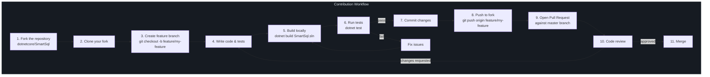
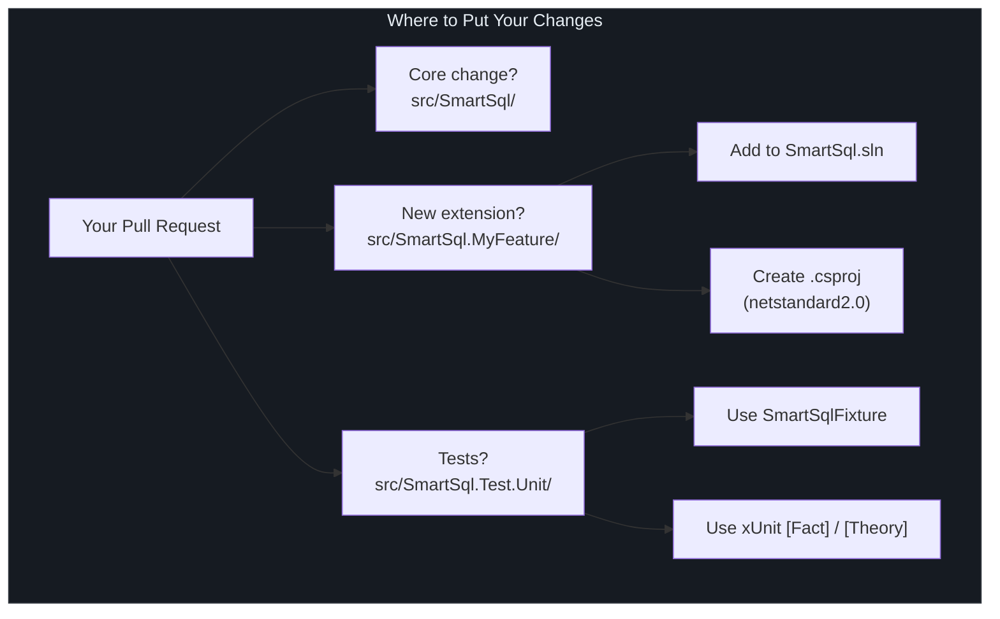
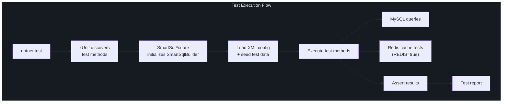

# 贡献指南

SmartSql 欢迎贡献。本页介绍贡献工作流、编码约定、测试期望和 XML 配置模式。

## 一览

| 方面 | 约定 |
|------|------|
| 许可证 | Apache-2.0 |
| 语言 | C# 7.3 |
| 目标 | `netstandard2.0` |
| 测试框架 | xUnit |
| CI 要求 | 推送/PR 时所有测试通过 |
| 提交风格 | 描述性、简洁的消息 |

## 贡献工作流



<!-- Sources: .github/workflows/integration-test.yml:1 -->

### 详细步骤

1. 在 [github.com/dotnetcore/SmartSql](https://github.com/dotnetcore/SmartSql) **Fork** 仓库
2. **克隆**你的 fork：
   ```bash
   git clone https://github.com/<your-username>/SmartSql.git
   cd SmartSql
   ```
3. 从 `master` **创建分支**：
   ```bash
   git checkout -b feature/my-feature
   ```
4. 按照以下编码约定**进行修改**
5. **构建和测试**：
   ```bash
   dotnet build SmartSql.sln
   dotnet test
   ```
6. **提交**，附带清晰的消息说明做了什么以及为什么
7. **推送**并向 `master` 发起**拉取请求**

## 编码约定

### 通用 C# 风格

- 目标 `netstandard2.0` -- 避免使用此目标中不可用的 API
- 使用 C# 7.3 语言特性（不使用 C# 8+ 特性，如可空引用类型、switch 表达式或异步流）
- 当类型从赋值右侧显而易见时使用 `var`
- 当类型不明显时使用显式类型
- 对注入的依赖优先使用 `readonly` 字段
- 在公共 API 上使用 XML 文档注释

### 命名约定

| 元素 | 约定 | 示例 |
|------|------|------|
| 命名空间 | PascalCase，匹配文件夹结构 | `SmartSql.Middlewares` |
| 类/结构体 | PascalCase | `PrepareStatementMiddleware` |
| 接口 | `I` 前缀 + PascalCase | `IMiddleware`、`ISqlMapper` |
| 方法 | PascalCase | `ExecuteAsync` |
| 属性 | PascalCase | `SmartSqlConfig` |
| 私有字段 | `_` 前缀 + camelCase | `_logger`、`_cacheManager` |
| 参数 | camelCase | `requestContext` |
| 常量 | PascalCase | `DEFAULT_ALIAS` |

### 项目结构

添加新功能时：

- **核心更改**放在 `src/SmartSql/` 中
- **扩展**有自己的项目：`src/SmartSql.MyFeature/`
- **测试**放在 `src/SmartSql.Test.Unit/` 中对应的功能
- 新的扩展项目应添加到 `SmartSql.sln` 解决方案文件中



<!-- Sources: src/SmartSql/SmartSql.csproj:1, SmartSql.sln:1 -->

### 基于接口的设计

SmartSql 遵循基于接口的设计。所有主要服务都通过接口访问：

```csharp
// Good: depend on interface
public class MyMiddleware : AbstractMiddleware
{
    private ICacheManager _cacheManager;

    public override void SetupSmartSql(SmartSqlBuilder smartSqlBuilder)
    {
        _cacheManager = smartSqlBuilder.SmartSqlConfig.CacheManager;
    }
}
```

## 测试要求



<!-- Sources: src/SmartSql.Test.Unit/SmartSql.Test.Unit.csproj:1, .github/workflows/integration-test.yml:39 -->

### xUnit 约定

所有测试使用 xUnit。测试项目位于 `src/SmartSql.Test.Unit/`。

| 约定 | 详情 |
|------|------|
| 框架 | xUnit |
| 测试发现 | 带有 `[Fact]` 或 `[Theory]` 的公共方法 |
| 命名 | `MethodName_Scenario_ExpectedBehavior` 或描述性的中文名称 |
| Fixture | `SmartSqlFixture` 使用 XML 配置初始化 SmartSqlBuilder |
| 数据库 | 测试期望有预填充数据的本地 MySQL 实例 |
| Redis | 缓存测试需要 Redis（由 `REDIS` 环境变量控制） |

### 本地运行测试

提交 PR 之前，确保所有测试通过：

```bash
# Start MySQL and ensure test database exists
mysql -h localhost -uroot -proot < src/SmartSql.Test.Unit/DB/init-mysql-db.sql

# Run all tests
dotnet test

# Run a specific test class
dotnet test --filter "FullyQualifiedName~SmartSql.Test.Unit.Tests.CacheTest"
```

### 编写测试

```csharp
public class MyFeatureTest : IClassFixture<SmartSqlFixture>
{
    private readonly ISqlMapper _sqlMapper;

    public MyFeatureTest(SmartSqlFixture fixture)
    {
        _sqlMapper = fixture.SqlMapper;
    }

    [Fact]
    public void Query_ShouldReturnResults()
    {
        var users = _sqlMapper.Query<User>(new RequestContext
        {
            FullSqlId = "User.GetAll"
        });

        Assert.NotNull(users);
        Assert.True(users.Count > 0);
    }
}
```

## XML 配置约定

SmartSql 使用 XML 文件（`.xml`）来定义 SQL 映射。请遵循以下约定：

### 文件命名和放置

- SQL 映射文件以作用域命名：`User.xml`、`Order.xml`
- 将它们放在测试项目或示例应用的 `Maps/` 目录中
- 从主 `SmartSqlMapConfig.xml` 中引用它们

### 语句命名

| 语句类型 | 前缀 | 示例 |
|---------|------|------|
| 查询（SELECT） | `Query` 或描述性名称 | `User.Query`、`User.GetById` |
| 插入 | `Insert` | `User.Insert` |
| 更新 | `Update` | `User.Update` |
| 删除 | `Delete` | `User.Delete` |

### XML 结构

```xml
<?xml version="1.0" encoding="utf-8" ?>
<SmartSqlMap Scope="User" xmlns="http://SmartSql.net/schemas/SmartSqlMap.xsd">
  <Statement Id="Query">
    SELECT
      <IsNotEmpty Property="Name">
        u.Name,
      </IsNotEmpty>
      u.Id
    FROM t_user u
    <Where>
      <IsNotEmpty Property="Name">
        AND u.Name = @Name
      </IsNotEmpty>
    </Where>
  </Statement>
</SmartSqlMap>
```

## 代码审查清单


<!-- Sources: .github/workflows/integration-test.yml:1, Directory.Build.props:1 -->

审查 PR 或准备自己的 PR 时，请验证：

- [ ] 代码使用 `dotnet build SmartSql.sln` 编译通过
- [ ] 所有测试使用 `dotnet test` 通过
- [ ] 新的公共 API 具有 XML 文档注释
- [ ] 没有对现有 API 的破坏性变更（除非主版本号升级）
- [ ] 新功能有对应的单元测试
- [ ] 遵循命名约定
- [ ] 没有硬编码的连接字符串或凭据
- [ ] 保持 `netstandard2.0` 兼容性

## Issue 模板

仓库为 Bug 报告和功能请求提供了 Issue 模板：

- [Bug Issue 模板](https://github.com/dotnetcore/SmartSql/blob/master/.github/ISSUE_TEMPLATE/bug-issue-template.md) -- 用于报告带重现步骤的 Bug
- [功能请求模板](https://github.com/dotnetcore/SmartSql/blob/master/.github/ISSUE_TEMPLATE/feature_request.md) -- 用于提议新功能

## 报告 Bug

提交 Bug 报告时，请包含：

1. SmartSql 版本（查看 `build/version.props`）
2. .NET 目标框架
3. 数据库类型和版本
4. 最小重现步骤
5. 期望行为与实际行为
6. 相关的堆栈跟踪或错误消息

## 交叉引用

- [构建与 CI](/zh/building/index) -- 构建命令和 CI 流水线详情
- [发布](/zh/building/publishing) -- 包如何发布到 NuGet
- [中间件 API](/zh/api/middleware) -- 如何创建自定义中间件

## 参考资料

| 来源 | 描述 |
|------|------|
| [`.github/workflows/integration-test.yml`](https://github.com/dotnetcore/SmartSql/blob/master/.github/workflows/integration-test.yml) | 推送/PR 时运行的 CI 工作流 |
| [`.github/ISSUE_TEMPLATE/bug-issue-template.md`](https://github.com/dotnetcore/SmartSql/blob/master/.github/ISSUE_TEMPLATE/bug-issue-template.md) | Bug 报告模板 |
| [`.github/ISSUE_TEMPLATE/feature_request.md`](https://github.com/dotnetcore/SmartSql/blob/master/.github/ISSUE_TEMPLATE/feature_request.md) | 功能请求模板 |
| [`Directory.Build.props`](https://github.com/dotnetcore/SmartSql/blob/master/Directory.Build.props) | 共享构建属性（许可证、标签等） |
| [`build/version.props`](https://github.com/dotnetcore/SmartSql/blob/master/build/version.props) | 版本管理 |
