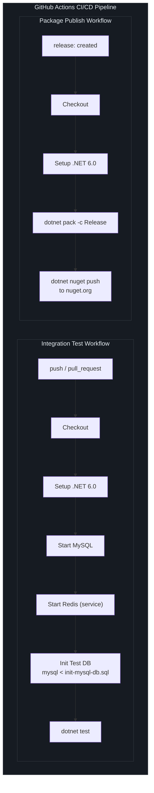
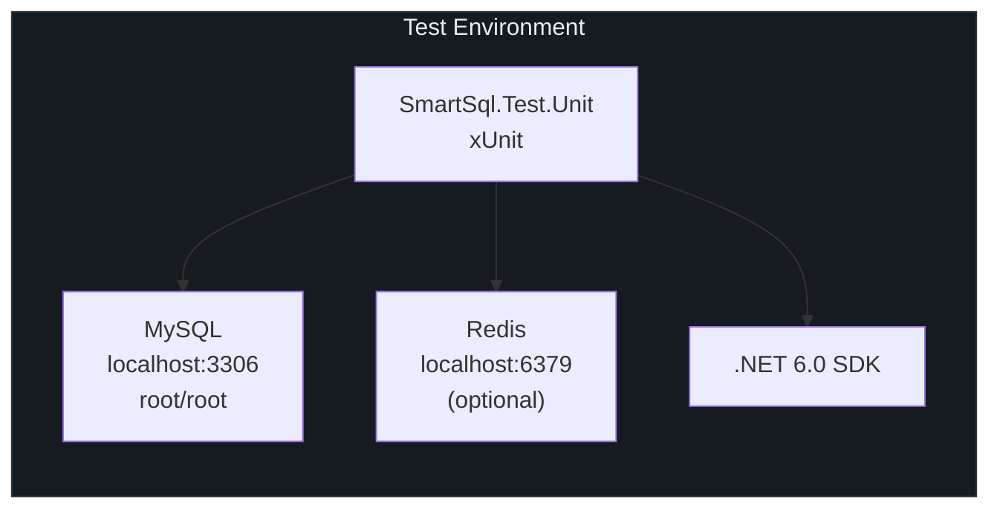
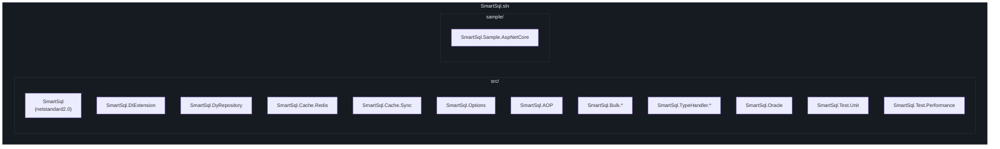

# 构建与 CI

本页介绍从源代码构建 SmartSql、运行测试、理解 CI/CD 流水线和构建配置系统。

## 一览

| 方面 | 详情 |
|------|------|
| 解决方案文件 | `SmartSql.sln` |
| 目标框架 | `netstandard2.0` |
| 语言 | C# 7.3 |
| 测试框架 | xUnit |
| CI 平台 | GitHub Actions |
| 包格式 | NuGet（`.nupkg`） |

## 构建命令

### 构建解决方案

```bash
dotnet build SmartSql.sln
```

这将编译解决方案中的所有项目，包括核心库、扩展和测试项目。`SmartSql.sln` 中的解决方案文件包含所有组织在解决方案文件夹中的项目。

### 运行所有测试

```bash
dotnet test
```

单元测试项目（`src/SmartSql.Test.Unit`）需要：
- 本地运行的 **MySQL**（默认连接：`Server=localhost;Uid=root;Pwd=root`）
- 端口 6379 上的 **Redis**（可选，用于缓存测试）

运行特定测试项目：

```bash
dotnet test src/SmartSql.Test.Unit/SmartSql.Test.Unit.csproj
```

按名称过滤器运行测试：

```bash
dotnet test src/SmartSql.Test.Unit/SmartSql.Test.Unit.csproj \
  --filter "FullyQualifiedName~SmartSql.Test.Unit.Tests.CacheTest"
```

### 打包 NuGet 包

```bash
dotnet pack -c Release -o ./nuget
```

这将为解决方案中的每个库项目生成 `.nupkg` 文件。版本从 `build/version.props` 读取。

## 构建配置

### Directory.Build.props

所有项目通过仓库根目录的 `Directory.Build.props` 共享公共元数据。此文件：

- 从 `build/version.props` 导入版本
- 设置 NuGet 包元数据（作者、许可证、描述、标签）
- 启用 SourceLink 以支持调试到 NuGet 包

| 属性 | 值 |
|------|---|
| `Product` | SmartSql |
| `Authors` | Ahoo Wang; ncc |
| `PackageLicenseExpression` | Apache-2.0 |
| `RepositoryUrl` | https://github.com/Smart-Kit/SmartSql |
| `PackageTags` | orm, sql, read-write-separation, cache, redis, dotnet-core |

<!-- Sources: Directory.Build.props:1 -->

### 版本管理

版本号在 `build/version.props` 中集中管理：

```xml
<Project>
  <PropertyGroup>
    <VersionMajor>4</VersionMajor>
    <VersionMinor>1</VersionMinor>
    <VersionPatch>68</VersionPatch>
    <VersionPrefix>$(VersionMajor).$(VersionMinor).$(VersionPatch)</VersionPrefix>
  </PropertyGroup>
</Project>
```

| 组件 | 当前值 | 描述 |
|------|--------|------|
| 主版本 | `4` | 破坏性变更 |
| 次版本 | `1` | 新功能（向后兼容） |
| 补丁版本 | `68` | Bug 修复 |
| 完整版本 | `4.1.68` | 组合版本字符串 |

要递增版本，编辑 `build/version.props` 并更新相应的组件。

<!-- Sources: build/version.props:1 -->

## CI/CD 流水线

### 流水线概览



<!-- Sources: .github/workflows/integration-test.yml:1, .github/workflows/package-publish.yml:1 -->

### 集成测试工作流

**触发条件：** 每次推送和拉取请求。

| 步骤 | 操作 | 详情 |
|------|------|------|
| 1 | 启动 MySQL | 使用 `ubuntu-latest` 上预装的 MySQL |
| 2 | 启动 Redis | Docker 容器，端口 6379，带健康检查 |
| 3 | 检出代码 | `actions/checkout@master` |
| 4 | 设置 .NET | `actions/setup-dotnet@v2`，SDK `6.0.x` |
| 5 | 初始化测试数据库 | 在本地 MySQL 上运行 `src/SmartSql.Test.Unit/DB/init-mysql-db.sql` |
| 6 | 单元测试 | `dotnet test`（所有测试项目） |

工作流设置环境变量 `REDIS=true` 以启用 Redis 相关的测试。

### 包发布工作流

**触发条件：** GitHub release 创建（`release: types: [created]`）。

| 步骤 | 操作 | 详情 |
|------|------|------|
| 1 | 检出代码 | `actions/checkout@master` |
| 2 | 设置 .NET | `actions/setup-dotnet@v2`，SDK `6.0.x` |
| 3 | 打包 | `dotnet pack -c Release -o ./nuget` |
| 4 | 发布 | `dotnet nuget push "./nuget/*.nupkg"` 到 nuget.org，使用 `NUGET_API_KEY` 密钥 |

打包步骤为每个库项目生成一个 `.nupkg`。所有包共享来自 `build/version.props` 的相同版本。推送步骤在单个命令中上传所有包。

### 测试环境要求



| 依赖 | 是否必需 | 用途 |
|------|---------|------|
| MySQL | 是 | 主要测试数据库 |
| Redis | 可选 | 缓存扩展测试 |
| .NET SDK | 6.0+ | 构建和运行 |

## 解决方案结构

解决方案将项目组织到逻辑文件夹中：



## 交叉引用

- [贡献指南](/zh/building/contributing) -- 如何为 SmartSql 贡献代码
- [发布](/zh/building/publishing) -- 包如何发布到 NuGet
- [API 概览](/zh/api/index) -- NuGet 包列表

## 参考资料

| 来源 | 描述 |
|------|------|
| [`.github/workflows/integration-test.yml`](https://github.com/dotnetcore/SmartSql/blob/master/.github/workflows/integration-test.yml) | CI 测试工作流 |
| [`.github/workflows/package-publish.yml`](https://github.com/dotnetcore/SmartSql/blob/master/.github/workflows/package-publish.yml) | NuGet 发布工作流 |
| [`Directory.Build.props`](https://github.com/dotnetcore/SmartSql/blob/master/Directory.Build.props) | 共享构建属性 |
| [`build/version.props`](https://github.com/dotnetcore/SmartSql/blob/master/build/version.props) | 版本管理 |
| [`SmartSql.sln`](https://github.com/dotnetcore/SmartSql/blob/master/SmartSql.sln) | 解决方案文件 |
