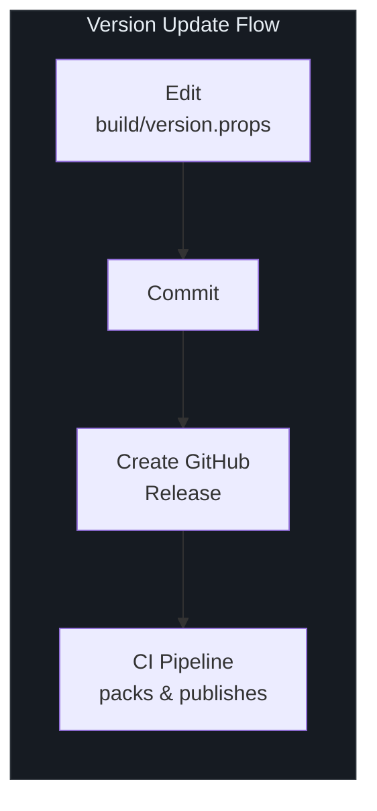
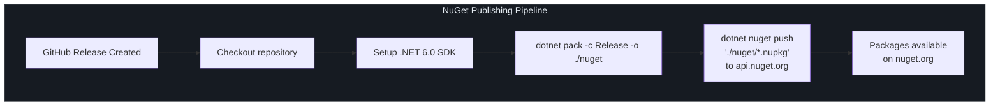
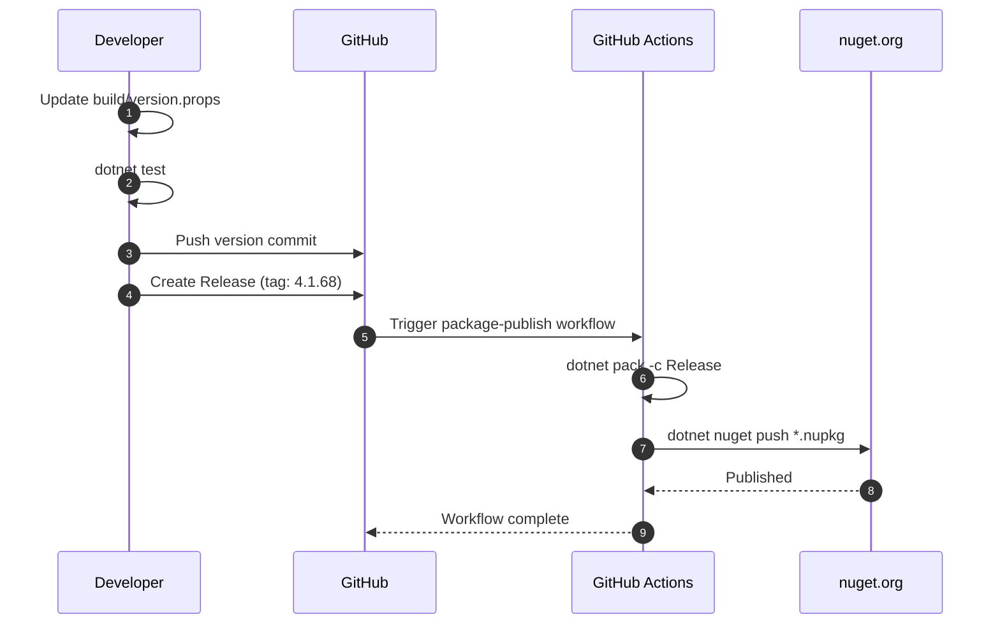

# 发布

SmartSql 将所有库包作为协调的集合发布到 [nuget.org](https://www.nuget.org/)。本页介绍版本管理系统、CI/CD 发布流水线以及已发布的 NuGet 包完整列表。

## 一览

| 方面 | 详情 |
|------|------|
| 注册表 | [nuget.org](https://www.nuget.org/) |
| 版本来源 | `build/version.props` |
| 当前版本 | 4.1.68 |
| CI 触发条件 | GitHub release 创建 |
| 构建命令 | `dotnet pack -c Release -o ./nuget` |
| 推送命令 | `dotnet nuget push "./nuget/*.nupkg"` |
| 许可证 | Apache-2.0 |

## 版本管理

所有 SmartSql 包共享单一版本号，在 `build/version.props` 中集中管理：

```xml
<Project>
  <PropertyGroup>
    <VersionMajor>4</VersionMajor>
    <VersionMinor>1</VersionMinor>
    <VersionPatch>68</VersionPatch>
    <VersionPrefix>$(VersionMajor).$(VersionMinor).$(VersionPatch)</VersionPrefix>
  </PropertyGroup>
</Project>
```

`VersionPrefix` 属性由三个组件计算得出，并通过 `Directory.Build.props`（导入 `build/version.props`）自动应用到每个项目。

### 版本策略

| 组件 | 递增时机 | 示例 |
|------|---------|------|
| 主版本（`VersionMajor`） | 破坏性 API 变更 | `4.x.x` -> `5.0.0` |
| 次版本（`VersionMinor`） | 新功能，向后兼容 | `4.1.x` -> `4.2.0` |
| 补丁版本（`VersionPatch`） | Bug 修复，无 API 变更 | `4.1.67` -> `4.1.68` |

### 如何递增版本

1. 编辑 `build/version.props`
2. 更新相应的组件（`VersionMajor`、`VersionMinor` 或 `VersionPatch`）
3. 提交更改
4. 创建 GitHub release（这会触发发布流水线）



<!-- Sources: build/version.props:1, Directory.Build.props:3 -->

## 发布流水线

### CI/CD 概览

发布通过 GitHub Actions 完全自动化。工作流在创建 GitHub release 时触发。



<!-- Sources: .github/workflows/package-publish.yml:1 -->

### 工作流详情

发布工作流（`.github/workflows/package-publish.yml`）执行以下步骤：

| 步骤 | 命令 | 描述 |
|------|------|------|
| 设置 | `actions/setup-dotnet@v2`，SDK `6.0.x` | 安装 .NET SDK |
| 打包 | `dotnet pack -c Release -o ./nuget` | 以 Release 模式构建和打包所有项目 |
| 推送 | `dotnet nuget push "./nuget/*.nupkg" -s https://api.nuget.org/v3/index.json -k NUGET_API_KEY` | 将所有包上传到 nuget.org |

### 所需密钥

| 密钥 | 用途 |
|------|------|
| `NUGET_API_KEY` | 用于发布到 nuget.org 的 API 密钥（在仓库密钥中设置） |

### 发布内容

`dotnet pack` 命令为每个库项目（非测试、非示例项目）生成一个 `.nupkg`。所有包使用来自 `build/version.props` 的相同版本。每个包的 `PackageId` 默认为 `AssemblyName`（与项目名称匹配）。

## NuGet 包

### 核心包

| 包 | 描述 | NuGet |
|----|------|-------|
| `SmartSql` | 核心 ORM 库 | [](https://www.nuget.org/packages/SmartSql/) |

### 扩展包

| 包 | 描述 | NuGet |
|----|------|-------|
| `SmartSql.DIExtension` | ASP.NET Core DI 集成 | [](https://www.nuget.org/packages/SmartSql.DIExtension/) |
| `SmartSql.DyRepository` | 动态仓库代理生成 | [](https://www.nuget.org/packages/SmartSql.DyRepository/) |
| `SmartSql.Options` | Options 模式配置 | [](https://www.nuget.org/packages/SmartSql.Options/) |
| `SmartSql.AOP` | AOP 事务支持 | [](https://www.nuget.org/packages/SmartSql.AOP/) |
| `SmartSql.Extensions` | 通用扩展 | [](https://www.nuget.org/packages/SmartSql.Extensions/) |
| `SmartSql.ScriptTag` | 脚本标签支持 | [](https://www.nuget.org/packages/SmartSql.ScriptTag/) |
| `SmartSql.DataConnector` | 数据连接器服务 | [](https://www.nuget.org/packages/SmartSql.DataConnector/) |

### 缓存包

| 包 | 描述 | NuGet |
|----|------|-------|
| `SmartSql.Cache.Redis` | Redis 缓存提供程序 | [](https://www.nuget.org/packages/SmartSql.Cache.Redis/) |
| `SmartSql.Cache.Sync` | 缓存同步 | [](https://www.nuget.org/packages/SmartSql.Cache.Sync/) |
| `SmartSql.DistributedCache` | 分布式缓存抽象 | [](https://www.nuget.org/packages/SmartSql.DistributedCache/) |

### 批量插入包

| 包 | 描述 | NuGet |
|----|------|-------|
| `SmartSql.Bulk` | 基础批量插入抽象 | [](https://www.nuget.org/packages/SmartSql.Bulk/) |
| `SmartSql.Bulk.SqlServer` | SQL Server 批量插入 | [](https://www.nuget.org/packages/SmartSql.Bulk.SqlServer/) |
| `SmartSql.Bulk.MsSqlServer` | MS SQL Server 批量插入 | [](https://www.nuget.org/packages/SmartSql.Bulk.MsSqlServer/) |
| `SmartSql.Bulk.MySql` | MySQL 批量插入 | [](https://www.nuget.org/packages/SmartSql.Bulk.MySql/) |
| `SmartSql.Bulk.MySqlConnector` | MySQL（MySqlConnector）批量插入 | [](https://www.nuget.org/packages/SmartSql.Bulk.MySqlConnector/) |
| `SmartSql.Bulk.PostgreSql` | PostgreSQL 批量插入 | [](https://www.nuget.org/packages/SmartSql.Bulk.PostgreSql/) |

### 同步包

| 包 | 描述 | NuGet |
|----|------|-------|
| `SmartSql.InvokeSync` | 数据同步基础 | [](https://www.nuget.org/packages/SmartSql.InvokeSync/) |
| `SmartSql.InvokeSync.Kafka` | Kafka 同步传输 | [](https://www.nuget.org/packages/SmartSql.InvokeSync.Kafka/) |
| `SmartSql.InvokeSync.RabbitMQ` | RabbitMQ 同步传输 | [](https://www.nuget.org/packages/SmartSql.InvokeSync.RabbitMQ/) |

### 数据库提供程序包

| 包 | 描述 | NuGet |
|----|------|-------|
| `SmartSql.Oracle` | Oracle 数据库提供程序 | [](https://www.nuget.org/packages/SmartSql.Oracle/) |
| `SmartSql.TypeHandler` | JSON 和自定义类型处理器 | [](https://www.nuget.org/packages/SmartSql.TypeHandler/) |
| `SmartSql.TypeHandler.PostgreSql` | PostgreSQL 类型处理器 | [](https://www.nuget.org/packages/SmartSql.TypeHandler.PostgreSql/) |

## 构建元数据

`Directory.Build.props` 文件配置应用于每个包的共享元数据：

| 属性 | 值 | 描述 |
|------|---|------|
| `Authors` | Ahoo Wang; ncc | 包作者 |
| `PackageLicenseExpression` | Apache-2.0 | 许可证标识符 |
| `PackageRequireLicenseAcceptance` | True | 安装时要求接受许可证 |
| `Description` | SmartSql = MyBatis + Cache(Memory \| Redis) + ZooKeeper + R/W Splitting + Dynamic Repository | 包描述 |
| `PackageTags` | orm, sql, read-write-separation, cache, redis, dotnet-core, cross-platform, high-performance, distributed-computing, zookeeper | 搜索标签 |
| `PublishRepositoryUrl` | true | SourceLink：发布仓库 URL |
| `EmbedUntrackedSources` | true | SourceLink：嵌入未跟踪的源文件 |

SourceLink 通过 `Microsoft.SourceLink.GitHub` 包启用，允许使用者从调试器中进入 SmartSql 源代码。

<!-- Sources: Directory.Build.props:5 -->

## 发布清单

创建 GitHub release 以触发发布之前：

1. **更新版本** -- 在 `build/version.props` 中
2. **运行所有测试** -- `dotnet test`
3. **以 Release 模式构建** -- `dotnet build SmartSql.sln -c Release`
4. **本地打包** -- `dotnet pack -c Release -o ./nuget`
5. **验证包内容** -- 检查 `.nupkg` 文件
6. **提交**版本更改
7. **创建 GitHub release** -- 标签与版本匹配（例如 `4.1.68`）
8. CI 流水线自动打包和发布所有包



<!-- Sources: .github/workflows/package-publish.yml:1, build/version.props:1 -->

## 交叉引用

- [构建与 CI](/zh/building/index) -- 构建命令和测试设置
- [贡献指南](/zh/building/contributing) -- 如何贡献代码
- [API 概览](/zh/api/index) -- 包依赖图和描述

## 参考资料

| 来源 | 描述 |
|------|------|
| [`.github/workflows/package-publish.yml`](https://github.com/dotnetcore/SmartSql/blob/master/.github/workflows/package-publish.yml) | NuGet 发布工作流 |
| [`.github/workflows/integration-test.yml`](https://github.com/dotnetcore/SmartSql/blob/master/.github/workflows/integration-test.yml) | CI 测试工作流（发布前运行） |
| [`build/version.props`](https://github.com/dotnetcore/SmartSql/blob/master/build/version.props) | 版本管理 |
| [`Directory.Build.props`](https://github.com/dotnetcore/SmartSql/blob/master/Directory.Build.props) | 共享包元数据和 SourceLink |
