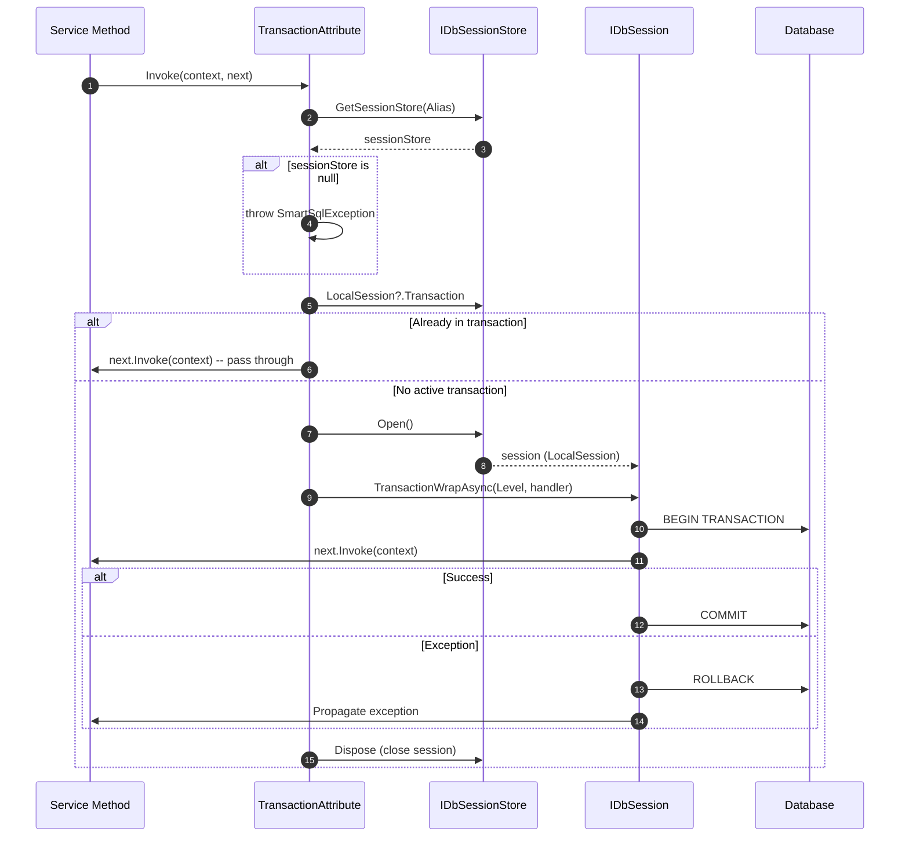
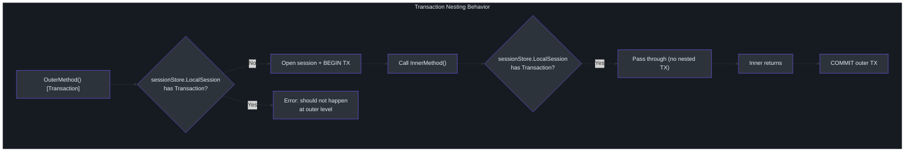
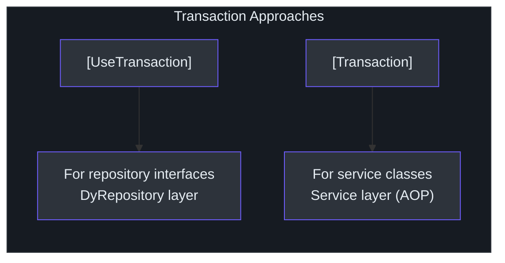

# AOP 事务

`SmartSql.AOP` 包通过 AspectCore 拦截器属性提供声明式事务和会话管理。你无需编写显式的 `using` / `TransactionWrap` 代码块，只需用 `[Transaction]` 或 `[DbSession]` 属性装饰你的方法，让 AOP 框架处理会话打开、事务提交和异常回滚。

## 一览表

| 特性 | 描述 |
|---------|-------------|
| 包名 | `SmartSql.AOP` |
| 框架 | AspectCore DynamicProxy |
| `[Transaction]` | 打开 DB 会话，将方法包装在事务中 |
| `[DbSession]` | 打开 DB 会话（无事务） |
| 嵌套支持 | 检测已有事务，避免重复包装 |
| 隔离级别 | 通过 `Level` 属性可配置 |
| 多实例 | `Alias` 属性选择使用哪个 SmartSql 实例 |

## 事务生命周期

`[Transaction]` 属性管理数据库事务的完整生命周期：



<!-- Sources: src/SmartSql.AOP/TransactionAttribute.cs:13, src/SmartSql.AOP/DbSessionAttribute.cs:10 -->

## 事务嵌套

SmartSql 的 AOP 事务系统支持嵌套。当标注了 `[Transaction]` 的方法调用另一个 `[Transaction]` 方法时，内部调用会检测到已有事务并直接通过，不会创建嵌套事务：



<!-- Sources: src/SmartSql.AOP/TransactionAttribute.cs:24, src/SmartSql.AOP/TransactionAttribute.cs:28 -->

## 属性

### `[Transaction]`

拦截方法调用并将其包装在数据库事务中：

```csharp
public class UserService
{
    private readonly IUserRepository _userRepository;

    [Transaction(Alias = "SmartSql", Level = IsolationLevel.ReadCommitted)]
    public void TransferFunds(long fromId, long toId, decimal amount)
    {
        var from = _userRepository.GetById(fromId);
        var to = _userRepository.GetById(toId);
        from.Balance -= amount;
        to.Balance += amount;
        _userRepository.Update(from);
        _userRepository.Update(to);
    }
}
```

| 属性 | 类型 | 默认值 | 描述 |
|---|---|---|---|
| `Alias` | `string` | `"SmartSql"` | 使用哪个 SmartSql 实例 |
| `Level` | `IsolationLevel` | `Unspecified` | 事务隔离级别 |

### `[DbSession]`

打开数据库会话但不开启事务。适用于受益于连接复用的只读操作：

```csharp
[DbSession(Alias = "SmartSql")]
public async Task<IList<User>> GetAllUsers()
{
    return await _userRepository.QueryAsync();
}
```

| 属性 | 类型 | 默认值 | 描述 |
|---|---|---|---|
| `Alias` | `string` | `"SmartSql"` | 使用哪个 SmartSql 实例 |

## 与 AspectCore 集成

两个属性都继承自 `AspectCore.DynamicProxy.AbstractInterceptorAttribute`。要在应用中启用它们，必须将 AspectCore 配置为 DI 提供程序：

```csharp
public IServiceProvider ConfigureServices(IServiceCollection services)
{
    services.AddSmartSql("SmartSql")
        .AddRepositoryFromAssembly(o =>
        {
            o.AssemblyString = "MyApp";
        });

    // Register services that use [Transaction]
    services.AddSingleton<UserService>();

    // Use AspectCore's proxy provider
    return services.BuildAspectInjectorProvider();
}
```

::: warning
如果没有 `BuildAspectInjectorProvider()`，`[Transaction]` 和 `[DbSession]` 属性将无法拦截方法调用。你必须使用 AspectCore 的服务提供程序。
:::

## DyRepository 与 AOP 事务对比

SmartSql 提供了两种声明事务的方式：



| 特性 | `[UseTransaction]` | `[Transaction]` |
|---|---|---|
| 应用于 | 仓储接口方法 | 任意服务方法 |
| 需要 AspectCore | 否 | 是 |
| 嵌套感知 | 通过 DyRepository emit 逻辑 | 通过 `sessionStore.LocalSession` 检查 |
| 推荐层 | 数据访问 | 业务/服务层 |

参见 [动态仓储](./dy-repository.md) 页面了解 `[UseTransaction]` 的详情。

## API 参考

### TransactionAttribute

| 成员 | 类型 | 描述 |
|---|---|---|
| `Alias` | `string` | SmartSql 实例别名 |
| `Level` | `IsolationLevel` | 事务隔离级别 |
| `Invoke(AspectContext, AspectDelegate)` | `Task` | 拦截器入口点 |

### DbSessionAttribute

| 成员 | 类型 | 描述 |
|---|---|---|
| `Alias` | `string` | SmartSql 实例别名 |
| `Invoke(AspectContext, AspectDelegate)` | `Task` | 拦截器入口点 |

## 交叉参考

- **[动态仓储](./dy-repository.md)** -- 仓储方法的 `[UseTransaction]` 注解。
- **[DI 集成](./di-extension.md)** -- 如何注册使用 AOP 属性的服务。
- **[InvokeSync](./invoke-sync.md)** -- 事务事件可触发数据同步。

## 参考资料

- [TransactionAttribute.cs](https://github.com/dotnetcore/SmartSql/blob/master/src/SmartSql.AOP/TransactionAttribute.cs)
- [DbSessionAttribute.cs](https://github.com/dotnetcore/SmartSql/blob/master/src/SmartSql.AOP/DbSessionAttribute.cs)
- [Startup.cs](https://github.com/dotnetcore/SmartSql/blob/master/sample/SmartSql.Sample.AspNetCore/Startup.cs) -- 使用 `BuildAspectInjectorProvider()` 的示例
