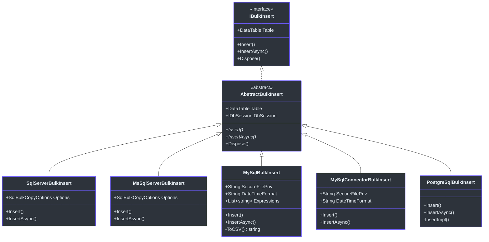
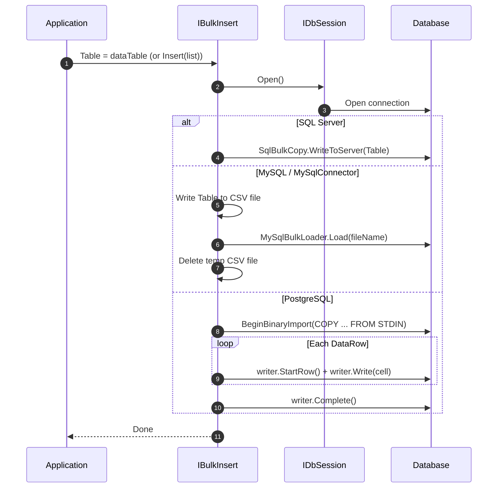

# 批量插入

对于大多数生产工作负载，逐行插入大量数据的速度慢得令人无法接受。`SmartSql.Bulk` 包提供了数据库无关的高性能批量插入接口，并为 SQL Server、MySQL、MySQL（MySqlConnector）和 PostgreSQL 提供了原生实现。每个实现都使用数据库自身的批量加载机制 -- `SqlBulkCopy`、`MySqlBulkLoader` 和 `COPY BINARY` -- 以实现最大吞吐量。

## 一览表

| 特性 | 描述 |
|---------|-------------|
| 包名 | `SmartSql.Bulk`（基础包） |
| 实现 | SqlServer、MsSqlServer、MySql、MySqlConnector、PostgreSql |
| 输入 | `DataTable` 或 `IEnumerable<TEntity>` |
| 接口 | `IBulkInsert` |
| 同步/异步 | `Insert()` 和 `InsertAsync()` |

## 类层次结构



<!-- Sources: src/SmartSql.Bulk/IBulkInsert.cs:8, src/SmartSql.Bulk/AbstractBulkInsert.cs:10, src/SmartSql.Bulk.SqlServer/BulkInsert.cs:17, src/SmartSql.Bulk.MySql/BulkInsert.cs:19, src/SmartSql.Bulk.PostgreSql/BulkInsert.cs:10 -->

## 各数据库提供程序的工作原理



<!-- Sources: src/SmartSql.Bulk.SqlServer/BulkInsert.cs:28, src/SmartSql.Bulk.MySql/BulkInsert.cs:27, src/SmartSql.Bulk.PostgreSql/BulkInsert.cs:19 -->

## 用法

### 将实体转换为 DataTable

`BulkExtensions.ToDataTable<T>()` 扩展方法将 `IEnumerable<T>` 转换为 `DataTable`，使用 SmartSql 的实体元数据缓存定义列：

```csharp
var entities = new List<User> { /* ... */ };
DataTable dataTable = entities.ToDataTable();
```

### 直接从实体列表批量插入

`Insert<T>()` 和 `InsertAsync<T>()` 扩展方法将转换和插入合二为一：

```csharp
// SQL Server
var bulkInsert = new SmartSql.Bulk.SqlServer.BulkInsert(dbSession);
await bulkInsert.InsertAsync(userList);

// PostgreSQL
var bulkInsert = new SmartSql.Bulk.PostgreSql.BulkInsert(dbSession);
await bulkInsert.InsertAsync(orderList);
```

### 使用 DataTable 批量插入

```csharp
var bulkInsert = new SmartSql.Bulk.MySql.BulkInsert(dbSession)
{
    SecureFilePriv = "/tmp",
    DateTimeFormat = "yyyy-MM-dd HH:mm:ss"
};
bulkInsert.Table = dataTable;
bulkInsert.Insert();
```

## 提供程序特定选项

### MySQL / MySqlConnector

| 属性 | 类型 | 默认值 | 描述 |
|---|---|---|---|
| `SecureFilePriv` | `string` | AppDomain 基础目录 | 临时 CSV 文件目录 |
| `DateTimeFormat` | `string` | `"yyyy-MM-dd HH:mm:ss"` | CSV 中的 DateTime 格式 |
| `Expressions` | `List<string>` | 空 | MySqlBulkLoader 表达式 |
| `_fieldTerminator` | `string` | `","` | CSV 字段分隔符 |
| `_fieldQuotationCharacter` | `char` | `"` | CSV 引号字符 |
| `_escapeCharacter` | `char` | `"` | CSV 转义字符 |
| `_lineTerminator` | `string` | `"\r\n"` | CSV 行终止符 |

### SQL Server / MsSqlServer

| 属性 | 类型 | 默认值 | 描述 |
|---|---|---|---|
| `Options` | `SqlBulkCopyOptions` | `Default` | 批量复制行为标志 |

### PostgreSQL

PostgreSQL 批量插入使用 `NpgsqlConnection.BeginBinaryImport()` 配合 `COPY ... FROM STDIN (FORMAT BINARY)` 命令。对于 JSONB 列，在 `DataColumn` 上设置 `DataTypeName` 扩展属性：

```csharp
DataColumn col = dataTable.Columns["Metadata"];
col.ExtendedProperties.Add("DataTypeName", "JSONB");
```

## 包映射

| NuGet 包 | 底层驱动 | 机制 |
|---|---|---|
| `SmartSql.Bulk.SqlServer` | `System.Data.SqlClient` | `SqlBulkCopy` |
| `SmartSql.Bulk.MsSqlServer` | `Microsoft.Data.SqlClient` | `SqlBulkCopy` |
| `SmartSql.Bulk.MySql` | `MySql.Data.MySqlClient` | `MySqlBulkLoader` 通过 CSV |
| `SmartSql.Bulk.MySqlConnector` | `MySqlConnector` | `MySqlBulkLoader` 通过 CSV |
| `SmartSql.Bulk.PostgreSql` | `Npgsql` | `BeginBinaryImport`（COPY BINARY） |

::: info
`SmartSql.Bulk.SqlServer` 和 `SmartSql.Bulk.MsSqlServer` 使用相同的源文件，通过条件编译（`#if MicrosoftSqlClient`）区分。请选择与你的 SqlClient 依赖项匹配的包。
:::

## 交叉参考

- **[类型处理器](./type-handlers.md)** -- 自定义类型处理器影响实体属性通过 `BulkExtensions.ToDataTable<T>()` 转换为 `DataTable` 值的方式。
- **[DI 集成](./di-extension.md)** -- 在 DI 容器中注册 `IBulkInsert` 实现。

## 参考资料

- [IBulkInsert.cs](https://github.com/dotnetcore/SmartSql/blob/master/src/SmartSql.Bulk/IBulkInsert.cs) -- 接口定义
- [AbstractBulkInsert.cs](https://github.com/dotnetcore/SmartSql/blob/master/src/SmartSql.Bulk/AbstractBulkInsert.cs) -- 带 `IDbSession` 的基类
- [BulkExtensions.cs](https://github.com/dotnetcore/SmartSql/blob/master/src/SmartSql.Bulk/BulkExtensions.cs) -- `ToDataTable<T>()` 和 `Insert<T>()` 扩展
- [SqlServer/BulkInsert.cs](https://github.com/dotnetcore/SmartSql/blob/master/src/SmartSql.Bulk.SqlServer/BulkInsert.cs) -- SQL Server 实现
- [MySql/BulkInsert.cs](https://github.com/dotnetcore/SmartSql/blob/master/src/SmartSql.Bulk.MySql/BulkInsert.cs) -- MySQL 实现
- [PostgreSql/BulkInsert.cs](https://github.com/dotnetcore/SmartSql/blob/master/src/SmartSql.Bulk.PostgreSql/BulkInsert.cs) -- PostgreSQL 实现
